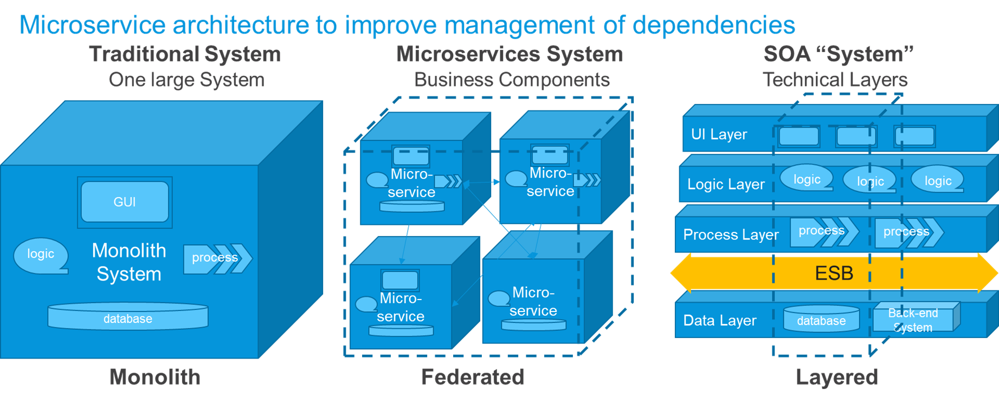
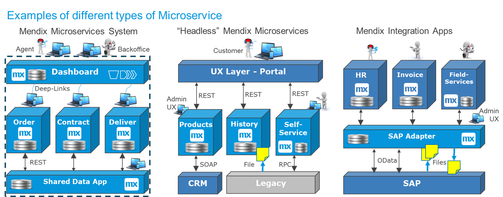

## 1 Introduction

Integration between different systems means that data flows are automated and functions in different apps are connected. In turn, integration drives the automation and digitization of processes, saving time and money for your organization. This means integration is an incredibly important area to master and do right.

The sections below will go through a number of methods for integrating the Mendix Platform with other systems, things, SaaS solutions, and microservice systems made up of many Mendix apps.

Unless you are building a stand-alone Mendix app, there will be integration with existing systems and between Mendix apps. Even if Mendix makes it very easy to integrate technically, it is still important to functionally define the most efficient overall solution, in which the integration should be as simple as possible. That will determine how easy it is to maintain, update, or extend the solution.

To assist Mendix app projects in this area, typical examples are presented of how Mendix apps play functionally different roles and how they integrate well within an enterprise landscape. This is especially helpful for organizations that want to use Mendix for core systems replacement or large scale migrations towards the cloud as well as when Mendix is the preferred platform for all custom development.

## 2 Microservices integration

Microservices architecture is prevails nowadays over layered SOA architectures as a much more efficient way to implement service-oriented and event-driven architectures.

However, microservice architecture has changed a lot of things in the area of integration. For more information, see Martin Fowler's [Microservices: a definition of this new architectural term](https://martinfowler.com/articles/microservices.html ).

In general, microservices replace solutions where functional dependencies have become too complex like the following:

* Large monolithic systems working on one single large database
* SOA-layered architectures

### 2.1 Good Dependencies

Microservice apps are smaller functional pieces that contain a business function. The following best practices are important to understand for dependencies:

* There must not be too many functional areas that depend on the same data model (as occurs in monoliths)
* There must not be too many functional areas that depend on the same technical layers (as occurs in SOA-layered architectures)

Instead, you must try to contain everything required to perform a business function within each app. A new business feature requirement is then likely to land within only one single app, which will be maintained by one single team. This means you can change quickly when necessary and provide flexibility to the business unit that owns that functionality.

There is still integration required between microservice apps. However, there will be less integration than needed between the application server and database in a monolith, or between the layers in an SOA-layered architecture. This is because most of the work that the app does, is contained within the app itself. They are local and private (not externally exposed) dependencies, that are easily owned and maintained by a small DevOps team. 

Mendix is perfect for building this type of microservices, because within a Mendix app all internal dependencies are kept private. They are managed and consistency-checked by the Mendix model itself, and the developer builds UX, logic, workflow and data structures directly for a business function.

Some microservices will be complete end-user-oriented apps with GUI, logic, data and workflow. Some can be "head-less" microservices providing the functionality and data under UX oriented apps or layers, some are pure integration apps that act as legacy adapters, shared data apps or distributed ESBs.

There is no rule for what Microservice should do and not, and what they contain. Just that they fulfill a clear function and have a clearly defined external interface, using clear contracts for external integration. 

In a landscape of many styles of Microservices, Mendix can take any role and/or evolve from one to the other. E.g. having a "head-less" Mendix app supporting a customer portal UX via REST services, it is easy to add an internal UX for a support group that can set business values, monitor progress or do other internal tasks on the same functional area.

The diagram below shows a number of typical Microservices:

* The first part shows a microservices system covering a larger functional area where several user groups cooperate. It has 
** A log-in and overviews Dashboard
** Three separate functional microservices each covering a phase in a process
** It has a shared data app for the combined data set, for importing reference data and for other external integratiion
* Second part is where Mendix apps are built with no UI at all, or with only a business administration UI - providing the business functions via REST services to a separate UI layer, e.g. a customer portal
* Third part is where Mendix acts as an Integration layer, making it easy for other apps to access key data and functions from e.g. SAP or older legacy systems

### 2.1 What changes with Microservices

1. Organize components around Business Capabilities
2. There will be less functionality in Integration layers ("smart end-points, dumb pipes")
3. Balance autonomy against re-use, i.e. only re-use things when it does not impair the flexibility of evolving separate microservices
4. Clear contracts for communication between microservices, typically REST, OData or SOAP contracts
5. Decentralize data-management, i.e. do not be afraid of having a local copy of data, but do not copy all data and do not copy data-models, just copy the data required for that function, and adjust the data structure to what is needed in each app
6. Design for failure, i.e. make sure the user experience is not impacted when a source app is down. In some cases copying core data beforehand is recommended. When this is not possible, make a nice user message that the service is un-available.
7. Automate infrastructure. Ifrastructure automation is already at a very high level on the Mendix cloud, but additional automated testing and deployment management can be added.

## 2 Minimize and Manage Dependencies

While integration leads to automation and digitization it also creates dependencies between systems. Dependencies need to be managed from design to production for different releases of apps going live at different times.

The target for a solution architect that designs a larger solution will therefore be to design apps and systems of apps that:

1. Minimize integration
2. Find a solution where integration dependencies are easy to build, change and manage

Finding the correct, right-sized, functional and autonoumous microservices is the first step. Then finding the integration method that makes it easy to build and manage is the next step, where these best practices can help. 

The best solution varies from case to case, and depends on several aspects: organizational, technical, functional and operational. The optimal solution takes all of thos factors into consideration.

### 2.1 Team Dependencies

Less development team dependencies follows from using a microservices architecture. It means that every app can be built and managed by one single DevOps team. The team is autonomous to complete the entire microservice. The only dependencies are external integration, which ideally can be defined as REST services in the beginning of the project.

Less dependencies between business units of an organization, can be achieved by defining functional apps that align relatively well with the business process or the business organization. That means less comprimizes on requirements, and less prioritizations to do between different stake-holders, and it often means a more purpose oriented app that is good at one specific area.

### 2.2 Functional Dependencies

When the right microservices have been chosen, there will still be some functional dependencies left, that should be automated by building good interfaces between the apps. These functional dependencies can not be removed, so they just need to be minimized.

For example: If we have a feature request where two apps both need to implement new fields, e.g. GPS coordinates, and if one app is the source of this data, it is in-evitable that the service contract needs to change. We then need a good process for managing this through separate releases. The typical way to do so is by the source app going live first, with two end-points, while the consumer goes live afterwards, swapping from the first end-point to the next one.

If it is easy for the two apps to go live at the same time, then the two new versions are tested and deployed together. The diagram below shows the more generic case of service management, the apps are now not dependent on the same release date:

<<FIGURE 3>>

To minimize the functional dependencies it is usually recommended to 

1) Make specific service contracts that imitate a Business event. Often the data is from more than one table, and rarely it includes all the fields from one table. If the functional requirement for the business event changes, we have to change the service, but if other data in the same tables change, there is no impact.
2. Make consumer specific services when different consumers want different things. When one consumer wants additional functionality in the service, the other consumers are not impacted

### 2.3 Operational Dependencies

Operational dependencies relate to the fact that one system must be up and running for a certain function in another app to work. 

For example: To create an order I need to search for products in another app. Then if the products app is down, there is also no ordering possible. In all synchronous services the both apps needs to be up and running for the integration to work. 

It is possible to minimize operational dependencies by copying data over to the service that needs it before it is needed. This is particularly common for slow-changing data, such as product definitions. In the example above we can remove the operational dependency by simply copy the important part of the product definition over to the ordering app, and poll the product app for any changes.

The desire for autonomy in Microservices architectures, will allow copying data more often than in the SOA architecture pattern, where re-use of functions was more important, and people strived to retrieve data in real-time from the source system.

In high-volume automated situations the copying of required data becomes even more important, since every out-bound service call will take time and CPU resources and it leads to a risk for failed processing that may be difficult to manage manually.

Sometimes, when operational dependencies are required, e.g. a source system needs to validate data in an input-form, then the best we can do is to build functionally around this dependency to soften the impact on the user if the other system is down. This could be by being aware of the other system's status, to inform the customer early or simply disable the local function temporarily. 

Microservice theory also suggests using circuit breakers for high-volume situations, so that the source app stops bombarding the destination with requests, when the service is already timing out the majority of the requests. This helps both apps to operate better.

### Technical Dependencies

In quite a few cases there is alreay a legacy system, or we integrate with a SaaS solution with an already existing API. In these cases there is often little choice in the format and protocol of the services we need to use.

In these cases the Mendix app will typically adapt to the existing technical and functional format of services provided by e.g. a SaaS system such as SAP or SalesForce. Mendix is the more flexible side in most integration relations, and can adopt to almost any format that is provided.

But there are cases when it is better to change even old legacy systems. E.g. when one can not retrieve the data without looping over a service call 100s of times, then either a new service should be built or switching to copying the data ahead of time with e.g. a file.

### 2.4 Scoping Integration Early & Implementing Late

Because integration is an external dependency, it makes sense to scope out the required integration early. 

This will allow for teams to have the maximum time to provide updated services or files before the go-live date. While waiting, users can use mock services and/or files, and then connect to the final version towards the end of the project.

### 2.5 Keep It Simple

As in all design, the more simple solution is always easier to build and maintain that a more complex one. If something can be done with fewer service calls or fewer components or fewer technologies involved, it is usually better. 

The most frequently used and overall accepted service protocol aty the moment is REST over Http(s). This allows the caller of the service to manage any errors or issues, and within a single service call, there is both request and reply.

Bu there are an incredible amount of different situations to take into account, and this document will go through quite a few technical and functional scenarios where other formats and protocols are recommended.

## 3 Overall Recommendations

Apps should act as actors in a business process. They typically do different things, and often they have different views of the data. So it is ok to copy some data from one app to the otherm as part of the business process, or to share reference data between apps. 

Implementing the integration points as Business Events that fullfill a step in a business process. For sharing reference data, it is typical to pull the source for changes and/or send files with updated data for slowly changing data.

To approach an inegration problem it is good to think functionally first - and only when it is clear what the entire integration should do, including acknoledgements, statuses and errors, then compare technical solutions that will handle the situation in a simple way.

In the days of SOA layers, a central ESB would take care of a lot of integration functionality, such as transformation, routing, re-tries, queueing, and even combining services. 

In the era of microservices, you should aim for "dumb pipes and smart endpoints":
1. Within a system of microservices owned by the same organizational area, there is no reason to use an integration layer at all
2. For a number of other cases, especially for large organizations, a thin integration layer is helpful

Integration is easy with Mendix, and microservices are enhancing the efficiency and flexibility in the IT industry. If in this situation the integration can be made simple, there is an amazing opportunity to re-shape how organizations build and manage It to support different business functions.

### 3.1 Basic Solution Categories

For most of the integration related to Mendix, there are five basic solution categories that are almost always used. Sometimes just one is used, and sometimes a combination is used:

* [Service Integration](service-integration) – This is otherwise known as remote procedure call (RPC) integration. This category uses request and reply, and it almost always synchronous. The request-reply interfaces with REST and SOAP. There is also database integration with OData and SQL, business event and process integration, process orchestration, integration apps, and distributed ESBs.
* [UI Integration](ui-integration) – This solution category includes, for example, using a deep link from the UI of one app to open the UI of another app (either in the same browser tab or another tab). It also includes website, content management system, and content delivery network integration.
* [Event-Based Integration](event-integration) – This category usually does not have a response, and it is used to distribute data at large scales or large distances, or simply distribute data in a decoupled way. Event-driven integration can involve IoT, metrics, and social media, as well as state engines and event management.
* [Batch Integration](batch-integration) – This category includes exporting, moving, and importing files as well as file integration.
* [Central Data](central-data) – This category uses a pattern where data is landed and combined in a central place before it is distributed. This could be, for example, an operational data store (ODS); extract, transform, load (ETL); business intelligence (BI); or data lake solution.

### 3.2 Overview of Use Cases & Solution Options

Plotting functional use cases against basic methods of integration allows you to see there are several common options available. That is good, because integration needs to be flexible in a solution for the architect to select the best option for a specific situation. 

For example, you may choose not to change an old system, which leads you to choose another option than you would if you were building two new apps. This means that you may choose the less ideal way to integrate in order not to change an old system. In the scenario that you were building two new apps, you would make another choice.

As another example, when integrating to SaaS solutions and older systems, there may only be one option available. Such a scenario will determine which integration to use, rather than these guidelines. 

The table below presents use cases that you can reference  for more detail. The table uses the following symbols:

| Symbol | Meaning |
| --- | --- |
|  | Indicates the common or preferred use of the method. In some of cases (for example, "Integration with IoT solutions"), the solution will require several methods, so several of these symbols are used. |
|  | Indicates possible use in some cases. |

| Use Case | UI Integration | RPC / Services | Events / Queues | Export, Import, Batch | Central Data |
| --- | --- | --- | --- | --- | --- |
| SSO, AD & Identity integration |  |  | | | |
| Import & Distribute Reference Data | |  |  |  |  |
| View & Search Data in Another System  |  |  | | | |
| Use & Refer to Data in Another System | |  | | |  |
| [Process Int.](process-integration) (cont. workflow) |  |  |  | | |
| [Export, Import & Batch Processing](export-import-batch) | |  |  |  |  |
| Update Data in Master App |  |  |  | | |
| Distribute Master & Transactional Data | |  |  |  |  |
| Int. with BI & Reporting | |  |  |  |  |
| Mobile Int. & Offline | |  |  | | |
| CMS & CDN Int. |  |  | | | |
| Process Orch. & State Engines | |  |  | |  |
| Int. with Ops & Monitoring |  |  |  |  |  |
| Int. with IoT Solutions | |  |  |  |  |
| Int. with AI & Machine Learning | |  |  | |  |

For more details, see [Integration Examples](integration-examples).
