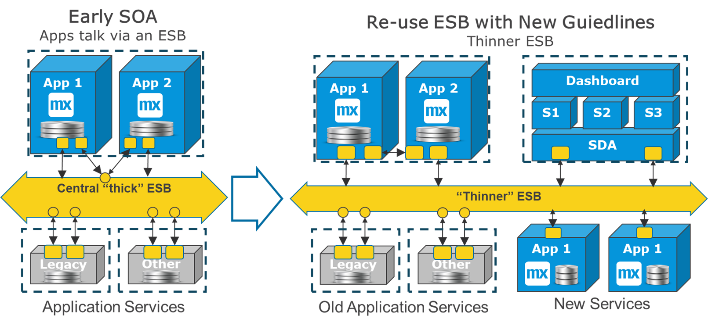
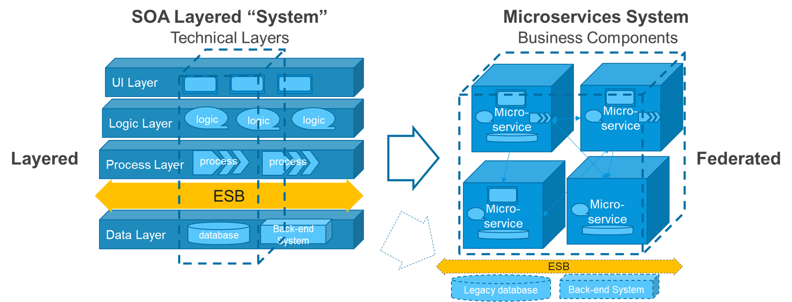
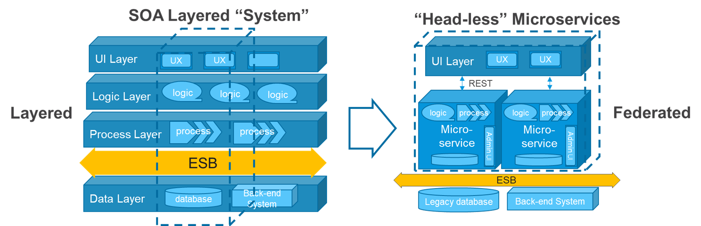
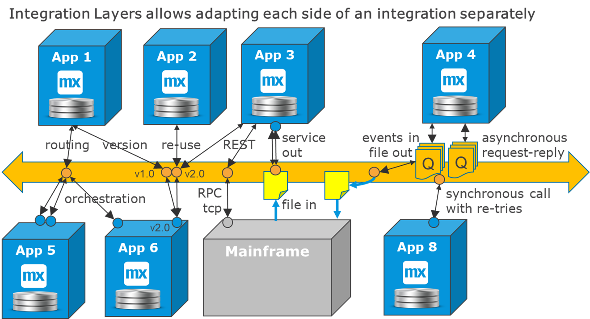
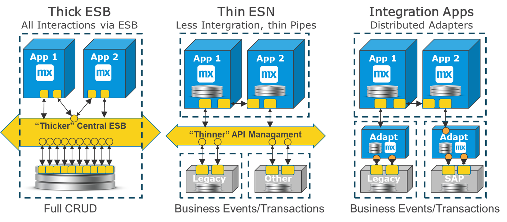

## 1 Introduction

For large enterprises with several departments and hundreds of systems, it makes sense to create integration layers. These layers provide one or more benefits to an organization:

* Decoupling between systems and departments, so that every app does not connect directly to every other app.
* A connectivity layer between networks, for example between cloud and premises, geographies or areas, and customer systems and external companies (as an external API gateway) 
* A messaging platform with queue management

### 1.1 Pros and Cons

The benefit of an integration layer to decouple systems can be exemplified in this way: 

A project wants to introduce a new Mendix app that needs to call 20 existing services from 10 different systems in 3 locations. If all the services were already exposed on an API management gateway, the project would only need to align with one party, connect to one technology and reach one network location. There would already be an available test environment for all 20 services etcetera. 

If there was no integration layer the project manager would have to align with 10 different teams, the team would design, build, and test against 20 disparate services, and network issues could be a problem. 

Decoupling comes with the cost of introducing an additional dependency that affects projects flexibility and timelines. If functional mapping is done in the integration layer, it often become a bottleneck for building and maintaining services. At organizations where all integration is required to go through an integration layer, this dependency often becomes an issue that slows down evolution of new business functionality across the enterprise.

Mendix recommends to balance these pros and cons, and use Integration layers where it makes the best sense.

### 1.1 Microservices architecture

With microservices architecture the recommendation is to use "thin" integration layers or no integration layer at all.

* Use integration layers when it is beneficial, for example for event based integration, external integration or integration between departments of a company (see the [Different Integration Layers](#different) section below)
* Use relatively "thin" integration layers with less mapping and minimal functionality
* Build functional groups of microservices (microservice systems), where the internal integration is direct
** No integration layer between Mendix apps that are part of the same functional system
** No integration layer between GUI, logic, and data of the same system, which is the default way Mendix works
  
### 1.3 Overview of a modern Bus landscape

The diagram below shows a schematic view of a balanced and mixed strategy for Integration layers:

There are local connections between closely related microservices, and DevOps tribes even build some local Ops monitoring to own the entire life-cycle of their clusters of apps. Since the teams that build these apps are organized together, they easily manage their internal dependencies through releases of separate apps.

For connections with other areas of the organization, there is a "Bus" that represents one or more integration layers used for connecting to the other areas of the company. It handles all formats, such as events, service calls and files. The integration layer services represent how departments speak to eachother, which we expect will change more rarely. The bus in this case decouplles departments from eachother and provides enterprise connectivity geographically and network wise.

## 2 From SOA to Microservices

### 2.1 Reuse the Early SOA

In early SOA architectures, applications connected to each other via an ESB, which transformed messages into a common format and sometimes transformed them again into the destination format. The ESB took over a lot of integration functionality, leaving the participating systems relatively vanilla. The systems on each side of the ESB where full-blown applications with GUI, data, logic, and an API.

This version of SOA (when already implemented) is beneficial for new projects, because a large amount of useful services may already be available for new apps and services to use. 

It is quite easy to switch towards a more microservice-oriented approach by simply adjusting the guidelines for new solutions being built:

* Less mapping in the integration layer
* Local integration allowed to go directly

This diagram shows an example how to evolve around an existing ESB:

1. For the two old Mendix apps that belong to the same system, we re-route their internal communication to be direct
2. Two new single-purpose apps below the ESB provide new services with less mapping in the ESB 
3. Above the ESB, there is a microservices system that has a shared data app (SDA) for external communication, and that is the only one that connects to the ESB (for details, see the [Example - Microservices SDA](central-data#example-sda-micro) section of *Central Data*).

In the old situation, all communication went via the ESB. In the new situation, we continue to benefit from the existing services as they are, while for  new services we put less mapping in the ESB and only connect to the ESB for cross-departmental communication. 

### 2.2 Layered SOA

In later stages of SOA architectures, an "N-layered" architecture was used. This meant that almost all the functionality was split up in a number of layers, where each layer had a technical task. This also meant that every feature crossed several technical layers, with an explosion of dependencies as a result. 

The layers and the names of the layers varied, but they often contained the following components:

* UX layer 
* Logic layer
* Process or BPM layer
* ESB
* System of record or data layer

Characteristically, the architecture would not allow business data to be stored in any of the layers above the ESB. If this was strictly implemented, it meant that an incredible amount of integration had to be built, and often several service calls had to be made for every user interaction. 

In small situations, layered SOA could work reasonably well. Building an application in 3–4 layers is still common, even if it is done much less quickly than can be done with low-code. The real issues occurred over time, when the size grew and reuse across areas was encouraged. Feature evolution could grind to a halt when managing all the dependecies, service calls, and related complex regression testing scenarios.

### 2.3 Transition from Layered SOA

The diagram below shows how business features cross many layers in SOA layerd architectures, and almost all business functions depend on other business functions in intricate ways:

The diagram also shows that the transition from a large functional scope built in an SOA-layered architecture towards a microservices architecture requires a complete functional redesign and a rebuild of most of the functionality. However, there are often still services on the ESB towards the legacy systems that can be reused in the new architecture.

Migrating from a layered SOA architecture is still strongly recommended for any area of functionality that requires flexibility and/or low-cost maintenance. A possible way to soften the impact of such a migration is to build Mendix "headless" services that do not have an end-user UX, but provides REST services to the existing UX layer. This saves most of the UX investment, while the logic, workflow and data management is made a lot more flexible using Mendix technology and a microservice architecture.

This diagram shows how this replacement could be done. For example it could be two Mendix apps replacing the business function for a functional area of a customer portal:

The interaction with legacy systems will be less frequent, and occur only when committing changes to the data.

### 2.4 Moving from SOA to Microservices

In summary, we see these changes for integration layers with microservices architectures:

* Integration layers are getting thinner, and they do less functionally than before
* There are no integration layers between technical layers of the same system (for example, between UX and data)
* There are no integration layers between apps that belong to the same microservices system

## 3 Different Integration Layers {#different}

These are the typical integration layers and how they are typically used:

| Layer | Description |
| --- | --- |
| **Reverse proxy** | This is an integration component that sits in the firewall and provides restricted access to certain domains and IP addresses, providing security for externally provided services. |
| **API management B2B** | This is a professional and central reverse proxy with consistent logging, security, and protection against denial-of-service attacks. |
| **API management** |  This can also be used by large enterprises to provide a single technical connection point for all systems. This means that you only have to know how to connect a new app to this layer instead of to all the source systems. |
| **ESBs** |  Enterprise service buses are like API management, but ESBs also provide mapping of messages and service orchestration. This can be valuable, but there is a tendency for a bottleneck in the delivery of enterprise-wide integration. |
| **Integration apps** | These can be built with Mendix and provide a way to have a distributed ESB that consists of many apps, each specializing in a different area. |
| **Message brokers** | This focuses on event-driven integration with a queue manager plus routing and possible mapping. |
| **Kafka** | This event-streaming technology is a modernized message broker that provides high-volume, resilient, many-to-many event integration. |
| **ETL tooling** | Extract, transform, and load tooling is like an ESB, but it focuses on batch processing and BI and DWH integration. It usually stages the data first, does heavy mapping, and then updates the destination. It can do direct DB connections or use files. |
| **MFT tooling** | Managed file transfer tooling can create a practical deposit and pickup point with access security for all file interfaces. It often has scheduling included and can raise alarms if files do not arrive as expected. |

In large enterprises, there may be several different integration layers and various requirements for using them in different circumstances. For example, there could be ETL for data transition, ESB for internal integration, and an API management gateway for external integration.

The integration between the Mendix app and an integration layer has the same properties as the integration between two Mendix apps. I.e. for a Mendix app an integration layer is just like another exteral system to connect to.

## 3 Why Use an Integration Layer?

### 3.1 Distance

If there is a large geographical, network or organizational distance between two systems, an integration layer can provide a shared and secure way to bridge this distance.

### 3.2 Event Streams & Queues

For event streams and queues—where there is high volume or distributed systems—an integration layer takes the responsibility for delivery.

For more information, see [Event-Based Integration](event-integration).

### 3.3 Service Maintenance

If all the connections in a large organization were point-to-point interfaces, there would be far too many direct dependencies, and all the systems would have to know too much about each other. An ESB or an API management gateway helps separating these systems through releases and in operations.

However, *decoupling* does not mean *independent*. As soon as there is a new contract and a new service, consumers should be informed and given time to migrate. Therefore, keeping a service repository that lists all the services and service users is recommended for your organization. 

Changes to services are usually done as a new endpoint next to the old one, allowing consumers to migrate and deploy the new version at their own pace, see also the diagram below:

<<Figure 8 - New>>

ESBs can help with this by allowing the source system to go live with only the new version and having the ESB map it into two endpoints. This is useful for large enterprises with many service users. See the diagram in the next section showing this.

### 3.4 Service Options

An integration layer can also provide connectivity to old protocols and/or provide different protocols on each side of an integration in order not to change existing systems. For example, the integration layer can receive a file and deliver the data as events or service calls. An ESB can collect events on a queue and generate a file at the end of the day.

This diagram presents some examples of how an integration layer enables new patterns by dividing the integration into two parts:

* Routing towards several systems, orchestrating and combining services
* For services that are reuses by several consumers, the ESB can provide different versions for consumers
* Translation of technical formats, e.g. connecting Mainframes
* translating from file to push services
* translating an event flow to a daily file
* translating asynchonous request reply to a synchronous call with re-tries

All these cases allow the end-points to adapt less to each other, and for large enterprises with hundreds or thousands of systems this does make sense for several integration scenarios. It should ne noted that most of these benefits can be achieved by separate and smaller integration apps, just as well as an ESB can provide them centrally.

## 4 Microservice Integration Apps

An integration layer does not have to be central and enterprise-wide for an entire organization. If you are driving all integration onto the same framework, it is likely to become a bottleneck for all. Therefore, many organizations have several solutions, and there is no significant reason to consolidate them.

With microservices, there is a new style for achieving many ESB benefits using separate localized integration apps or shared data apps. For more information, see the [Shared Data App (SDA)](central-data#sda) section of *Central Data* and the [Integration Apps & Adapters](service-integration#adapters) section of *Service Integration*.

Mendix has strong integration capabilities, and it is easy to add UI elements to handle errors, manage lookups, and manage reference data. That is why the Mendix Platform is increasingly being used to quickly build and efficiently maintain integration solution.

This diagram shows the three styles next to each other – thick ESB, thin ESB, and integration apps:

## 5 Summary

In summary, these are the recommendations for integration layers:

* Use integration layers when there is a clear reason to use them
* Do not push all integration through an integration layer
* When using integration layers, avoid functionality in the middle when possible
* Consider Mendix apps as a possible part of the solution to complex integration problems
