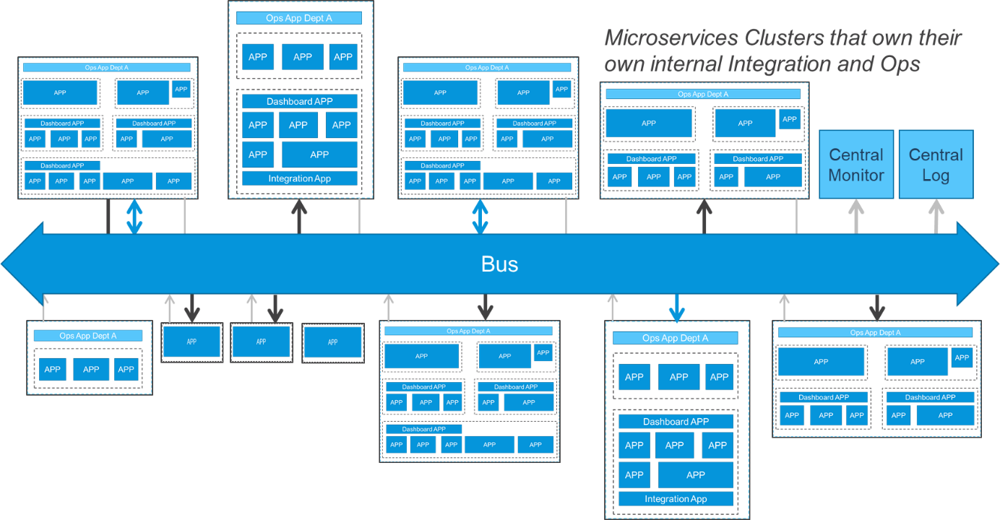
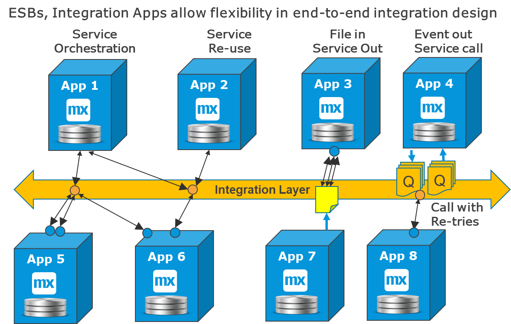

## 1 Introduction

For large enterprises with a lot of departments and hundreds or thousdands of systems, it makes sense to create integration layers. These layers can be used for messaging and events, all the integration between departments, and long distance integration.

Integration layers provide a level of decoupling, but this comes with the cost of introducing an additional dependency that can affect all projects. However, a benefit of integration layers is that apps are only allowed to connect to one single technology where maybe an enterprise-wide message header can be used that would be useful for BI and logging.

In one scenario, if you are introducing a new Mendix app that needs to call 35 services from 20 different systems and all of those services already exist, then aligning with only the integration layer team—instead of 20 different teams—is an organizational benefit.

In another scenario, there is a requirement to always use an integration layer and you introduce a new Mendix app that needs five services from an app that is organizationally close and ready to provide them. However, the integration layer team is busy with other projects, so the project may be significantly delayed by the requirement to use this layer

This means that if the team that owns the integration layer is adequately staffed and efficient, the required usage of the integration layer is a small dependency. However, if that team is over loaded and the integration layer itself tries to reuse services too much, the dependency becomes larger and can become a bottleneck.

As this diagram presents, Mendix prefers a mixed strategy in which local connections between closely related microservices and apps can and should be direct, while a thin integration layer is good for communication that is organizationally or network-wise farther away:

##2 Different Integration Layers

Describing all the possible integration layers available is outside the scope of this best practices document. However, some standard cases worth mentioning are listed below.

In all of these cases, the integration between the Mendix app and the integration layer has the same properties as the integration between two Mendix apps. In addition, the same integration patterns exist and the same technical protocols can be used.

These are the typical integration layers:

| Layer | Description |
| --- | --- |
| **Reverse proxy** | This is an integration component that sits in the firewall and provides restricted access to certain domains and IP addresses, providing security for externally provided services. |
| **API management B2B** | This is a professional and central reverse proxy with consistent logging, security, and protection against denial-of-service attacks. |
| **API management** |  This can also be used by large enterprises to provide a single technical connection point for all systems. This means that you only have to know how to connect a new app to this layer instead of to all the source systems. |
| **ESBs** |  Enterprise service buses are like API management, but ESBs also provide mapping of messages and service orchestration. This can be valuable, but there is a tendency for a bottleneck in the delivery of enterprise-wide integration. |
| **Integration apps** | These can be built with Mendix and provide a way to have a distributed ESB that consists of many apps, each specializing in a different area. |
| **Message brokers** | This focuses on event-driven integration with a queue manager plus routing and possible mapping. |
| **Kafka** | This event-streaming technology is a modernized message broker that provides high-volume, resilient, many-to-many event integration. |
| **ETL tooling** | Extract, transform, and load tooling is like an ESB, but it focuses on batch processing and BI and DWH integration. It usually stages the data first, does heavy mapping, and then updates the destination. It can do direct DB connections or use files. |
| **MFT tooling** | Managed file transfer tooling can create a practical deposit and pickup point with access security for all file interfaces. It often has scheduling included and can raise alarms if files do not arrive as expected. |

In large enterprises, there may be several different integration layers and various requirements for using them in different circumstances.

These are the best practices for using required integration layers:

* Verify the recommendations
* See if there are common security or message headers
* Align with standards as much as possible without compromising flexibility

## 3 Management & ESBs

All real-time interfaces can be routed via an ESB or API management. This does not change very much for the publisher and the consumer except for the fact that there is a technical decoupling point. In addition, if the ESB allows mapping, this is to some extent a functional decoupling point.

However, *decoupling* doesnot mean *independent*. As soon as there is a new contract and a new service, the consumers should be informed and given time to migrate.

API management or ESBs start making sense when there are more than 100 systems and several business domains that are organizationally separated. These can create a level of stability for the services used across an enterprise.

The microservice recommendation is to use a very thin integration layer or even no layer at all. Many users use direct integration within a system, business domain, or area while using some API management for external and intra-domain integration.

For your Mendix team, the only difference to consider is the team with which they will be interacting. Calling a REST service on an ESB or on another app is functionally and technically the same. For end-to-end integration, the interface is split in two parts, and in rare cases, there are different paradigms on each side.

This diagram presents some examples of how an integration layer enables new patterns by dividing the integration into two parts:

Service orchestration combines services, and service reuse is the same as with direct integration. For example, the integration layer can receive a file and deliver it as service calls, or the other way around.

## 4 Why Use an Integration Layer?

There are many reasons to use an integration layer, but such a layer is far from necessary. Small companies often have only a reverse proxy and do all their other integration directly. For those companies, using Mendix integration apps can be cost-efficient and an easy way to move towards an integration layer while utilizing the same technology and similar skillsets as are used for building apps.

For large enterprises, it makes sense to use integration layers between departments and/or geographies.

If there is a standard that already exists in your company, it is always recommended to stay with it to maintain consistency. Only when productivity is severely impacted should the Lead Architects look for ways to create a better working standard.
