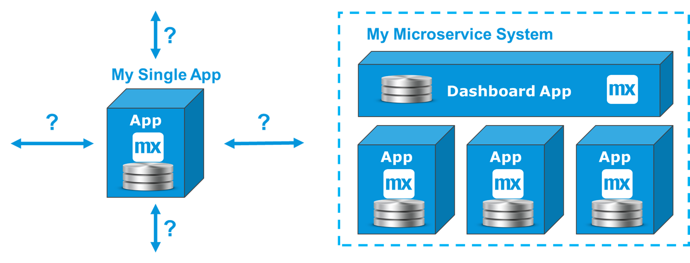
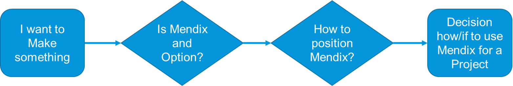
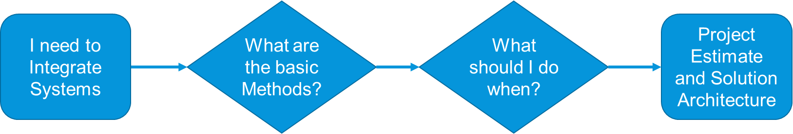
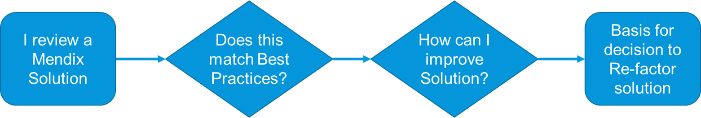
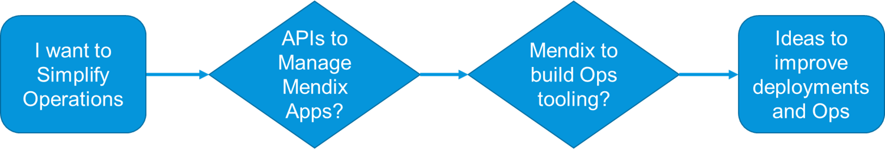

## 1 Introduction

These *Expert Best Practices for Architecture* will provide Lead Developers, Designers, and Architects with recommendations for when to choose one integration option over another. They will also present examples for integration solutions made with the Mendix Platform involved.

### 1.1 What Questions Do These Best Practices Address?

These are the questions addressed in the integration-focused *Expert Best Practices for Architecture*:

* What are good business scenarios for using Mendix?
* How do you integrate Mendix in an enterprise landscape?
* What technical and functional options are there for integration?
* How do you move towards a more microservice-oriented architecture?

## 2 How to Use the Integration Best Practices

### 2.1 Enterprise Architecture, Positioning & Project Validation

Enterprise and Domain Architects can scan these best practices for typical examples of how the Mendix Platform has been used for integration. This is useful for positioning Mendix within the enterprise and validating for which projects and roles Menidx apps may be useful. This diagram presents the basic steps of this process:

### 2.2 Solution Architecture & Project Planning

Solution Architects and Lead Developers can gain an overview of available options as well as recommendations for integration. This can lead to more realistic estimates, a better solution architecture, and hopefully more stable solutions. This diagram shows the basic steps to be expected:

### 2.3 Design & Architecture Reviews

These best practices will also help when conducting design reviews on existing solutions and evaluating ways to solve issues. This could be relevant for a legacy solution or a larger Mendix solution. Reconsidering past decisions and refactoring is part of the Agile model for achieving value quickly and making gradual improvements.

### 2.4 Services for Test & Operations

A new category of integration is growing important in the DevOps and microservices areas. This type of integration is related to building services used to automate testing or to drive a coherent operational overview and support a maintenance team.

## 3 Integration Best Practices Structure

### 3.1 Introduction to Integration in Mendix

To start learning about the Mendix capabilities for integration, see [Introduction to Integration](integration-intro) for background information on integration, and [Mendix & Integration](mendix-integration) for more specific details on integration in Mendix.

### 3.2 Integration Solutions

These best practices are organized with theoretical guidelines in the following solution categories where Mendix plays an important role: 

* [Service Integration](service-integration)
* [UI Integration](ui-integration)
* [Event-Based Integration](event-integration)
* [Batch Integration](batch-integration)
* [Central Data](central-data)
* [Process Integration](process-integration)
* [Integration Layers](integration-layers)
* [Ops & CI/CD Integration](ops-cicd-integration)

Within these solution categories, the use cases and scenarios listed below show how the Mendix Platform integrates within a landscape.

#### 3.2.1 Service Integration Use Cases

* [REST to Call Other Systems](service-integration#push-transfer)
* [REST Pull to Transfer Data](service-integration#pull-transfer)
* [OData Retrieve](service-integration#odata-retrieve)
* [Database Integration](service-integration#db-int)
* [SOAP Integration](service-integration#soap-int)
* [RPC Integration & Adapters](service-integration#adapters)
* [Queue Integration](service-integration#queue-int)

#### 3.2.2 UI Integration Use Cases

* [Deep Linking from App to App](ui-integration#deep)
* [Web Link Integration for Websites](ui-integration#web)
* [CMS Integration for Customer Portals](ui-integration#cms)
* [CDN Integration for Global Portals & Apps](ui-integration#cdn)

#### 3.2.3 Event-Based Integration Use Cases

* [Event Streams, IoT, Logging & Metrics](event-integration#stream-iot)
* [State Engines & Event Managers](event-integration#state)
* [Using Queues with Mendix](event-integration#queues)

#### 3.2.4 Batch Integration Use Cases

* [Using Batch Processing](batch-integration#using)
* [Reference Data Examples with Mendix](batch-integration#reference)
* [File Integration & Management](batch-integration#file-integration)
* [Export & Import](batch-integration#export-import)
* [ETL, DWH & BI Integration](batch-integration#int)

#### 3.2.5 Central Data Use Cases

* [Shared Data App (SDA)](central-data#sda)
* [Self-Learning Processes Using Data Lakes](central-data#data-lakes)

#### 3.2.6 Process Integration Use Cases

* [Business Events & Process Flow](process-integration#business)
* [Case Management](process-integration#case)
* [Process Orchestration](process-integration#po)
* [Event Managers](process-integration#event-managers)

#### 3.2.7 Integration Layers Use Cases

* [From SOA to Microservices](integration-layers#soa-micro)
* [Microservice Integration Apps](integration-layers#microservice)

#### 3.2.8 Ops & CI/CD Integration Use Cases

* [CI/CD & Test Automation](ops-cicd-integration#test)
* [Deployment & Monitoring](ops-cicd-integration#deploy)

### 3.3 Integration Examples

The [Integration Examples](integration-examples) present detailed examples for certain integration solutions along with recommendations, do's, and don'ts.

At this time, examples for [Export, Import & Batch Processing](export-import-batch) and [Workflow Integration](workflow-integration) are available. 

In the future, [Mendix App Store](https://appstore.home.mendix.com/index3.html) items will be added to accompany these examples.

## 4 Related Content

To learn even more about Mendix and integration, the following documentation and training material is available:

* [Integration](/refguide7/integration) in the *Mendix 7 Reference Guide*
* [Integration](/howto7/integration/) in the *Mendix 7 How-to's*
* [Integration](https://www.mendix.com/evaluation-guide/app-capabilities/integration) in the *Mendix Platform Evaluation Guide*
* [Integration Authentication](https://gettingstarted.mendixcloud.com/link/module/117/lecture/944) in the *Mendix Academy*
