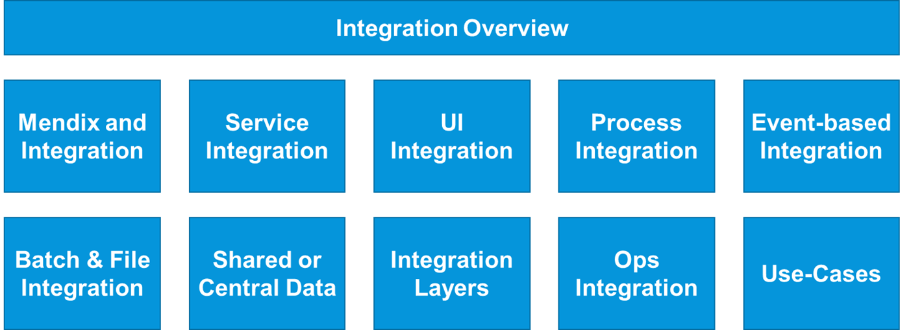
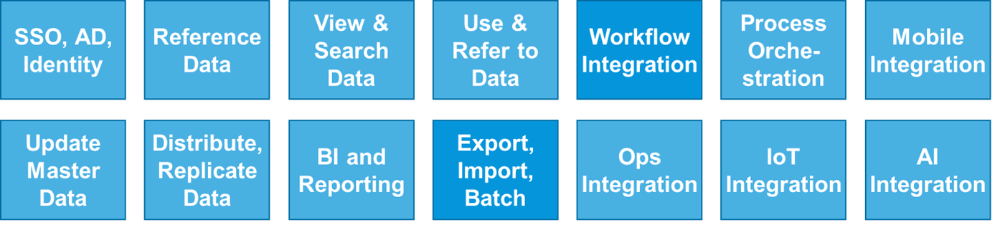

## 1 Introduction

Most solutions (which are made up of various applications) require integration with other apps and systems. Such integration is easy with Mendix, but there are many options to choose from. Integration is like the glue between components in a solution, and it needs to be adaptable for all possible functional scenarios. 

As more core systems are built using Mendix microservices, integration is increasingly important, as is using a set of microservices together to perform a business funtion. That is called a microservices "system."

These Best Practices for integration position Mendix apps in a number of roles in a typical enteprise architecture. The Best Practices consider typical integration options and recommend (where possible) the easiest and/or most stable way to integrate Mendix apps or microservice systems into a landscape.

This diagram illustrates the question this section tries to address:

{}
Internal integration of a business function via GUI–logic–data integration within a Mendix app is handled out-of-the-box in the Mendix Platform. This means that a typical Mendix app project has many fewer integration points than, for example, an SOA-layered architecture project, where every user story typically passes 3–5 technical layers.
{}

## 2 Integration Overview

The Best Practices for integration are intended for Architects, Lead Developers, and other stakeholders to evaluate different integration options that will make solutions stable and easy to maintain.

These Best Practices will cover the following content areas:

These are the typical use cases that will be described:

{}
At this time, only use cases for [Export, Import & Batch Processing](export-import-batch) and [Workflow Integration](workflow-integration) are available.
{}

### 2.1 Enterprise Architecture, Positioning & Project Validation

Best Practices for integration do not focus on positioning. But since Mendix applications are shown in a number of roles as integrated with other systems in the enterprise, these Best Practices can be useful in this area. 

Enterprise and Domain Architects can scan these Best Practices for typical use cases and examples of how Mendidx has been used. This is useful for positioning Mendix within the enterprise and validating for which projects and roles Menidx apps may be useful.

This diagram presents the basic steps of this process:

### 2.2 Solution Architecture & Project Planning

Solution Architects and Lead Developers will gain an overview of the available options as well as recommendations for integration. This can lead to more realistic estimates and a better solution architecture. The diagram shows the basic steps expected:

### 2.3 Design & Architecture Reviews

The Best Practices will also help when conducting design reviews on existing solutions and evaluating ways to solve issues. This scenario could apply to a legacy solution or a larger Mendix solution. Reconsidering past decisions and refactoring is part of the Agile model for achieving value quickly and making gradual improvements.

### 2.4 Services for Test & Operations

A new category of integration is growing important in the DevOps and microservices areas. This type of integration is related to building services used to automate testing or to drive a coherent operational overview and support the maintenance team.

## 3 Related Documents

The Best Practices for integration include [Integration Use Cases](integration-use-cases) and guidelines. 

These use cases are supplemented by the following documentation and training material:

* [Integration](/refguide7/integration) in the *Mendix 7 Reference Guide*
* [Integration](/howto7/integration/) in the *Mendix 7 How-to's*
* [Integration](https://www.mendix.com/evaluation-guide/app-capabilities/integration) in the *Mendix Platform Evaluation Guide*
* [Integration Authentication](https://gettingstarted.mendixcloud.com/link/module/117/lecture/944) in the *Mendix Academy*

