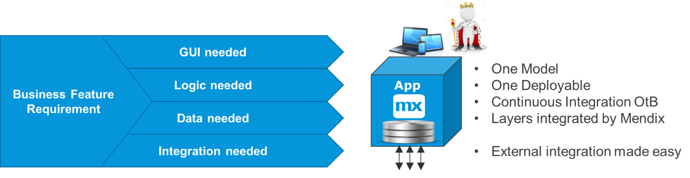

{}[**COULD USE 1-2 DIAGRAMS FOR LAST SEVERAL SECTIONS**]{}

## 1 Introduction

Mendix handles internal integration via one model and one deployment. This out-of-the-box functionality is a major factor for acceleration, and it is what makes Mendix so efficient as a low-code platform. The app developer can just model business functionality, and the integration from the UX down to the data in a database is handled.

If the right Apps or Microservices are created, there will limited or simple external integration. But most larger solutions require integration with other apps and other existing systems, and sometimes must cross firewalls. 
Such integration is easy with Mendix, but there are many options to choose from. Integration is like the glue between components in a solution, and it needs to be adaptable for all possible functional and technical scenarios.
As more core systems are being built using Mendix microservices, integration is increasingly important. This document discusses different types of integration and when one way to solve the problem may be better than another.

# OLD

## 1 Introduction

Mendix makes it easy to build, update, and maintain an apps and microservices that
fulfill business functions. Usually business functions need a GUI, logic, and data. The internal integration of those layers is handled by Mendix, but for most apps and microservice architectures, integration with other systems is necessary.

{}[**EXPLAIN DIAGRAM; UX-UPDATE DIAGRAM**]{}

So, you do not have to worry about the integration of internal app layers. However, the Solution Architect or Lead Developer does need to design good microservices and interfaces that can integrate seamlessly with other apps and systems in the enterprise.

Mendix handles a large array of formats and protocols. For more information, see the [Integration how-to's](/howto/integration/).

The most important thing to do is to choose the right integration option from a lot of possibilities. These best practices will present an overview of integration methods and typical use cases.

## 2 Always Think *Functionally* First {#functionally}

The first best practice is to have an open mind regarding integration requirements. Think about what the integration need really is and consider more than one option for the solution.

It is important to remember that an interface starts inside one system and ends inside one or more other systems. There could also be integration components in the middle, so the
number of options to decide on can be quite large.

First, consider the following questions:

* What triggers the interface?
* Who needs what data when?
* Who should handle functional errors if they occur?
* Who should handle technical errors?
* How can integration be minimized?
* How can a UX be built that requires very few service calls to load?

Next, consider which use case applies and which options are available. 

Finally, make a conscious choice about why one method is chosen over another.

## 3 Use Cases & Solutions

### 3.1 Use Case Categories

"Integration" means any kind of interaction between any person, thing, app, or system for any type of purpose. The scope is enormous, and there are hundreds of use cases. When scoping out a new project, there is a fair chance you may find a new type of use case, even if you have worked on integration for years. So, there is reason to keep your eyes open for what is similar and what is different in the use cases we already know.

However, there are typical use cases for which Mendix is creating example implementations. These best practices are related to such typical use cases.

{}[**EXPLAIN DIAGRAM; UX-UPDATE DIAGRAM**]{}

For each use case, we need to consider which solution is most suitable under which condition.

### 3.2 Solution Categories

For most integration related to Mendix, there are five solution categories that are almost always used. Sometimes just one is used, and sometimes a combination is used:

{}[**EXPLAIN DIAGRAM; UX-UPDATE DIAGRAM**]{}

* **UI integration** – This solution category includes, for example, using a deep link from the UI of one app to open the UI of another app (either in the same browser tab or another tab). It also includes content management system integration with, for example, Akamai and other CMSs.

* **Services** – This is otherwise known as remote procedure call (RPC) integration. This category uses request and reply, and it almost always synchronous.

* **Event-driven** – This category usually does not have a response, and it is used to distribute data at large scales or large distances, or simply distribute data in a decoupled way.

* **Batch-oriented** – This category includes exporting, moving, and importing files.

* **Central data** – This category uses a pattern where data is landed and combined in a central place before it is distributed. This could be, for example, an operational data store (ODS); extract, transform, load (ETL); business intelligence (BI); or data lake solution.

### 3.3 Uses Case & Solution Options

Plotting functional use cases against basic methods of integration allows us to see that there are several common options available. That is good, because integration needs to be flexible in a solution in order to adapt to how systems, things, or people communicate. 

The table below presents use cases that you can reference  for more detail. The table uses the following key:

* A &#9989; indicates the common or preferred use of the method
	* In some of the latter cases (for example, "Integration with IoT solutions"), the solution will require several methods, so there are several instances of &#9989;
* An &#10004; indicates possible use in some cases

{}[**ADD LINKS AS DOCS AVAILABLE**]{}

| *Use Case* | *UI Integration* | *RPC / Services* | *Events / Queues* | *Export, Import, Batch* | *Central Data* |
| --- | --- | --- | --- | --- | --- |
| SSO, AD & Identity integration | 
&#10003;
 | 
&#9989;
 | | | |
| Import & Distribute Reference Data | | 
&#9989;
 | 
&#10003;
 | 
&#9989;
 | 
&#10004;
 |
| View & Search Data in Another System  | 
&#10003;
 | 
&#9989;
 | | | |
| Use & Refer to Data in Another System | | 
&#9989;
 | | | 
&#10003;
 |
| [Process Integration](process-integration) (continue workflow) | 
&#9989;
 | 
&#10003;
 | 
&#10003;
 | | |
| [Export, Import & Batch Processing](export-import-batch) | | 
&#10003;
 | 
&#10003;
 | 
&#9989;
 | 
&#10003;
 |
| Update Data in the Master App | 
&#9989;
 | 
&#9989;
 | 
&#10003;
 | | |
| Distribute Master & Transactional Data | | 
&#9989;
 | 
&#10003;
 | 
&#10003;
 | 
&#10003;
 |
| Integration with BI & Reporting | | 
&#10003;
 | 
&#10003;
 | 
&#9989;
 | 
&#10003;
 |
| Mobile Integration & Offline | | 
&#9989;
 | 
&#10003;
 | | |
| CMS & CDN Integration | 
&#9989;
 | 
&#10003;
 | | | |
| Process Orchestration & State Engines | | 
&#9989;
 | 
&#10003;
 | | 
&#9989;
 |
| Integration with Ops & Monitoring | 
&#10003;
 | 
&#10003;
 | 
&#9989;
 | 
&#10003;
 | 
&#9989;
 |
| Integration with IoT Solutions | | 
&#9989;
 | 
&#9989;
 | 
&#10003;
 | 
&#9989;
 |
| Integration with AI & Machine Learning | | 
&#9989;
 | 
&#10003;
 | | 
&#9989;
 |

To read these use cases, start with [Integration Use Cases](integration-use-cases).
## 4 Integration Styles

{}[**ADD MORE DIAGRAMS/IMAGES IN THE SECTIONS BELOW**]{}

### 4.1 Request–Reply (Most Frequently Used)

Request–reply is a collaboration style in which whoever initiates the integration expects a response back from the destination. For most standard interfaces, a request–reply scenario is the easiest way to integrate, because the side of the interface that starts the integration knows directly if the call worked or not.

Request–reply is more deterministic and therefore easier to think about. If it times out, it is possible to try again later (if relevant). If it there is an error message, the calling system can react directly by setting a flag, starting an error workflow, or displaying an error message on the screen that helps the end-user correct the problem immediately.

### 4.2 UI Integration

Integration via a UI link is becoming more common. This enables developing a UI only once in the app where it belongs, and then linking and directing other users there when they need to perform that process.

In microservice systems, there is often a dashboard app, portal, or landing page where people sign in (for example, via single sign-on). This often contains workflows, overviews, and statuses. When the end-user wants to perform real work in an area, they are deep-linked into another app to work there.

Depending on the business requirements, the second app can be opened in the same tab so that the end-user is unaware of working in several apps. If parallel work in two areas is preferred, there could be a separate tab opened.

UI integration can also have an advantage for mastering data, since the process and UX validations of information are always done in the same way. When the work is done, a relevant part of the new data can be copied back to the other app.

### 4.3 Event-Driven Trends

At the moment, event-driven architectures are making their return into the mainstream of integration. This follows an increased interest in and focus on, for example, IoT solutions, distributed networks of actors, and central monitoring. Several solution providers are promoting new paradigms for managing large, distributed, high-volume event driven architectures.

The key to event-streams is that they (often) only flow in one direction. A device leaving metrics in an IoT system does not expect an immediate answer to the data it ships. Additionally, there could be very many devices that are geographically distributed and shipping a lot of data. Request–reply is neither needed nor practical for inbound IoT, but for commanding a drone or other device, for example, it is highly recommended.

IoT, AI, and Big-Data integration is only the beginning of an expected explosion of new IT that will be built alongside the existing IT landscape. In the coming years, Mendix and Siemens will invest heavily in this area. With this perspective, Kafka and other event-based architectures will play an important role in the coming years.

{}[**VERIFY THAT SIEMENS/INVESTMENT MENTION ABOVE IS OKAY**]{}

In conclusion, we foresee IoT, AI, and business intelligence (BI) counting as professional systems and requiring professional developers that handle queues, Kafka, and large databases.

### 4.4 Batch-Oriented, Export & Import

Batch oriented integration runs a large set of data at a certain moment. Interfaces towards data warehouse (DWH) and BI are often bulk and/or snapshot oriented. The same is true for initial loads of systems or the distribution of reference data.

More processes are becoming real-time, but a lot of business processes are still periodic in nature (for example, salary payments and interest calculations). These use cases are best implemented in batch-oriented interfaces.

Files and database dumps will remain important in the future. The advantage of batch is that systems are decoupled and the export and import operations can run at different times. The interface can be “re-run” again and/or use a workflow that handles errors.

Processing data in bulk is also more CPU efficient. If it is periodic, it can usually be done at night, when other loads are much lower.

### 4.5 API Management & ESBs

All real-time interfaces can be routed via an API management or enterprise service bus (ESB). This does not change very much for the publisher and the consumer except that there is a technical decoupling point and/or a queueing system.

API management or ESBs start making sense when there are \>100 systems and several business domains that are organizationally separated. These can create a level of stability for services used across the enterprise.

This document will not differentiate from the case of direct service interaction, because functionally that is almost the same thing. The microservice recommendation is to use a very thin integration layer, or no layer at all.

Many users use direct integration within a system, business domain, or area while having some API management for external and intra-domain integration.

### 4.6 Integration Layers & Data Hubs

If the integration layer in the middle stores and combines business data before redistributing it to other parties, it is a “central data” integration pattern.

A typical use case here is if a company has 10 business lines with different ordering systems, but only one single support desk. It then makes sense to store all the orders in a central point where they can be searched together using SQL instead of composite service calls. Maybe this would be the support system itself, but it could also be an integration app or operational data store (ODS) serving a global search on orders via services.

Many users use Mendix apps to create such a pattern for a specific area. It is easy to define the data, logic, lookups, and a human workflow to manage errors.

An extract, transform, load (ETL) system works in a similar way by extracting data from one system, storing
the data from the last extract, maybe combining with reference data, and then sending it on.

A data lake functions like an enterprise-wide ODS that doubles as a BI and DWH system. It is a big undertaking to make this work, and there is an issue when trying to combine operational data and snapshot-type data that is used for statistics.

The statistics part of data lakes can feed BI and AI solutions of the future, but Mendix does not recommend using data lakes as operational data due to the varying time-stamps and various layers that the data goes through. For operational data, a relational database and ODS is preferred, as mentioned above.

### 4.7 Ops Integration & Test Services

A new trend that is part of microservices as well as DevOps is to build services and interfaces from live systems that are specifically oriented towards automated testing and health checks on live systems.

A service used to test things in CI/CD pipelines may later be reused to verify a production deployment, check a live system, or collect user metrics for a dashboard.

For professional operations solutions, there is often an agent per node, shipping data in near-real time towards an application performance monitoring system that is used for root-cause analysis, trend analysis, sizing metrics, and alarms.

Microservices also often have an admin page where important information is collected. This can include both technical and functional KPIs that help maintain the solution as well as data from a local ops dashboard or app-management module. These pages can be deep-linked for further use.

## 5 Recommendations

### 5.1 Minimize Integration

{}[**"1-N" CLEAR ENOUGH HERE? REPLACE WITH "one-to-many"?**]{}

It may seem obvious, but it is still worth pointing out that the overall solution design of 1-N apps working together should always attempt to find the functional components and interfaces with the least amount of integration need and the least complicated integration.

That will make the overall solution easier to build and maintain, and it will also simplify dependencies between apps. This means that even the decision on which microservices/apps to build should incorporate integration analyses.

### 5.2 Dependencies Are There, So Learn to Work with Them

Apps working together are dependent on each other – that is part of the business process and cannot be avoided. Trying to eliminate a functional dependency between two apps via a technical solution is not recommended, because this usually creates other functional issues with more complex error handling.

For example, when sending data from App A to App B, we may put them in a queue in between asynchronous events, which would seem to eliminate an online dependency from a synchronous request reply. But in fact, error handling becomes much more difficult in this scenario, since neither App A nor App B is aware of the entire travel path of the event, and if something goes wrong in the middle, there is no proper notification. A better solution is often to poll from App B to App A and get all the recently updated records. The app that needs the data is then in control of the entire interface, and error handling is confined to one single place.

In this example scenario, the development dependency is almost eliminated, but the runtime situation is less optimal with events than request–reply. 

Still, there are many cases when events make more sense (for example, real event streams from IoT, logging, or metrics). In the cases, data should only flow one way, and a message can be lost without breaking the business.

There are also technical reasons to go for events (for example, very high volume, distributed infrastructure, poor network connectivity, many-to-many situations). To guarantee delivery, one can make asynchronous request replies or use a state/process engine to monitor all the events in a large supply chain process.

### 5.3 Keep It Simple

{}[**VERIFY: "LinkedIn"?**]{}

Event-driven integration will increase drastically in the future. LinkedIn is already using Kafka to distribute posts, metrics, and user statistics, and Siemens and the rest of the world are bracing for the era of IoT, when almost all devices will be connected.

Howver, the event-driven trend will not change what is already working well for normal business apps. The regular app developer who is integrating a few systems for regular business processes should generally keep it as simple as possible.

This usually means employing request–reply (for example, by using REST over Http(s)). This allows for control in the case of non-delivery of information or events, which should be managed for normal business processes.

### 5.4 Overall Recommendations

Apps should act as actors in a business process. They typically do different things, and often they have a different views of the data.

For example, a customer portal, sales funnel, support, and operations will all have product and customer data, but they will have very different views of the data. This is good, because they specialize in what is their specific task. When specialization is local, we allow for smaller interfaces, and thereby more autonomous services.

Mendix endorses the following basic recommendations:

* Seek the overall solution that minimizes integration, because integration means complexity, and this creates dependencies in releases and operations
* Think functionally first and do not start from the solution; instead, define what is really needed, and consider more than one technical solution option
* Use explicit contracts that only transfer the data required in order to make dependencies smaller and shelter apps from each other’s data models
* Use request–reply when possible for easier error handling
* Do not be afraid of copying data from one app to another, because this increases processing speed and removes online dependencies
* Only copy the data that is required in order to limit dependencies
* Consider consumer-specific contracts if a service is not truly generic and stable, because such contracts can augment autonomy and flexibility in releases

To continue learning about integration best practices, read through the specific [Integration Use Cases](integration-use-cases) that are provided.
