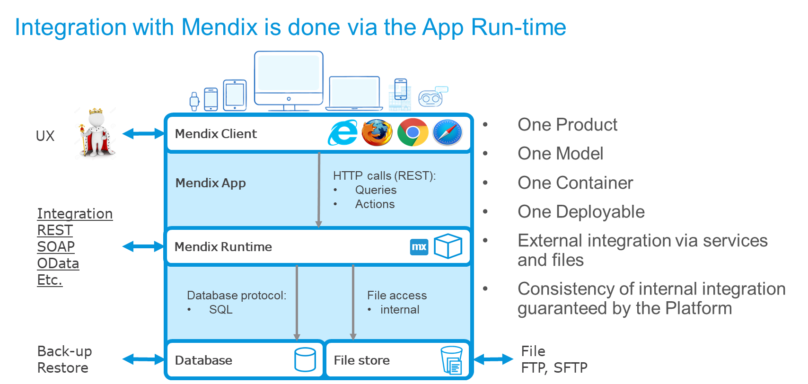

## 1 Introduction

Mendix makes it easy to build, update, and maintain an application or microservice that fulfils a business function. The best practice is to try and keep as much of a business function as possible in an app to minimize external integration and complexity. In turn, this will make your DevOps teams more independent while making development and maintenance even faster and more efficient. However, most apps will need some external integration with other apps, systems, API layers, things, and human workflows.

The Mendix Platform is very good at integrating with virually any other technology. This Best Practices section provides an overview of how Mendix integrates with different formats and how it does this so securely and easily, some organizations even build Mendix apps whose entire focus is entirely on integration.

## 2 Internal & External Integration with Mendix

The sections below summarize the basic approaches to internal and external integration in the Mendix Platform.

### 2.1 Internal Integration Within Each App for Free

This diagram presents how the Mendix Platform keeps everything together—from design to operations—and checks the consistency in the app model before allowing changes to be committed to the [Team Server](/refguide7/team-server):

This means that you do not have to worry about the integration of internal app layers. The communication between an app's own UX layer, runtime server, database, and file store are all private and handled automatically by the Mendix Platform itself. Mendix strongly recommends not interferring with these mechanisms and always integrating via defined services or file contracts, as handled by the Mendix Runtime server.

### 2.1 External Integration by Contract & Secured

In Mendix, all external integration occurs via the app's runtime server, as presented in the diagram below. This internal Mendix architecture means that the Mendix model is in control of all integration, which also makes everything more secure and easy to maintain. 

Mendix handles a large array of formats and protocols out of the box (for more information, see the [Integration How-to's](/howto/integration/). If there is a format that is not immediateley supported (for example, with a specific old legacy system), then it is easy to extend Mendix with a new adapter using the [Mendix Platform SDK](/apidocs-mxsdk/mxsdk/).

Mendix recommends using REST services, OData contracts, or SOAP for real-time integration; SFTP for files; and Kafka or a queue management system for distributed architectures. Mendix also recommends avoiding any direct database queries to the Mendix database. In fact, this option is disabled on Mendix Cloud, because the platform cannot check external SQL, which raises the risk of problems in production. Poor SQL can destroy things in an app, and when things change in the domain model, the platform cannot warn the developer of broken links.

The standard for security on external integration is to use encrypted channels, meaning, SSL for service calls and SFTP for files. This always allows an app to be on different clouds, with data centers will communicate safely.

### 3 Thinking *Functionally* First {#functionally}

The most important thing for good solutions is to choose the right integration option from a lot of possibilities. These best practices will present an overview of integration methods and typical use cases. The first best practice is to have an open mind regarding integration requirements. This means thinking about what the integration really needs to accomplish and consider more than one option for the solution.

In the days of SOA layers, a central ESB would take care of a lot of integration functionality, such as transformation, routing, re-tries, queueing, and even combining services. In the modern era of microservices, you should aim for "dumb pipes and smart endpoints," which means you should almost always put transformation into the app itself. This also means that within a close cluster of apps, you should do all the integration directly, leaving for larger enterprises a thin API management layer or a message broker for communications between departments, networks, and geographies.

In turn, this means interface functionality starts inside one app and ends inside another system, so a Mendix developer needs to think through the entire interaction functionally and technically. The best practice is to think functionally first. Then, the different technical options should be compared to see which one has the fewest errors to manage and is the easiest to maintain through separate deployments of the apps being integrated.

For example, a data replication can be identified as functionally asynchonous, meaning, the process creating the business event with data does not have to be directly aware when the second app receives the information. In this case, the simplest and most stable implementation is to use the [Process Queue](https://appstore.home.mendix.com/link/app/393/) module available from the Mendix App Store in the first app. Then, you would implement a synchronous REST call from the second app to the first app, picking up the next message.

## 4 Best Practices for Integration Design

* Think before you integrate. There is a chance that a simpler approach can make the app a lot easier to build, test, deploy and manage in production.
* List all the planned integration early, and maintain the list through the project.
* Think about how you can make the overall integration simple (for example, by choosing the right apps or microservices). Integration that is too much and too complex is a sign that apps should be merged or that the functional division is sub-optimal.
* Start addressing external teams for integration dependencies early. If the other teams need to make changes to make your app work, those needs to be identified immediately.
* If there are existing external services, make sure they are adequate. For example, you should avoid all types of loops on services, because they tend to make apps slow. If your source app can collect information internally with SQL, that is more efficient and the integration will be faster. 
* Design the integration well. Consider what triggers the interface, who needs what data and when, and whether you can cache the data (by storing a local copy).
* Plan for what functional errors can occur and how to manage them.
* Consider how to minimize the overall integration complexity.
* Analyze which integration use case applies and which technical options are available. Use these [Integration](integration-overview) Best Practices as references!
* Make a conscious choice about why one method is chosen over another.

## 5 Basic Solution Categories

For most of the integration related to Mendix, there are five basic solution categories that are almost always used. Sometimes just one is used, and sometimes a combination is used:

* [Service Integration](service-integration) – This is otherwise known as remote procedure call (RPC) integration. This category uses request and reply, and it almost always synchronous. The request-reply interfaces with REST and SOAP. There is also database integration with OData and SQL, business event and process integration, process orchestration, integration apps, and distributed ESBs.
* [UI Integration](ui-integration) – This solution category includes, for example, using a deep link from the UI of one app to open the UI of another app (either in the same browser tab or another tab). It also includes website, content management system, and content delivery network integration.
* [Event-Based Integration](event-integration) – This category usually does not have a response, and it is used to distribute data at large scales or large distances, or simply distribute data in a decoupled way. Event-driven integration can involve IoT, metrics, and social media, as well as state engines and event management.
* [Batch Integration](batch-integration) – This category includes exporting, moving, and importing files as well as file integration.
* [Central Data](central-data) – This category uses a pattern where data is landed and combined in a central place before it is distributed. This could be, for example, an operational data store (ODS); extract, transform, load (ETL); business intelligence (BI); or data lake solution.
* [Integration Layers](integration-layers) – This category involves ESB, internal and external API management, and other gateways.

## 6 Overview of Use Cases & Solution Options

Plotting functional use cases against basic methods of integration allows you to see there are several common options available. That is good, because integration needs to be flexible in a solution for the architect to select the best option for a specific situation. 

For example, you may choose not to change an old system, which leads you to choose another option than you would if you were building two new apps. This means that you may choose the less ideal way to integrate in order not to change an old system. In the scenario that you were building two new apps, you would make another choice.

As another example, when integrating to SaaS solutions and older systems, there may only be one option available. Such a scenario will determine which integration to use, rather than these guidelines. 

The table below presents use cases that you can reference  for more detail. The table uses the following symbols:

| Symbol | Meaning |
| --- | --- |
|  | Indicates the common or preferred use of the method. In some of cases (for example, "Integration with IoT solutions"), the solution will require several methods, so several of these symbols are used. |
|  | Indicates possible use in some cases. |

| Use Case | UI Integration | RPC / Services | Events / Queues | Export, Import, Batch | Central Data |
| --- | --- | --- | --- | --- | --- |
| SSO, AD & Identity integration |  |  | | | |
| Import & Distribute Reference Data | |  |  |  |  |
| View & Search Data in Another System  |  |  | | | |
| Use & Refer to Data in Another System | |  | | |  |
| [Process Int.](process-integration) (cont. workflow) |  |  |  | | |
| [Export, Import & Batch Processing](export-import-batch) | |  |  |  |  |
| Update Data in Master App |  |  |  | | |
| Distribute Master & Transactional Data | |  |  |  |  |
| Int. with BI & Reporting | |  |  |  |  |
| Mobile Int. & Offline | |  |  | | |
| CMS & CDN Int. |  |  | | | |
| Process Orch. & State Engines | |  |  | |  |
| Int. with Ops & Monitoring |  |  |  |  |  |
| Int. with IoT Solutions | |  |  |  |  |
| Int. with AI & Machine Learning | |  |  | |  |

For more details, see [Integration Examples](integration-examples).
