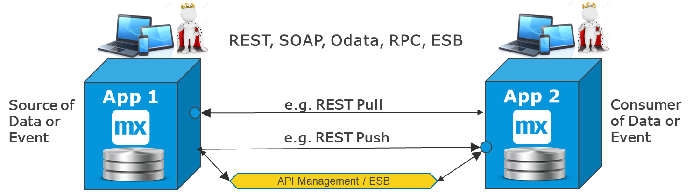
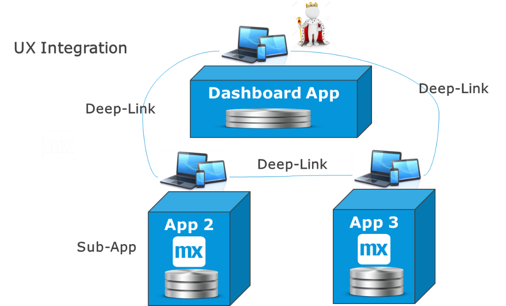
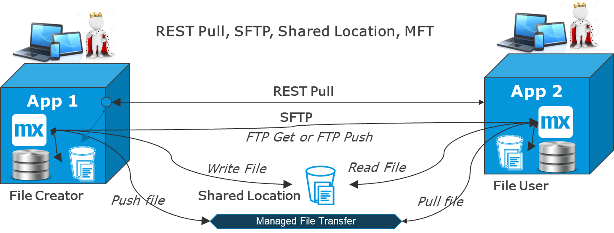
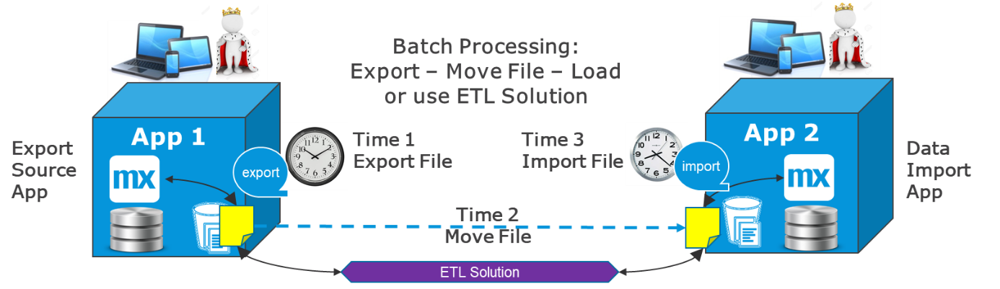
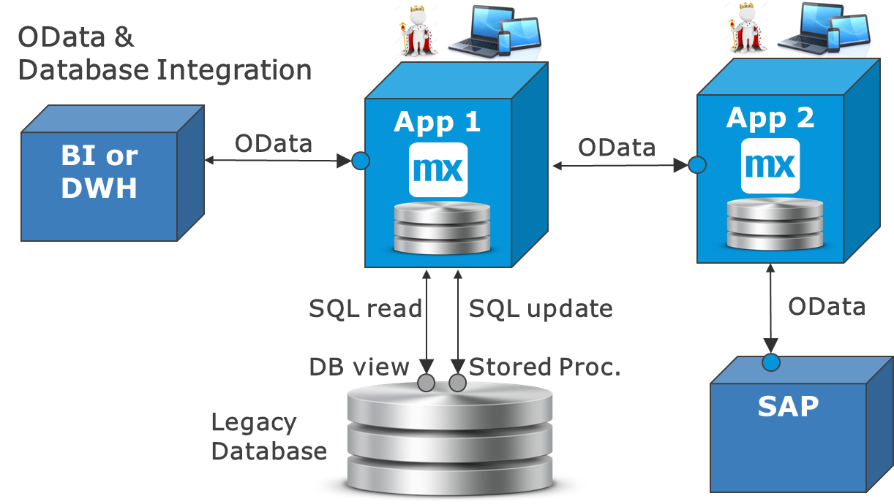
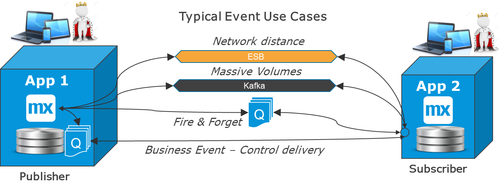
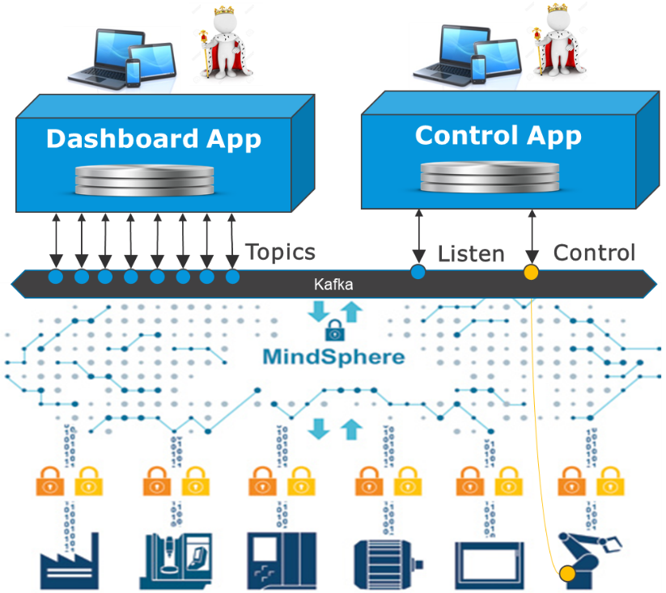
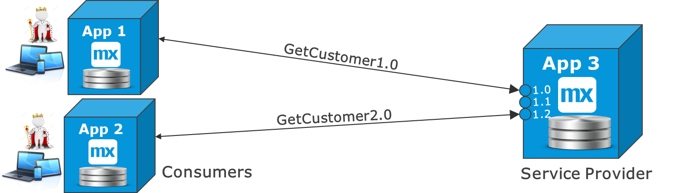

{}[**COULD USE 1-2 DIAGRAMS FOR LAST SEVERAL SECTIONS**]{}

## 1 Introduction

Mendix makes it easy to build, update, and maintain an apps and microservices that fulfill business functions. Usually business functions need a GUI, logic, and data. The internal integration of those layers is handled by Mendix, but for most apps and microservice architectures, integration with other systems is necessary. The diagram below shows how Mendix keeps all these parts together and checks consistency in the app model:

{}[**UX-UPDATE DIAGRAM**]{}

So, you do not have to worry about the integration of internal app layers. However, the Solution Architect or Lead Developer does need to design good microservices and interfaces that can integrate seamlessly with other apps and systems in the enterprise.

In Mendix, all the integration goes via the app's runtime server, which is a clear advantage for security and control, as presented in this diagram:

{}[**EXPLAIN DIAGRAM; UX-UPDATE DIAGRAM**]{}

Mendix handles a large array of formats and protocols. For more information, see the [Integration how-to's](/howto/integration/).

The most important thing to do is to choose the right integration option from a lot of possibilities. These best practices will present an overview of integration methods and typical use cases.

### 1.1 Security

The standard for security is to almost always use encrypted channels: SSL for service calls and SFTP for files. This always allows an app to be on different clouds and data centers will communicating safely.

### 1.2 Always Think *Functionally* First {#functionally}

The first best practice is to have an open mind regarding integration requirements. Think about what the integration need really is and consider more than one option for the solution.

It is important to remember that an interface starts inside one system and ends inside one or more other systems. There could also be integration components in the middle, so the
number of options to decide on can be quite large.

First, consider the following questions:

* What triggers the interface?
* Who needs what data when?
* Who should handle functional errors if they occur?
* Who should handle technical errors?
* How can integration be minimized?
* How can a UX be built that requires very few service calls to load?

Next, consider which use case applies and which options are available. 

Finally, make a conscious choice about why one method is chosen over another.

## 2 Use Cases & Solutions

### 2.1 Use Case Categories

"Integration" means any kind of interaction between any person, thing, app, or system for any type of purpose. The scope is enormous, and there are hundreds of use cases. When scoping out a new project, there is a fair chance you may find a new type of use case, even if you have worked on integration for years. So, there is reason to keep your eyes open for what is similar and what is different in the use cases we already know.

However, there are typical use cases for which Mendix is creating example implementations. These best practices are related to such typical use cases.

{}[**EXPLAIN DIAGRAM; UX-UPDATE DIAGRAM**]{}

For each use case, we need to consider which solution is most suitable under which condition.

### 2.2 Solution Categories

For most integration related to Mendix, there are five solution categories that are almost always used. Sometimes just one is used, and sometimes a combination is used:

{}[**EXPLAIN DIAGRAM; UX-UPDATE DIAGRAM**]{}

* **UI integration** – This solution category includes, for example, using a deep link from the UI of one app to open the UI of another app (either in the same browser tab or another tab). It also includes content management system integration with, for example, Akamai and other CMSs.

* **Services** – This is otherwise known as remote procedure call (RPC) integration. This category uses request and reply, and it almost always synchronous.
* **Event-driven** – This category usually does not have a response, and it is used to distribute data at large scales or large distances, or simply distribute data in a decoupled way.
* **Batch-oriented** – This category includes exporting, moving, and importing files.
* **Central data** – This category uses a pattern where data is landed and combined in a central place before it is distributed. This could be, for example, an operational data store (ODS); extract, transform, load (ETL); business intelligence (BI); or data lake solution.

## 3 Integration Styles

### 3.1 Request–Reply (Most Frequently Used)

Request–reply is a collaboration style in which whoever initiates the integration expects a response back from the destination. For most standard interfaces, a request–reply scenario is the easiest way to integrate, because the side of the interface that starts the integration knows directly if the call worked or not.

Request–reply is more deterministic and therefore easier to think about. If it times out, it is possible to try again later (if relevant). If it there is an error message, the calling system can react directly by setting a flag, starting an error workflow, or displaying an error message on the screen that helps the end-user correct the problem immediately.

This diagram shows that within request–reply, there are three basic options:

* Pulling data or a business event from another system
* Pushing data to another system or initiating a process there
* Using a service layer in between, such as API management

{}[**UX-UPDATE DIAGRAM**]{}

The "pull" request–reply version is the most commonly used option when replicating data from point A to point B. The reason for this is that the system that needs the data is in charge of triggering the interface. To know what has changed, there are 3-4 options, explained in the section “Request-Reply Options”.

{}[**WHERE IS THIS "Request-Reply Options" SECTION?**]{}

### 3.2 UI Integration

In microservice systems, there is often a dashboard app, portal, or landing page where people sign in (for example, via single sign-on). This often contains workflows, overviews, and statuses. When the end-user wants to perform real work in an area, they are deep-linked into another app to work there.

Integration via a UI link is becoming more common. This enables developing a UI only once in the app where it belongs, and then linking and directing other users there when they need to perform that process.

UI integration can also have an advantage for mastering data, since the process and UX validations of information are always done in the same way. When the work is done, a relevant part of the new data can be copied back to the other app.

These are the main variations, depending on the business requirements:

* The  second app is opened in the same tab, and the user is unaware of working in several apps
* If parallel work in two areas is preferred, another tab is opened, and the user can work in both aspps simultaneously
* Mendix is running in a functional portal within another web page that is provided by a content management system (CMS)
* Mendix is running a portal and using a content delivery network (CDN) such as Akamai to quickly show pictures in a geo-scaled solution

This diagram presents the most typical deep-linking option:

{}[**UX-UPDATE DIAGRAM**]{}

### 3.3 File Integration & transfer

File integration is highly relevant for many implementations, especially when it comes to pictures and PDFs (for example, for marketing or instruction manuals). Files are also used to extract data from one app and later import it into another app (for more details, see the [Batch Processing, Export & Import](#batch) section below). And, of course, this is used for backup and restore.

Each Mendix app has a dedicated file storage area to which it will write files by default. This is also where the Mendix app log file is located, by default.  The size of this area is large enough to handle most regular file management, and it can be extended if there are special needs to quickly access and show a large number of files.

Depending on the size of the file, the urgency, and the network situation, the app that needs to use a file can read a file from a remote location or copy the file to his own folder first.

The diagram below presents these options with some additional points:

1. Call the source app via REST to request the specific file.
2. Read and write the files to a shared file location or drive.
3. Move the file via SFTP, which can be either push or pull. This requires the [SFTP](https://appstore.home.mendix.com/link/app/107256/) App Store module and a Java action.
4.	Using an enterprise service bus (ESB) or a manager file transfer (MFT) solution usually also requires FTP, where the file is pushed to MFT and pulled from there by subscribers.

{}[**UX-UPDATE DIAGRAM**]{}

In simple instances and smaller files, a REST call is enough. Considering other interfaces using REST, it is recommended as the first choice.

If there are a lot of (heavy) files, it is better to use a shared location and/or move the files using SFTP, for example.

For the many-to-many file transfers, MFT can be an option. In a small scale, this function can even be built as a Mendix microservice specializing in this.

### 3.4 Batch Processing, Export & Import {#batch}

Even in a "real-time" world, file integration and batch processing remain relevant. Batch processing runs a large set of data at a certain moment. Interfaces towards data warehouse (DWH) and BI are often bulk and/or snapshot oriented. The same is true for initial loads of systems or the distribution of reference data.

Other business processes remain periodic (for example, salary payments), but interest calculations and even monitoring solutions typically have an agent that batches up some data before sending events with many records in order to save on processing power. These use cases are best implemented in batch-oriented interfaces, mostly using files. This means that batch processing, export, and import will stay important in the future.

One advantage of batch is that systems are decoupled, meaning, the export and import can run at different times. The interface can be “re-run” and/or use a workflow that handles errors. Another advantage is that processing bulk is more CPU-efficient, and it can often be done at night, when the other load is lower.

As indicated, files can be read remotely or copied back to the app file space first, based on how close the apps are on the network and depending on the size of the data and other restrictions that may exist.

The most common format is CSV import and export, which also work well with Excel integration. The [Excel importer](https://appstore.home.mendix.com/link/app/72/) module in the Mendix App Store is one of the most commonly used modules available.

When there are text fields in the data, there should be more complex field separators than commas. In the "to" and "from" legacy systems, one can see fixed-length fields, which requires a microflow to be built to read the data correctly using character position.

This diagram shows the three main steps of exporting, moving, and importing a file. Batch processing can involve all three steps, or it can only be related to an export or import. There are extract, transform, load (ETL) system solutions that can perform all three steps and add data mapping in the middle.

{}[**UX-UPDATE DIAGRAM**]{}

### 3.5 Database Integration & OData

Mendix can integrate directly with external databases using OSQL, OData, or SQL.

OData is the preferred method if it is available, because it provides a clear contract and is directly supported from the Mendix Platform. However, it does require both sides of the integration to support OData (for example, the integration from Mendix to SAP is well supported via OData contracts).

OData can be used between Mendix apps for reading out data directly and from a BI solution to retrieve data from a Mendix app closer to real-time than using a daily batch-file. The reason to do this could be that a good REST service is not available. It could be an old legacy database where the data model never changes or changes very rarely, so that there is little risk for the calls to fail due to changes in the system below. For a Mendix app to get data from a legacy application that should no longer be changed, it is unlikely that OData is available, and then direct SQL is often used.

In all the cases where database integration is done, it is recommended to have some level or “padding” from the base database tables, so that when things change in the source system, the integration still works:

* For read contracts, a database view is recommended that provides a simplification of the SQL required in the Mendix Java action that calls it
* Updating and creating objects in the external database via a stored database procedure is recommended, as that can do the necessary validation and perform the update in a consistent way (that the calling app itself should not be aware of)

This diagram presents the most common cases of OData integration and direct database integration.

{}[**UX-UPDATE DIAGRAM**]{}

{}
Never do direct SQL across firewalls.
{}

### 3.6 Event-Driven Trends

At the moment, event-driven architectures are making their return into the mainstream of integration. This follows an increased interest in and focus on, for example, IoT solutions, distributed networks of actors, and central monitoring. Several solution providers are promoting new paradigms for managing large, distributed, high-volume event driven architectures.

The main characteristic for event-driven trends is that the process that produces events or data does not communicate directly to the target system. Rather, it creates an “event” message that is put on a queue for asynchronous delivery. This means that the triggering process will not know directly if the message arrives or if there were errors in the delivery.

#### 3.6.1 What Can Be Used as as Queue?

The queue that is used depends on the situation. It can be an internal queue in the source system, or an external queue management system, such as Kafka or any other standard queueing system on the market.

Mendix itself does not currently provide an external queue management system, but in the App Store, there are connectors to most standard queue managers on the market. There are plans to eventually provide Kafka as a queueing system “under the hood.”

{}[**ADD APP STORE LINKS? VERIFY LAST SENTENCE SHOULD BE KEPT**]{}

In the App Store, there is an [Process Queue](https://appstore.home.mendix.com/link/app/393/) module available that is used by many customers both as an out-bound queue and an inbound queue. The advantage of this is that there is no external technology to deploy and manage. The limitation with internal queues is that, in the end, a request–reply is required to move the event, or it must be pushed via a file-based interface. This is only a limitation if there are large geographical distances or many subscribers and publishers.

{}[**EXPLAIN DIAGRAM; UX-UPDATE DIAGRAM**]{}

#### 3.6.2 Reasons to Go Event-Driven

Always consider a synchronous request–reply as the standard option for integration, because it is the simplest and most robust way to integrate when you want to make sure that the data or event arrives safely in the destination. This means that it is easier to think about and easier to manage errors that way.

There are some clear cases where event-driven integration is preferred:

* If it is truly a one-way communication (meaning, the source of the data/event expects no answer back, and the destination always accepts all messages)
* There is a very high volume (as in, > 1000 messages per second could mean that request reply becomes less efficient)
* You can afford to lose a message or two (as occurs with stock tickers, IoT, and logging messages), thus you are looking for trends or having the next message overwrite the previous one
* Geographical distances or network issues makes direct communication impossible or unstable
	* If guaranteed delivery is required in this case, it is recommended to use a state engine in the middle, or use an asynchronous request–reply (as in, have a two-way event-driven communication)
* Where there are many publishers and many subscribers, that should be as fast as possible in the same shape on hundreds of servers around the world or employ user metrics in the same use case (LinkedIn created Kafka to solve this problem)

{}[**ABOVE LINE ABOUT "user metrics" IS UNCLEAR**]{}

In the diagram below, some typical event use cases are shown. Note that Kafka is also a great choice for fire-and-forget, and network distances and ESBs can also handle large volumes.

{}[**UX-UPDATE DIAGRAM**]{}

The internal queue provides the best control over delivery of business events in a one-to-one situation, because it only has two parts involved. However, this is not suited for massive volumes or if the two systems are hard to connect via a network.

#### 3.6.3 One-Way Communication

The key to event-streams is that they (often) only flow in one direction. A device leaving metrics in an IoT system does not expect an immediate answer to the data it ships. Additionally, there could be very many devices that are geographically distributed and shipping a lot of data. Request–reply is neither needed nor practical for inbound IoT, but for commanding a drone or other device, for example, it is highly recommended.

IoT, AI, and big-data integration is only the beginning of an expected explosion of new IT that will be built alongside the current IT landscape. In the coming years, Mendix and Siemens will invest heavily in this area. With this perspective, Kafka and other event-based architectures will play an important role in the coming years.

#### 3.6.4 IoT, MindSphere & Kafka

IoT, Kafka, and other event-based architecture will play an important role in the coming years. Mendix is working to incorporate Kafka into the platform, and a seamless integration with MindSphere was recently set up.

{}[**VERIFY CLAIMS FOR KAFKA AND MINDSPHERE**]{}

Mendix will in these cases usually work as the dashboard for event streams and sometimes as the control center for devices and other connected items.

This diagram gives a schematic view of a potential Mendix integration where one app provides a dashboard and the other one is used to control a robot:

{}[**UX-UPDATE DIAGRAM**]{}

This integration is many-to-many and largely event-driven. Using Kafka can be a relevant option if the Mendix app is located far away from the MindSphere implementation.

### 3.7 Integration Apps & Distributed ESBs

Many old legacy systems have a very specific format of communication, which could be from mainframes or any other old technology. To create integration for these systems takes a technical developer. Because building this technical integration repeatedly is not a good idea, it is a good option to create one single adapter or integration app that specializes in the intricacies of that legacy system.

Other apps can then integrate with the adapter in a simple format using REST or files, for example, and then using the pre-configured functionality. For a typical use case, it could take 3 TCP/IP or RPC calls to do an operation, which the integration app would encapsulate into a single easy-to-use REST service.

Depending on the use case, the integration app may only forward real-time requests to the back-end system, it may cache some requests, or it may even store entire datasets and provide them via services or files. It really depends on how you answer the following questions:

* What is the legacy system capable of?
* Whats is the requirement to use the data from other systems?

In the diagram below, both file and RPC integration is shown to the legacy system. Depending on the situation, you can use one method or both:

{}[**UX-UPDATE DIAGRAM**]{}

For example, you can imagine that most interaction happens via a retrieval of data. To make that fast and easy, the integration app imports the relevant data via a file and stores it in a format that is ideal for retrieval, a materialized view, or making parts of the legacy system data easily available via OData.  You will need the updates to be synchronous all the way, so you should use REST in the integration app, which would translate to TCP/IP and update the legacy system as a request reply interface, then informing the user of success or failure.

The benefit of using Mendix for this is that if there is an admin UI needed, it is easy to provide. In effect, you can create a distributed ESB with this pattern.

### 3.8 Integration Layers

Describings all the integration layers available is outside the scope of this document, but it is worth mentioning some standard situations below.

In all of these cases, the integration between the Mendix app and the integration layer has the same properties as integrating between two Mendix apps. The same integration patterns exist, and the same technical protocols can be used.

#### 3.8.1 Typical Layer Options

These are the typical integration layers:

* **Reverse proxy** – This is an integration component that sits in the firewall and provides restricted access to certain domains and IP addresses, providing security for externally provided services.
* **External API management** – This is a professional and central reverse proxy with consistent logging, security, and protection against denial of service attacks.
* **Internal API management** – This can also be used by a large enterprise to provide a single technical connection point for all systems. This means that with a new app, you only have to know how to connect to this layer, instead of to all the source systems.
* **ESB** – This is like an internal API management layer, but it also provides mapping of messages and service orchestration. This can be valuable, but it also tends to become a bottleneck for the delivery of enterprise-wide integration.
* **ETL tooling** – This is like an ESB, but it focuses on batch processing and BI and DWH integration. It usually stages the data first, does heavy mapping, and then updates the destination. It can do direct database connections or use files.
* **Managed file transfer (MFT) tooling** – This can create a practical deposit and pickup point with access security for all file interfaces. It often has scheduling included and raises alarms if files do not arrive as expected.

#### 3.8.2 Why Use an Integration Layer?

There are many possible reasons to use an integration layer, but it is far from necessary. Small companies often have only a reverse proxy and do all other integration directly. For such companies, using Mendix integration apps can be cost-effective and an easy way to move towards an integration layer while utilizing the same technology and similar skill sets as for building apps.

For large enterprises, it makes sense to use integration layers between departments and/or geographies. Some enterprises use all the options listed above. 

If there is an existing standard, it is always recommended to stay with it to maintain consistency. Only when productivity is severely impacted should the Lead Architects start looking for ways to make a better standard.

### 3.9 Operational Data Stores

If the integration layer in the middle stores and combines business data before re-distributing it to other parties, it is a “central data” integration pattern, often referred to as an operational data store (ODS).

A typical use case here is if a company has 10 business lines with all different ordering systems, but only one single support desk. It then makes sense to store all the orders in a central point where they can be searched together using SQL instead of composite service calls. 

Mendix apps can also be used for ODS solutions, since it is easy to integrate several disparate systems, store the data, and manage any errors in the integration by creating human workflow for it.

Data lakes are like an enterprise-wide ODS that doubles as a BI and DWH system. It is a big undertaking to make this work, and there is an issue when trying to combine operational data and snapshot-type data used for statistics. Most experience shows that it is unwise to use the same system for DWH and operational data.

### 3.10 Ops Integration & Test Services

A new trend that is part of microservices as well as DevOps is to build services and interfaces from live systems that are specifically oriented towards automated testing and health checks on live systems.

A service used to test things in CI/CD pipelines may later be reused to verify a production deployment, check a live system, or collect user metrics for a dashboard.

For professional operations solutions, there is often an agent per node, shipping data in near-real time towards an application performance monitoring system [APM](apm/index) that is used for root-cause analysis, trend analysis, sizing metrics, and alarms.

[Microservices](../microservices/microservices-overview) also often have an admin page where important information is collected. This can include both technical and functional KPIs that help maintain the solution as well as data from a local ops dashboard or app-management module. These pages can be deep-linked for further use.

### 3.11 Overview of Use Case & Solution Options

Plotting functional use cases against basic methods of integration allows us to see that there are several common options available. That is good, because integration needs to be flexible in a solution in order to adapt to how systems, things, or people communicate. 

The table below presents use cases that you can reference  for more detail. The table uses the following key:

* &#10004;&#10004; indicates the common or preferred use of the method
	* In some of the latter cases (for example, "Integration with IoT solutions"), the solution will require several methods, so there are several instances of &#10004;&#10004;
* &#10003; indicates possible use in some cases

{}[**ADD LINKS AS DOCS AVAILABLE**]{}

| Use Case | UI Integration | RPC / Services | Events / Queues | Export, Import, Batch | Central Data |
| --- | --- | --- | --- | --- | --- |
| SSO, AD & Identity integration | &#10003; | &#10004;&#10004; | | | |
| Import & Distribute Reference Data | | &#10004;&#10004; | &#10003; | &#10004;&#10004; | &#10003; |
| View & Search Data in Another System  | &#10003; | &#10004;&#10004; | | | |
| Use & Refer to Data in Another System | | &#10004;&#10004; | | | &#10003; |
| [Process Int.](process-integration) (cont. workflow) | &#10004;&#10004; | &#10003; | &#10003; | | |
| [Export, Import & Batch Processing](export-import-batch) | | &#10003; | &#10003; | &#10003;&#10003; | &#10003; |
| Update Data in Master App | &#10004;&#10004; | &#10004;&#10004; | &#10003; | | |
| Distribute Master & Transactional Data | | &#10004;&#10004; | &#10003; | &#10003; | &#10003; |
| Int. with BI & Reporting | | &#10003; | &#10003; | &#10004;&#10004; | &#10003; |
| Mobile Int. & Offline | | &#10004;&#10004; | &#10003; | | |
| CMS & CDN Int. | &#10004;&#10004; | &#10003; | | | |
| Process Orch. & State Engines | | &#10004;&#10004; | &#10003; | | &#10004;&#10004; |
| Int. with Ops & Monitoring | &#10003; | &#10003; | &#10004;&#10004; | &#10003; | &#10004;&#10004; |
| Int. with IoT Solutions | | &#10004;&#10004; | &#10004;&#10004; | &#10003; | &#10004;&#10004; |
| Int. with AI & Machine Learning | | &#10004;&#10004; | &#10003; | | &#10004;&#10004; |

To read these use cases, start with [Integration Use Cases](integration-use-cases).

## 4 Decoupling & Dependencies

Integration is something you will always need, but it is often the most difficult part of an implementation. This is partly because the variation in patterns is so large, and partly because it is an unavoidable dependency on another component and team that may not be ready to help.

### 4.1 Example Of Team Dependencies

Even in a situation that seems fully decoupled—where an app is supposed to receive a file and import it—it could happen that since you are implementing a new business function, there is a field you need that is not in that file. Then, you are still dependent on another team to make an update in the file export program.

Because integration involves team dependencies, you have to learn to live with them, be extremely adaptable, and be ready for issues along the line.

### 4.2 Good Services with a Purpose & Avoiding Loops

In another use case, you want to show which customers are impacted when a ship with thousands of containers is stranded in a port. And there are services providing the right data, but they are not good for your purpose.

If you have to retrieve all the containers, call a separate service for each of them that gives you the shipment, and call another service for each shipment to find the company that ordered it, your system will not perform well.

In this case, you would ideally ask the sub-system to create a new service that is optimized for this new business function. If that system is old and impossible to touch, it could make sense to either create a new microservice or integration app that has the single purpose of providing this data. It will import data from the source systems and keep it up-to-date by polling for changes. The dashboard app that the business uses can then be simple and make a real-time call to the integration app, which would then givee a sub-second response.

### 4.3 Scoping Out Integration Early & Implementing Late

Because integration is an external dependency, it makes sense to scope out the required integration early in order to have as much time as possible for getting other teams to provide updated services or files before the go-live date. While waiting, you can use mock services and/or files and connect to the final version towards the end of the project.

### 4.4 Request-Reply Decoupling {#request-reply-decouple}

Decoupling for real-time request-reply interfaces means there is a point in the middle of forwarding requests, so the systems are still not independent. Both the service provider and the consumer must be up and running for the interface to work.

### 4.5 Asynchronous Decoupling 

Decoupling for asynchronous interfaces or files is more obvious. This is because one side of the interface finalizes it’s work at one time, and the other system receives information or data later.

{}
However, in both this case and [request-reply decoupling](#request-reply-decouple), there is a functional dependency that cannot be removed and that you have to work with via new and more frequent releases of other apps. If changing a file format or message format, everybody that uses that service or file must be informed.
{}

### 4.6 Service Versioning 

This is the standard way to handle service versioning:

1. Provide two separate end points for each service version.
2. Preferably put the service version in the service end-point name, so that nobody can be mistaken when using it.
3. Allow consumers to migrate within a certain time limit.

{}[**EXPLAIN DIAGRAM; UX-UPDATE DIAGRAM**]{}

### 4.7 Consumer-Oriented Services

A good standard for both security and for limiting dependencies is to not make services too large and generic. This is because each app will get a service that is just adequate to what is needed – not more and not less.

## 5 Recommendations

### 5.1 Minimize Integration

{}[**"1-N" CLEAR ENOUGH HERE? REPLACE WITH "one-to-many"?**]{}

It may seem obvious, but it is still worth pointing out that the overall solution design of 1-N apps working together should always attempt to find the functional components and interfaces with the least amount of integration need and the least complicated integration.

That will make the overall solution easier to build and maintain, and it will also simplify dependencies between apps. This means that even the decision on which microservices/apps to build should incorporate integration analyses.

### 5.2 Dependencies Are There, So Learn to Work with Them

Apps working together are dependent on each other – that is part of the business process and cannot be avoided. Trying to eliminate a functional dependency between two apps via a technical solution is not recommended, because this usually creates other functional issues with more complex error handling.

For example, when sending data from App A to App B, we may put them in a queue in between asynchronous events, which would seem to eliminate an online dependency from a synchronous request reply. But in fact, error handling becomes much more difficult in this scenario, since neither App A nor App B is aware of the entire travel path of the event, and if something goes wrong in the middle, there is no proper notification. A better solution is often to poll from App B to App A and get all the recently updated records. The app that needs the data is then in control of the entire interface, and error handling is confined to one single place.

In this example scenario, the development dependency is almost eliminated, but the runtime situation is less optimal with events than request–reply. 

Still, there are many cases when events make more sense (for example, real event streams from IoT, logging, or metrics). In the cases, data should only flow one way, and a message can be lost without breaking the business.

There are also technical reasons to go for events (for example, very high volume, distributed infrastructure, poor network connectivity, many-to-many situations). To guarantee delivery, one can make asynchronous request replies or use a state/process engine to monitor all the events in a large supply chain process.

### 5.3 Keep It Simple

Event-driven integration will increase drastically in the future. LinkedIn is already using Kafka to distribute posts, metrics, and user statistics, and Siemens and the rest of the world are bracing for the era of IoT, when almost all devices will be connected.

However, the event-driven trend will not change what is already working well for normal business apps. The regular app developer who is integrating a few systems for regular business processes should generally keep it as simple as possible.

This usually means employing request–reply (for example, by using REST over Http(s)). This allows for control in the case of non-delivery of information or events, which should be managed for normal business processes.

### 5.4 Overall Recommendations

Apps should act as actors in a business process. They typically do different things, and often they have a different views of the data.

For example, a customer portal, sales funnel, support, and operations will all have product and customer data, but they will have very different views of the data. This is good, because they specialize in what is their specific task. When specialization is local, we allow for smaller interfaces, and thereby more autonomous services.

Mendix endorses the following basic recommendations:

* Seek the overall solution that minimizes integration, because integration means complexity, and this creates dependencies in releases and operations
* Think functionally first and do not start from the solution; instead, define what is really needed, and consider more than one technical solution option
* Use explicit contracts that only transfer the data required in order to make dependencies smaller and shelter apps from each other’s data models
* Use request–reply when possible for easier error handling
* Do not be afraid of copying data from one app to another, because this increases processing speed and removes online dependencies
* Only copy the data that is required in order to limit dependencies
* Consider consumer-specific contracts if a service is not truly generic and stable, because such contracts can augment autonomy and flexibility in releases

To continue learning about integration best practices, read through the specific [Integration Use Cases](integration-use-cases) that are provided.
