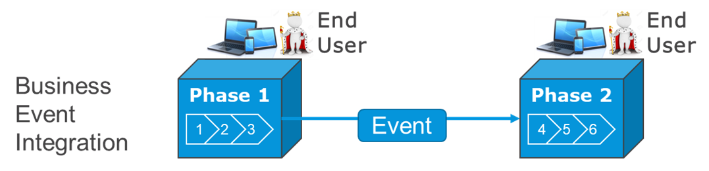
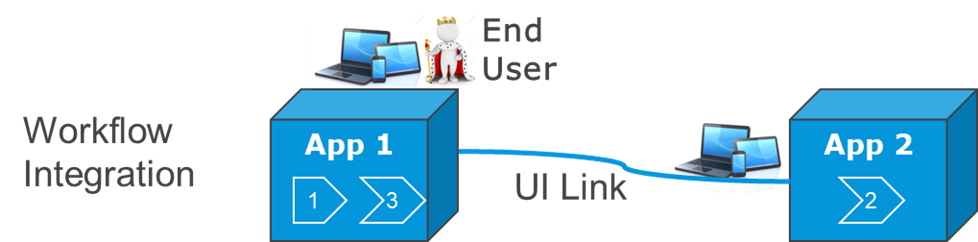
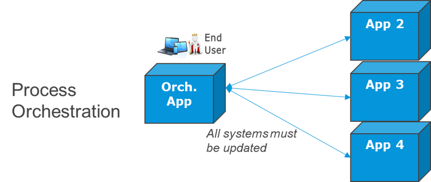
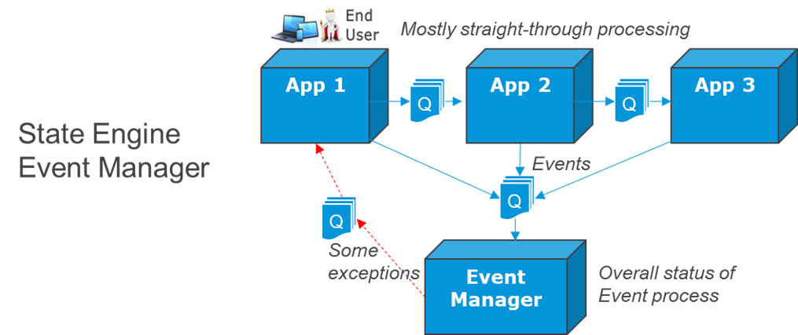
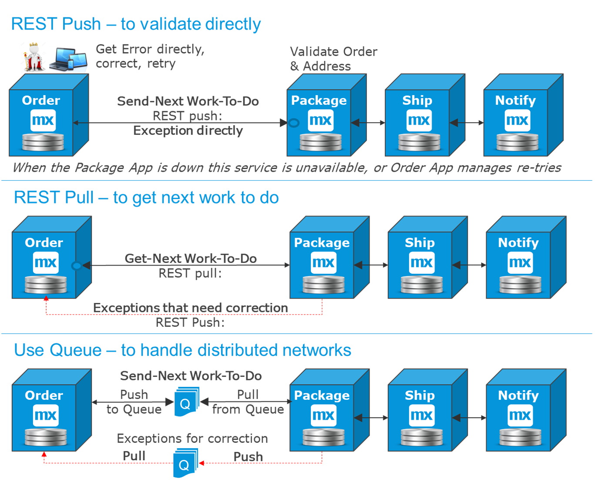
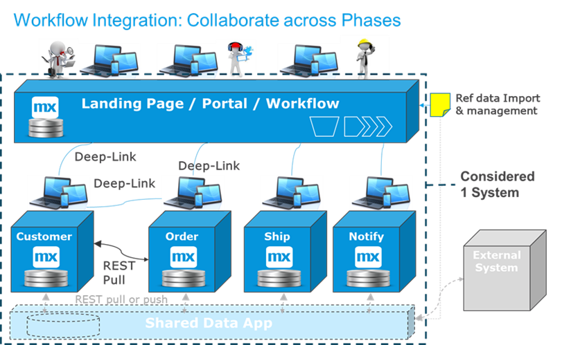
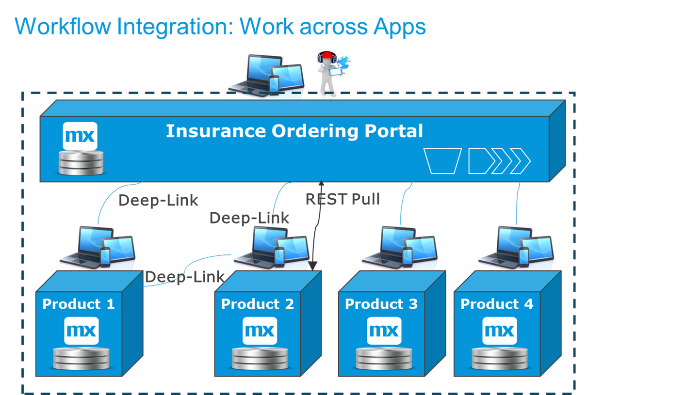
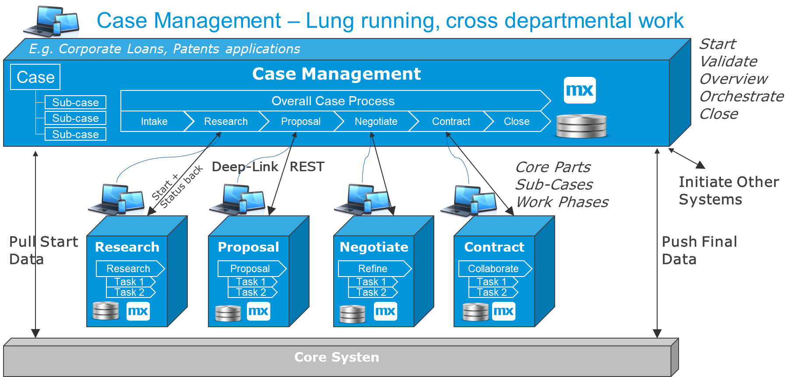
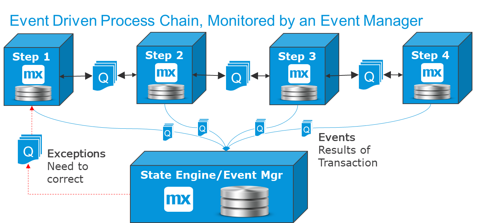

## 1 What Is Process Integration?

Process integration is a wide and important area that promises automation, digitization, and operational improvement. Often there is a significant business case for this type of IT development, where companies can gain on their competition by being more efficient, running lower costs, and providing better and faster services.

When a business process runs across several systems, there will be some type of process integration. There are many ways this can be done:

* **Business event integration** – Work finishes in one app, and the next app is notified to start the next step of the process automatically. This avoids, for example, sending emails and having to retype information into another system.

	

* **Workflow integration** – A user works in one app and then continues the same process in another app (for example, via a deep link). By enabling this integration, you can have specialized apps or microservices that evolve separately, but for the end-user it seems to be the same system. For more information, refer to [Workflow Integration with Data Transfer Example](workflow-int-data-transfer).

	

* **Case management** – Human workflow in phases maintains a “case” object with data and status. The case is routed to different user-group baskets and/or sub-cases are created and completed in other systems. This is the best way to support a cross-departmental process, where several user groups are involved with approvals and coordination.

	

* **Process orchestration** – A system actively orchestrates a process across several systems, keeping track of status, re-trying when required, and escalating to human workflow when required. This is useful for automating transaction processing (for example, in banks), for provisioning a bill of materials, and when a business event should lead to updates in several systems in parallel.
	
	

* **State engine/event manager** – Events are passively gathered related to a process that runs across several systems. This is to determine that the process finishes correctly and that actions can be taken when something is wrong. This is useful for monitoring and managing a chain of business events (for example, packages for track-and-trace) and for high-volume asynchronous process orchestration.

	  << FIGURE 5 >>

## 2 Business Events & Process Flow

The most common process integration is for business events. This means that some part of a  process finishes in one app, which triggers something to happen in the next app or system. The business-event messages can be transferred in different ways, depending on the requirements. 

These are the most common options:

* **REST push end-to-end** – this is the best option when the destination system should validate the business event, especially when there is a user working in the source system who can correct information directly
* **REST pull from the next system** – this is the simplest and most commonly used option, which works well for a majority of situations
* **Queues in the middle** – you can use a message broker or any other external queuing system when there is a high volume, large distance, or poor network

This diagram presents the three main options, and there is further description below:

* **When validation is required in destination, use a REST push to the next system** 
	1. App 1 finishes a piece of work pushes the business event forward, which is a good idea when a human worked on the case and if app 2 needs to verify that the data is correct. By doing this synchronously, the user can correct data directly.
* **With simple and low volume, use a REST pull from the next system** 
	1. App 1 finishes a piece of work and a flag is set or an internal event is created and stored internally. App 2 polls app 1 to ask for new work. When it has correctly picked up a piece of work, it resets the flag. 
	2. If a functional exception occurs in app 2, it may need to notify app 1 and ask for a correction using a separate service.
* **For high volume, large distance, or poor network, use a message broker in the middle or any other external queue** 
	1. App 1 finishes a piece of work and pushes an event to the external queue. 
	2. App 2 polls the queue to ask for new work, committing from the queue when safely stored. 
	3. If a functional exception occurs in app 2, it may need to notify app 1, which then often also goes via a response queue
	4. To minimize the number of errors in the destination, a technical XSD validation can be made in app 1 before sending, minimizing errors in destination

### 2.1 Selecting the Best Option

A REST pull from app 2 to app 1 (the second option above) should be the default option. This is the most robust option, and both apps can be redeployed independently.

The REST push option is good when you want app 2 to validate the business event while making sure that app 1 and app 2 are always in sync. However, this means you may not be able to finish the process in app 1 when app 2 is down.

Queues should be used in some cases, for example, with distributed networks, IoT-style integration, or together with an Event Manager, for automated straight-through processing, see <<Event Managers>> below.  
	
Kafka is often used as an advanced queueing system for one-way communications, such as IoT, central logging, or any other situation where there is a high volume, many-to-many distributed integration situation.

## 3 Workflow Integration

Mendix is often used as a workflow tool, where a partly manual business process is implemented in a Mendix app. The Mendix app can perform the workflow on top of SAP or legacy systems, or the app could be a departmental “business portal” that allows users to work in one single app instead of opening 10-20 different applications.

[Workflow integration](workflow-integration) means that the human workflow is handled across several apps via links in the UI (which are usually deep links). The end-user is often unaware that there are two separate apps. Sometimes you need to copy data behind the scenes, so the user has new data when they come back to the original app.

### 3.1 Example 1 – Dashboard for Standard Microservices System

This pattern is common for [microservices](../microservices/microservices-overview). When the process is large and/or contains functionally separate parts, it makes sense to split the “system” into a set of microservices. There is often a dashboard app where all the end-user groups log in and where they have the right to access different parts of the process via deep links.

### 3.2 Example 2 – Complex Products in Separate Apps

A real example here is for the insurance sector, as shown in the diagram below. Insurance products can be quite complicated, and by having a separate app for each product, this insurance provider can drastically shorten their time-to-market for new offerings. The end-user (insurance agent or customer) works in the portal, but when selecting a product, the actual detailed ordering and configuration of that product is local and done in a separate app. When the work there is done, the end-user is redirected back to the main app. Key parts of the data are also copied over to be visible there.

### 3.3 Example 3 – Creating a Customer in a Separate App

In the diagram below,  the customer app is separated from the ordering app because managing customer data in this organization is a central function and the ordering is just for one business line. The customer app has a lot of validation logic (contained in both the UX and the microflows), which we do not want to copy to the other apps.

In this example, the same end-user enters both the customer information (if new) and the ordering information. You then get a workflow across two apps where data needs to be copied directly after the transaction in the second app. This means the data is used in the ordering app directly after it is created in the customer app.

This is the flow for this ordering process example:

1. The end-user creates an order in the ordering app.
2. The customer searches for the the customer in the customer app and allows the end-user to select it in the ordering app.
3. If the customer is not found, the end-user clicks **Create User** in the ordering app UI. Via a deep link, the end-user is taken to the customer app UI.
4. The customer is created and stored in the customer app, after which the end-user is linked back to the same context/order in the ordering app. Note that the data should be saved in the ordering app to be available when the end-user comes back. Alternatively, selecting the customer can be made to be the first step in the ordering process.
5. Before control is handed over to the user in the ordering app, the customer data is retrieved and stored in the relevant fields on the order. This is then displayed in the ordering app UI.

## 4 Case Management

Human work is mostly done when possible in phases where certain pre-conditions are completed first. This leads to the need for case-management solutions.

When there is a long-running cross-departmental process with many decision points and approvals, it makes sense to treat the process as a case. A case contains a set of data that is enriched through the process as a set of tasks are completed during one or more phases. The order of most tasks are arbitrary, as humans decide to work on one or more tasks at the same time. The case management tool keeps track of pre-conditions of some tasks, or criteria to move from a phase to the next, and the addition of tasks for certain situations.

A simple example here is a ticket management system that manages the ticket (case) through several steps. The case can be reassigned to other groups or users within the same app, or it can be sent out as sub-cases to other apps to complete.

A more complex example is a patent application or corporate loan application. This type of case goes through several phases over 6–24 months. Within each phase, a significant number of tasks are completed. Some of these tasks are done in parallel, some require a set of other tasks to be completed first, some are automated, some are sent out to other systems for completion, and some are done by a human in the case management system itself.

The diagram below shows a case management system built as a dashboard/case-manager with work-baskets and overall control, and a few sub-case-apps to handle specific parts of work. 

In the diagram: A case is triggered from the outside or from a core system. The "intake" phase collects and validates the required data, and the case is then planned. After that, a due diligence or research phase done in an app specializing in that. Then, a decision-maker in the case system can decide to proceed and create a proposal, which requires document creation and legal capabilities. Next, a negotiation phase occurs that is specialized in internal and external collaboration, and new proposals can be created. Finally, a contract is signed and other systems are initiated, including the core system, similar to [process orchestration](#po).

Case management solutions have taken over from BPM for process management where there is human workflow involved, beause of the larger flexibility in when and how work is done. BPM stays relevant in the area of automated process orchestration, see <<Process Orchestration>> below.
	
### 6.1 Mendix for Case Management or BPM

The Mendix Platform is a good alternative to pre-defined BPM and case-management systems because the automation and case management can be adapted to the specific process problems that needs a solutions. Many existing BPM and Case management platforms were built for a specific business use-case, and they often traslate poorly to other insustries, sectors or business problems. But when using Mendix for complex process automation, we recommend using an experienced solution architect to get started. 

## 5 Process Orchestration {#po}

When a process finishes in one app, and several systems need to be updated at the same time, there is a need for Process Orchestration. The business process runs over several systems, and we need a component that orchestrates the work done in several other areas.

In the diagram below, the support app has been given the task of process orchestration for the operationalization of a newly sold product. There are two reasons for this:

* The support app already deals with cases and distribution of tasks
* If there is an issue the customer, is likely to call Support

This pattern is similar to what BPM engines do, and it works for highly automated and well-defined processes. Mendix is often used for this purpose, from an existing app (as in the diagram), or as a separate orchestration app, where a UX to handle errors is easier to realize than in e.g. an ESB or a queue management system.

## 6 Event Managers

A close relative to Process Orchestration is Event Managers, that act as a passive state-engines for automated processes, receiving events from all participants in a straight-through processing chain. It picks together and monitors the status of each initiated process. 

The diagram below shows a typical situation from e.g. the logistics or supply-chain industry:

1. A chain of apps implement the phases in a mostly automated process. 
2. A queueing system or message broker is used as transportation mechanism
3. An Event Manager collects the status of each overall process using events from the apps, and raises exceptions when required
4. A track & trace dashboard app alows checking the status of any specific automated process or getting alarms. 

  <FIGURE 13>>

The Event Manager makes sure that messages are not lost and that processes are not halfway finished. It can raise alarms when a phase is missing or something goes wrong, or a process takes too long to finish. The result of the alarm could be to notify the correct app in the chain, or to send a message to a dashboard for monitoring the process.

Dashboards and/or track and trace solutions are usually built separatelly using services to retrieve status or alarms. This makes them independent and allows more than one-purpose view, e.g. internal dashboard, and external track & trace.

The Event Manager solution is typically used when::

* The process is mostly automated with straight-through processing across a chain of apps 
* There is very high volume
* Systems are distributed or have unclear up-times
* There is another reason for using [event-based integration](event-integration). See the [State Engines & Event Managers](event-integration#state) section in *Event-Driven Integration*. 

The Mendix Platform can be used for building all of the components in the diagram, but most often Mendix is chosen for:
* Automated straight-through processing apps
* Internal dashboards and control apps

## 7 Summary

Process integration is one of the most important things an organization can focus on to increase automation, digitize processes, and make workflows leaner and more efficient. 

With Mendix, and while building in a Microservices oriented way, the process automation, case management, straight-through processing and dashboards for exceptions etcetera can be adapted exactly to the problem that needs to be solved. This saves organizations large amounts in implementation and maintenance cost and it makes the solution flexible to adapt to changing circumstances inside and outside the  organization.

