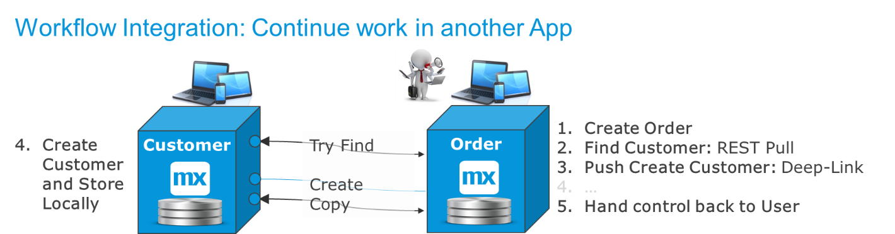

## 1 What Is Process Integration?

Process integration is a wide and important area that promises automation, digitization, and operational improvement. Often there is a significant business case for this type of IT development, where companies can gain on their competition by being more
efficient, running lower costs, and providing better and faster services. 

When a business process runs across several systems, there will be some type of process integration. There are many ways this can be done:

* **Business event Integration** – Work finishes in one app, and the next app is notified to start the next step of the process automatically. This avoids, for example, sending emails and having to retype information into another system.

	

* **Workflow integration** – A user works in one app and then continues the same process in another app (for example, via a deep link). By enabling this integration, you can have specialized apps or microservices that evolve separately, but for the end-user it seems to be the same system. For more information, refer to [Workflow Integration with Data Transfer Example](workflow-int-data-transfer).

	

* **Case Management** – Human workflow in phases maintains a “case” object with data and status. The case is routed to different user-group baskets and/or sub-cases are created and completed in other systems. This is the best way to support a cross-departmental process, where several user groups are involved with approvals and coordination.

	

* **Process orchestration** – A system actively orchestrates a process across several systems, keeping track of status, re-trying when required, and escalating to human workflow when required. This is useful for automating transaction processing (for example, in banks), for provisioning a bill of materials, and when a business event should lead to updates in several systems in parallel.

	

* **State Engine/Event Manager** – Events are passively gathered related to a process that runs across several systems. This is to determine that the process finishes correctly and that actions can be taken when something is wrong. This is useful for monitoring and managing a chain of business events (for example, packages for track-and-trace) and for high-volume asynchronous process orchestration.

	

## 2 Business Events & Process Flow

The most common process integration is for business events. This means that some part of a  process finishes in one app, and this should trigger something to happen in the next app or system of apps. The business-event messages can be transferred in in different ways depending on the requirements. 

These are the most common options:
* **REST Push end-to-end** – this is the best option when the destination system should validate the business event, especially when there is a user working in the source system who can correct information directly
* **REST Pull from the next system** – this is the simplest and most commonly used option, which works well for a majority of situations
* **Queues in the middle** – you can use a message broker or any other external queuing system when there is a high volume, large distance, or poor network

This diagram displays shows the three main cases, and after that each case is
described:

1.  **Validation required in Destination**: **Use REST Push** to the next
    system:

    1.  App 1 finishes a piece of work pushes the business event forward, which
        is a good idea when a human worked on the case and if App 2 needs to verify
        that the data is correct. By doing this synchronously the user can
        correct data directly.
	
2.  **Simple and low volume**: **Use REST Pull** from the next system:

    1.  App 1 finishes a piece of work and a flag is set or an internal event is
        created and stored internally. App 2 polls App 1 to ask for new work.
        When it has correctly picked up a piece of work it re-sets the flag.
    2.  If a functional exception occurs in App 2, it may need to notify App 2
        and ask for a correction using a separate service

3.  **High Volume, Large Distance or Poor Network**: **Use Message Broker** in
    the middle, or any other external queue.

    1.  App 1 finishes a piece of work and pushes an event to the external
        queue.
    2.  App 2 polls the queue to ask for new work, committing from queue
        when safely stored
    3.  If a functional exception occurs in App 2, we may need to notify App 2,
        which then often also goes via a response queue. To minimize the number of errors in destination, an XSD validation can
        be made in App 1 before sending. This gives a technical validation of the message

### 2.1 Selecting the Best Option

REST Pull from App 2 to App 1 should be the default option. It is the most robust and both apps can be re-deployed independently.

REST Push is good when we want App 2 to validate the business event, and to be sure App 1 and App 2 are always in synch. But this means that we may not be able to finish the process in App 1 when App 2 is down.

Queues should be used in some cases, e.g. for distributed networks, IoT style integration and sometimes where almsost all processing is automatic straight through processing, then often together with an Event Manager, to handle exceptions in the over-all flow.
Kafka can be used for one-way communications, such as IoT, central logging or any other situation where there is a high volume, many-to-many distributed integration situation

## 3 Workflow Integration

Mendix is often used as a Workflow tool, where a partly manual business process is implemented in a Mendix App. The Mendix App can perform workflow on top of SAP or legacy systems, or it could be a departmental “business portal”, that allows users to work in one single App instead of opening 10-20 different applications.

With *Workflow integration* we mean that human workflow is handled across several Apps via UX links (usually Deep-links). The user is often unaware that it is two separate Apps. Sometimes we need to copy data behind the scenes, so the user has new data when coming back to the original App.

### 3.1 Example with Dashboard for standard Microservices system

The pattern is a common for *Microservices*: The process is so large and/or contains functionally separate parts. It makes sense to split the “system” in a set of Microservices. There is often a Dashboard App, where all user-groups log in and where they have the right to access different parts of the process via Deep-links.

### 3.2 Example with complex Products in separate Apps

A real example is for the insurance sector shown in the diagram below. Insurance products can be quite complicated, and by having a separate app for each product this insurance provider could shorten time-to-market for new offerings drastically. The customer or agent works in the portal, but when selecting a product, the actual detailed ordering and configuration of that product is local and done in a separate app. When the work there is done, the user is re-directed back to the main app, and key parts of the data copied over to be visible there as well.

### 3.3 Create customer in separate App

In the diagram below  the Customer App is separated from the Ordering App, because managing customer data is quite different from ordering, and because customer data is used and shared across all the phases in this system. The Customer App has a lot of validation and logic, contained in both the UX and Micro-flows we do not want to copy to the other Apps,

In this use-case the same user enters both customer information (if new) and the ordering information. We then get a workflow across two Apps where data needs to be copied directly after the transaction in the 2nd App, to be used in the Ordering App directly after created in the Customer App. 

1.  Create Order in Order App
2.  Find Customer in Customer App and allow user to select it in the Order App 
3.  If not found: Click *Create User* in Ordering App UX, that via a Deep-Link goes to the Customer App UX
4.  A customer is created and stored in the Customer App, after which we link back to the same context/order in the Ordering App.
    1.  Note that data should saved in the Order App to be available when coming
        back, or alternatively choosing the customer is made the first step in
        the Ordering process.
5.  Before we hand over control to the user in the Ordering App, we get the Customer data and store the relevant fields on the Order, and display them  in the Ordering UI.

## 4 Process Orchestration

In some (relatively rare) cases a process finishes, and several systems need to be updated at the same time. The process runs over several systems and we need a place that knows what the current status is and what to do next.

This pattern is similar to what BPM engines do, and it works for highly automated and well-defined processes. Some time ago BPM was considered the way to solve also human processes, but that is hard since people usually work on several tasks and think in phases.
The other problem with processes and work is that depending on the sector and the type of work, there are different ways of interacting and working. The consequence is that it’s often hard to fit real work onto specific BPM and Case Management engines.

Mendix is a platform to build processes and work on. It provides a good alternative to pre-defined BPM and Case management systems. The advantage is that automation and the case management can be adapted to the specific problem to solve. 

In the figure below, the Support App has been given the task of *Process Orchestration* for the operationalization of a newly sold product. The reason was: 1) The Support App already deals with cases and distribution of tasks, 2) If there is an issue the customer is likely to call Support.

## 5 Case Management

Human work is mostly done “when possible” in “phases” where certain pre-conditions are completed first, leading to Case management solutions. 

When there are long running cross-departmental processes, with many decision points and approvals, it makes sense to treat it as a Case. The Case contains a set of data that is enriched through the process and the Case Management tool manages the Case through a set of Phases where several tasks can be done simultaneously.

A simple example is a Service Desk or Ticket management system, that manages the ticket-Case through several steps. It can be re-assigned to other groups or users within the same App, or as send out sub-cases to other Apps to complete.

A more complex process could be a Patent application or Corporate loan or Bond issuance application. The Case goes through several stages/phases over 6-24 months. Within each phase a significant number of tasks are completed; some in parallel, some requiring a set of other tasks to be completed first, some automated, some sent out to other systems for completion, some done by a human in the Case system itself.

The figure below shows a typical situation. A Case is triggered from the outside or from a Core system. The Intake phase collects and validates required data and the case is planned. After that a due diligence or research phase done in an App specializing in that. Then a decision maker in the Case system can decide to proceed and create a proposal, which requires document creation and legal capabilities. After that a negotiation phase specializing in internal and external collaboration. New Proposals can be created. In the end a Contract is signed and other systems are initiated, including the Core system, similar to Process orchestration.

## 6 Event Managers

In certain situations, active process orchestration is not recommended. This is typically the case when:

1.  There is very high volume
2.  Systems are distributed or have un-clear up-times
3.  Any other reason for using an event driven architecture

It’s hard to make synchronous calls in these situations, so the “phases” in the process are using some queueing system or Message broker as transportation mechanism.

To make sure that messages are not lost and processes not half-way finished, and to provide status like in Track & Trace, there is usually an Event Manager and/or a State Engine that passively monitors the overall process and sets of alarms when some phase is missing or something seems to go wrong.

See the section *State Engines, Event Managers*, in *Event driven architectures.* Mendix makes very good cases to handle steps in straight-through processing Apps, and can act as Event Manager for most cases except when the volumes are extreme.

## 7 Summary

Process integration is maybe one of the most important things companies should focus on to automate things, digitize processes and make things leaner and more efficient.

Mendix provides a great basis for these architectures, since the implementer is not forced into a specific way of looking at processes. Rather process automation and case management support, or straight through processing with exceptions can be adapted exactly to the problem that needs to be solved. 

Building these solutions in a Microservices way, using Mendix Apps, saves customers large amounts in reduced workload for personnel and leaves them flexible to adapt to changing circumstances inside and outside the company.
