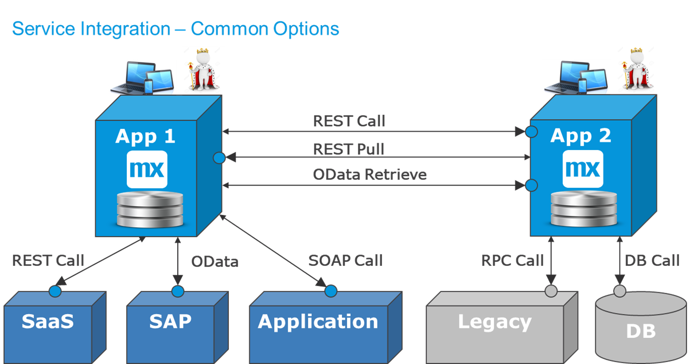
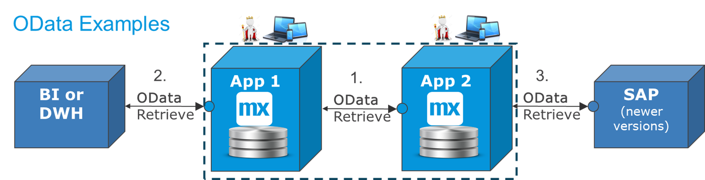

## 1 Introduction

Service integration means using a synchronous request–reply interaction. The system or person that initiates the call can take a relevant action depending on what the reply contains. If there is an error or a timeout, it can be handled directly in the context of where the call was initiated from.

There are these types of service integration, all of which are described in detail in the sections below:

* [REST call](#rest-call) – This type is used for calling most modern APIs and SaaS systems, initiating a function, finding information, or sending a business event. This is also used to transfer data to another app or system when data needs to be validated by a destination app (for example, when a user fills in an order in a portal, and the ordering app needs to accept it for it to be valid).
* [REST pull](#pull-transfer) – This is the most common way to keep data in sync between two Mendix apps, or to retrieve the next business event in an automated chain.
* [OData retrieve](#odata-retrieve) – This type is becoming popular for reading data in other apps and systems. OData creates a data contract directly from the data model that allows another app to use that data as remote objects. OData is also used to retrieve information from modern versions of SAP.
* [SOAP call](#soap-int) – This is used in many applications that are 10–20 years old and on many ESBs. It is similar to REST, but it uses XML instead of JSON as the messaging format. It is more formal and the messages are a bit larger, which makes it unsuitable for mobile and UX integration. 
* [RPC integration](#adapters) – A remote procedure call (RPC) can have many formats (for example, text messages on TCP/IP sockets). When something is identified with "RPC," that generally means it is older than the SOAP format, often from the 1990s. Such a system is often a legacy, and a custom module or adapter should be created to make the connection easily reusable.
* [Database integration](#db-int) – This means you connect directly to a database, using direct SQL on base tables or database views. Or, you can call a stored database procedure, which is virtually a remote procedure call directly on a database.
* [Queue integration](#queue-int) – Calls to put messages on queues and get them from the queues are also synchronous. However, the queues are generally used in asynchronous scenarios and for event streams, as further described in [Event-Based Integration](event-integration).

Service integration is the most commonly used integration paradigm, and it should be considered the default method. What you need to decide is how far the synchronous part of the integration needs to go. You can decide this via these two questions:

1. Does the synchronous part of the integration end when the call is processed in the destination? That means you have a confirmation of delivery or an error message, but also an operational dependency on the destination app being available.
2. Does the synchronous part of the integration end on a queue or message broker? In that case, any end-to-end confirmation of delivery is in a separate service (for details, see [Event-Based Integration](event-integration)).	

The sections below focus on the simpler case, in which there is an end-to-end synchronous call and no integration layer in between.
	
## 2 Types of Service Integration

### 2.1 REST Call to Other Systems {#rest-call}

Most common off-the-shelf systems or SaaS systems provide API services to initiate a function, get data, and update data. REST is the most commonly used format today, while SOAP was the most common ten years ago. The API services validate the input fields, and do something before returning an answer or acknowledgement.

Pushing data to another system is useful when there is validation in the destination app that should be presented back to the source app and the end-user directly. It allows errors to be corrected immediately or any other action to be taken, as determined by the end-user. 

In a typical scenario, the end-user fills in an order or form in one app, and the resulting information is processed in another app, as visualized in this diagram:

The first app does the technical validation at the field-level. Only the destination app can do the final functional validation. If something does not work, the end-user can change the data and retry, try again later, or abandon the activity entirely. The end-user is an active part of the service integration across the two apps.

#### 2.1.1 When the Destination App Is Down

The issue with synchronous end-to-end calls is that they create an operational dependency. The systems are tightly coupled, because the second app has to be up and running for the service to work. To handle this, there are the following options:

* The business function in the source app that needs the service is disabled when the destination app is down
* The source system stores the input and tells the end-user to retry later
* The source system stores the input and retries automatically later, informing the end-user of the results separately

There is a tradeoff between receiving direct feedback (which is good) and one or both of the following points:

* How easy it is to make sure the second app is up and running
* How acceptable it is to retry later

#### 2.1.2 Retries & Selective Validation

This diagram shows the three integrations that can be involved in pushing events or data:

These steps are illustrated in the diagram:

1. The main service call pushes events directly from the process that changes the data in the destination, directly providing full validation. 
2. To manage automatic retries, it is possible to use the Mendix [Process Queue](https://appstore.home.mendix.com/link/app/393/) module, where events are stored if the destination app is down. A separate process retries the messages to the destination until it is delivered. If there are validation errors in this case, the end-user is informed separately.
3. If the processing in the destination app is complex and takes time, and we want the end user to be able to continue his work, it is possible to use the [Process Queue](https://appstore.home.mendix.com/link/app/393/) module in the destination. The service that receives the call does selected validations, then it stores the message on a queue before acknowledging the reception of data.

### 2.2 REST Pull to Transfer Data {#pull-transfer}

To avoid retries, Mendix apps often use a REST pull between themselves to replicate data or transfer business events. This is the easiest option when replicating data from points A to B. The system that needs the data (the destination app) is in charge of triggering the interface. If it is up and running, it can also poll for changes or business events. If the source is down, we know that no changes happen and no business events are created.

This means that we get rid of an operational dependency. The two apps do not need to be up and running at the same time. When the destination app comes up after downtime, it quickly recovers the missing data before it starts operating.

This diagram functionally illustrates this situation:

The user interaction is separated from the integration, meaning it is "functionally asynchonous." The end-user finishes their work, which creates an event or a change in the source app. The destination app uses a synchronous REST pull to retrieve the changed data or business event. The two apps are operationally decoupled: the first app can operate without the second app being up and running, and vice versa. 

For this to work, there needs to be something in the source app that tags which data needs to be picked up. This diagram shows three common options:

* **Option 1** – Use the last updated time stamp of the record to retrieve `all changes since <last time stamp>`. This is quite robust, but for high volumes, there are some edge cases where this can miss an update.
* **Option 2** – Use a flag on the base table that indicates the record changed, which is reset when the change is picked up. For more than one subscriber, there will be more than one flag (for details, see [Workflow Integration with Data Transfer Example](workflow-int-data-transfer)). This is the recommended option for most situations
* **Option 3** – Use the Mendix [Process Queue](https://appstore.home.mendix.com/link/app/393/) module. In this case, the source app will already map the data into a REST JSON message that is ready to be picked up from the outbound queue. 

**Option 1** and **Option 2** mean that the service that gets the data or event works on the base tables in the domain model. In turn, this means that if the same data is changed four times while the destination app is down, it will only lead to one update when polling starts again.

For **Option 3**, every transaction is registered as a business event that is placed on the internal queue. This means that four changes will lead to four events, providing the entire change history. 

Functional requirements will decide which mechanism is preferred. Often **Option 2** is used to keep data synchronized, while **Option 3** is used for business events and transactions.

{}
"Functionally asynchronous" means the process that results in a business event does not complete the integration end-to-end. Instead, it may create a REST message and put it on an internal queue for delivery by a separate process.
{}

### 2.3 OData Retrieve {#odata-retrieve}

For several reasons, Mendix does not allow other systems to access internal database tables directly (for more information, see  [Introduction to Integration](integration-intro) and the [External Integration Is by Contract](mendix-integration#external-contract) section of *Mendix & Integration*).

As an alternative to this and to REST services, Mendix enables OData contracts to be used. OData does not use a microflow to retrieve data, as is the case for REST calls. Instead, the OData contract automatically creates REST endpoints from the data-base tables with very little effort by the developer. 

OData is a relatively new protocol that requires both sides of the integration to be OData-enabled. It is now mainly used for the following reasons:

* For BI solutions to access specific data in Mendix apps, which are more real-time than data-warehose solutions
* For Mendix apps to access data in newer versions of SAP (for details, see the [SAP OData Connector](/partners/sap/sap-odata-connector))
* For Mendix apps to use data from each other's data models directly, which is especially interesting within clusters of microservices that work together as a system

In future releases, Mendix will make OData contracts easier to use while making some data replication unnecessary (at least within microservices systems). A Mendix app will then be able to provide OData objects and REST services to the rest of the Mendix apps in the same organization via a platform-provided service catalog. This will improve the access and control of service integration in general.

Using OData to retrieve data means a tighter integration than most REST services, since it links database table formats to the integration and it can be sensitive to changes. As long as it is managed well, OData provides a great way to work more closely between apps (for example, when the data model is already stable, or when two apps are maintained by the same DevOps team, there is no issue).

### 2.4 SOAP Integration {#soap-int}

SOAP integration uses XML messages and a SOAP header that includes the endpoint in a WSDL file. For large solutions, the integration points can be figured out early, WSDLs created, and after that point, the teams can work and test relatively independently. Using XML allows for XSLT mappings, and a filled-in message can be compared with an XSD to do relatively detailed validation before sending messages, which can be good for asynchronous flows.

SOAP was most popular between the years 2000–2010, and there are still an enormous amount of SOAP services available in most organizations. When mobile internet became more important, the SOAP format was found to be quite heavy, and since then, REST services are more frequently used for almost all new synchronous services. 

Mendix connects easily with SOAP services, but it is rare that new SOAP services are created in Mendix apps these days. Instead, the REST functionality has been expanded to allow for REST publish and REST consume via Swagger files, which makes REST services even easier to use.

### 2.5 RPC Integration & Adapters {#adapters}

Many old legacy systems have a very specific format of communication. This could be to and from mainframes or another other old technology. It is possible to build services to these old formats, but a more technical developer and the Mendix SDK are often required. 

It is not a good idea to repeatedly build this technical integration. There are two options to avoid building this over and over again:

* Create a [Mendix App Store](https://appstore.home.mendix.com/index3.html) module that works as an adapter and can be used in several apps with little effort; this will allow for easy access to existing RPCs
* Create an integration app or adapter that makes data and services from the legacy system available in an easy-to-use format for other apps (for example, using OData or REST services)
	* This could bundle 3 TCP/IP calls into one operation and provide it via a REST services
   	* This could import files with data or get data in real-time to store locally; in turn, this could provide faster services for other apps and more uptime for real-time requests, or it could extract a certain part of the data to store in a format that is suitable for a specific purpose

This diagram shows how an integration app enables easy interaction with a legacy system:

In this example, most of the interaction is for the retrieval of data. To make that fast and easy, the integration app imports the relevant data via a file and stores it in a format that is ideal for retrieval (for example, by using materialized views). This data from the legacy system is easily available via OData. To update the legacy system, the interaction needs to be synchronous. A REST service is created that translates the call to three RPC calls, updating the legacy system and informing the user of success or failure.

When using Mendix for integration apps, it is easy to create an admin UI when that is neede. This makes it more flexible and adaptable than what most integration layers provide. In effect, with this pattern, one can create a distributed ESB (for details, see [Integration Layers](integration-layers)).

### 2.6 Database Integration {#db-int}

Mendix can integrate directly with external databases using database calls (usually via JDBC calls).

However, there are only two cases when this is recommended:

* When there is a legacy system or database that cannot be changed anymore, and the only way to access the data is via direct database interaction. This could be part of a migration scenario, or it could be maintained for some time. If the source system really does not change anymore, the risk is small that something will break in the connection.
* When there is a desire to maintain a very large data history in connection with a system of Mendix apps. The data may be stored for compliancy reasons, and very rarely accessed from the operational apps. Since this is "within" the same system, Mendix then interacts diretly with an external database.

The diagram below illustrates these cases:

* Retrieving data from a legacy database, preferrably using a database view
* Updating data in a legacy database, preferably by calling a stored procedure
* Reading and writing via SQL calls to a history database as part of a microservices system

A good architectural guideline is to avoid the tight coupling of data models of different systems. Each data model should be adapted to what that app is focusing on doing. This allows apps to develop their data models and functionality without impacting other apps and systems. 

If you have to go directly on a database, it is wise to use database views and stored procedures as a "padding" between the underlaying data model and the service interaction. You should never do JDBC through firewalls. If the legacy database is on premises and database calls are the only option, then either deploy the Mendix app on premises as well, or create a Mendix "adapter app" on premises and have the main apps use the data on the cloud.

### 2.7 Queue Integration {#queue-int}

Using queues, a message broker, or Kafka typically means that the end-to-end integration is asynchronous. However, each leg in the end-to-end integration is always a synchronous call to either put an event or get an event:

* Pushing an event to a queue returns an acknowledgement or reception from the queue manager
* Pulling an event from the queue returns data, after which the message is "committed" or "consumed"; the queue manager deletes consumed messages after a configurable amount of time

Queue integration is described more in detail in [Event-Based Integration](event-integration).

## 3 Recommendations

### 3.1 Where to Use Synchronous Integration

Synchronous calls can be used for almost anything. They are easy to design, build, deploy, and operate. These are the most typical synchronous service scenarios:

* Data retrieval with REST, OData, SOAP, RPC, or direct SQL
* Initiation of a function in another system, usually using REST, SOAP, or RPC
* Transferring business events by either pushing or pulling with REST
* Keeping data up to date when one app has a copy of some data, using REST pull
* Committing data changes to another SaaS systems or apps where validation is part of the integration
* Legacy integration with older RPC protocols on mid-range systems or with mainframe transactions
* Business-to-business protocols, such as EDI, SWIFT, or EDIFACT, often via an API gateway (for details, see [Integration Layers](integration-layers))
* Process orchestration where you need to know that the target received and processed the message (for details, see [Process Integration](process-integration))
* CI/CD integration, test automation, and some health checks for monitoring (for details, see [Ops & CI/CD Integration](ops-cicd-integration))

### 3.2 Where to Use Asynchronous Integration

For synchronous integration to work, it is necessary that the other system is directly reachable through the network. 

For IoT, user metrics, logging scenarios, and stock-ticker updates, the commmunication is truly one-directional, and synchronous calls have little benefit. The messages will be accepted as they are in the destination.

If the network is unreliable, geographical distances are large, or volumes are extremely high, synchronous calls are difficult to accomplish, and there may be reasons to implement other mechanisms. Integration will often become more functionally complex in these cases, because to fully guarantee delivery end to end, you should implement two interfaces: one to send the event, and one going back acknowledging the reception. For details, see [Event-Based Integration](event-integration).

If a synchronous end-to-end call is impractical, it can be replaced by two asynchronous separate services. For example, ordering is one service, status is another service, and a queue somewhere is required to store messages on the way. Most of the time it is possible to use a Mendix internal queue, which means there are fewer moving parts and fewer places where things can fail. The other option is to use an external queue-manager integration layer (for details, see [Integration Layers](integration-layers)).

For scenarios where there are many-to-one or many-to-many situations, there is no reason to be synchronous between distributed components. In fact, it would be very hard to use synchronous communication there. In these scenarios, Mendix recommends using Kafka, a message broker, or file interaction. For more information, see [Event-Based Integration](event-integration).

For periodic interactions that handle large datasets (for example, in reporting, billing, and invoicing), there is no reason to be working in real-time. Furthermore, processing will be slower and take more CPU power if transactions are processed one by one via services. For details on such cases, see [Batch Integration](batch-integration).

### 3.3 Copying Data or Getting It in Real-Time

If data generated by one app is needed in another app, there are two main options:

* Store a copy of the data in the other app
* Retrieve the data on demand whenever it is needed

In the future, the Mendix Platform will make remote objects available using OData to seamlessly get data from another app in real-time. This will be great for apps that work tightly together in a microservices system.

But in general, with microservices architecture, it is more common to copy required data over in the background to make apps as operationally independent as possible. This is at least true if the app that needs the data uses it frequently and combines it with other local data to display in a grid.

After the data is copied over, it needs to be kept up to date. At that point, the option is for the source to push data or the destination to poll for changes.

### 3.4 Pushing or Pulling to Keep Data Up to Date

Building up a local copy of data can be done either by having the destination app pull changes or having the source app push data when it changes. This table compares both options:

| Push | Pull |
| --- | --- |
| Orders can be sent immediately on change | The support app asks for new orders periodically, so the order information may be slightly outdated (eventual consistency) |
| Commonly transferred per individual object | Commonly transferred in batches (all objects that changed since the last pull) |
| The owner app must know the apps to push to; each app that needs the data must register itself | The owner app does not need to know which apps are using its data |
| The owner app must retry pushes on failure | The client app can retry or re-pull data orders when necessary |
| Recovering from errors in the data transfer is difficult to do in the owner app | Recovery of errors is easy: have the client app re-pull the data |

To create autonomous microservices and apps, pull-based synchronization between Mendix apps is most common. However, when updating SaaS solutions, you almost always have to adapt to their published API, in which case push-based updates are more common.

## 4 Summary

Synchronous calls are used everywhere and in amost all integration situations.

* If it is synchronous end-to-end, there is an operational dependency, but that means the result of the operation can be provided back instantly
* If there is a layer in-between where messages are persisted before delivery, it is functionally asynchronous (for more information, see [Event-Based Integration](event-integration) and [Integration Layers](integration-layers))

In order of relevance and priority for synchronous end-to-end interactions, Mendix prefers the protocols in this order:

1. REST
2. OData
3. SOAP
4. RPC
5. Database calls

The Mendix Platform has very rich integration functionality. Several organizations use Mendix to build integration apps and adapters to various systems or shared data apps that provide combined datasets.

The diagram shows the following main functional cases:

* Pulling for new data or events to process from the source app
* Initiating a function remotely and often receiving results back
* Pushing data forward to an app that validates and returns results

The rounded shapes in the diagram represent a process or microflow within an app.
