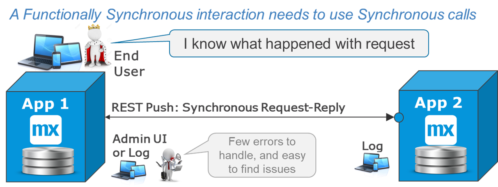
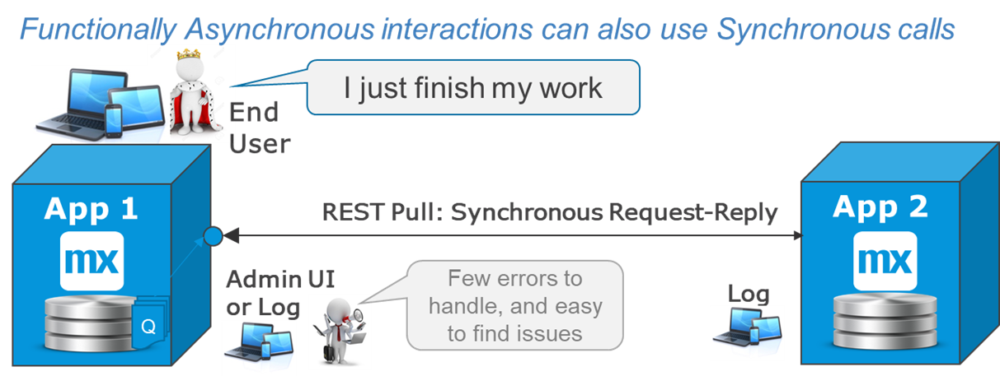
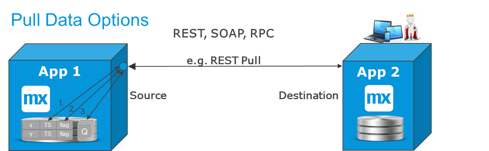
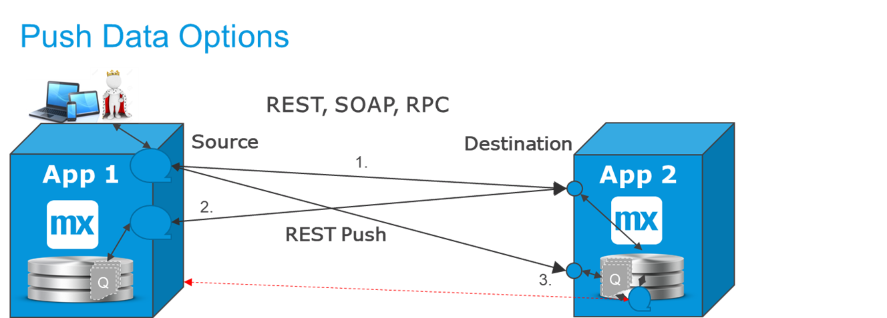

## 1 Introduction

Service integration means using synchronous request-reply as the integration paradigm. This is most commonly done via REST and OData, and sometimes via SOAP. In addition, older versions of RPC calls, SQL database interactions, and many mainframe transactions are  synchronous. It is easy to understand synchronous request-reply interfaces, as the initiating process gets feedback instantly. This makes error handling easier, because the same system that initiates the call also gets information about the result and can take a relevant action.

Service integration should be considered the default method for integration. Only when there are strong reasons to avoid synchronous request-reply should other options be considered. 

In a typical scenario, an app end-user is filling in an order or a form, and they need to be informed of mistakes in their entries or that the product they requested is out of stock, for example (as visualized in the diagram below). The systems are tightly coupled, because the second app has to be up and running for this to work. However, the end-user is able to decide how they want to proceed when there is an error or a time-out. The end-user is in this case fully part of this interaction.

In another typical scenario, the user interaction is separated from the integration, meaning it is "functionally asynchonous." However, a technically synchronous integration mechanism is still preferred for retrieving the event, using a REST `pull` request from the second app to get the next business event(s) (as visualized in the diagram below). This means that the two apps are decoupled from each other. The first app can operate without the second app being up and running, and vice versa. The first app needs to implement something that acts as a queue (for more information, see the [REST Pull Request-Reply to Transfer Data](#pull-transfer) section below).

{}
"Functionally asynchronous" means the process that results in a business event does not complete the integration end-to-end. Instead, it may already create a REST message and put it on an internal queue for later delivery.
{}

## 2 What Is Service Integration?

Service-based integration is request-reply and almost always synchronous. It follows this flow:

1. One system initiates the call and waits for an answer. 
	* There should be a time-out configured, after which the integration is abandoned
	* In some cases it is desirable to re-try, but if this can be avoided, the solution becomes simpler and more robust
2. The originating system will know the result of the call immediately:
	* A success status if the operation succeeded
	* A time-out if the destination system was unavailable
	* A set of data that was requested in the call
	* An error with information about why the call did not work

The diagram below presents the following main functional cases, where the rounded shape represents a process or microflow within an app:

* Pulling for new data or events to process from the source app
* Initiating a function remotely and often receiving results back
* Pushing data forward to an app that validates and returns results

### 2.1 Where to Use Synchronous Integration?

Synchronous calls can be used for almost anything where you want to assure that messages arrive safely. They are easy to design, build, deploy, and operate, and they have the easiest error handling. This means they should be the default method for most integration.

These are some typical synchronous service scenarios:

* Request-reply interfaces with REST and SOAP (for more information, see the [Request-Reply to Transfer Data](#transfer) section below)
* Transferring business events when using internal queues (for details, see the [REST Pull Request-Reply to Transfer Data](#pull-transfer) and [REST Push Request-Reply When Validation Is Needed](#push-transfer) sections below)
* Data retrieval with OData, REST, SOAP, or direct SQL (for more information, see [Database Integration & OData](#db-odata))
* Legacy integration with older RPC protocols on mid-range systems or with mainframe transactions (for more information, see [Integration Apps & Adapters](#adapters))
* API management and other external gateways to, for example, EDI, SWIFT, or EDIFACT protocols for busines-to-business transactions (for details, see [Integration Layers](integration-layers))
* Process orchestration where you need to know that the target received and processed the message (for details, see [Process Integration](process-integration))
* CI/CD integration, test automation, and some health-checks for monitoring (for details, see [Ops & CI/CD Integration](

Synchronous integration styles are easy to manage, because there are no moving parts between the two systems. It is possible to estimate that more than 50% of all integration is synchronous request-reply in the current landcape.

### 2.2 Where Not to Use Synchronous Integration?

For synchronous integration to work, it is necessary that the other system is directly reachable through the network. If the network is unreliable, geographical distances are large, or volumes are extremely high, the synchronous calls can be more difficult to accomplish. In that case, there may be reasons to implement other mechanisms. Integration will often become more functionally complex in these cases, because to fully guarantee delivery end to end, you should implement two interfaces: one to send the event, and one going back acknowledging the reception. For details, see [Event-Based Integration](event-integration).

For IoT and logging scenarios where there are many-to-one or many-to-many situations, which are often distributed and where commmunication is truly one-directional, there is no reason to be synchronous. In fact, it would be very hard to realize such situations as synchronous communication. In these cases, Mendix recommends using Kafka, a message broker, or file interaction. For more information, see [Event-Based Integration](event-integration).

For periodic interactions that handle large datasets (for example, in reporting, billing, and invoicing), there is no reason to be working in real-time. Furthermore, processing will be slower and take more CPU power if transactions are processed one by one via services. For details on such cases, see [Export, Import & Batch Processing](export-import-batch).

## 3 Request-Reply to Transfer Data {#transfer}

The diagram below shows the most typical methods for transferring data in real-time:

* Pulling data/business event from the destination – this is the most common method and the easiest to operate
* Pushing data/business event to the destination – this is a good method for validating data in the destination before it can be stored ther
* Using a service layer in between, such as API management or a message broker – using a service layer (with queues or with transformation) can further decouple the apps, and this is recommended if there is a large organizational or geographical distance between the apps
* Using OData to retrieve "remote objects" – this is a tighter integration that is more closely linked to the data model; this method will be strengthened in a future version of Mendix, and it should be very useful when apps are close (meaning, within microservices systems)

### 3.1 REST Pull Request-Reply to Transfer Data {#pull-transfer}

The REST `pull` request-reply is the default option when replicating data from point A to point B. The system that needs the data is in charge of triggering the interface, and the apps do not need to be up and running at the same time for this to work. To see what has changed, there are at least three options:

1. Use the last updated time stamp of the record to retrieve `all changes since <last time stamp>`. This is quite robust, but for high volumes, there are some edge cases where this can miss an update.
2. Use a flag on the base table that indicates the record changed, which is reset when the change is picked up. For more than one subscriber, there will be more than one flag (for details, see [Workflow Integration with Data Transfer Example](data-transfer)).
3. Use the Mendix [Process Queue](https://appstore.home.mendix.com/link/app/393/) App Store module. In this case, the source app will already map the data into a REST JSON message that is ready to be picked up from the outbound queue.

Options 2 and 3 are the most recommended. 

Option 3 has an additional advantage in that the transformation to a business event or transaction takes place directly. Because you will have already created a REST message, you will know that it reflects the exact situation when the change happened. The service call will also be slighly faster, because this work is already done.

However, if the subscribing app is only interested in the latest stage, there is no need to receive "every save" in the source system. In that case, using option 2 with a flag is the easiest and most efficient method (for more information, see [Workflow Integration with Data Transfer Example](data-transfer)).

### 3.2 REST Push Request-Reply When Validation Is Needed {#push-transfer}

Pushing data to another system is useful when there is validation in the destination (for example, to change the master data). If there is a validation error, the user should see it directly while in the process of changing the data so that they can correct it immediately. You should at least consider an error workflow.

There are technically two options for doing  this:

1. Push directly from the process that changes the data. This is typical for when an end-user is interacting with the system, so they will receive errors directly from the source service. The error messages can potentially be shown to the end-user so they can correct the data or take another action.
2. Use the Mendix [Process Queue](https://appstore.home.mendix.com/link/app/393/) App Store module, and then have a separate process that tries (and retries) to push these messages to the destination. Validation messages will still be received, but in this case, the end-user is not directly informed, instead receiving a task later to correct something.
3. Use the [Process Queue](https://appstore.home.mendix.com/link/app/393/) module on the destination side, which means that the message will arrive on the destination app but without the full validation there. I.e. the destination side has a separate process that gets them from the queue and updates the domain model.

The choice for pushing data is usually validation-related. However, it could also be that the destination system is unable to poll for new data, as is often the case for SaaS solutions (for example, creating an order in SAP or Siebel will be a push request).

The choice between options 1 and 2 will depend on if you want the end-user to fix things directly (via option 1) or finish their work and then handle the errors (via option 2).

Option 3 is often preferred as an alternative to option 1, when less validation errors are expected or when the validation would take too long for an end-user to be waiting. With option 3, the end-user is assured that the business event has arrived in the destination, and they can continue working on something else. Any exceptions later will have to be transferred separately back to the source, if required. Compare this with submitting an order online and getting an email confirmation or error message later.

### 3.3 Using a Message Broker or Other Integration Layer

Using an integration layer will provide a level of decoupling. However, it is important to note that this will be another dependency, another place to maintain the integration functionality, and another place where things can go wrong.

Integration layers are used in many instances for a variaty of reasons:

* There is a desire for functional decoupling (for example, to allow an ESB to tranform the messages on the way)
* There is a large distance in the network or geography, and the integration layer can handle these distances
* Because integration layers are almost always up and running while destination systems may not be, the integration layer can queue up messages (for more information, see [Event-Based Integration](event-integration)
* There is a standard at an organization to use a specific integration layer between departments, for example, which provides a standard gateway for integration

When using an integration layer for transfering or replicating data, you would expect the source system to push a message to the integration layer and then just receive an acknowledgement of reception. This could be a REST `push` or any other format, but the call will always be synchronous. Even Kafka and queue managers have their own APIs, and there are modules in the Mendix App store to make these calls easy.

For more details, refer to [Integration Layers](integration-layers).

### 3.4 Using OData Retrieve {#odata-retrieve}

For some data transfer use cases (especially for BI and within microservice clusters), it makes sense to use OData. In such cases, data is retrieved from another app's data tables more or less automatically and is then used in the widgets of the other app, with the caveat that domain models can become more tightly linked. Because of this, OData should be used in "organizationally-close situations" where teams are aware of developments, or in BI situations where the business risk to changes is smaller.

In a future version of Mendix, OData contracts will be easier to use and will make some data replication unnecessary (at least within microservices clusters). An app will then be able to "provide" OData objects and REST services to the rest of the Mendix apps in the same organization that can "consume" these. This will simplify the use of both REST and OData while increasing control over integration.

## 4 Database Integration & OData {#db-odata}

Mendix can integrate directly with external databases using OSQL, OData, or SQL. But Mendix does not allow integration directly into its own database. This is to avoid risks and to use clear contracts in the communication. OData then provides a solution for easily accessing data tables in Mendix from an OData-enabled system. Writing with OData to a Mendix app will not be allowed in the first releases, so for pushing a change, a REST service is required.

OData provides a clear contract and is directly supported from the Mendix Platform. Both sides of the integration are required to support the OData. For example, the integration from Mendix to [SAP](/refguide/sap/sap-odata-connector) is well supported via OData contracts in all recent versions of SAP.

These are the typical data use cases:

* USe OData between Mendix apps for reading out data directly from widgets in the UI; at any point in this interaction, some data can be saved locally, in effect creating a data transfer (for details, see the [Using OData Retrieve](#odata-retrieve) section below)
* Use OData from BI solutions to retrieve data from a Mendix app close to real-time
* Use OData for integrating with SAP solutions (or any other external system that supports OData)

Sometimes within a microservice cluster where Mendix plays a role, there is a need for a very large history database. For BI reasons, this can be an external database. Since this is "within" the same system, Mendix then interacts diretly with an external database.

Other common reasons to use direct SQL is for older systems or databases. There may be no OData, REST, or SOAP options. There could be an RPC, and using that by building a small "adapter" using Java actions is recommended if it has the required functions. But if the RPC is inadequate, the last resort option is connecting directly to an external database.

These are further use cases:

* Retrieve data from a legacy system or other database, using SQL, preferrably on a database view
* Update data in a legacy system or database, preferably via calling a stored procedure

A good architectural guideline is to avoid tightly coupling the data models of different systems. Each data model is adapted to what that app is focusing on doing, and it is good to allow for the freedom of developing a data model without impacting other apps and systems. That is why OData is better than direct database interactions. If you have to go directly on a database, it is wise to use database views and stored procedures as a "padding" between the underlaying data model and the service interaction.

{}
Never do SQL across firewalls, because that would open a hole where an external party could do anything to the database.
{}

## 5 Integration Apps & Adapters {#adapters}

Many old legacy systems have a very specific format of communication, which could be from mainframes or any other old technology. A technical developer is needed for creating good integration with these systems.

To build this technical integration repeatedly is not a good idea. There is the option to create one single adapter or integration app that specializes in the intricacies of that legacy system. Other apps can then integrate with the adapter in a simple format using, for example, REST or files and pre-configured functionality. As an example scenario, it could take 3 TCP/IP RPC calls to do an operation, which the integration app encapsulates into one single easy-to-use REST service.

Depending on the case, the integration app may only forward real-time requests to the back-end system, cache some requests, or even store entire datasets and provide them via services or files. This really depends on how you answer the following questions:

* What is the legacy system capable of?
* What is the requirement for using data from other systems?

In the diagram below, both file and RPC integration is shown to the legacy system. Depending on the situation, you can use one method or both.

For example, imagine that most of the interaction is the retrieval of data. To make that fast and easy, the integration app imports the relevant data via a file and stores it in a format that is ideal for retrieval with a materialized view that makes parts of the legacy system data easily available via OData. For the updates, it is preferred that they are synchronous all the way, so you use REST into the integration app. That will translate to TCP/IP and update the legacy system as a request-reply interface, informing the user of success or failure

The benefit of using Mendix in this type of scenario is that if there is an admin UI needed, that is easy to build. In effect, with this pattern, you can create a distributed ESB.

## 6 Summary

Request-reply integration is an easy way to integrate systems, and it should be considered the default integration option. The most important thing to consider is that the other system needs to be up and running for the integration to work. Using `pull` requests solves this for most cases, and means that work can continue in the first app while later other work continues in the other systems. 

If queue functionality is required, using Mendix internal queues is recommended, because there are fewer moving parts and fewer places where things can fail. However, there are exceptions for when an integration layer is preferred (for details, see [Integration Layers](integration-layers)).

In some cases, you want the business interaction to be direct across the two apps (for example, to get validations and confirmations directly back to the end-user). This is the way most SaaS solutions work. When you need to update them from another app, you call a service and get the results back. The business function then requires both apps to be up and running. 

For BI and microservice systems as well as for retrieving data from SAP, OData provides a new paradigm that is easy to build and control. OData usage will be significantly strengthened in a future Mendix release.

For legacy databases and history databases, there may be a reason to use direct SQL. In that case, database views annd stored procedures are preferred to using direct SQL statements.

In order of relevance and priority for synchronous interactions, Mendix prefers the protocols in this order :

1. REST
2. OData
3. SOAP
4. Other RPC
5. SQL to database view or stored procedure
6. Direct SQL

The Mendix Platform has very rich integration functionality. Several organizations use Mendix to build integration apps and adapters to various systems or shared data apps that provide combined datasets.
