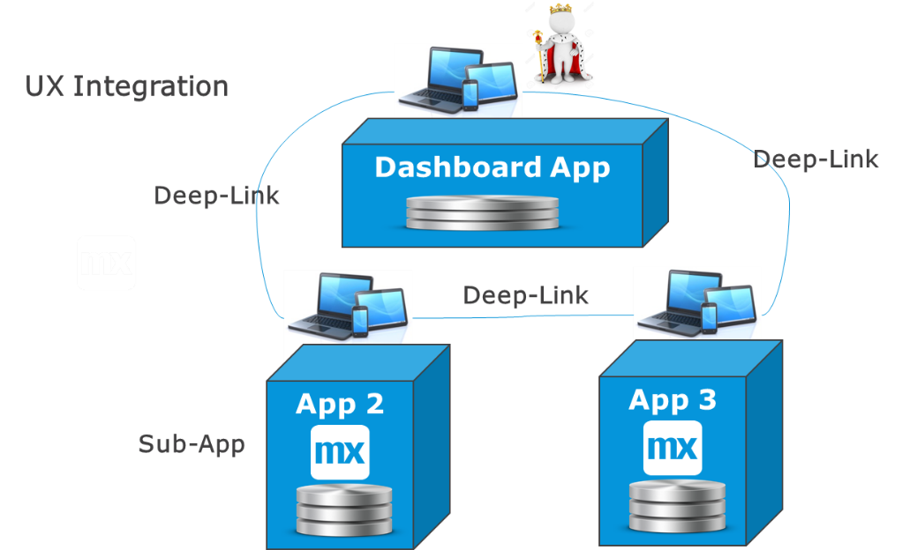
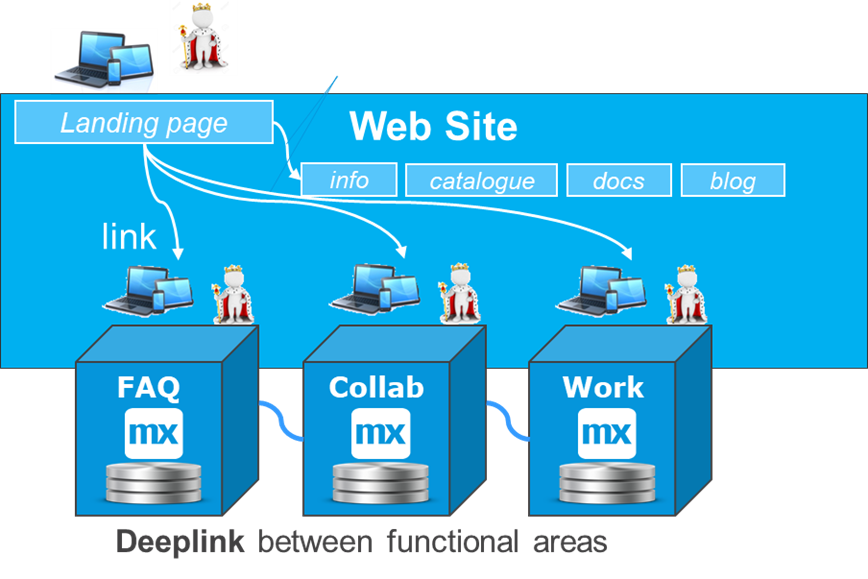
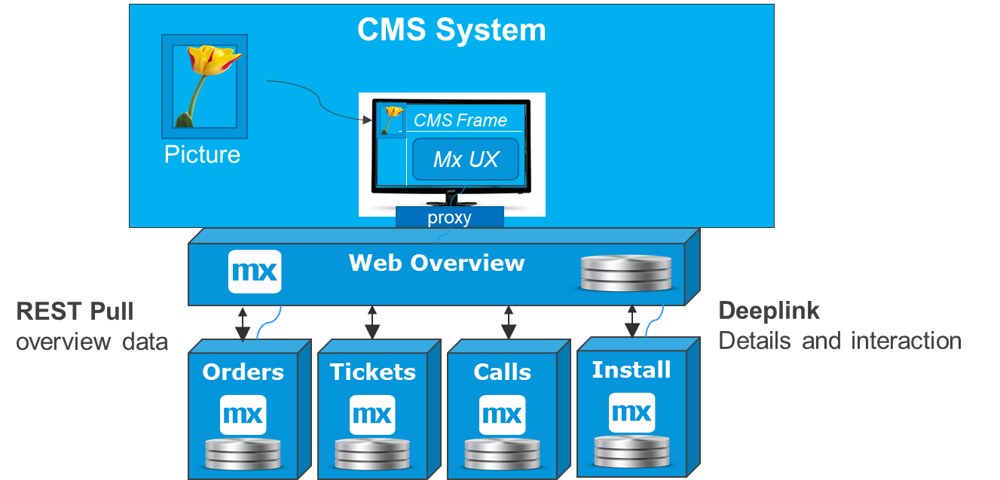
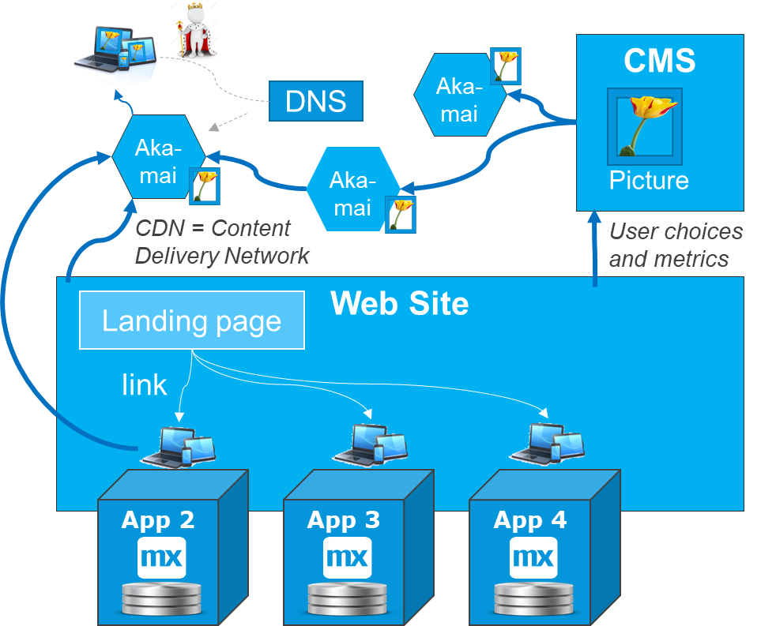

## 1 Introduction

There are various types of UI integration. This best practices document will describe the types below.

* **Deep-links** – This is the most typical way to integrate from the UI of one Mendix app to another Mendix app. This includes authentication and business context so that a specific page in a specific context can be opened in the second app. One important consideration is whether to open the second app in the same brower tab, which will be a seamless experience for the user, or to open it in a separate tab to enable working in parallel in both apps. For more details, see [Deep Linking from App to App](#deep) below.
* **Web-links or URLs** – This type of integration goes from, for example, a website to a Mendix app that fulfils a functional part of a portal. For more details, see [Website Integration](#web) below.
* **Content management system (CMS)**  – This type of integration enables running a Mendix app in part of the UI of a marketing-oriented portal. The CMS will render the frame with the company header, while the Mendix app renders a pane in the portal via a reverse proxy for functional interaction. For more details, see [CMS UI Integration](#cms) below.
* **Content delivery network (CDN)** – This type of integration means that in front of your website, CMS, and/or Mendix app, there is a geographically distributed network of content delivery nodes that focus on caching as much content as possible. This allows for shorter distance from the browser to images and other content. For more details, see [CDN UI Integration](#cdn) below.

## 2 Deep Linking from App to App {#deep}

In microservice systems, there is often a dashboard app, portal, or landing page where end-users log in (for example, via SSO). This often contains workflows, overviews, and statuses. When the end-user wants to perform real work in an area, they are deep-linked into another app and work there.

Depending on the business requirements, these are the main variations of deep linking:

* The second app is opened in the same browser tab and the user is unaware of working in several apps
	* This is great for building microservice clusters that act together as one single system while still providing all the advantages of [microservices](../microservices/microservices-overview)
* If parallel work in two areas is preferred, another browser tab is opened, and the user can work in both apps simultaneously.

This diagram presents the most typical deep-linking option in a simple form:

Integration via a UI link is becoming more and more common. This enables developing a UI only once in the app where it belongs, and then linking other end-users there when they need to perform a workflow there. This is mostly accomplished via the [Deep link module](https://appstore.home.mendix.com/link/app/43/) available from the Mendix App Store.

Sometimes when using deep links, it is necessary to send data over to the second app or back to the first app. This is done using [service integration](service-integration). As an example scenario, you need to open a UI for creating a customer in the customer master app, while right after creation, the customer is already available in the first app.

UI integration can also have an advantage for mastering data, since the process for UI validations of information is always done in the same way. Accordingly, when the work is done in one app, a relevant part of the new data can be copied back to the other app.

## 3 Web Link Integration for Websites {#web}

Websites are different from web apps in that they are mostly passive. This means that a website end-user is mostly browsing information, rather than interacting with the site in more complex ways (for example, by entering orders). There are several solutions for providing nice-looking read-only web pages to deliver content and marketing in ways that are easy to optimize for Google searches. However, as soon as there is more logic or UX interaction involved, website solutions become inefficient for building functionality.

The diagram below shows a typical setup: a website has a landing page, information, product catalog, documentation, and blog posts in the website area, while Q/A, collaboration, and work-oriented parts are all built into Mendix applications. All the important information in the website can be search engine-optimized. Additionally, all the functional parts can be quickly created, modified, maintained, and secured where needed.

	
Many organizations combine a content-oriented website solution with Mendix apps that are rich in functionality. Some organizations build all of their logged-in portals and pages via the Mendix Platform, ensuring a good security system for access to restricted functions and business data. 

In that way, a full organization website consists of the following components:

* Marketing-oriented website software for the landing page and read-only pages
* One or several Mendix applications covering the functional parts of the website

The integration down from the website to the Mendix apps is done via normal web links and URLs. The integration between Mendix apps is done via deep links, as described above. In this context, the Mendix Platform saves you a lot of time in building interactive websites and customer portals.

## 4 CMS Integration for Customer Portals {#cms}

Many websites and portals use Mendix applications for the functional parts where user interaction is required. When aligning UI design themes, this works very well. However, large organizations often use a professional content management system (CMS) to generate the marketing-oriented portals. A CMS selects content depending on user behaviors and tracks the click and hovering statistics.

This diagram shows a CMS rendering Mendix UI in a part of the browser while the CMS can keep pushing marketing content into the other parts of the UI:

Developing pages in a CMS is still slow and costly, so several organizations use the Mendix Platform along with a CMS solution for the active parts of their customer portals. There are a few options for doing this, and often the Mendix UI will go through a proxy and render in the same web portal where the CMS system is running. You can contact the Mendix Architecture Guild via <DIS_Architecture_Guild@mendix.com> for more information. 

With such a solution, marketing teams can use the CMS and decisioning to show relevant marketing content to different business users without a new software release. At the same time, building and maintaining the functional and active parts of the customer portal can be easily done via the Mendix Platform.

Often, there is a specialized Mendix application built for the purpose of interacting with the CMS customer portal. This app imports the overview information (for example, the last ten tickets and orders) so that the end-user quickly gets an overview and can then follow deep links down to other apps and do specific work in different pages.

## 5 CDN Integration for Global Portals & Apps {#cdn}

As seen in the sections above, the Mendix Platform is a great option for building functional customer portals as well as collaborating with websites, a CMS, or a document management system. Some organizations have even used a pure Mendix solution to develop full customer portals with basic content-management and document-management capabilities included.

Global websites, customer portals, and applications have end-users located anywhere on the planet, so they need to avoid long rendering times. To cut the traveling distance for as much content and data as possible, content delivery nodes (CDN) solutions should be used. CDN solutions cache content in local nodes and render the entire page for the users. This enables providing quick response times across the globe, especially when large images and videos are used.

The diagram below shows a typical setup. All web pages are rendered close to the end-user browser location using a CDN solution, which provides a first secutity layer and caches all static or semi-static information, limiting the round-trips to the underlaying systems, which could be a website, a CMS system, and several Mendix apps: 

In this setup, a website runs the frame, and Mendix provides the active pages where the user collaborates with the organization. The CMS system no longer runs the frame, but it is providing the right content at the right time. 

For the static content, this setup provides a huge advantage in rendering time. For Mendix apps, this setup can save up to 50% of the content round-trips. CDN systems also have faster and better internet routing, which can provide a 50% improvement in Asia and South America, and around 10% within Europe. 

The advatages with CDN solutions are so siginficant that almost all global portals and applications use CDN solutions these days. This also works very well with Mendix. When customer portals and apps need to be globally deployed and accessible, Mendix usually combines a global deployment strategy with a CDN solution for redirection and additional proximity to cached static content. Such a strategy looks like this:

1. Deploy several instances globally in different availability zones. They may collaborate with each other if required.
2. Use a CDN solution to further increase the availability and speed of UX interactions.

For more details, see the [Geo-Scaling Architecture](../performance/plan-design-high-volume#geo-scaled) section of *Planning & Designing for High Volume*).

In a customer portal, most end-users work locally in their region, so they will mostly log into their closest instance. A CDN can re-direct them back there when they are travelling, or the required data can also be copied over to work locally when travelling.

When using CDN solutions, the external APIs are often also made available via the content nodes. This has the same proximity and caching advantages as for UX, while also providing some API management functions like protection against denial-of-service attacks, throttling, and bot management.
 
Akamai is the most established solution with 240,000 nodes in 240 countries, while AWS and Azure have good competing solutions available.

## 6 Summary

UI integration is becoming increasingly common, and it enables a microservices strategy for building and maintaining systems while providing a unified "one-system" experience to end-users. Mendix deep links provide a secure way to integrate UX components and transfer the context over to another app.

UI integration is also used for a variety of websites, customer portals, and global solutions:

* Websites use web links to Mendix apps for the functional part of the websites
* Marketing-oriented CMS-based customer portals render Mendix UI panes within CMS-based web-page frames
* Global apps and portals use CDN solutions to provide snappy UX experiences across the globe
