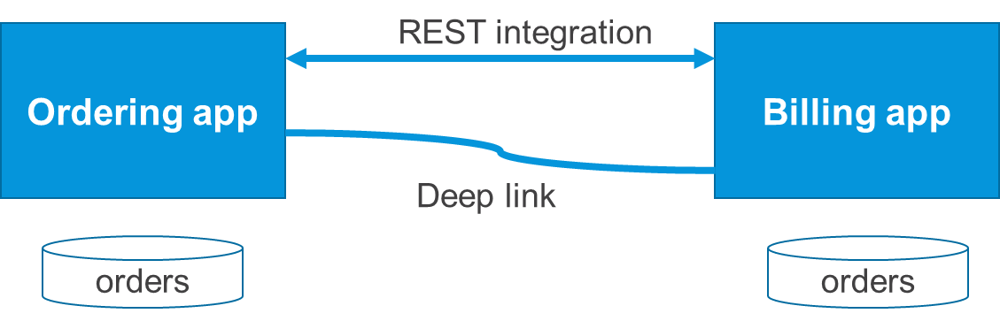
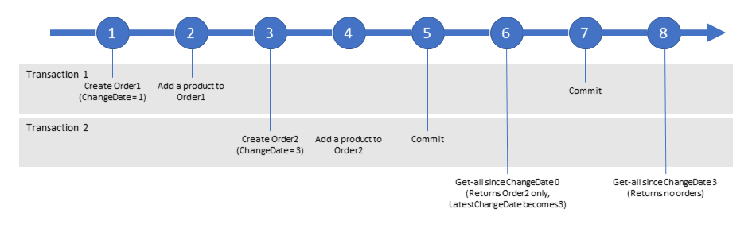

{}[**Needs thorough review**]{}

{}[**Structure is unclear for where this doc is located - what is exact relation to parent doc?**]{}

## 1 Introduction

{}[**NEEDS DIAGRAMS; ADD LINK WHEN AVAILABLE BELOW AND UPDATE TEXT AS NECESSARY**]{}

The integration pattern has been implemented in an App Store module that can be
downloaded from the **Best Practices** section as **Integration Pattern: Process
Integration**.

In this integration pattern example app, an example architecture is implemented that consists  of an ordering app and a billing app. The ordering app is responsible for managing customer orders, and the billing app is responsible for generating invoices. A user who creates an order (in the ordering app) needs to approve the invoice (in the billing app) immediately after creating the order. To support this workflow, an integration is necessary to transfer the user and data between apps.

Both example apps have been built into the same Mendix model to facilitate easy distribution and deployment of the demo. However, they could be split and deployed as two separate microservices in a real implementation.

The integration between the apps consists of the following parts:

* The transactional data from the ordering app is shared with the billing app through a REST service endpoint published by the ordering app. The billing app has a scheduled event that periodically pulls data from this service.
* The user working in the app can seamlessly transition between apps using deep links. When in the ordering workflow, the existing data-sharing mechanism is used to get updated data when necessary.

## 2 The Example Case

You can use this pattern when you have a business process using transactional data that starts in one app and ends in another. An example is depicted in this diagram:

1. Orders can be created in the **Ordering app**. Each order has a status, which starts at **Draft**.
2. When an order reaches the **Confirmed** status, the **Billing app** needs to start a process of its own, so it requires the order data.
3. Periodically (every few minutes), the **Billing app** polls the **Ordering app** for changed orders and stores them locally.
4. When a new order is retrieved, the **Billing app** process starts its own processing. 
5. In the **Ordering app**, when a user clicks the **Confirm** button, they are transferred to the invoice screen using a deep link.
6. Just before opening the screen for the user, the **Billing app** uses the REST integration to get the order data in time for the user to see the invoice.

## 3 Business Event Integration

In order to successfully implement a pull-based data integration, there are several things that need to be in place and error conditions that must be handled. 

### 3.1 Pulling All Orders

The root of the implementation is a simple REST service that exposes the order data:

1.  In the **Ordering app**, orders are exposed as a REST resource.
2.  In the **Billing app**, a scheduled microflow is created that calls the **Order** REST
    endpoint.
3.  In the import mapping of the result, **Find by key** and **If not found,
    create** are used. This ensures updates are applied to the right objects.

This approach has the drawback that for every pull, all the orders are transferred, even when they have not changed. An obvious way to improve this is to only retrieve objects that are changed.

At first sight, adding a changed date attribute to the order object solves this issue. The REST service can then provide all the objects that have been changed since that date, and the consumer can ask for all objects changed since the last call time. In addition to only retrieving changed objects, this approach has the additional advantage that the app can reset the continuation token value stored in **OrderPull** whenever they want to re-retrieve changes since a certain time. 

This implementation has one shortcoming – it might not synchronize all the orders. When a change to an **Order 1** occurs, its **ChangeDate** is set. However, this value will only show up in the REST operation once the database transaction associated to the change finishes. Since this may be a while (if a complex calculation occurs after that change), it is likely that another change (in the form of **Order 2**) will occur and be committed before the end of the transaction.

If the `get-all` REST operation is called during that time, the operation will have a max **ChangeDate** (meaning, that of **Order 2**) that is after the **ChangeDate** of **Order 1**, even though the change to **Order 1** is not included in the returned records. The next call to the service will include the later **ChangeDate**, and so it will not retrieve the change to **Order 1** either. Accordingly, the change to **Order 1** may be lost.

{}[**EXPLAIN DIAGRAM; POSITION OF DIAGRAM IS CORRECT?**]{}

### 3.2 Assigned Number as Continuation Token

To resolve this problem of **Order 1** potentially being lost, a different approach is necessary. This approach uses a sequence number instead of a timestamp and assigns that number in another transaction to prevent this problem from occurring:

1. The **ConfirmedSequenceNr** is added to the order. 
2. This value is used as the continuation token instead of **ChangeDate**.
3. Whenever a change occurs, this value is set to `-1`. A scheduled event finds all the orders that should be exposed via `get-all` and sets **ConfirmedSequenceNr** to the maximum plus `1`.

Increasing the **ConfirmedSequenceNr** is now an operation in the same transaction as retrieving the data, so all the orders will be synchronized.

### 3.3 Deleted Data

In the **Order app**, data cannot really be deleted. Instead, a delete is handled by marking the object as  **Removed** using a Boolean attribute. "Soft-deleted" objects are excluded from use in the app through entity access rules and other XPath constraints. This is seen as a normal change and processed in the data transfer mechanism.

The **Billing app** is free to decide how to handle deleted data, and in the example implementation, it also performs soft deletes. It is also possible to perform “hard deletes" in the integration if necessary.

## 4 Continuing the Workflow in Another App

Pulling data based on a timer causes a delay, so the data is not immediately available in the other app. In some scenarios, this is not acceptable. For instance, when a user has created an order and wants to continue working with that order in the **Billing app**. You do not want them to have to wait for the order to be pulled into the **Billing app**.

In this case, you can push the order into the **Billing app**. However, a data replication mechanism already exists based on the pull, so that can be reused.

When the order is finished in the **Order app**, you need to deep-link the user into the **Billing app** by passing the order ID. The **Billing app** then pulls the order and shows the page.

## 5 Error Scenarios

The implemented case gracefully deals with several error scenarios:

| Scenario | Behavior | Resolution |
| --- | --- | --- |
| The order app is temporarily unavailable. | The **Billing app** will keep retrying the pull with the same continuation token. As soon as the order app becomes available, it will start pulling all orders that have been changed in the meantime. | |
| The **Billing app** is temporarily unavailable. | The deep link from the **Order app** to the **Billing app** will show "application unavailable." | Make sure there is a good [custom error page](/howto/front-end/custom-error-page). |
| While pulling, the **Order app** returns an error (for example, the ordering database is unavailable). | See the behavior for **The order app is temporarily unavailable** error handling scenario above, where the **Billing app** will continue polling. | |
| While pulling, the **Billing app** encounters an error (for example, the support database is unavailable). | Behavior: the **Billing app** does not update the continuation token, so the next time, the pull is retried. | |

## 5 Do's & Don'ts

### 5.1 Do’s

* Use a REST service to share transactional data between apps
	* Reference implementation – the **Ordering** module publishes a REST endpoint in the **Ordering.OrderService** document; it has operations to get all the confirmed orders and to get orders with a specific order number
* Periodically pull the data from a client app instead of pushing from the owner
	* Reference implementation –  the **Billing** module has a scheduled event called **Billing.InvokePull** that does this every minute
* Use a special-purpose assigned number to track which objects have been transferred instead of a change date
	* Reference implementation – every order in the **Ordering app** has a **ConfirmedSequenceNr** attribute that stores the number as described above; the **InvokeUpdateConfirmedSequenceNumber** scheduled updates the numbers of changed objects.
* Provide a global identifier for the shared data
	* Reference implementation – each order has a **Number** attribute that is used to uniquely identify order; in the owning **Ordering** module, this is an auto-number; in the client **Billing** module, this is a normal integer but with a “unique” validation
* Handle deleted data as “soft deletes” in the owning app
	* Reference implementation – the **Order** entity in the ordering app has a before-delete event that prevents a delete action from completing successfully; a deleted object should instead have the **State** attribute set to “Deleted”; the entity access security rules are set so that these objects are not visible to anyone, and any processing logic should also take this into account; deleted objects are also returned by the published REST service so clients can see when objects are deleted
* Consider a strategy to handle deleted data in a client 
	* Reference implementation – the **Order** entity in the billing app is also protected from deletion by a before-delete event; deleted objects have the **Deleted** attribute set to true; this is automatically performed by the import mapping based on the state of the object as returned by the ordering app
* Create clear (debug) log messages for the data transfer mechanism (for example, how many records were new, changed, or removed)
	* Reference implementation – the integration microflows in the **Billing** module provide several debug- and trace-level messages that can be used to analyze the integration behavior
* Use deep links to transfer a user between apps
	* Reference implementation – the **Billing** module provides a deep link at `/link/new_order`, which is used from the **Ordering app** to transfer the user; the transferring microflow is **Ordering.SendUserToBillingApp_Order**, and the receiving microflow is **Billing.DL_NewOrder**
* Reuse the existing asynchronous data transfer mechanism in a synchronous context if possible
	* Reference implementation – the deep link microflow **Billing.DL_NewOrder** reuses the existing REST endpoints in the **Ordering app** to retrieve the right order just before showing the user the right page

### 5.2 Don’ts

* Use change-dates to decide which data to sync, because it is possible to miss data in certain scenarios, which could lead to an inconsistent state
