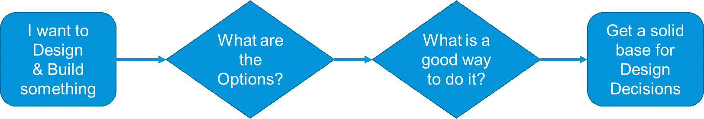

## Introduction

Mendix is optimized for the easiest and fastest way to develop and maintain Apps that fulfil a business function. As the scope grows larger, architecture becomes more important, and it becomes
relevant to leverage best practices expertise in the area.

The Architecture Best Practices complements the sections in the Evaluation Guide: Data Management, Integration, Deployment, DevOps, Architecture and Security.

### About Architecture Best Practices

Best Practices around Architecture will be valuable for architects, designers, business developers and more technical developers that work on Mendix Projects. The Best Practices try to address common areas where we think quality of Mendix solutions can improve by reading the documents or using the examples in the App Store.

#### Areas of Architecture Best Practices

The Architecture subject areas planned to be covered are:

- Integration
- Performance
- Microservices
- Security
- CI/CD and Test Automation
- Monitoring and Robustness

#### Structure of Best Practices

The figure below gives an overview of the structure of the documentation. This document is the Architecture Best Practices Overview. For each subject area there is an overview document, and below that a number of in-depth descriptions or business use-cases, some of them which have a link to a module in the App Store showing example modelling reflecting the theory.

