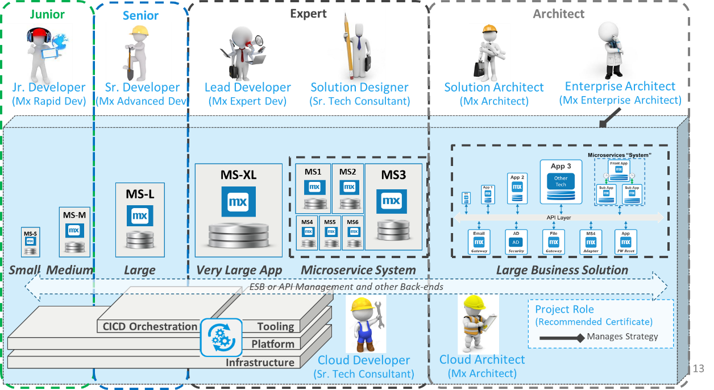

## 1 What Is IT Architecture?

There are many types of IT architecture, and we hear the term in different contexts. The fact is that architecture is practiced at the highest levels of companies as well as by relative beginner Mendix developers.

&quot;_IT architecture is the art and science of designing and delivering valuable technology strategy&quot;._

We want to make nice things with technology. We want them to be valuable for the business, we want them to be easy to deliver and maintain, and we want them to be robust in production, while delivering all this value to a reasonable cost.

All the processes that attempt to optimize that formula is to some extent architecture work, and if you work in the IT industry, chances are you do it every day.

Some work is strategic, like policy, positioning, portfolio or guidelines to define what to do and good ways to do it. So is enterprise architecture road-maps, and business value calculations and measurements.

Some work is tactical when we work concrete designs, anything from large program solution designs to small system design, App design, Microservice design or even just deciding how to configure a Mendix App in a good way to maximize business value and maintainability.

### Microservice Architecture

With the arrival of Low code platforms, cloud solutions and automation, it has become easier to make Architecture Functional, which is reflected in the trend towards Microservices.

An entire subject area will dive into this exiting development.

### Modern IT Architecture only for Architects?

There are more than architects that work on IT architecture, whether they are aware of it or not. And this trend is getting stronger.

It is emphasized by Microservices, Agile and DevOps. The most techie considerations are increasingly abstracted away by Low code and other cloud-based solutions, and left are more functional decisions, where process and organization play a larger and larger role in architecture decisions.

Not only can non-techie people start building solutions in e.g. Mendix, they can understand the architecture considerations, and take part in a more team-oriented and iterative architecture process.

IT Architecture of the future will not separate technical from functional architecture, but rather work on one single solution model, that is understood by all parties, taking business organization, delivery organization, technology, and business process into consideration.

And the architecture will have a level of flexibility, as more information is available during the realization of a solution. It could be re-factoring of an App, or splitting an App in smaller parts, discovering reasons to do so based on real knowledge from the actual implementation.

### Mendix and Architecture?

Mendix has made the subject of Architecture a lot easier, by reducing the number of factors to consider, e.g. how to make UI, logic and databases work together, and Mendix simplifies the entire infrastructure and deployment considerations.

But there is still some architecture work remaining, to get the best Apps to work together to serve the business in a secure, robust and well performing way.

Mendix has a very strong base in Innovation Apps and Business Differentiating systems (see the pace layered model), but as many customers have discovered the speed, productivity and flexibility of Mendix, they have started using Mendix for the heavy lifting of the company.

It then becomes more and more important with Architecture, to optimize the solution and make sure it meats requirements for volume and robustness.

### When Do I Need the Real Architects?

As the solution, the scope, the volumes and the criticality of systems increase, there is an increasing need to have very strong technical people on the team and professional architects to help creating the best solution.

It's a matter of natural law, that more thinking, i.e. more architecture, needs to go into larger and more important solutions. There may also be more reason to test and tune the system after functional realization, and requirements for professional monitoring.

### Good Integration Architecture

One of the most important parts of Architecture is integration. All business Apps need to integrate with people, things, other systems and operational tools to be useful.

The integration with Humans is covered in the _UX and Design thinking_ best practices, but all other integration falls into this category. Integrating Apps with each other and other systems, with things, devices and with monitoring.

Integration is really the glue that holds the pieces together, and since there are so many different systems, businesses, technologies and organizations, integration is a hard subject to nail down.

Best is to have an open mind, think functional, have a discussion with stakeholders and experts, consider error scenarios and then make an overall solution design that makes integration as easy and clearly defined as possible.

Systems do depend on each other. That is part of life. But dependencies can be made smaller and more explicit, and more functionally easy to understand, to get an easy to build, operate and maintained solution.

### High Performance

Sometimes the functional and/or technical architecture has to be adapted to the fact that there is a very high volume of users or messages and/or high requirements for availability.

For most Apps created in Mendix so far, this has had a relatively low impact. We model the App, we test it and it performs well, so we can just deploy and have happy users. In some cases, we see something that is slow, and we fix it by simple modelling changes.

But as volume increases this leads to a whole specialization of Architecture that focuses optimizing both architecture and implementation around supporting large volumes and maintain fast response times.

It may require more planning, more technical expertise, more testing, more tuning and more monitoring in production. This is often the core systems or the most critical systems for enterprises. The primary concern may not be feature development speed, but to get well performing systems that are easy to monitor and maintain, and with great recovery features should something still go wrong

### Security Architecture

Security architecture is the subject of making sure that no one can penetrate, destroy, disrupt or in any other way interfere with the normal business operations of the IT systems that we build and operate.

The subject is increasingly important, and it is in constant evolution as technology providers get better at defending themselves, and malicious parties, sometimes even state sponsored, are getting better at breaking the same systems.

Mendix has good certification for security (more from jasper/bart)….

The security areas are generally considered as:

- Infrastructure security, on e.g. cloud level, deployments etcetera
- App security, usually on user level, focusing on authentication, authorization and SSO
- Integration security, focusing on secure service calls, e.g. via SSL, or via secure queueing or SFTP for files

### Monitoring and Robustness

For simple Apps and systems Mendix has all required monitoring available on the Mendix Developer Portal

For VPC solutions the same would be provided by the party that provides the infrastructure, while integration with Mendix.

As there are more Apps created (\&gt;20), and some of them form a part of Microservices systems, there are reasons to start evolving the monitoring of the solution.  A first step for Mx Cloud customers, can be to dedicate one App to the monitoring and control of the others, using the open APIs of Mendix Cloud.

But for VPC, on prem and when the number of systems increase, and the criticality grows, there is more and more desirable to use professional monitoring, log integration, alarms and recovery mechanisms.

The set-up of such an architecture is largely the role of central IT of the customer, while Mendix connects to the tools and protocols proscribed.

This section of the architecture best practices, will discuss both how some of these benefits can be achieved both using native Mendix technology, and when connecting to professional tooling.

### CI/CD and Test Automation

See also the section [Eval Guide - CICD](https://www.mendix.com/evaluation-guide/app-lifecycle/cicd)

Mendix provides some Continuous integration already out of the Box:

1. Consistency between UI, logic and DB is done by the modeller automatically
2. Checking into the team server the consistency check is done against other developers work.

This is the same for everybody that makes Mendix solutions, because it is part of the Model, and it is part of the acceleration that Mendix provides to get good quality solutions in a quick way. Some testing that is needed for e.g. Java solutions is not needed for Mendix.

Mendix provides 1-click deployments onto Mendix Cloud, SAP Cloud and IBM Cloud and soon also for RedHat Open-shift Kubernetes.  Mendix provides the Unity test module for testing Microflows, and ATS to automatically test the UX functions.

But the scope for automation never ends. It is always possible to automate more and Mendix provides all required APIs to set up automated testing and deployments.

This is an area that is evolving very fast and many companies are making significant investments. There is not one single way to do this, and the focus on automation shifts depending on customer and solution.

Some partners build automation from a Mendix App, some from Jenkins or GitLab CI. Some do mostly Test automation. Some focus on Deployment automation.

The important thing is to take a clear look at the needs, the benefits and the costs, and make the right decisions on what to automate, what to centralize, what to localize and what to just continue to do manually via the easy to use Mendix developer portal.

### Summary

Architecture is a wide subject area, where we will only try to cover the areas where we see the most interest in advice and information.  The Best Practices included are work in progress and constantly changing, as is the world around us, so read this as &quot;one good source of information&quot;.

The weather never looks (exactly) the same on two days of one&#39;s life, so it&#39;s important to both look for what is the same, and what is different when you work towards the best solution for your Maker&#39;s challenge.

Ultimately, Mendix is there to support you both with technology and consulting.