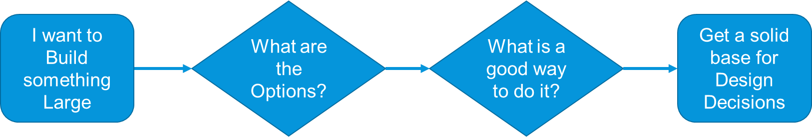
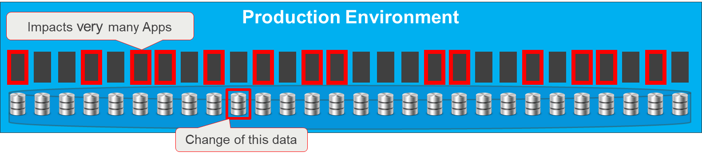
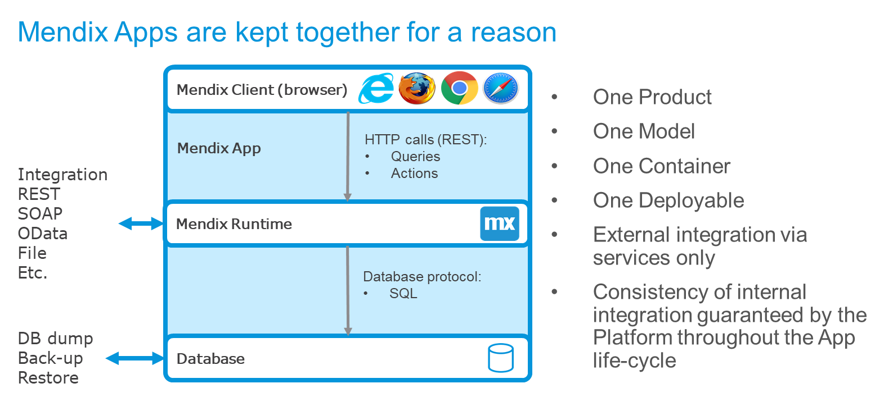
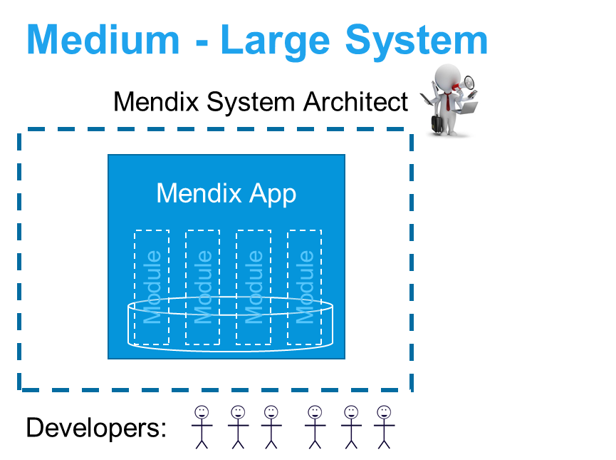
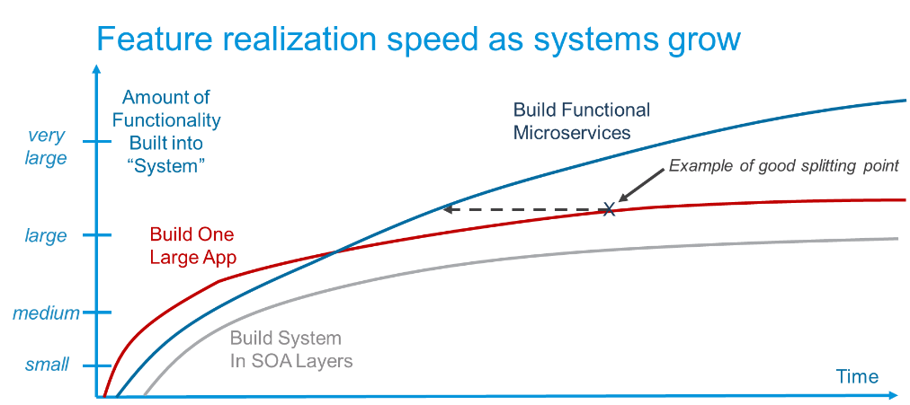

## 1 Introduction

This document gives a view on how Mendix microservices architecture is created and what important areas there are to consider.

Microservices is a relatively new concept that has become very popular. By now, microservices are used in many contexts. On the web, one will come across several different styles of microservices, which may prompt the question, “What is the correct way to build microservices?”

{}[**UPDATE DIAGRAM**]{}

Microservices is less of an actual architecture and more of an organizational context. Therefore, it works very well with DevOps. The common goal of microservices is to make components that can be built and maintained by a small team of fewer than 10 people.

{}[**UPDATE DIAGRAM; EXPLAIN DIAGRAM**]{}

Development efficiency is maxed out with 2–3 developers that cooperate, do peer review, and help each other while maintaining slightly different focuses (one developer is more technical, another is business-oriented, another is ops-oriented, etc.).

Microservices can guide you to try and optimize the component size and the team size. Functional or architecture reasons may require you to have some apps with 0.5 developers and others with 8 developers. But when you need \>10 developers, according to microservices theory, you should start peeling off parts of that app and separate them.

These are some benefits of microservices:

* Most efficient team size for knowing and owning the product
* Full control of the code-base and dependencies within the team
* Very clear and explicit service contracts with other components that are tested and maintained through the releases of this and other components
* You can change, deploy, and replace parts of the solution without having to change everything
* There is less regression testing needed for each release if the service contracts are clear and stable

## 2 What Is Microservices Architecture?

Having a team with no more than 10 people building one component will help you to build the best possible microservices architecture. In a cross-functional DevOps team, these 10 people would include a Product Owner, Business Analyst, Tester, and an Operations person. This means that 6–8 developers on a team is already a lot.

Having a separate database per microservice is recommended. All the functional parts of a business function are thus grouped together and separated from other business functions via explicit service contracts. This makes each component more self-contained, and it makes the dependencies clear and explicit.

From an infrastructure point of view, one could consider sharing a database between several microservices and maybe having separate schemas. However, one should ideally only cross-use the data from other services via explicit service calls.

A separate database per microservice is ideal for backup and restore operations. And having a clear and easy restore procedure is good for availability. But there are also other reasons this recommendation.

## 2.1 Why Not Share a Database?

The problems with shared databases and cross-using data will become apparent over years of small fixes and improvements. Such changes will almost always be “time-critical.” Operations and/or development teams will be asked by the Business or Project Manager to take the shortest route (or to simply finish the work quickly). This means that if developers *can* access the data that belongs to another function directly, they *will*.

Eventually, this will lead to un-desired dependencies. And five or ten years later, people will hardly want to touch the system, which by then will be monolithic.

{}[**UPDATE DIAGRAM; EXPLAIN DIAGRAM**]{}

## 3 Mendix Microservices

{}[**CAN WE NAME THIS PARTNER COMPANY OR EVEN THE DEVELOPER? OTHERWISE, IT JUST SOUNDS VAGUELY ATTRIBUTED AND MADE UP**]{}

A partner developer who recently started using Mendix stated:

<blockquote>
Mendix makes microservices by default, so we get feature-based teams and we don’t have to worry about cross-using data.
</blockquote>

Mendix promotes keeping together what belongs functionally together. By having all the parts needed for a business function in one project (which equals one model, which equals one deployable), we can guarantee the integrity between data, UI, and logic starting with the developer through the testing cycles and until it runs as an app in production.

Other apps or components can only access data and functions via well-defined APIs by using explicit contracts. The APIs are very easy to set up via REST, SOAP, OData, files, or any other mechanism. But access to data and service is controlled via the Mendix Runtime. That way only right caller can only allowed operations that are provided by the App Team who owns the data in that app.

{}[**UPDATE DIAGRAM; EXPLAIN DIAGRAM**]{}

### 3.1 What Happens When the Scope Grows?

Mendix is a low-code platform that allows for quick development. Six developers can produce quite a significant scope. An advanced ordering app or support app can easily be contained in one single Mendix app.

This allows you to choose the size of an app based on functional considerations, instead of having to break it down based on the microservice consideration that it is too big to be efficient and autonomous.

When the scope grows, the first thing to do in Mendix is to structure the app in separate modules within the app all using the same database. Ideally, the modules should be as independent as possible. They may copy parts of the same data to have a specific view on the same information.

{}[**UPDATE DIAGRAM; EXPLAIN DIAGRAM**]{}

The increased speed of development in a low-code platform like Mendix means that apps and microservices can be functionally quite large and significant before the rule of having fewer than eight developers on a team comes into play. This enables more scope for selecting an architecture that is
functionally ideal rather than having to split things for size reasons. 

These are some other reasons for having separate apps and microservices:

* Separate business functions from each other
* Improve scalability
* Follow different release cycles
* Allow for the autonomy of evolution for different stakeholder organizations
* Fulfill different operational requirements

The increased flexibility of a low-code platform like Mendix allows for the architects of the solution to choose the best microservices without thinking of size in most cases.

### 3.2 What Happens When the Scope Grows Even More?

When the scope increases further and it is still one business function, you can split things up and create a system of apps working together as a microservices cluster. This is treated from the outside as one single system, but it is built, tested, and deployed as a set of independent functional components by \~1–8
DevOps teams.

There are several ways to do this, and it will depend on the situation that fits the purpose of this business requirement.

These are the most common patterns:

{}[**UPDATE DIAGRAM; EXPLAIN DIAGRAM**]{}

* **Process oriented cluster** – This is where several user groups cooperate over several phases in one process. Often, there is a landing page or dashboard app with separate microservices below, each implementing a phase in the business process. The other services are accessed via deep links so that the user does not notice they are working in more than one app. This is also the pattern for larger functionally-oriented customer portals.

* **Main app & peeled-off pieces** – This is a common pattern when data-integrity is important across a larger data scope and where there is a true core functionality that is hard to break up. Certain parts are broken off, like batch-processing, calculations, and configuration of products. Anything that has a small and stable interface towards the main app is a candidate for a separate microservice.

* **Separate individual systems** – In this pattern, the initial idea of the app contained more than one business function. To quickly get to an MVP and demo for the stakeholders, the modules were built well within one single app. Not being sure of the best approach for breaking up the modules, the team postponed the decision until later. This app will thus become two separate systems altogether, and each app will be handled by a small and independent team of developers again.

* **Marketing-oriented customer portal style** – In this pattern, there is marketing and searchable information in the main pages of a customer portal. This is a microservices pattern found quite frequently on the web, and for these cases, Mendix is an excellent choice for building the microservices below the common portal landing page. For more information, see the *Customer Portals* section below.

## 4 The Mendix Advantage

For Java-oriented systems and some other low-code providers, it makes sense to build separate small services using the same database. This is good in the beginning of a project, when all the microservices can access and change all the data in the database.

In Mendix, the same pattern is built using separate modules inside the app. The same database is used, but the team is ready to split things later when it is clear what the most important thing to separate out is.

{}[**UPDATE DIAGRAM; EXPLAIN DIAGRAM**]{}

Both patterns in the diagrams above can be done in a good way with minimal dependencies between modules and apps. Both patterns can also be done in a bad way with too much data cross-usage and concerns that are not separated from each other.

Mendix has the advantage in this scenario, because the integrity of how data is used is within the model and is checked by the platform. Changing something in one Mendix module will immediately verify if it works with the other modules.

As the scope grows, Mendix splits the app into functional parts with separate process phases and separate data that is owned and managed. In other technologies, people often keep building in the same way, eventually creating a monolith with a lack of control over dependencies.

{}[**UPDATE DIAGRAM; EXPLAIN DIAGRAM**]{}

When apps are split, Mendix forces the separation of data as well as access to each other’s data via services and clear contracts. This aligns with the purpose of microservices, as developers are encouraged to think carefully about integration. Over time, this helps to make large solutions manageable yet still flexible.

## 5 Good Dependencies

You cannot remove dependencies, so you should try to implement as few of them as possible from the start. In addition, you should try to make any necessary dependencies as simple as possible. The larger the system becomes, the more important it is to make functional components that have clear business-related
dependencies.

When a business function is so large that you need to break it up into a microservices cluster, you should consider the integrity of data between the apps. Preferably, each app should “own” its part of the data. There will be an overlap, so you must allow for copying data, but whenever possible, each app should own one type of update or business event.

Often the split handles different phases of the business process, which means that one type of business event often happens in one single app.

If data integrity is still an issue (which is rare), it is worth considering these options:

* Make one main app with the core functionality that acts as the master of most of the data in that microservices cluster. This app owns the data integrity of the system. Then, peel off parts of the functionality that have clear integration, making the main app smaller. This is the primary choice.
* Shift overview data up to a dashboard or landing page where end-users can get overviews and simple reports. This is also where the integrity between entities can be viewed, maintained, and managed.
* Make a local operational data store (ODS) app where data from different equivalent services are stored on commit in the other services. The sole purpose of this app is to maintain real-time operational data integrity.

If data integrity seems difficult, the system has probably not been split in a good way. Bad splits are characterized by split parts that are too small, business processes ping-ponging back and forth, the same data updating in many places, or integration that is done poorly.

{}[**UPDATE DIAGRAM; EXPLAIN DIAGRAM**]{}

Mendix cannot make good integration easy, but we can makes it easier. It takes the right thinking to find the right apps and integrate them well with minimal contracts in order to create smart and minimal dependencies. When dependencies are defined, it is easy in Mendix to implement and maintain them using REST, OData, SOAP, or file contracts.

This is why when you build larger systems, you need experienced people and a careful approach, maybe considering a “factory” or, as Spotify calls it, a tribe of teams that own one functional area.

## 6 Approaches to Size & Changes

As the size of what you build increases, the approach needs to change. More care needs to be taken with the following actions:

* Architecting and designing before building and the project
* Involving a more experienced Lead Developer
* Involving more technical Developers
* Conducting more peer reviews
* Conducting more testing, automated testing, and tuning
* Performing more refactoring (for example, 1–2 times per year with 1–2 sprints to improve the app structure)
* Implementing more monitoring

Speed does slow down with size, in whichever direction you turn. However, you can minimize that consequence by implementing a solid microservices architecture with a good team and professional approach.

Positioning for core systems should be based on technology and approach, as in the [Gartner Pace-Layered Application Strategy](https://www.gartner.com/binaries/content/assets/events/keywords/applications/apn30/pace-layered-applications-research-report.pdf). You should optimize for what each system requires. Sometimes speed is important, sometimes size, and sometimes stability and performance are even more important. The project should adapt to the approach accordingly.

{}[**UPDATE DIAGRAM; EXPLAIN DIAGRAM**]{}

With a mature and careful approach, Mendix can be used for almost any challenging business problem.

## 7 Customer Portals

Another way to build microservices involves customer portals. These portals often have one single landing page or dashboard with a few microservices below that provide functions or services via REST services or deep links.

If you are building a functionally-oriented customer portal, Mendix is ideal for building all the portal parts. Small portals are often only built on one single Mendix app. For larger portals, it is recommended to use a landing page or dashboard app in front, and then deep-link into sub-apps to do more significant work for the logged-in areas of the portal.

{}[**UPDATE DIAGRAM; EXPLAIN DIAGRAM**]{}

The main purpose of marketing-oriented portals is to provide a window into an enterprise or department. There is a lot of information, links, and pictures that can be accessed without having to log in. The information is search-optimized, and different pictures are displayed depending on where the user is hovering and clicking. In these cases, Mendix is preferred for the functional parts of the portal that are accessed via REST services or linked to from the public portal pages.

{}[**UPDATE DIAGRAM; EXPLAIN DIAGRAM**]{}

## 8 Summary

In summary, the Mendix Platform can be used for almost all situations encountered in the business application landscape of a typical enterprise. It is all a matter of the correct attention to skills of the team, good modelling, tuning, performance testing, sizing, scaling and operational monitoring and procedures.

Mendix will often not play well in the area of BI, Analytics and DWH, and there are better tools for Content management etcetera. There are also very many great SaaS tools out there which make sense when functionality is standard cross-industry and very little customization is needed.

But for most other cases Mendix is a good choice for it’s seamless development and operational experience, speed of development and ease of use.

The customer can decide system borders, can align to his own processes, and make smart, functional microservices that fits his functional and technical needs, and, as this document shows, that adapts to the volumes and criticality of the system.
