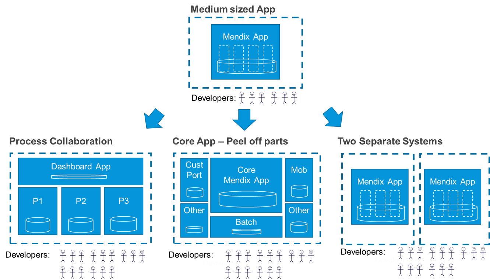

## 1 Introduction

Mendix promotes keeping together what belongs functionally together. By having all the parts needed for a business function in one project (which equals one model and thus one deployable), we guarantee the integrity between data, UI, and logic starting from development through testing cycles until it runs as an app in production. 

Other apps or components can only access the data and functions via well-defined APIs using explicit contracts. The APIs are easy to set up via REST, SOAP, OData, files, or any other mechanism. Access to data, files, and functions is controlled via Mendix Runtime. That way, only the right caller can perform the predefined operations provided by the app. Dependencies are thus defined and kept under control.

In the diagram below, the three parts of a Mendix app are shown. The browser and external services talk exclusively with the [Mendix Runtime](/refguide/runtime), which is the only component that works directly on data in the database. Backup and restore is easy, as only this app is affected.

This is why Mendix works well for creating all types of microservices: business-oriented microservices that are like applications, API-oriented microservices that do not have a UI, and .NET-styled microservices that share a database. 

For more information, see [Three Microservice Patterns](three-microservice-patterns).

## 2 What Happens When the Scope Grows?

When the scope grows, the first thing to do in Mendix is structure the app in separate modules within the same App. Ideally modules should be as independent as possible. They may copy parts of the same data to have a specific view on the same information while maintaining more autonomy in this way.

{}[**EXPLAIN DIAGRAM**]{}

The increased speed of development in a low-code platform like Mendix means that apps and microservices can be functionally quite large and significant before the rule of having fewer than eight developers on a team comes into play. An advanced ordering app or support app can easily be contained in one single Mendix app. 

This allows you to choose the size of an app based on functional considerations, instead of having to split it up based on the microservice size consideration. These are some other reasons for having separate apps and microservices: 

* Separate business functions from each other
* Allow for the autonomy of evolution for different stakeholder organizations
* Follow different release cycles
* Fulfill different operational requirements
* Improve scalability
* Sparate complicated integration and batch processes
* Fulfill different security requirements (for example, in customer portals)

## 3 What Happens When the Scope Grows Even More?

When the scope increases further and it is still one business function, you can split things up and create a system of apps working together as a microservices cluster. The microservices cluster is is treated from the outside as one single system, but it is built, tested, and deployed as a set of independent functional components by 1–8 DevOps teams.

There are several ways to do this, and it will depend on the situation that fits the purpose of this business requirement. If the situation is complex, Mendix recommends organizing an architecture workshop for several stakeholders. Such a workshop should include the business, because considerations are not only technical.

These are the most common cluster patterns:

* **Process-oriented cluster** – In this pattern, several user groups cooperate over several phases in one process. Often, there is a landing page or dashboard app with separate microservices below, each implementing a phase in the business process. The other services are accessed via deep links so that the user does not notice they are working in more than one app. This is also the pattern for larger functionally-oriented customer portals.
* **Main app & peeled-off pieces** – This is a common pattern when data-integrity is important across a larger data scope and where there is a true core functionality that is hard to split up. Certain parts are broken off, like batch-processing, calculations, and configuration of products. Anything that has a small and stable interface towards the main app is a candidate for a separate microservice.
* **Separate individual systems** – In this pattern, the initial idea of the app contained more than one business function. To quickly get to an MVP and demo for the stakeholders, the modules were built well within one single app. Not being sure of the best approach for spitting up the modules, the team postponed the decision until later. This app will thus become two separate systems altogether, and each app will be handled by a small and independent team of developers again.
* **Marketing-oriented customer portal style** – In this pattern, there is marketing and searchable information in the main pages of a customer portal. This is a microservices pattern found quite frequently on the web, and for these cases, Mendix is an excellent choice for building the microservices below the common portal landing page. For more information, see the [Customer Portals](#customer-portals) section below.

## 4 Customer Portals {#customer-portals}

Another way to build microservices involves customer portals. These portals often have one single landing page or dashboard with a few microservices below that provide functions or services via REST services or deep links.

If you are building a functionally-oriented customer portal, Mendix is ideal for building all the portal parts. Small portals are often only built on one single Mendix app. For larger portals, it is recommended to use a landing page or dashboard app in front, and then deep-link into sub-apps to do more significant work for the logged-in areas of the portal.

{}[**EXPLAIN DIAGRAM**]{}

## 5 Marketing Portals {#marketing-portal}

The main purpose of marketing-oriented portals is to provide a window into an enterprise or department. There is a lot of information, links, and pictures that can be accessed without having to log in. The information is search-optimized, and different images are displayed depending on where the user is hovering and clicking. In these cases, using Mendix is preferred for the functional parts of the portal.

{}[**EXPLAIN DIAGRAM**]{}

For more information, see the [Website Integration](../integration/ui-integration#web) and [CMS UI Integration](../integration/ui-integration#) sections of *UI Integration*.

## 6 Summary

Mendix is a great option for building large microservices. This is because it is a low-code platform, you can develop features almost 10 times faster with it (and you thus need fewer developers), and you will rarely have to break something up due to size.

Most Mendix microservices are separated from other microservices because of functionality, team, or scalability reasons. So, the first thing to do when the scope grows in a Mendix app is to split the functionality into well-defined modules that separate parts of the scope from each other. This will make it easier for several developers to cooperate.

When scope is even larger, Mendix recommends participating in architecture workshops where managers, business stakeholders, and operations are also involved to determine what the best way is to split things up. This is usually different from case to case.

Finally, Mendix apps make for really good functional parts of websites and customer portals, and they integrate well with CMS and CDM systems. For more information, see the [CMS UI Integration](../integration/ui-integration#cms) and [CDN UI Integration](../integration/ui-integration#cdn) sections of *UI Integration*.

When the scope, volume, and criticality increase even more, Mendix recommends changing the approach towards a factory model by using DevOps Tribes and more technical resources. For more information, see [Large Microservices Clusters](large-microservice-clusters).
