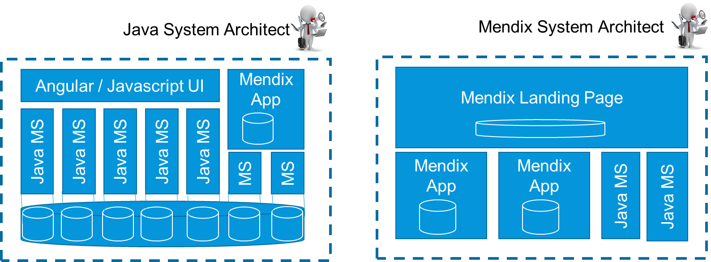
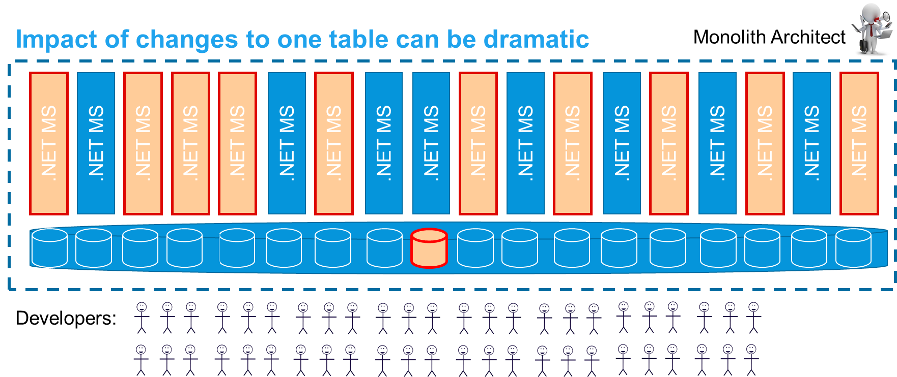

## 1 Introduction

Microservices is a relatively new concept that has become very popular. By now, microservices are used in many contexts. 

On the web, one will come across several different styles of microservices, which may prompt the question, “What is the correct way to build microservices?”

### 1.1 Microservices by Lewis & Fowler

Mendix bases its view on microservices on the [definition](https://www.thoughtworks.com/insights/blog/microservices-nutshell) created by James Lewis and Martin Fowler from Thoughtworks, who coined the "microservice" term. They recommend keeping all parts of a business function together in a deployable container and separated from other business functions via explicit service contracts.

This makes components more self-contained and autonomous, and also makes dependencies clear and explicit.

### 1.2 Why Microservices?

The reason for utilizing microservices has less to do with actual architecture and more to do with organizational context. The common goal of microservices is to have components that can be built and maintained by a small team with fewer than 10 people. This is due to the fact that development productivity is optimal with 2–4 developers that cooperate, do peer review, and help each other while maintaining slightly different focuses (one developer is more technical, another is business-oriented, another is ops-oriented, etc.).

{}[**EXPLAIN DIAGRAM; UX-UPDATE DIAGRAM**]{}

At 8–9 developers, your productivity will decrease enough that splitting up the app should be considered. And with more than 10 developers, you should start peeling off parts of the app and separating them, according to microservices theory.

Microservices can guide you to try and optimize the component size and the team size, thus it works very well with DevOps.

Beyond team size, there could be many other reasons to split up an app. For example, there could be different processes involved, stakeholder feedback, or scaling requirements. Accordingly, functional or architecture reasons can require you to build one app with only one developer and another app with eight developers.

### 1.3 Typical Benefits

These are some benefits of microservices:

* Most efficient team size for knowing and owning the product
* Full control of the code-base and dependencies within the team
* Very clear and explicit service contracts with other components that are tested and maintained through the releases of this and other components
* You can change, deploy, and replace parts of the solution without having to change everything
* There is less regression testing needed for each release if the service contracts are clear and stable

### 1.4 This Document

This document presents different microservice architecture patterns that fit various business scenarios in relation to Mendix.

Microservices is more relevant if the scope is large. By reading this document, your team will gain a basis for deciding whether app should be split up and for identifying the best microservices pattern to fit a specific business scenario.

{}[**EXPLAIN DIAGRAM; UX-UPDATE DIAGRAM IN RELATION TO INTRO TEXT**]{}

## 2 Mendix Microservices

Having a team with no more than 10 people owning a component will help you to build the best possible microservices architecture. In a cross-functional DevOps team, these 10 people would include a Product Owner, Business Analyst, Tester, and an Operations person. This means that 6–8 developers on a team is already a lot.

At a microservices training session with [Sam Newman](https://samnewman.io/talks/principles-of-microservices/) in Amsterdam, a relatively new Mendix developer named Jurre Tanja from [Friesland Campina](https://www.frieslandcampina.com/en/) noted the following: 

<blockquote>
Mendix makes microservices by default. We get feature-based teams, and we don’t have to worry about accessing another app's database directly.
</blockquote>

Mendix promotes keeping together what belongs functionally together. By having all the parts needed for a business function in one project (which equals one model, which equals one deployable), we can guarantee the integrity between data, UI, and logic starting with the developer through the testing cycles and until it runs as an app in production.

Other apps or components can only access data and functions via well-defined APIs by using explicit contracts. The APIs are very easy to set up via REST, SOAP, OData, files, or any other mechanism. But access to data and service is controlled via the Mendix Runtime. That way only right caller can only allowed operations that are provided by the App Team who owns the data in that app.

In the diagram below, the three parts of a Mendix app are shown. The browser talks exclusively with the [Mendix Runtime](/refguide/runtime), and this is the only component that works directly on data in the database. Backup and restore is easy, as it affects only this app.

{}[**UX-UPDATE DIAGRAM**]{}

### 2.1 What Happens When the Scope Grows?

When the scope grows, the first thing to do in Mendix is to structure the app in separate modules within the app. Ideally, the modules should be as independent as possible. They may copy parts of the same data to have a specific view on the same information while maintaining more autonomy in this way.

{}[**EXPLAIN DIAGRAM; UX-UPDATE DIAGRAM**]{}

The increased speed of development in a low-code platform like Mendix means that apps and microservices can be functionally quite large and significant before the rule of having fewer than eight developers on a team comes into play. An advanced ordering app or support app can easily be contained in one single Mendix app. 

This allows you to choose the size of an app based on functional considerations, instead of having to split it up based on the microservice consideration. These are some other reasons for having separate apps and microservices: 

* Separate business functions from each other
* Allow for the autonomy of evolution for different stakeholder organizations
* Follow different release cycles
* Fulfill different operational requirements
* Improve scalability
* Sparate complicated integration and batch processes
* Fulfill different security requirements (for example, in customer portals)

### 2.2 What Happens When the Scope Grows Even More?

When the scope increases further and it is still one business function, you can split things up and create a system of apps working together as a microservices cluster. The microservices cluster is is treated from the outside as one single system, but it is built, tested, and deployed as a set of independent functional components by 1–8 DevOps teams.

There are several ways to do this, and it will depend on the situation that fits the purpose of this business requirement. If the situation is complex, Mendix recommends organizing an architecture workshop for several stakeholders. Such a workshop should include the business, because considerations are not only technical.

These are the most common cluster patterns:

{}[**UX-UPDATE DIAGRAM**]{}

* **Process-oriented cluster** – This is where several user groups cooperate over several phases in one process. Often, there is a landing page or dashboard app with separate microservices below, each implementing a phase in the business process. The other services are accessed via deep links so that the user does not notice they are working in more than one app. This is also the pattern for larger functionally-oriented customer portals.
* **Main app & peeled-off pieces** – This is a common pattern when data-integrity is important across a larger data scope and where there is a true core functionality that is hard to split up. Certain parts are broken off, like batch-processing, calculations, and configuration of products. Anything that has a small and stable interface towards the main app is a candidate for a separate microservice.
* **Separate individual systems** – In this pattern, the initial idea of the app contained more than one business function. To quickly get to an MVP and demo for the stakeholders, the modules were built well within one single app. Not being sure of the best approach for spitting up the modules, the team postponed the decision until later. This app will thus become two separate systems altogether, and each app will be handled by a small and independent team of developers again.
* **Marketing-oriented customer portal style** – In this pattern, there is marketing and searchable information in the main pages of a customer portal. This is a microservices pattern found quite frequently on the web, and for these cases, Mendix is an excellent choice for building the microservices below the common portal landing page. For more information, see the [Customer Portals](#customer-portals) section below.

### 2.3 Customer Portals {#customer-portals}

Another way to build microservices involves customer portals. These portals often have one single landing page or dashboard with a few microservices below that provide functions or services via REST services or deep links.

If you are building a functionally-oriented customer portal, Mendix is ideal for building all the portal parts. Small portals are often only built on one single Mendix app. For larger portals, it is recommended to use a landing page or dashboard app in front, and then deep-link into sub-apps to do more significant work for the logged-in areas of the portal.

{}[**EXPLAIN DIAGRAM; UX-UPDATE DIAGRAM**]{}

### 2.4 Marketing Portals

The main purpose of marketing-oriented portals is to provide a window into an enterprise or department. There is a lot of information, links, and pictures that can be accessed without having to log in. The information is search-optimized, and different images are displayed depending on where the user is hovering and clicking. In these cases, using Mendix is preferred for the functional parts of the portal.

{}[**EXPLAIN DIAGRAM; UX-UPDATE DIAGRAM**]{}

## 3 The Mendix Advantage

### 3.1 Java Microservices

For Java-oriented architectures, it makes sense to build separate small services using the same database with, for example, an Angular UX layer on top. Holding a business feature together across the layers is difficult and requires management, and as the system grows, so do the dependencies. A very good architect is required to make this work well.

In Mendix, on the other hand, you only need to find the functional pieces and the UX, logic, and data is all kept together by the platform.

{}[**EXPLAIN DIAGRAM; UX-UPDATE DIAGRAM**]{}

### 3.2 Other Low-Code or 3GL Platforms

In .NET and some other low-code platforms, the standard pattern is to build apps that share a database In Mendix. This same pattern is built using separate modules inside the app. The same database is used, but the team can split things up later when it is clear what the most important thing to separate out is.

Both patterns in the diagrams below can be done in a good way with minimal dependencies between modules and apps. However, both patterns can also be done in a bad way with too much data cross-usage that is not clear.

{}[**UX-UPDATE DIAGRAM**]{}

Mendix has the advantage in this scenario, because the integrity of how data is used is within the model and is checked by the platform. Changing something in one Mendix module will immediately verify if it works with the other modules.

As the scope grows, the other styles of microservices tend to keep building more apps on top of the same database, eventually creating a monolith. For more information, see the [Why Not Share a Database?](#why-not-share) section below.

Mendix splits the app into functional parts with separate data that is owned and managed by each app. Mendix forces the separation of data, and access to each app’s data happens via services and clear contracts.

{}[**EXPLAIN DIAGRAM; UX-UPDATE DIAGRAM**]{}

This aligns with the purpose of microservices, as developers are encouraged to think carefully about integration. Over time, this helps to make large solutions manageable yet still flexible.

### 3.3 Why Not Share a Database? {#why-not-share}

The diagram below presents an example of when too many apps share the same database. In this scenario, updating one single table has effects on many of the apps in this system, which means they all must change at once. Making a change that suits all these functions may be difficult. 

{}[**EXPLAIN DIAGRAM; UX-UPDATE DIAGRAM**]{}

From an infrastructure point of view, one can share a database between microservices, have separate schemas, and try to only cross-use the data from other services via explicit service calls. However, the problems with shared databases and cross-using data will become apparent over years of small fixes and improvements. Such changes will almost always be “time-critical.” Operations and/or development teams will be asked by the Business or Project Manager to take the shortest route (or to simply finish the work quickly). 

This means that if developers *can* access the data that belongs to another function directly, they *will*, because that will be the easiest way. Eventually, this will lead to un-desired dependencies. And five or ten years later, people will hardly want to touch the system, which by then will be monolithic.

Therefore, having a separate database per microservice (as Mendix always does) is recommended.  A separate database per microservice is also ideal for backup and restore operations. And having a clear and easy restore procedure is good for availability. 

There are other reasons for this recommendation, which are described below.

### 3.4 Good Dependencies

You cannot remove dependencies, so you should try to implement as few of them as possible from the start. In addition, you should try to make any necessary dependencies as simple as possible, as this will lead to the maximum autonomy of teams and components. 

The larger the system becomes, the more important it is to make functional components that have clear business-related dependencies. When a business function is so large that you need to split it up into a microservices cluster, you should consider the integrity of data between the apps. Preferably, each data field is updated in only one place. 

For example, a support app may copy 10–15 customer fields from a customer master app and add another 5 specific support-related fields. Updating the 5 support fields does not impact anyone else, so it does not require integration. But, if the customer calls the support app to update one of the 15 shared fields, the update needs to be cleared with the customer master app before the commit. This is a necessary and minimal business dependency.

In turn, this means there will be an overlap in data. We must allow for copying data, but whenever possible, one type of business event should be owned by only one app. Often, the split will handle different phases of the business process, which means that one type of business event will often happen in one single app.

### 3.5 Signs of Poor Microservice Architecture

A poor microservice architecture can be characterized by the following signs:

* The microservices are too small ad you are deploying several together for every release
* The business processes ping-pong back and forth between apps
* The exact same data is updated in many places, which causes issues
* The integration is complex and works poorly or has poor error-handling
* There are still a lot of dependencies between the teams building separate apps

After identifying any of these signs, it is worth looking at both the apps and microservices you have created along with the integration patterns used.

## 4 Large Microservices Cluster

As the business function grows very large, we can consider splitting it into several systems or creating a group of DevOps teams that cooperate to own this large cluster (which will replace 1–3 core systems in a regular architecture).

These are the typical microservices seen in such clusters:

* **Internal dashboard or landing page** that can be used by internal end-users to get overviews, simple reports, and links to other functionality
	* Some data from processes is copied up to the dashboard to allow for good overviews
	* Working on a specific process is done on one of the sub-apps
* **Customer portal** that can be separated
	* This useful for keeping users and security separated
	* In this case, you want external users to see a sub-set of data and processes that are then often copied over to the portal in order to know exactly what can be accessed
	* Widgets can be shared via the [Mendix App Store](https://appstore.home.mendix.com/index3.html) if relevant
* **Mobile portal** for mobile devices
	* These often have a much larger amount of users and/or events with much smaller functionality
	* With very different operational features, this would be a candidate for a separate specialized app
* **Product definitions** and other relatively static master data management
	* This is often good to do in a separate app
	* This is a different phase of the process, with an often different user group that only needs be synched daily or monthly
* **Historical data** that can be separated with views created from a dashboard
	* This makes the operational databases smaller, which is always good for performance
	* This is also often a different process that uses historical data
* **Operational data store (ODS)**, which is rarely needed
	* This is an option to consider when you need to keep data from different processes together to join the data in views and reports – but only if the dashboard is not suited for this should an ODS be considered

{}[**EXPLAIN DIAGRAM; UX-UPDATE DIAGRAM**]{}

### 4.1 Integration

Mendix cannot make good integration easy, but we can make it easier. It takes the right thinking to find the right apps and integrate them well with minimal contracts in order to create smart and minimal dependencies. When dependencies are defined, it is easy in Mendix to implement and maintain them using REST, OData, SOAP, or file contracts sent via FTP(S).

This is why when you build larger systems, you need experienced people and a careful approach. You should consider a “factory” or a group of teams that own one functional area.

### 4.2 Approaches to Size & Changes

As the size of what you build increases, the approach needs to change. More care needs to be taken with the following actions:

* Architecting and designing before building and the project
* Involving a more experienced Lead Developer
* Involving more technical Developers
* Conducting more peer reviews
* Conducting more testing, automated testing, and tuning
* Performing more refactoring (for example, 1–2 times per year)
* Implementing more monitoring

Speed does slow down with size, in whichever direction you turn. However, you can minimize that consequence by implementing a solid microservices architecture with a good team and professional approach.

### 4.3 The Rate of Feature Realization

The diagram below shows how in any technology, the speed of feature realization will slow down as the system grows over time:

{}[**UX-UPDATE DIAGRAM**]{}

We can under stand this rate change in the following way:

* Both monoliths and microservices are better than traditional service-oriented architecture (SOA) layers, where dependencies between components realizing the same business feature are maximized rather than minimized
* Monolith development will be faster to start with, since you only have one single component and you do not need integration
* As the scope grows, there will be benefits in separating the concerns from each other

If it is not very clear from the beginning which apps should be created, it is generally advised to start coarse-grained and split later.

### 4.4 Positioning for Core Systems

Positioning for core systems should be based on technology and approach, as in the [Gartner Pace-Layered Application Strategy](https://www.gartner.com/binaries/content/assets/events/keywords/applications/apn30/pace-layered-applications-research-report.pdf). You should optimize for what each system requires.

Sometimes speed is important, and sometimes size. Sometimes stability and performance are even more important. The project should adapt to the approach accordingly.

With a mature and careful approach, Mendix can be used for almost any challenging business problem.

## 5 Summary

{}[**THIS SUMMARY IS ALREADY USED FOR HIGH PERFORMANCE WITH MENDIX: https://documentation-accp.cfapps.io/best-practices/architecture/performance/mendix-performance#9-summary
NEED NEW CONTENT, NO DUPLICATION**]{}

In summary, the Mendix Platform can be used for almost all situations found in the business application landscape of a typical enterprise. The most important thing to do is pay the correct amount of attention to team skills, good modelling, tuning, performance-testing, sizing, scaling, and operational monitoring and procedures.

Mendix will often not play well in the area of business intelligence, analytics, and data warehousing. There are also better tools for content management. In addition, there are a lot of great SaaS tools out there that make sense when the functionality is standard across industries and very little customization is needed.

But for almost all other cases, Mendix is a good choice due to the following characteristics:

* Seamless development
* Operational experience
* Speed of development
* Ease of use

As a Mendix customer, you can decide on system borders, align to your own processes, and make smart functional microservices that fit your functional and technical needs. In addition, as this overview demonstrates, you can build microservices that adapt to the volumes and criticality of your system.
