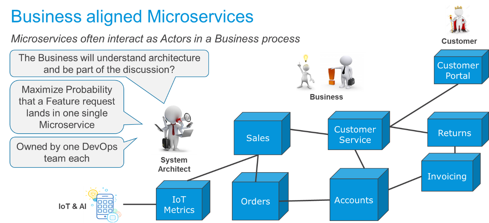
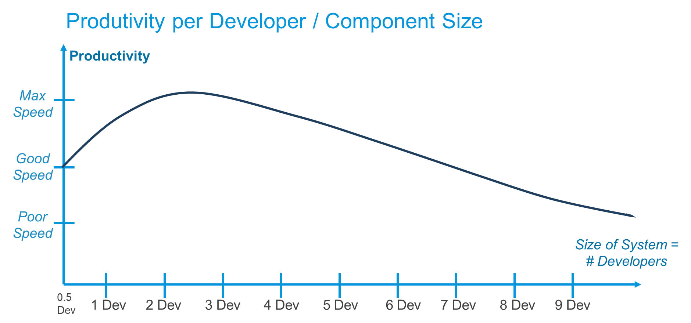
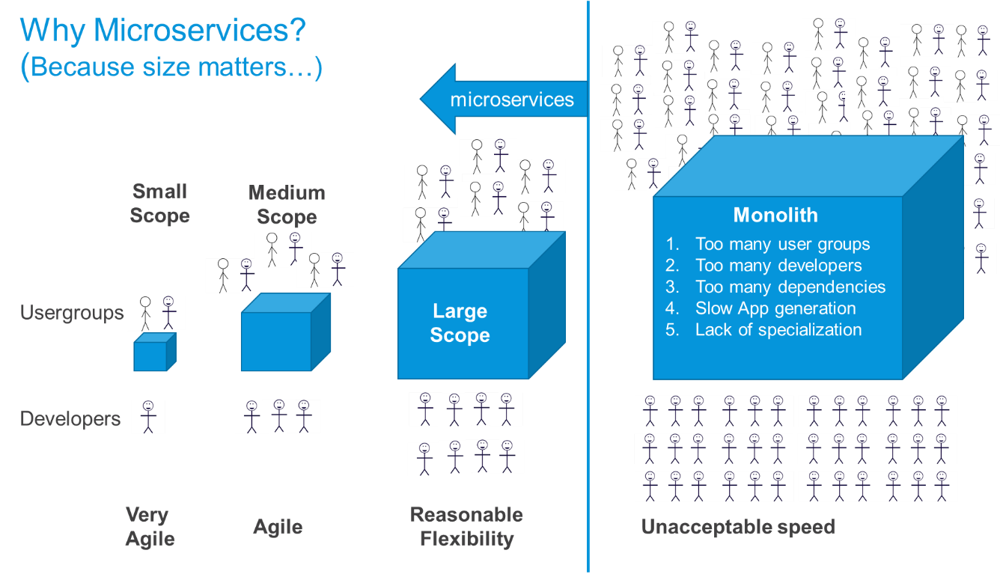
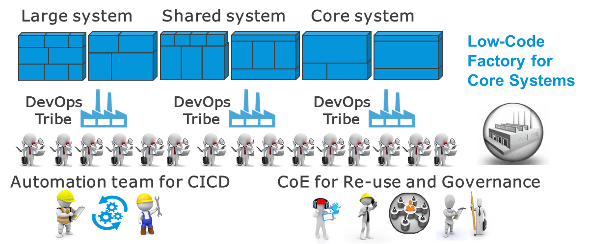

## 1 Introduction

Microservices is a relatively new concept that has become very popular. Microservices are used in many contexts, and as you come across different microservice patterns, you will start to wonder what the best practices are for building them. All microservice patterns can be valid in certain situations, but the sections below describe the microservice pattern Mendix believes is the most beneficial.

## 2 Business-Oriented Microservices

Mendix bases its views on the [definition of microservices](https://martinfowler.com/microservices/#what) created by James Lewis and Martin Fowler from Thoughtworks, who coined the "microservice" term. They recommend keeping all parts of a business function together in an app (microservice) so that all the parts are owned by one team and the functionality can evolve autonomously.

This diagram presents functionally-oriented microservices where the business can understand the architecture and interactions, which is ideal for business-IT alignment:

Since business features and functions most often have layers of UX, logic, and data, these apps/microservices usually have all three technical layers included. The layers are chosen to maximize the probability that a new feature request impact only one single app/microservice. 

## 3 Why Microservices?

The reasons for using microservices involve an organizational context. The common goal of microservices is to have components that can be built and maintained by a small team with fewer than 10 people. The other goal is that each microservice fully contains a business function.

This is because development productivity is optimal with 2–4 developers that cooperate, do peer review, and help each other while maintaining slightly different focuses (one developer is more tech, another is biz, another is ops, etc.).

{}[**EXPLAIN DIAGRAM**]{}

According to microservices theory, at 8–9 developers, productivity decreases sufficiently so that you should consider breaking up an app. With more than 10 developers, you should start peeling off parts of the app and separating them.

Because microservices theory can guide you to optimize component size and team size, it works very well with DevOps.

Beyond team size, there are other reasons to split an app (for example, different processes, stakeholders, or scaling requirements). Due to functional or architecture reasons, you may create some apps with one developer and others with eight developers.

These are some benefits of using microservices:

* Team sizes are the most efficient for knowing and owning the product
* Full control of the code base and dependencies within the team
* Clear and explicit service contracts with other components that are tested and maintained through component releases of these and other components
* The ability to change, deploy, and replace parts of the solution without having to change everything
* Less regression testing needed for each release when the service contracts are clear and stable

## 4 Microservices, Monoliths & SOA Layers

The reason why microservices are better than monoliths and service-oriented architecture (SOA) layers is that they allow for the better management of size of and dependencies between teams and components.

### 4.1 Monoliths Have Too Many Internal Dependencies {#monolith}

Teams simply become too large when working on monoliths. In addition, developers specialize on small parts of the monolith without understanding the functional overview or the impact of changes on the entire monolith. Teams reuse functions and data too much, and over time, every small change may have significant impact.

In this diagram, it is clear that the speed of development slows when a large development team has to support more user groups and processes who are all working on the same software and database:

The speed of development slows here for the following reasons:

* Too many user groups want to change too many different things
* Too many developers are trying to do too many things, often on the same functions and data tables
* There are too many dependencies between functions, as shortcuts are taken and internal modules are not well separated
* There is slow system generation and deployment as well as a lot of regression testing for every small change
* There is a lack of specialization for different functional areas, since all share the same teams, processes, and deployable technical components

### 4.2 SOA Layers Have Too Many External Dependencies

In the latter years of popular SOA usage, it was common do use a so-called “n-tier” architecture or “layered SOA model.” This was intended to increase specialization in each technical layer of an implementation and to reuse as much as possible within each of these layers. 

This is a typical five-tiered model:

* UX layer
* UX-related logic layer
* BPM layer for processes
* ESB layer for enterprise services with a front-end adapter for exposing services and back-end adapters to connect to source systems
* Layer for systems of record where the actual business data and functionality are located

This model had some merit in the beginning for web-enabling companies with mature core systems who were not ready for the cloud and the web. However, this system did not scale well, and the question remained: can you separate UX, logic, process, and data easily?

To enable such a separation, business features were divided into 4–6 layers, where each team developed a small part of the function. Each layer depended on all the other layers, so the teams for these layers had to wait on each other's designs and builds.

The desire to reuse each service in these layers drove the services to become larger and more generic over time. As the services were "successfully" reused, the dependencies increased, and more parties were affected by each change.

The diagram below compares the following:

* **Traditional System** – a large monolith with all the parts in one single piece, with the result being so heavy that flexibility is limited and development is slow
* **Microservices System** – a set of four specialized microservices, most of which have UX, process, logic, and data included
* **SOA System** –  a system built as a set of features cross-using and reusing services through a number of layers in the infrastructure

## 5 Biz-DevOps for Autonomy

Having a team with no more than 10 people owning each component means you are building a microservices architecture. In a cross-functional DevOps team, these 10 people would include a Product Owner, Business Analyst, Tester, and an Operations person. This means that 6–8 developers on a team is already a lot.

For innovation apps, operational improvements and customer engagement it is often useful for working very close to the business as a close-knit team. Such autonomous teams can evolve IT and processes over time as autonomous components.

{}[**EXPLAIN DIAGRAM**]{}

## 6 Factory Model for Large Systems

For large, core, or shared systems that are built as a cluster of microservices, using a factory model is recommended. DevOps tribes should own the functional areas, and it is good to separate out an automation team. A CoE should be set up that can share best practices, help with architecture, act as specialists, and finalize and own reusable components in the best way.

## 7 Summary

Microservices are here to stay, and there are several versions available out there that all are better than monoliths and SOA-layered architectures. For more information, see [Three Microservices Patterns](three-microservice-patterns).

Mendix is ideally placed for this microservices evolution, since the platform keeps the technical layers of UX, logic, and data together in one container in order to streamline the development of business functionality.

This evolution also positions Mendix as a great choice for really big systems, built as a cluster of smaller collaborating microservices. For details, see [Mendix Microservices](mendix-microservices) and [Large Microservice Clusters](large-microservice-clusters).
