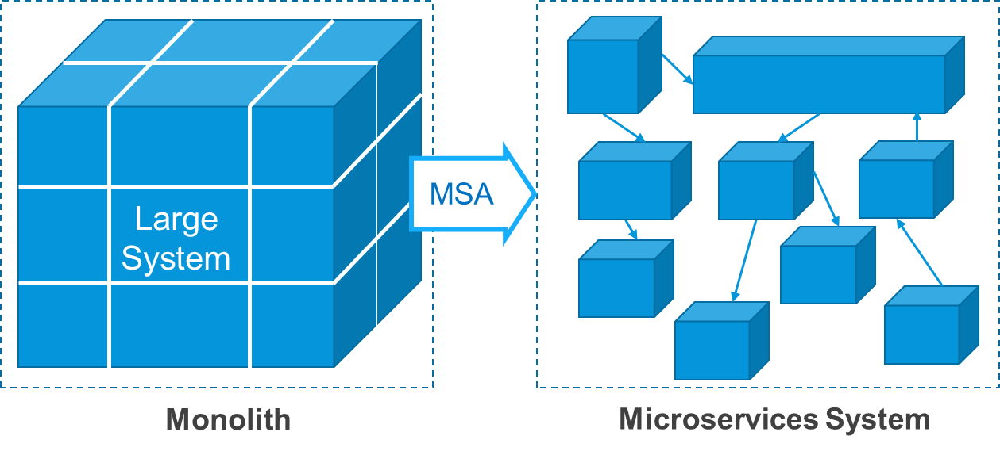
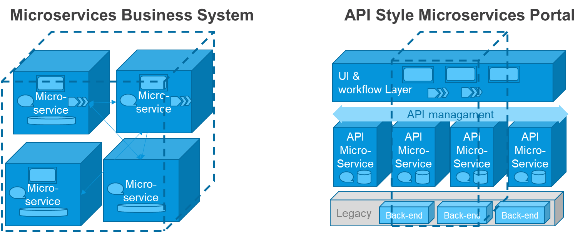

---
title: "Three Microservice Patterns"
parent: "microservices-overview"
menu_order: 2
draft: true
tags: ["microservices"]

There are three basic types of Microservices that may be used in different
situations:

1.  **In Business oriented microservices** that Fowler and Lewis suggest usually
    cover a business function and are autonomous, giving the full advantage of
    the microservices architecture pattern. The service has UX, Logic and Data.

2.  **API oriented microservices** are smaller and request-reply oriented. It is
    closer to SOA layers and are good for e.g. generic functions behind
    web-portals. The service normally has only Logic and Data, the UX is
    externally developed.

3.  **Shared data microservices**, are set of smaller Apps sharing a database,
    which means it is closer to the Monolith pattern, and risks creating one if
    too many Apps use the same database. The service has UX and Logic.

All of these patterns are better than SOA Layers and Monoliths, and all these
patterns are used by Mendix customers in different situations. The most common
version is the one where UX, Logic and GUI are all together, which makes it
easier to control quality and consistency across deployments.

Mendix contains all three layers, so it is easy to provide microservices for any
of these three patterns. That also makes it is easy to ‘*complement’* a service
with the missing part, if that should be required for e.g. administration
purposes:

-   For an API oriented microservice used behind a shared UX layer, it is easy
    to add a business admin UX to manage exceptions and reference data.

-   For a shared DB service, it is easy to add look-up tables for mapping or a
    business data cache into the App DB, since a database is always available.

In the next two sections we look closer at the other two patterns.

Microservices by Lewis and Fowler
---------------------------------

Mendix bases its view on Microservices on the
[definition](https://martinfowler.com/microservices/#what) created by James
Lewis and Martin Fowler from Thoughtworks. They recommend keeping all parts of a
business function together in a deployable container and separated from other
business functions via explicit service contracts:

“*The Microservice architecture style provides an approach to build large
applications as a suite of smaller parts where each microservice:*

-   *Is built around a business capability,*

-   *Runs its own process,*

-   *Communicate via a light weight mechanism,*

-   *Is independently deployable*

-   *by an automated deployment machinery*” \<blue box?\>

It makes the component more self-contained and autonomous, and dependencies are
clear and explicit. In the figure below. The figure below shows how a large
system is being divided in functionally independent pieces that work together,
often as actors in a business process.

-   We split the system in smaller autonomous pieces that work together

-   This we call a Microservices architecture “System” or “Cluster”

-   Each service contains a business function and speaks with other business
    function microservicesattachments/three-microservices-patternsservices or deep-links

Note that the large system has GUI, Logic and Data, and that means that at least
some microservices in the MSA situation will also have a GUI. In fact the split
is functional so most of them will have all three layers to fulfil a business
function.

API style Microservices – Without UX
------------------------------------

Many people associate Microservices with APIs and API gateways, because there
are API management platforms that market those types of microservices. This
school focuses on the “*services*” part of the name and it is closer to a SOA
layered model than the Fowler-Lewis microservices.

API style “microservices” will provide one or more request-reply functions,
usually in REST, that can be used by one or more UX components or
web-applications, usually on the other side of an API management layer to handle
security and access.

The improvement from SOA layered architecture is that these are relatively small
and independent, and should try to fulfil a business function, and they can have
data in them. We go from 4-8 layers with a central ESB in between, to only 3-4
layers using a light-weight API management gateway between microservices and to
the UX layer.

Mendix is used in this way to a great advantage at many places, and a typical
use-case for this is a Marketing oriented customer portal, where some areas are
text and picture oriented information, and some areas are functional, see
*Marketing Portals*.

The figure below shows a typical architecture based on “headless” Microservices.

Since they are small and contain relatively little data, they often expose and
enrich functionality from legacy systems. Simple workflow is usually handled in
the UX layer to the extent that workflow is required.

This pattern is useful in a large enterprise that wants to provide generic
request-reply based services to be used in several channels, e.g. several mobile
Apps and several customer-oriented portals.

This pattern is less efficient for process heavy business applications and
internal business department portals, where often concentrating the
functionality to a Business Oriented microservices cluster is more efficient.

Shared Database Microservices 
------------------------------

In Mendix the consistency between the layers UX – Logic – Data is very
important, and it is part of the model that is created. Mendix Apps on the
Mendix cloud do not share a database because then Apps would be dependent on
each other and it would be hard to guarantee quality and consistency from Dev to
Ops. The developers do not need to know about SQL and about which database is
used.

For most other App building platforms, the Apps are not deployed *with* the
database, but rather they *point* to a database and have various ease of
integration to and from the database. There is often a DBA that sets up a
separate database that developers of different Apps will use.

In that situation the common standard is to share a database between Apps. This
may can be a good pattern when there are a few Apps that act like modules in one
single application. They are still separately deployable which is a benefit, but
of course they all depend on the same database. Deployments of one App will
contain changes to the database, that can affect data other Apps etcetera. I.e.
there is some separation of function, but not as good as for Business Oriented
microservices.

The figure below shows the shared DB pattern where Apps are using and updating
the same database tables, which will gain speed in the short term, but make the
system very hard to maintain in the long term, see also *Why Not Share a
Database?*.

On the right side is a pattern with Business Oriented microservices, sharing
data and functions only via well-defined service calls.

In the definition of Microservices as suggested by Fowler, Lewis and Newman, it
is not recommended to share the same Database for microservices, at least not if
the Apps are directly accessing each-other’s data. The reason is that
dependencies grow in the same way as they would for a Monolith.
