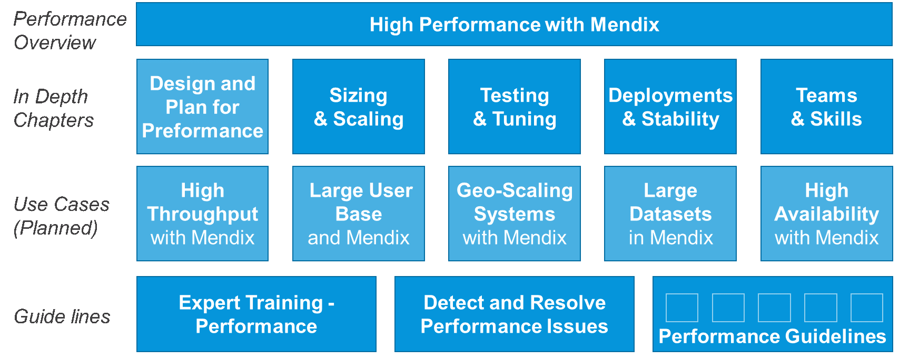
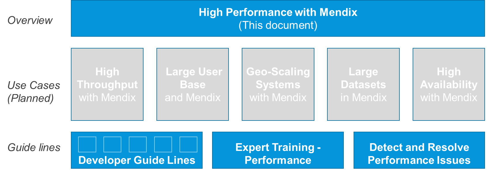

**NEED STAGE 4 REVIEW.**

## 1 Introduction

Mendix is optimized for the easiest and fastest way to develop and maintain apps that perform well under a normal load. In addition, for core systems and high-volume situations, Mendix is an excellent choice for modeling, testing, tuning, and monitoring your solution.

This document goes through the main areas for building high-performance core enterprise systems using the Mendix Platform.

{}
This document is intended for Enterprise Architects, Lead Developers, and senior stakeholders to consider how to achieve the correct stability and performance when using the Mendix Platform for core enterprise systems.
{}

### 1.1 Use Cases for This Overview

These are the typical use cases when this overview will be helpful:

* High throughput processing
* Large amount of concurrent users
* Working on large data sets
* Working on a geographically distributed system
* Requirements for [high availability](https://docs.mendix.com/developerportal/deploy/high-availability)

#### 1.1.1 Positioning, Portfolio Management & Project Planning

This document can be used by Enterprise Architects to create positioning documents or in the work of portfolio planning. It can also be used as a baseline for technology selection and project initiation.

#### 1.1.2 Program or Product Expansion

The document is also relevant for expanding projects or programs via increased functionality, more users, more geographical regions, or significantly increased volume. It is a guide to what additional measures, methods, and skills are recommended for achieving the next level of volume and stability.

#### 1.1.3 Operational Planning

The document can be helpful when sizing, configuring, managing, operating, and maintaining larger Mendix solutions. It can be useful for discussing infrastructure, operational procedures, and testing.

### 1.2 Related Documents

This document is followed by use case-specific guidelines that in turn relate to the developer best practices applicable in the different use cases. 

There is also the Mendix Expert training module [Performance Guidelines](https://gettingstarted.mendixcloud.com/link/module/127/lecture/1031) as well as [How to Detect & Resolve PErformance Issues](https://docs.mendix.com/howto/monitoring-troubleshooting/detect-and-resolve-performance-issues).

## 2 Overview of High Performance

### 2.1 The Right Level of Attention

Mendix is optimized for the easy and fast development and maintenance of apps and microservices that fulfill meaningful business functions. The Mendix modelling best practices enable you to achieve a good snappy performance, especially if you are working on core data in the Mendix app database or using back-end services that perform well to populate screens.

However, in cases when the volume of users or service calls is very high, special recommendations become relevant. Some modelling patterns are preferred, performance testing is required, tuning of the domain model and microflows is recommended, and scaling of infrastructure should be clear and tested.

In other cases, the criticality of the system is very high, which mandates doing performance and redundancy testing, increased monitoring, and planning well-tested failover scenarios.

This table presents an overview of the recommended attention levels required for different apps:

|                                          | Level 1 | Level 2 | Level 3 | Level 4 | Level 5 |
| --- | --- | --- | --- | --- | --- |
| **Tuning & Monitoring Requirement** | No action required | Peer review & best practices | Occasional performance testing & tuning | Mendix Expert does regular performance testing, tuning, monitoring health | Architect does full-scale performance testing & professional monitoring |
| **Criticality of System** | Low | Medium | High | Core | Business critical |
| **Uptime Requirement** | 95% of business hours | 98% of business hours | 99% of business hours | 99% 24/7 | 99.5% 24/7 |
| **Number of Records in the Database** | \< 100k | \< 1m | \< 5m | \< 50m | 500m or more |
| **Number of Concurrent Users** | \< 20 | \< 100 | \< 500 | \< 5k | 200k or more |
| **Number of Service Calls (per Second)** | \< 5 | \< 10 | \< 50 | \< 500 | 2k or more |

### 2.2 Potentially Massive Performance Improvements

Mendix has proven itself in several scenarios with the ability to tune the model where app size matters. These are some examples:

* Handling the throughput of 1000 orders per second in a supply-chain scenario
* Supporting the 20,000 concurrent users on a normal sized retail-oriented app
* Searching within the text of 30 million records within 0.2 seconds in a master data management (MDM) system

These are not absolute limits, but the examples present how much it was required to tune the respective Mendix apps based on business requirements. In some cases, the improvement was in the scale of 100 times better by doing significant tuning.

As a result, the customers could maintain their flexibility with using Mendix while still handling significant performance challenges.

### 2.3 Tuning

Normally, app functionality is built first to make sure it works as the business
wants it to, and then the tuning is started. But it is always good to read Mendix best
practices ahead of any app project.

When performance-tuning a Mendix app, the focus should always be on the highest-volume area or the most critical part of the logic. For example, in a high-volume straight-through processing (STP) app, the highest-volume area or most critical logic should be tuned, but the UI will not need tuning. In an app with a large number of users, the amount of traffic from the GUI to the app server may be minimized.

Some tuning can be done directly by a knowledgeable developer. More professional
tuning requires iterating over full-scale performance tests, tuning, more testing, and
so on, where metrics on execution times, CPU, and database usage are required.

Consider these tuning best pracatices:

* Small apps do not normally need any performance testing or tuning
* For a medium-sized app with some volume, it is a good idea to do peer reviewing and look at the Mendix Expert learning path [Optimize the Performance of Your Apps](https://gettingstarted.mendixcloud.com/link/path/39)
* For high-volume or critical apps, tuning and performance testing should be done at least occasionally, and the focus should be on the critical areas of the app
* When volume and criticality increase even further, a professional level of tuning is recommended, and professional monitoring in production is required
* For the most critical and high-volume apps, the performance testing and tuning need to be professional, so a professional performance expert should regularly assist the project, and the monitoring should be top-class.

### 2.4 Why Not Always Maximize Performance & Stability?

The reason why Mendix does not recommend full performance testing and professional
monitoring for all apps is that these measures add to the cost and time for development, maintenance, changes, and operations.

In some cases, tuning may use Java actions, SQL, and blobbing data. This can improve performance, but it makes maintenance harder and may require higher skill levels for changes and operations.

The most cost-effective way for an organization to operate an app landscape is to approach performance and stability with a conscious knowledge of what is required for each app. Then, you should focus time, investment, and attention on the most critical systems, while leaving other systems lightweight and agile.

## 3 Sizing & Scaling

### 3.1 Initial Sizing 

The other factor is the size of the infrastructure. Sizing an app is similar to the levels of attention in the table above in [The Right Level of Attention](The Right Level of Attention).

In the beginning of an app project, a first size assumption is made. When the functionality is built out and this assumption is tested, the sizing may be adapted and/or tuning be required. Small to medium-sized apps are verified with normal functional testing, while critical apps are tested with professional tools in a production-like environment.

This table presents a basic overview for infrastructure sizing for a single Mendix app instance:

|  | S – M | M – L | L – XL | XL – XXL | XXL – Custom Load Balanced |
| --- | --- | --- | --- | --- | --- |
| **Number of Records in Database** | < 100k | < 1m | < 5m | < 50m | 500m or more |
| **Number of Concurrent Users** | < 20 | < 100 | < 500 | < 5k | 200k or more |
| **Number of Service Calls (per Second)** | < 5 | < 10 | < 50 | < 500 | 2k |

A higher load can be handled with additional measures such as horizontal scaling, geo-scaling, functional scaling, or microservice scaling.

### 3.2 Redundancy for Availability

For more critical systems, users often choose an environment that is larger than the volume requires. This decreases the risk for production disturbances due to volume. But to cope with other issues, uptime can be improved by redundancy.

For example, critical low-volume apps can use small-size environments, with additional app instances behind a load-balancer (LB) to increase availability.

This table illustrates redundancy for system criticality:

|  | Low | Medium | High| Core | Business Critical |
| --- | --- | --- | --- | --- | --- |
| **Support Level** | Gold | Gold | Gold–Platinum | Platinum    | Platinum              |
| **Uptime (in Business Hours)**|  95% | 98% | 99.5% | 99.5% 24/7  | 99.95% 24/7 |
| **Horizontal Scaling** | No | No | Recommended | Yes | Yes |
| **Fallback** | No | No | No | Recommended | Yes |

For very critical systems, a fallback (FB) database is added to cover for unresponsive databases. That database should be in the same availability zone, no more than 5 km away. The rule of thumb is to also add an additional app instance when adding an FB database configuration.

### 3.3 Scaling

Any system may need to scale over time. Performance testing is often done testing at a volume level expected 3–5 years in the future. That ensures the infrastructure can handle growth for the next 2–3 years. A static scaling plan can be made for the years afterwards, and if this involves deploying to the Mendix Cloud, it is very easy to increase the size.

Dynamic scaling is possible using cloud-specific configurations (for example, Beanstalk on AWS and K8S on Azure). Dynamic scaling comes at a cost that makes it useful only in cases where traffic fluctuates a lot and in a non-predictable way.

Static windows with a larger capacity can also be set up (for example, double-capacity over "Black Friday" and Christmas). This is cheaper than dynamic scaling and can also be used in a non-standard Mendix setup.

In general, cloud deployment was supposed to enable paying for resources only when needed, but the standard AWS pricelist promotes stable long-term contracts. Accordingly, this is the way Mendix operates by default, and for most cases, this is the most cost-effective option.

### 3.4 Custom Sizing 

There are some situations where very specific scaling is needed. A custom infrastructure package can be required to optimize on cost and performance. For example, if you are running an MDM system with little user interaction but a huge amount of data, a normal-sized cloud environment can be used with additional database space.

Another example is an external website with relatively lightweight functionality but many concurrent users. Then, a normal-sized cloud database server may be possible as you scale out to handle more and larger app instances and optimize the app to minimize traffic to the database.

For non-global Mendix apps, the limiting factor is often the processing in the database. So, the size of Mendix environments relates to how large the database node is. Often, scaling app instances only makes a noticeable difference up to ~4 app nodes. After that, special tuning is needed, or the environment needs to be sized up with a larger database node.

Another limiting factor can be the traffic from the browser to the app instance. This can be particularly noticeable for global apps, since Mendix out-of-the-box needs the app server quite a lot while navigating functionality. Some tuning can be made here, but another attractive option is to scale geographically..

### 3.5 Geo Scaling

For global and (often) customer-facing apps, having a snappy user interaction is critical. However, the geographical distance from the browser to the app instance serving the GUI functionality can be so large that it adds a noticeable lag. From Asia to the EU, this could be anywhere between 0.2–1.0 seconds, depending on the network and other factors.

The recommended scaling in this case is a geo-scaled instance running a regional install on each continent (for example, EU, US, Asia, South America, and often China).

In many cases, a CDN and DNS resolution via Akamai, for example, is in front and the closest instance is used. Naturally, this option may require additional functionality to synchronize any data that is needed in more than one geo-location app.

In some cases, a separate URL is acceptable. Users will then use a regional app that is 90% the same as the other instances. This also helps to eliminate risks from deployments and allows for easier regional specialization and localization.

### 3.6 Functional Scaling 

A way to manage risky and high-volume situations is functional scaling. If there is a reasonable functional separation between different areas, one can deploy the same app several times for each functional area so that they run separately. That will both divide the load and decrease the risk of catastrophic failure.

An example here is a supply-chain scenario with a large set of distribution centers running the same functionality but on different data (for example, only 10% of the orders go to one app). This scaling also allows for phased go-lives, which helps to additionally reduced risk.

### 3.7 Microservice Architecture 

Another good way to manage scale is to divide processing into more components. One can build a core enterprise system as a set of separate functional microservices that cooperate and can be scaled separately. This splits the load and allows for optimizing the size per functional area.

A good microservice architecture improves on agility, ease of deployments, and separation of concerns. This makes it a very attractive way to build large systems.

An example here is a dashboard app use as a landing page. Users log in via SSO, master data is imported and distributed, and workflows can be managed while each specific phase of the business process gets another specific app. 

## 4 Performance Testing & Tuning

### 4.1 Test Levels

Testing is a time-consuming task and it is important to do the right level of testing for each situation so that you are not wasting time and money and can instead focus on where the testing is really needed.

For small apps where the volume is low, a developer can run though functional testing in less than an hour. For medium-sized and large apps where the volume should also be tested, you could decide to do one performance test only before the first go-live.

For the most critical and high-volume apps, you can run an entire series of tests, and the product-release cycle will include a sizable performance testing and tuning period before the planned go-live.

This table presents the recommended tests for various scenarios:

|  | Functional Test | Functional Test | Occasional Performance Testing | Professional Load Test | Architecture for Performance Professional Load Test |Occasional Stress Test & Soak Test | Stress Test | Soak Test |
| ---- | ---- | ---- | ---- | ---- | ---- | ---- | ---- | ---- |
| **Number of Records in DB** | \< 100k | \< 1m | \< 5m | \< 50m | 500m or more | ? | ? | ? |
| **Number of Concurrent Users** | \< 20 | \< 100 | \< 500 | \< 5k | 200k or more | ? |  ? | ? |
| **Number of Service Calls (per Second)** | \< 5 | \< 10 | \< 50 | \< 500 | 2k or more | ? | ? | ? |

{}[**FINISH ADDING TABLE INFO**]{}

### 4.2 Testing & Tuning

When it is determined that separated performance testing is desired, follow these steps:

1.  Determine which situation to test against, including the following parameters: 
	* Which load
	* Which amount of data in the database
	* Which response times
2.  Determine the preliminary infrastructure sizing to test against, or test against more than one configuration to find the most suitable setup.
3.  Decide which types of testing are required (for details, see [Types of Performance Testing](#types-testing) below).
4.  Select the tooling for testing and monitoring:
	* Higher volume and criticality requires better monitoring
	* For more frequent testing, more professional tooling makes sense
5.  Plan how to reproduce the real-time situation as well as possible.
6.  Iterate over performance testing, analysis, and tuning: 
  a. Perform the various performance tests 
  b. Analyze the results, looking at both response-times and infra usage. 
  c. Tune the system (which often involves some limited re-modelling of the app). 
7.  When the tuning is at the right level for maintainability and use, there is a final reassessment of the sizing and scaling of the infrastructure.

### 4.3 The Right Tuning

There is a balance between tuning, sizing, and maintainability.

Easy tuning options can include the following:

* Using indexes for frequently queried tables
* Storing some data as unstructured data
* Limiting the number of associations used in the database
* Improving microflows and UX design

More advanced tuning may include SQL and Java, which affects maintainability. In very high-volume cases and where functionality is stable, this makes sense. However, it should not be used everywhere, as it may be better to size up the infrastructure.

Testing different options as part of the testing and tuning iterations helps to find the best ways forward.

### 4.4 Types of Performance Testing {#types-testing}

* **Functional testing** – This is regular testing that includes, for example, unit testing, GUI testing, service testing, and UAT testing with end-users. For small apps, testers can see immediately if there is an issue. Some tuning can be done to fix problems, and retesting can be done afterwards.
* **Load testing** – This type of testing should give attention to one area of a specific app. This could be a large number of users (often using LoadRunner) or a large amount of service calls (using, for example, Soap UI, JMeter, or any other tool). A defined load and response time must be verified, and if it is not met, tuning, scaling, or both will be required. Nodes should be around 70% utilized at the load level being tested.
* **Stress Testing** – This testing increases the volume to a level where the system crashes or slows down unacceptably. Stress tests often show weaknesses in the system and enable tuners to remove the weaknesses, after which the stress test is done again and other issues are found. This testing is important for more critical apps. It informs the team about *where* the system can break so that good operations processes can be set up to manage failures.
* **Soak Testing** – This is a way to run the full production load through the system over a longer time (for example, 2–3 weeks). This fits the STP scenario and verifies how the system reacts over time, catching memory leaks and other problems. It also often finds functional edge cases, because such a large set of data is run through the system.
* **Recovery Testing** – This type tests how the app recovers from various crashes. Failover and fallback scenarios are tested. App nodes and/or database servers are taken down, and the expected infrastructure redundancy and/or procedures are verified. In addition, rolling back deployments, restoring from a database backup, and the other potential manual steps required when recovering from a system or deployment failure are tested. The intention is to minimize the time and effects of unplanned downtime.

### 4.5 Test Automation

Test automation is another stability enhancer, because the automation never tires of verifying the same thing over and over. This is more important for large and critical systems.

Almost all regression testing can be automated. If set up with performance KPIs, it can also help developers identify when they made a change that drastically reduced performance by comparing execution times between nightly runs.

This table presents test automation recommendations:

|                                            | Not Required | Optional | Functional with Performance KPIs | Functional with Performance KPIs | Functional & Performance Test |
| --- | --- | --- | --- | --- | --- |
| **Functional Size** | Very small | Small | Medium | Large | Very large |
| **Criticality of System** | Low | Medium | High | Core | Business critical |
| **Uptime Requirement (in Business Hours)** | 95% | 98% | 99.5% | 99.5% 24/7 | 99.95% 24/7 |

Setting up and maintaining test automation takes time. Automating functional tests is said to take 30–50% of development time, while saving ~90% of the time for regression test.

Test automation makes a lot of sense for large apps with a lot of functionality and continued new development. It makes less sense for small apps that are developed in 2–3 months by one single developer who can retest all of the app's functions in a couple of hours.

Professional performance testing can also be automated (for example, via JMeter). Such automation provides a nightly view on the performance of key parts of the functionality as they evolve during development; the areas we know from manual performance testing are critical

{}[**HANGING CLAUSE AFTER SEMI-COLON IN LAST SENTENCE; PLEASE COMPLETE SENTENCE OR DELETE**]{}

However, for critical systems that need regular performance testing and tuning, automated testing will just shorten the performance test cycle. Manually-run performance, stress, and load tests are still required, and the tester should be a technical expert that can read the metrics data from the tests. 

The performance testing that should be automated depends on the character and functionality of the app or microservice system. Functional and technical analysis will identify which areas are most efficient to automate first.

### 4.6 Different Strategies for Testing, Tuning & Sizing

Many strategies can be applied for performance and stability, and not one size
fits all. For example:

* A bank may be so focused on stability that it requires performance testing and automated testing for all apps, despite the extra costs
* One customer may prefer to buy more infrastructure to save on performance testing
* Another customer may save on infrastructure by investing in performance testing and tuning
* And another customer may do stress tests to see where the apps break and then size based on that

## 5 Deployments & Stability

### 5.1 High Availability 

For high-availability solutions, the focus should be to predict, plan, and manage all the risks for unexpected failures, including incidents during deployments.

This is where the most significant business impact happens. Because it is unplanned, it often happens when the load is high, and the recovery can take some time.

Stress tests help with identifying breaking points. Risk analysis and contingency planning should be done regularly for systems that require high availability. At first, having a contingency plan may be enough, while for the most critical apps, contingency and recovery plans should be tested regularly and improved. The more critical the system is, the more often recovery testing is performed.

For microservice architectures, health checks and administrative pages are implemented to assist operations teams. Fault tolerance around deep-links and service calls should provide  good error messages. Log integration is recommended for quickly analyzing issues that go across apps.

For more critical systems, a more professional level of monitoring and alarms should be added, and the process link to recovery actions should be tight. Mendix has great integration with, for example, DataDog for monitoring, trend analysis, and alarms.

### 5.2 Phased Go-Lives & Deployments 

It can be very hard to fix a problem when a tremendous amount of traffic is hitting the system at the same time. It is well known that large providers like Netflix, Facebook, and LinkedIn go live in a phased approach, meaning, they do not provide the entire world with new functionality in one single go-live.

A phased go-live is often a great idea for both very critical and high-volume situations, simply because it reduces risks and allows for fixing issues in a controlled environment. A phased go-live is not for all situations with high volume, but the following scenarios should be considered:

* **Internal go-live** – for users in the same company
* **Friendly customers go-live** – for a select list of customers
* **Regional go-live** – for a region or a functional part
* **Full go-live** – this could also be staged

### 5.3 Zero-Impact Deployments

There is a trade-off between risk in deployments, effort in preparing for them, and downtime during deployments. Deployments should be controlled, monitored, managed, and done in periods of less traffic so as to ensure minimal risk and business impact.

A standard Mendix app takes ~5 minutes to deploy. If you deploy frequently into production every 5 weeks, you have a ~0.0001% controlled and selected downtime, which in almost all cases will have zero business impact. 

Having zero-downtime deployments for an app server is easy in any technology when there are no destructive changes to the data model. Zero downtime when the release includes database changes requires additional configuration and actions independent of the selected technology. This has a cost and a risk associated, so it is recommended only in very specific instances.

Mendix Cloud enables avoiding this risk by promoting controlled deployments. In addition, customers have implemented zero-downtime deployments with Mendix on Kubernetes. For microservice systems and more critical systems, it is also common to automate the deployment with configuration and do health checks.

### 5.4 More Monitoring for More Critical Apps

To manage a solution and handle issues in production, there are levels of monitoring and support required. For critical apps, combining local functional monitoring and support is recommended with more professional central monitoring.

A local DevOps team will be closer to the solution and the users, so they can fix functional and simple technical problems. However, they may not be able to handle volume-related trend analysis and infra-related problems.

For critical and high-volume systems, there is a good reason to introduce a more professional monitoring framework. Professional monitoring can handle larger amounts of monitoring data over time. This is helpful for raising alarms in high-volume situations in order to do efficient root-cause analysis and to identify trends so that, for example, scaling can be adapted well before it is an issue.

This table presents operations recommendations:

|  | Local DevOps Monitoring & Alarms | Local DevOps Monitoring & Alarms | Add Central Monitoring | Add Recovery Testing | Frequent Recovery Testing |
| --- | --- | --- | --- | --- | --- |
| **Functional Size** | Very Small | Small | Medium | Large | Very Large |
| **Criticality of System** | Low | Medium | High | Core | Business Critical |
| **Uptime Requirement (in Business Hours)** | 95% | 98% | 99.5% | 99.5% 24/7 | 99.95% 24/7 |

## 6 Team & Skills

### 6.1 DevOps Team

The team that does the development, testing, tuning, and deploying of the apps should be adapted to the volume and criticality of the system to be developed.

Small apps can be created, tested and deployed on the Mendix Cloud by a [citizen developer](https://www.mendix.com/evaluation-guide/evaluation-learning/skills-training#1-what-types-of-users-can-build-apps-with-mendix#personas) without significant technical skills. But as the volume, complexity, and criticality of the apps increases, there is a larger need for more technical resources on board to initially design and review apps in order to make them better and faster.

Eventually, projects for critical, core, and high-volume apps may have several technical experts on board as well as a professional performance tuner available for every release to do the testing and tuning correctly.

This table presents recommendations for your DevOps teams:

| | Citizen Developer | Citizen Developer + Business Developer Design & Review | Citizen Developer + Business Developer + IT Developer Review & Tune | Citizen Developer + Business Developer + Performance Expert Test, Review & Tune | Performance Expert Test, Review & Tune for Every Release |
| --- | --- | --- | --- | --- | --- |
| **Functional Size** | Small app | Medium app | Large app | Complex app | XL core system |
| **Criticality of System** | Low | Medium | High | Core | Business-critical |
| **Uptime Requirement (in Business Hours)** | 95% | 98% | 99% | 99% 24/7 | 99.5% 24/7 |
| **Number of Records in Database** | < 500k | < 1m | < 5m | < 50m | 500m or more |
| **Number of Concurrent Users** | < 100 | < 500 | < 1k | < 5k | 200k or more |
| **Number of Service Calls (per Second)** | < 10 | < 50 | < 100 | < 1000 | 2k or more |

### 6.2 Professional Ops Team & CI/CD Team

In scenarios in which your solutions are becoming larger and more critical and/or your company has 100s or even 1000s of apps, investing in central professional operations and CI/CD automation becomes obvious.

A professional Ops team with professional tooling that owns the alarms, professional monitoring, and central log-integration is highly recommended for large microservice landscapes.

A professional CI/CD team will enable auto-testing and controlled repeatable deployments, limiting risk and improving availability, which is important for large and critical systems.

At the same time, it is important to be smart with what is required for monitoring and automation so that centralized Ops and CI/CD teams do not stifle the flexibility and agility of DevOps teams that deliver to the business. Not every app needs the same level of monitoring and automation, because then agility is reduced and costs are increased where that is not necessary.

## 7 Summary

In summary, the Mendix platform can be used for almost all the situations found in the business application landscape of a typical enterprise.

It is all a matter of the correct attention being paid to the skills of the team in addition to good app modelling, tuning, performance testing, sizing, scaling, and operational monitoring and following procedures.

Mendix will often not play well in the areas of business intelligence, analytics, and data warehousing, and there are better tools for content management, for example. There are also many great SaaS tools out there that make sense when the functionality is standard cross-industry and very little customization is needed.

But for almost all other cases, Mendix is a good choice for its seamless development and operational experience, speed of development, and ease-of-use. 

The customer can decide the system borders, align with their own processes, and make smart and functional microservices that fit their functional and technical needs. As this document shows, these microservices can adapt to the volume and criticality of the system.
