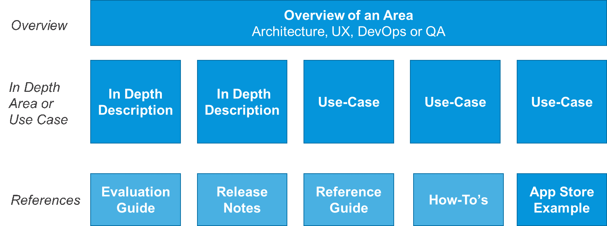

{}[**COULD USE 1 MORE DIAGRAM**]{}

## 1 Introduction 

In the Mendix documentation landscape, the [Mendix Evaluation Guide](https://www.mendix.com/evaluation-guide/) provides a great overview of all the possibilities and features in the Mendix Platform, the [Mendix Reference Guide](/refguide/) explains the product in detail, and the [Mendix How-to's](/howto/) provide developers with instructions on how to do things in Mendix.

With the **Best Practices** documentation, we want to share information on how to approach typical challenges and solve specific use cases. We will be looking at different solution options that may be valid under certain circumstances. 

This documentation is written by Mendix employees, and sometimes it refers to real product examples available in the [Mendix App Store](https://appstore.home.mendix.com).

### 1.1 About Best Practices

Best Practices will eventually be valuable for all the people that participate in the application lifecycle, from scoping and estimation to maintenance in production.

{}[**UPDATE DIAGRAM**]{}

These best practices do not provide complete solutions. Instead, they provide key parts of solutions that can be used for reference and sometimes partly copied. They should always be adapted to the specific situation of the your implementation.

### 1.2 Best Practice Areas

These best practices will be expanded on an ongoing basis to cover the following areas:

* [Architecture](../architecture/index)
	* [Integration](../architecture/integration/integration-overview)
	* [Performance](../architecture/performance/performance-overview)
	* Microservices
	* Security
	* CI/CD & test automation
	* Monitoring & robustness
* UX & design thinking
* DevOps & Agile
* Quality assurance

### 1.3 Structure of Best Practices

For each category and sub-category of best practices, there will be an overview that covers the breadth of the area discussed. This will be followed by a number of specific areas or use cases that are covered more in detail. These will refer to more detailed Mendix documentation that explains the product. The best practices will sometimes include example implementations in the App Store.

{}[**UPDATE DIAGRAM; EXPLAIN DIAGRAM**]{}

## 3 How Are the Best Practices Created?

Mendix organizes subject matter experts from different parts of the organization into guilds. Guild members meet frequently to shares problems and ideas, research different areas, and write guidelines and best practices around a subject area.

At this point in Mendix, there is an Architecture Guild and a UX Guild, and there is a plan for a DevOps Guild and a Quality Assurance Guild.

Members of these guilds own the content of the best practices. They also own the Best Practices items in the App Store, which are examples of the best ways to implement things for certain use cases.

{}[**ADD APP STORE LINK WHEN AVAILABLE**]{}

## 4 How Can These Best Practices Help Me?

The overview documents should quickly bring you up to speed with the most important considerations for a particular subject. These overviews are intended for Architects, Managers, Lead Developers, and other senior stakeholders.

The detailed descriptions and use cases are intended for experienced Mendix users who have already worked in a respective area. These documents will list different ways to solve a case and suggest in detail the best ways to implement them.

Some use cases will refer to examples in the App Store. These App Store items are not finished products, instead serving as small reference implementations that solve a single business problem. You can view these as examples for picking up ideas, or you can copy parts of them as starting points for building robust solutions with good error handling.

## 5 The Mendix Community & Knowledge Sharing

There is a great community around Mendix that constantly shares ideas, best practices, and solutions via the [Buzz](/developerportal/collaborate/buzz), [Meetups](https://www.meetup.com/Mendix-Netherlands/), partner presentations, and the [Mendix Forum](https://forum.mendixcloud.com).

Partners, customers, and other developers also share a large amount of valuable Mendix modules and components via the [Mendix App Store](https://appstore.home.mendix.com/).

This culture of sharing and learning is at the heart of what Mendix believes in: helping each other delivery the best possible value to customers.

These best practices are a valuable addition to this activity, as the information and implementations will come directly from Mendix experts in their respective guilds.

## 6 Can I Create Best Practices?

As part of the guild culture, Mendix stimulates creative discussions that lead teams and stakeholderss forward.

As best practices are published, we hope to get feedback and ideas related to the material. If the feedback case is strong and time allows, there will be updates and improvements done by the topic authors.

We will reserve the App Store **Best Practices** category for examples that have been created inside Mendix. This means that you know these App Store items are coming directly  from Mendix and they will be kept up to date.

{}[**ACCURATE NAME OF APP STORE SECTION?**]{}

## 7 What's Next?

Creating thorough documents and examples takes time, and the best practices will be built up gradually over time.

We hope these best practices will complement the existing documentation. We will try to avoid overlap by referring to existing documentation where possible.
