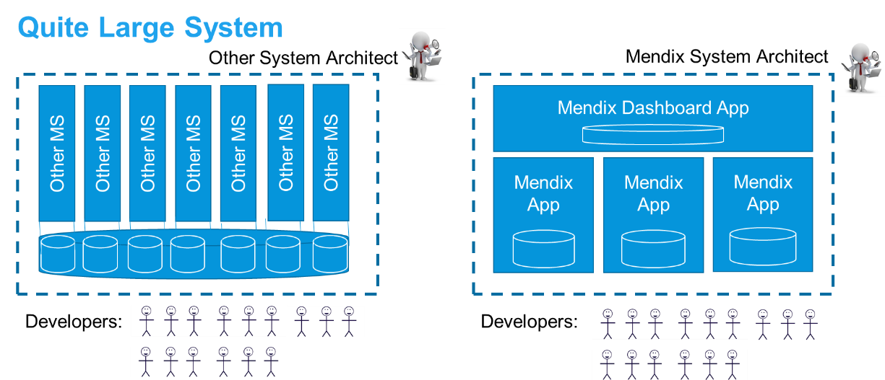

## 1 Introduction

This best practice page will look at the signs of poor microservices architecture as well as compare how Mendix microservices relate to Java and .NET microservices.

## 2 Signs of Poor Microservice Architecture

A poor microservice architecture can be characterized by the following signs:

* The microservices are too small and several are deployed together every release
* The business processes ping-pong back and forth between apps
* The exact same data is updated in many places, which causes issues
* The integration is complex and works poorly (or has poor error handling)
* There are still a lot of dependencies between teams building separate apps

When any one of these signs is identified, it is worth looking at both the apps and the microservices created as well as the integration patterns used.

## 3 Java Microservices

For Java-oriented architectures, it makes sense to build separate small services using the same database with an Angular UX layer on top of that, for example. Holding a business feature together across these layers is hard and requires management, and as the system grows, so do dependencies. A very good architect is required to make such Java-oriented architectures work well.

However, in Mendix, you only need to find the best functional pieces, and the UX, logic, and data are kept together by the Mendix Platform.

## 4 Other Low-Code or 3GL

In .NET and some other low-code platforms, the standard process is to build apps that share a database. However, in Mendix, the same pattern is built using separate modules inside the app. The same database is used, but the team can split things later when it is clear what the most important thing to separate out is.

Both patterns in the diagram below can be accomplished in a good way, with minimal dependencies between modules and apps. But both patterns can also be done in a bad way, with too much unclear cross-usage of data.

Mendix has the advantage in this scenario, because the integrity of how data is used is within the app model and is checked by the platform. When you change something in one Mendix module, the platform will immediately verify to see if that change works with the other modules.

As the scope grows, the other styles of microservices tend to pursue building more apps on top of the same database. This eventually creates a [monolith](microservices-overview#monolith).

By contrast, Mendix splits up the app into functional parts with separate data that is owned and managed by each app, as visualized in the diagram below. Mendix forces the separation of data, and access to each other’s data occurs via services and clear contracts.

This aligns with the purpose of microservices, as developers are encouraged to think carefully about integration. Over time, this helps to make large solutions manageable yet still flexible.

## 5 Why Not Share a Database?

The diagram below presents an example of when too many apps are sharing the same database. Updating one single table will affect many of the apps in this system, and they all must change at once. Making a change that suits all these functions may be difficult.

From an infrastructure point of view, you can share a database between microservices, have separate schemas, and try to only cross-use the data from other services via explicit service calls. But the problems with shared databases will become apparent over years of small fixes and improvements, as such changes will almost always be “time-critical.” Development teams will be asked by stakeholders to take the shortest route, or they will just want to finish their work quickly.

Generally, if developers *can* access the data that belongs to another function directly, they typically *will*, because that will be easiest. Eventually, this will lead to undesired dependencies. Five or ten years later, people will hardly want to touch the system, which by then will have become monolithic.

Therefore, having a separate database per microservice—as Mendix always provides—is recommended. A separate database per microservice is also ideal for backup-and-restore operations. In addition, having a clear and easy restore procedure is good for availability. There are even more reasons for this recommendation, which are described below.

## 6 Good Dependencies

Since you cannot remove dependencies, you should try to implement as few of them as possible from the start. In addition, you should try to make necessary dependencies as simple as possible, which will lead to maximum team and component autonomy.

The larger the system becomes, the more important it is to make functional components that have clear business-related dependencies. When a business function is so large that you need to break it up into a microservices cluster, you should consider the integrity of data between the apps. The best practice is that each data field is updated in only one place.

For an example sceario, a support app may copy 15 customer fields from the customer master app when a subscription starts and then add another 5 support-specific fields. Updating the 5 support fields impacts nobody else and requires no integration. But if the customer calls the support desk to update one of the 15 shared fields, the update needs to be cleared with the customer master before committed, which is a necessary and minimal business dependency.

In the scenario above, there will thus be an overlap in data. You must allow for the copying of data. But whenever possible, one type of business event should be owned by only one app. Often the split handles different phases of the business process, which means that one type of business event usually happens in one single app.

## 7 Mixing Technologies

{}[**NOT CLEAR HOW "take away" IS USED BELOW - PLEASE CLARIFY AND REWRITE**]{}

Even as Mendix is really good for most microservice use cases, take away DWH, CMS, and central ESB patterns, there will always be a mix of technologies (and in some cases a Java microservice) that may be preferred over a Mendix microservice. Such a preference may occur in a scenario, for example, where you have hefty mathematical calculations that can be expressed as a service.

Being able to mix technologies is another stated advantage of microservices. However, the best practice is to not over-do this,  due to the fact that every deployment pipeline has to be maintained.
