## 1 Introduction

The [Mendix App Store](https://appstore.home.mendix.com/index3.html) is a vibrant marketplace containing complete sample apps that can be used right away as well as various add-ons (such as connectors, widgets, and modules) that can be used to build custom apps more quickly. In the App Store, you can browse all the content, get what you need, and share the content you have created.

This document describes all the different sections of the App Store.

## 2 App Store Home Page

### 2.1 Categories

The home page of the Mendix App Store presents various content categories:

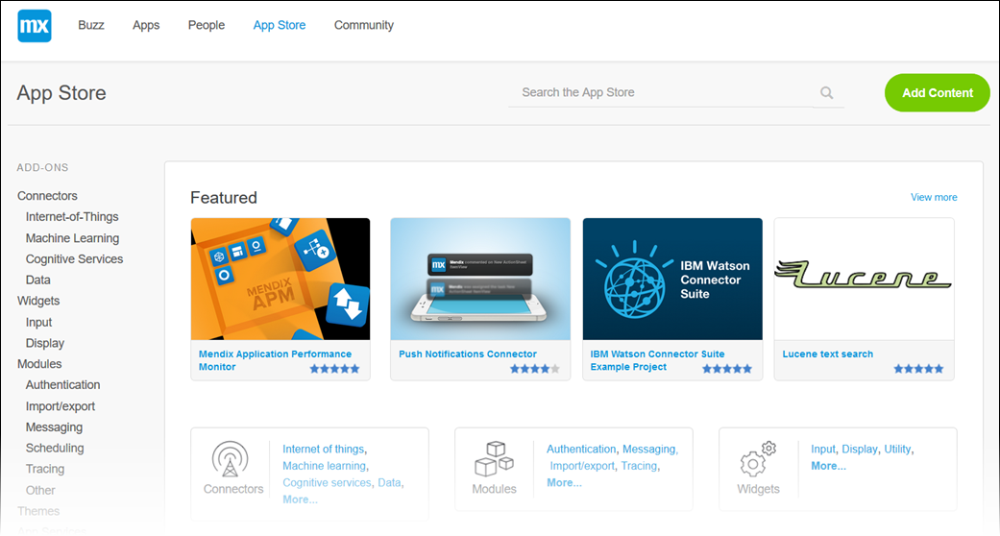

Category | Description
--- | ---
**Featured** | Presents some of the most important and useful App Store content as determined by Mendix (think of it as a "staff picks" section).
**Connectors**, **Modules**, **Widgets** | These are some of the add-on categories and sub-categories (for example, Internet of things and Authentication).
**New content** | Lists the most recent content uploaded to the App Store.
**Recent updates** | Lists the most recently updated App Store content.
**Most popular** | Lists the App Store content that has been downloaded the most in the past seven days.
**Reviews** | Lists the most recent reviews of App Store content along with the author and date of the review. Clicking the name of the review author will bring you to his or her Community Profile. Clicking the title of the content will allow you to see the details of what was reviewed.
**Top App Store contributors** | Lists the top 10 App Store contributors of the last 30 days. Clicking the name of the developer will bring you to his or her Community Profile. Clicking **View full leaderboard** will take you to the leaderboard site, where you can learn more about the Mendix Community point and badge system.

To see a detail page for each category, click **View more** (or **View full leaderboard**).

### 2.2 Sidebar Menu

The App Store sidebar menu lists all the pages that you can browse for content.

For details on add-ons, see [Add-On Details Page](#AddonDetailsPage).

You can also access [My App Store](https://appstore.home.mendix.com/link/myappstore/), the [Modeler](https://appstore.home.mendix.com/link/modelers/) page, the **Solutions** page, and the **Partners** page.

## 3 Add-On Details Page

Clicking an App Store item in a menu will bring you to the content item's details page. The details page presents the sections described below.

### 3.1 Add-On Details Section

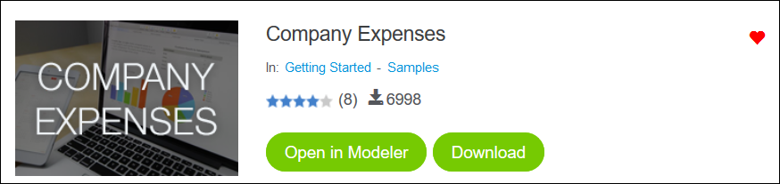

The top of the information page for each add-on presents the following item details:

* The **Name** and **Category** of the item
* The review average (in stars) and the number of reviews
* The number of times the item has been downloaded
* A heart for favoriting the item (so it will appear in your list of favorites on the [My App Store tab](#MyAppStore))
* The following buttons (depending on the type of item and what the developer added to share):
    * **Preview** – click this to preview more information or a demo about the content
        * This is only available if the developer has included a demo URL when sharing the content (for details on sharing content, see [How to Share App Store Content](share-app-store-content))
    * **Open in Modeler** – click this to open the content directly in the Desktop Modeler
        * This is only available for **Theme starting points** (available on the Getting Started tab)
    * **Download** – click this to download the content
        * This is only available for content that has a file attached (meaning, all shared  Desktop Modeler content, but not promotions; for details on sharing  Desktop Modeler content, see [How to Share App Store Content](share-app-store-content))
        * For details on how to import downloaded App Store content into the Desktop Modeler, see [How to Import and Export Objects](/howto6/importing-and-exporting-objects)
        * Please note that the best practice is to download content from the App Store that is accessible in the  Desktop Modeler, because it then downloads directly into the  Desktop Modeler (for details, see [How to Use App Store Content in the  Desktop Modeler](use-app-store-content-in-the-modeler))

### 3.2 Add-On Details Tabs

The details page for each add-on and app presents the following item information tabs:

* The **Overview** tab, with the following sections:
    * **Description** – a description of the item
    * **Screenshots** – screenshots of the item
    * **User Reviews** – user reviews of the item
        * To leave a review for the item, click **Add Review** — a section will open up where you can add text, rate the content, and submit the review (your reviews will be listed on the [My App Store tab](#MyAppStore))

    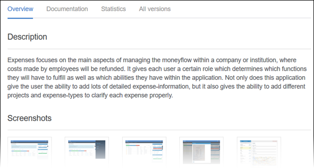

* The **Documentation** tab, which can include sections such as **Description**, **Typical usage scenario**, **Features and limitations**, **Depdencies**, **Installation**, **Configuration**, **Known bugs**, and **Frequently Asked Questions**:

    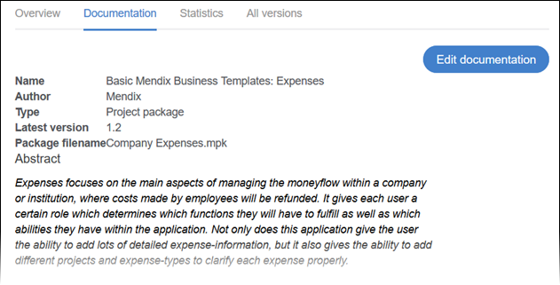

    * Clicking **Edit documentation** will open up a text editor in which you can edit the App Store item's documentation

* The **Statistics** tab, which charts the downloads of the item over time:

    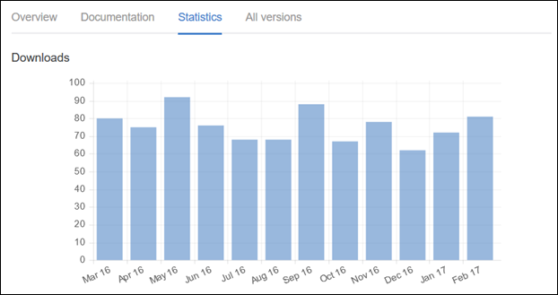

* The **All versions** tab, which lists all the versions (updates) of the item:

    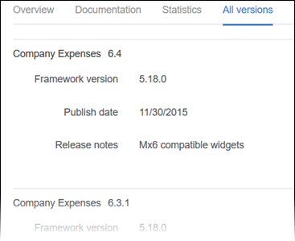

### 3.3 Additional Info Section

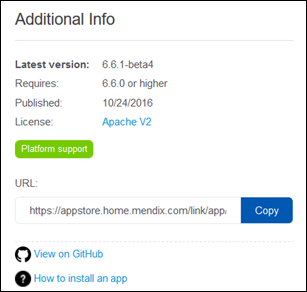

In the **Additional Info** section, you can see the following information (depending the type of content):

* The **Latest version** number of the item
* The  Desktop Modeler version that the item **Requires** to work
* When the item was **Published**
* The type of **License** for the item
* The type of support Mendix offers for the item
    * For details on support, see [App Store Content Support](app-store-content-support) (clicking the support type will also take you to this document)
* The **URL** for the item page that you can copy and share
* A **View on GitHub** link, which will take you to the GitHub source files of the content
* A link to the documentation on how to install App Store content

### 3.4 Developer Info Section

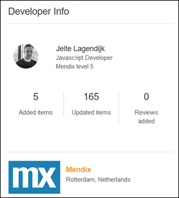

In the **Developer Info** section, you can see the following information:

* The name, job title, and Mendix level of the App Store content developer
    * Clicking the developer name will bring you to his or her Community Profile
* The numbers for **Added items**, **Updated items**, and **Reviews added** in the Mendix App Store
* The company for which the developer works
    * Clicking the company name will bring you to the company's Partner Profile

### 3.5 Compatability Section

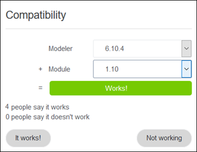

In the **Compatability** section, you can leave feedback on the compatability of the item. To leave feedback, follow these steps:

1. Select the **Modeler** version on which you are using the item from the drop-down menu.
2. Select the **Module**, **Widget**, or **Project** item version you are using from the drop-down menu.
3. Click **It works!** or **Not working** to describe how the item works on your system.

Based on the responses from multiple users, the following compatability summaries are shown:

* **Works!** – this combination of versions works for this item!
* **Not working** – this combination of versions does not work for this item
* **Insufficient information...** – not enough people have responded yet for this combination of versions for this item

For further information on the content compatibility, you can see how many **people say it works** and how many **people say it doesn't work**.

## 4 Other Pages

### 4.1 My App Store

The **My App Store** page presents all of your App Store activity:

* Your numbers for **PUBLISHED CONTENT** and **SUBMITTED REVIEWS**
* **Notifications** on content you favorited
* Your content **Favorites**

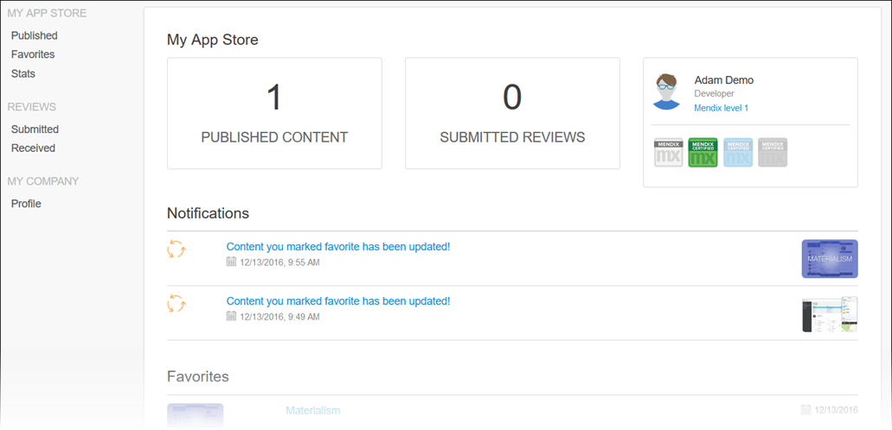

The **MY APP STORE** section of the sidebar menu contains the following options:

* **Published** – click this to see the content you have published as well as the content your company has published on the **Published content** page
    * On the **Published by me** tab, you can see the last version of the content you published
        * Click **Manage** to edit the current draft version, create a new draft version (for more information, see [How to Share App Store Content](share-app-store-content)), or unpublish content
    * On the **Published by my company** tab, you can see all of the content published by your company
        * Click **Manage** to edit content, create a new draft version (for more information, see [How to Share App Store Content](share-app-store-content)), or unpublish the content version you had published (if you are an organization administrator, you can unpublish any content)
* **Favorites** – click this to see the content you have favorited
* **Stats** – click this to see the content that has been downloaded the most in the previous month on the **Downloads overview** page
    * Clicking specific App Store content on this page will show you a **Downloads per month** graph as well as **User Reviews**

The **REVIEWS** section of the sidebar menu contains the following options:

* **Submitted** – click this to see the reviews that you have submitted as well as the reviews your company has submitted
* **Received** – click this to see the reviews that your content has received as well as the reviews that your company's content has received

The **MY COMPANY** section of the sidebar menu contains the following options:

* **Profile** – click this to see the profile of your company (the same profile that appears on the [Partners Tab](#PartnersTab))

### 4.2 Modeler

On the **Modeler** page, you can download any version of the  Desktop Modeler you need by clicking  **Download** for the latest release or the donwload icon for a specific older release:

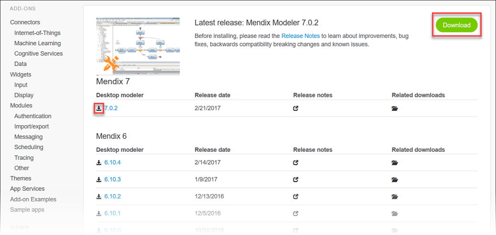

Clicking the **Release notes** icon will open the [ Desktop Modeler release notes](/releasenotes/desktop-modeler/) for that particular version.

Clicking the **Related downloads** option will open a page with information relating to that  Desktop Modeler version.

### 4.3 Solutions

The **Solutions** page lists off-the-shelf products that are available for reference:

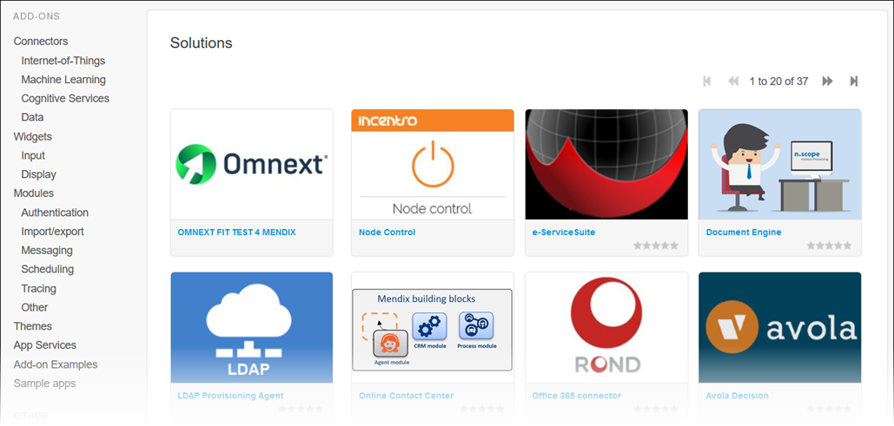

Hovering your mouse pointer over a solution tile will bring up a summary of the solution:

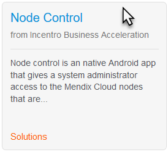

Solutions are not available for download. However, they contain a details section, **Overview** and **Documentation** tabs, and an **Additional info** section. For more information on these sections, see [Add-On Details Page](#AddonDetailsPage).

### 4.4 Partners

The **Partners** page lists selected App Store partner companies:

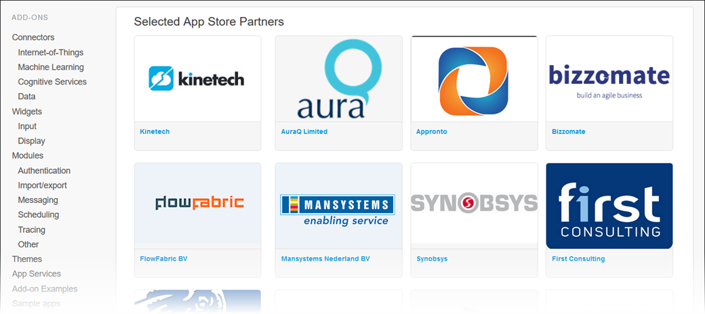

Hovering your mouse pointer over a partner tile will bring up a summary of the company:

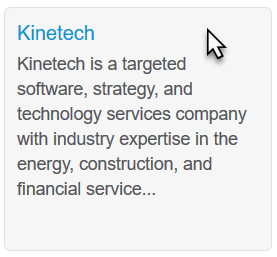

Clicking the partner name will bring you to the partner's App Store details page:

On the **Apps & Add-ons** tab at the bottom of the partner details page, you can browse the apps and add-ons that the partner has contributed to the App Store.

On the **More info** tab, you can view documents that provide more information on what the partner company does:

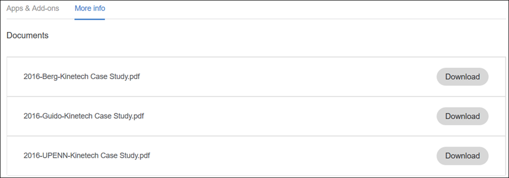

## 5 Related Content

* [App Store Content Support](app-store-content-support)
* [How to Share App Store Content](share-app-store-content)
* [How to Use App Store Content in the  Desktop Modeler](use-app-store-content-in-the-modeler)
