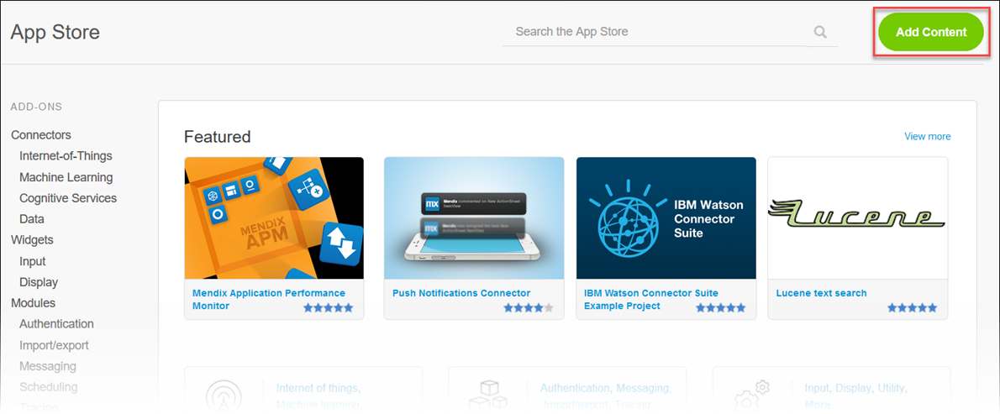
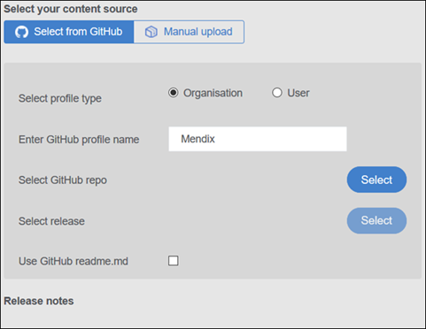
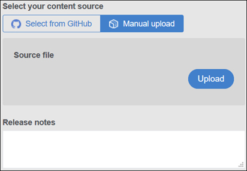
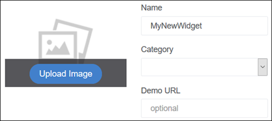
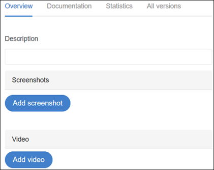
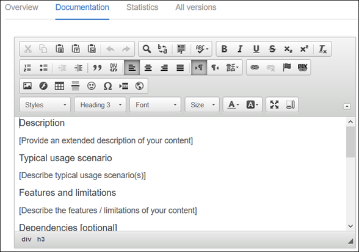
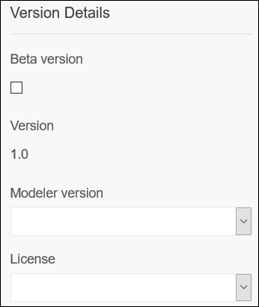
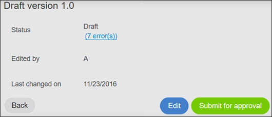
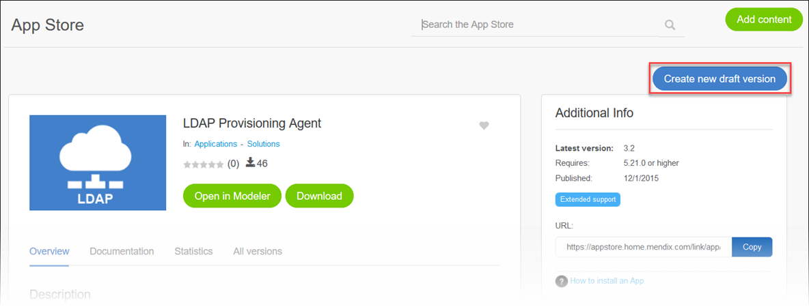
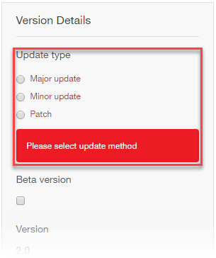

## 1 Introduction

The App Store is driven by contributions from members of the Mendix Community who share various components and apps they have built. This Community tool how-to presents all the necessary details on adding and updating App Store content.

**This how-to will teach you how to do the following:**

* Add new Desktop Modeler content and promotions to share in the App Store
* Update existing App Store content

## 2 Prerequisites

Before starting this how-to, make sure you have completed the following prerequisites:

* Familiarize yourself with the [App Store Overview](app-store-overview)

## 3 Adding New App Store Content

To add content to the App Store, follow these steps:

1. Click **Add content** in the top-right corner of the App Store home screen:

    

2. The **Share your content** page will open, where you need to select the purpose of your contribution:

    * **Share** — components that can be dowloaded using the Desktop Modeler
        * If you select this option, continue to [step #3](#3) below
    * **Promote** — a way to advertise a component or solution while not making it downloadable
        * If you select this option, continue to [step #4](#4) below
3. When adding Desktop Modeler content, select your **content source**:
    * If you select **Select from GitHub**, follow these steps:

        a. Select the type of GitHub profile (**Organisation** or **User**) where the content is stored.

        b. Enter the **GitHub profile name**.

        c. Select the **GitHub repo** from which the content will be uploaded by clicking **Select**. The system will crawl all of the projects fpr that GitHub profile and present the Mendix package file (*.mpk*) options to you on the **Please select a repository** pop-up window. When you find the correct *.mpk* file name, click **Select** on this window.

        d. Select the **release** by clicking **Select**. If there are various releases of the *.mpk* file available, the system will present them to you on the **Please select a release** pop-up window. When you find the correct release, click **Select** on this window.

        e. Check the **Use GitHub readme.md** check box if you want the *readme.md* file to be included with the content.

        f. Note that the **Release notes** section is only available for updating a new version of the content (for more information, see [4 Updating Existing App Store Content](#UpdatingExistingAppStoreContent)).

        

    * If you select **Manual upload**, follow these steps:

        a. Select the **Source file** by clicking **Upload**.

        b. On the **Upload source file** dialog box, click **Browse** to browse the source files on your computer, select your source file, and then click **Save**.

        c. Enter **Release notes** that describe your manually uploaded content.

        

4. In the **Publish to** drop-down menu, select the location where you want to publish your content:

    * **Public App Store (visible for anyone)** – your content will be available to every developer in the Mendix community (this content will have to be reviewed and approved by Mendix before it is available)
    * **Private App Store (visible for your company)** – your content will be available only to the developers in your company (this content will not be reviewed by Mendix)
5. In the bottom half of the **Share your content** screen, do the following:

    * Enter a **Name** for your content
    * Select a category for your content from the **Category** drop-down menu
    * If you have published a demo using your content, enter the **Demo URL**
    * Click **Upload Image** to upload an image for your app

        

6. On the **Overview** tab in the bottom half of the **Share your content** screen, you can do the following:

    * Enter an overview **Description** of your content (for example, "Node control is an native Android app that gives a system administrator access to the Mendix Cloud nodes being administered. From the app, the status of the different environments within a node can be monitored and an environment can be started or stopped.")
    * Upload **Screenshots** by clicking **Add screenshots** and selecting images of the content from your computer
    * Upload **Video** by clicking **Add video** and selecting a video that demonstrates using the content from your computer

        

7. On the **Documentation** tab, you can write or edit the documentation that should accompany your app in the editor. Note that this is only applicable when the **Use GitHub readme.md** check box is not checked, and you are only able to edit the documentation of your own and your company's content.
    * The documentation template includes the following sections that you must fill out in order to submit your content:
        * An extended **Description** of the content
        * The **Typical usage scenario** for the content
        * The **Features and limitations** for the content
    * These sections are optional:
        * Any **Depdencies** (for example, the required Desktop Modeler version, modules, images, and styles)
        * The **Installation** steps and details
        * The **Configuration** steps and details
        * Any **Known bugs**
        * Any **Frequently Asked Questions**

        

8. Note that there is nothing for you to do on the **Statistics** and **All versions** tabs. The **Statistics** tab will chart the downloads of your content over time. The **All versions** tab will list the various versions of your content that have been updated.
9. In the **Version Details** section on the bottom-right side of the screen, do the following:
    * Check the **Beta version** check-box if the content is in beta
    * Select the **Modeler version** on which you built the content
    * Select the type of **License** you want applied to your app (if applicable):
        * **Apache V2** (for details on this type of license, see [Apache License 2.0](https://www.apache.org/licenses/LICENSE-2.0))
        * **GNU General Public License, version 3** (for details on this type of license, see [GNU General Public License v3.0](https://www.gnu.org/licenses/gpl-3.0.en.html))
        * **Mendix EULA** (for details on this type of license, see [Mendix Terms of Use](https://www.mendix.com/terms-of-use/))
        * **MIT** (for details on this type of license, see [MIT License](https://opensource.org/licenses/MIT))

        

        You can request other license types to be added as **License** options by clicking the **Feedback** button on the right side of the App Store screen.
        
10. After entering the information for your content, you can click one of these buttons in the middle of the screen:

    

    * Click **Cancel** to cancel your changes to the content information
    * Click **Delete Draft** to delete the draft of the content information you are working on
    * Click **Save draft** to save the draft of the content information, which will open the **Draft version** section at the top of the screen:

        

        In this section, you can do the following:

        * In the **Status** section, if applicable, click the **error** link (for example, **(7 error(s))**) to bring up the **Warning** pop-up window that lists the information you need enter or fix before you submit the content
        * Click **Back** to go to the list of content drafts in the **My App Store** tab
        * Click **Edit** to continue editing the content information
        * Click **Submit for approval** to submit your App Store content for approval at Mendix

## 4 Updating Existing App Store Content

To update content that has already been published, follow these steps:

1. Go to the information page for the content you want to update (for example, by selecting **Published** on the **My App Store** tab and finding an app you want to update).
2. Click **Create new draft version**:

    

3. On the **Share your content** page, you can edit the content details (as described in [3 Adding New App Store Content](#AddingNewAppStoreContent)).
4. In the **Version Details** section, you must select the **Update type** so that the content is saved as a new version:

    * **Major update** – a large change (which will save the content from version 5.0 to version 6.0, for example)
    * **Minor update** – a medium-sized change (which will save the content from version 6.0 to version 6.1.0, for example)
    * **Patch** – a small change (which will save the content from 6.1.0 to 6.1.1, for example)

        

## 5 App Store Content Submission Guidelines

This section presents guidelines for developing and submitting content to the Mendix App Store.

{}

Submitted App Store content will be reviewed within five working days.

{}

### 5.1 Widget Guidelines

To develop widgets and submit them to the App Store, follow these guidelines:

* The widget must be based on the [AppStoreBoilerplate](https://github.com/mendix/AppStoreWidgetBoilerplate)
* When writing variable and function names, use lowerCamelCase (for example, *mySecondVariable*)
* Add code comments
* Use descriptive variable and function names in both XML and JavaScript
* Always add `"use strict";` to functions
* A function may not be larger than 200 lines of code
* A function may only do one thing, and it should do it properly
* Internal variables should start with an underscore (`_`)
* The Dojo library and its functionalities are leading, but for external plugins you can use jQuery
* Create a test project based on the [AppStoreBoilerplate](https://github.com/mendix/AppStoreWidgetBoilerplate)
* Create test pages for mobile when content is mobile-supported

### 5.2 Module Guidelines

To develop modules and submit them to the App Store, follow these guidelines:

* Create a folder named **USE_ME** and add the microflows and pages that are relevant for the user
* Reduce the use of layouts – using snippets will result in fewer module dependencies and will reduce the number of potential errors (for example, missing layouts)
* User roles and security should be implemented 
* Creating a new release or module export should be done while the security level of the project containing the module is set to **Production**
* The module security status (in the **Project Security**) must be **complete** for the following:
    * Page access
    * Microflow access
    * OData access
    * Entity access
    * Dataset access
* For example pages and microflows to be copied to another module, they should be "excluded from project" in order to encourage duplication and reduce dependency errors 
* Do not rename entities and attributes when creating new versions, as data in these entities will get lost (replacing an existing module is based on the entity names)
* The module should include the English language

## 6 Related Content

* [App Store Content Support](app-store-content-support)
* [App Store Overview](app-store-overview)
* [How to Use App Store Content in the Desktop Modeler](use-app-store-content-in-the-modeler)
