## 1 Introduction

This Mendix community tool how-to covers the basics of how to access the App Store from the Desktop Modeler and provides examples of how to add a widget and a module to your application.

**This how-to will teach you how to do the following:**

* Install content from the App Store via the Modeler
* Download widgets and modules from the App Store in the Desktop Modeler
* Find widgets and modules downloaded from the App Store in the Desktop Modeler
* Use other App Store content in the Desktop Modeler

## 2 Prerequisites

Before starting this how-to, make sure you have completed the following prerequisites:

* Familiarize yourself with the [App Store Overview](app-store-overview)

## 3 Downloading Content from the App Store via the Modeler

To download content from the App Store via the Desktop Modeler, follow these steps:

1. Open the Desktop Modeler and log in with your Mendix account credentials.
2. Open the project in which you would like to install a component.
3. Click **App Store** in the menu bar to open the App Store in the Desktop Modeler:

    

4. On the App Store overview page, you can browse and search for a project or component you want to use in your project. Use the **Search** bar to find a specific project or component. You can also filter the content with the **Categories** in order to get a general view of what is available to download.

    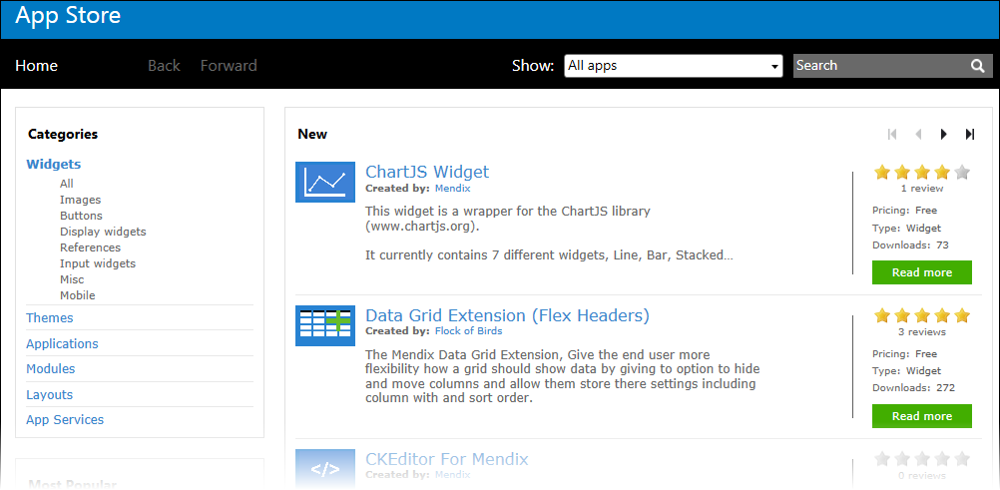

5. Click the title of the item or **Read more** to view the item details:

    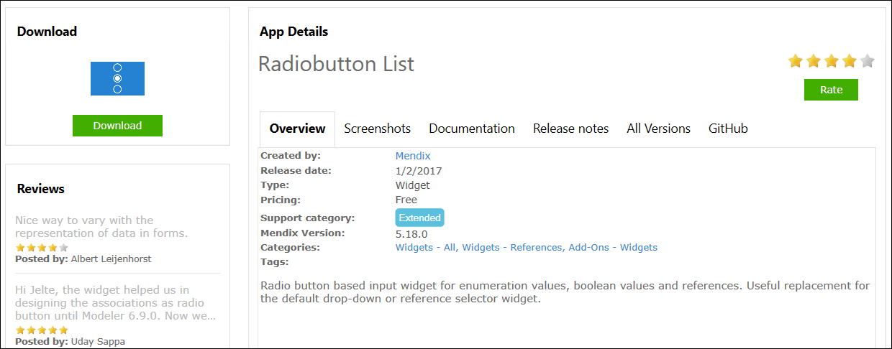

6. When you have found a project or component you want to download into your project, click **Download**:
    * A project will be created on your hard-drive and will be opened in the Desktop Modeler
    * A component will be downloaded directly into your project

    Make sure that you download the correct version of the content from the App Store, because the widget or module version needs to be compatible with the Desktop Modeler version in which you are working. For example, if you are using Mendix 6, always download a widget that has a Mendix 6 version. Do not download a widget that has a higher release version than the Desktop Modeler in which you are working. You can access older versions of the widgets in the All Versions tab in the App Store and download the most compatible version:

    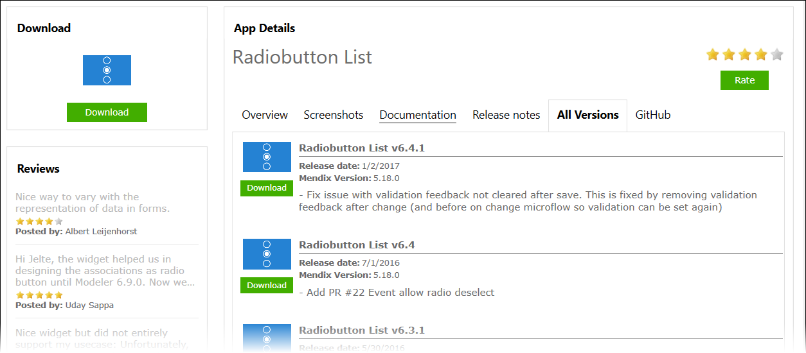

    For more information on App Store content compatibility, see **4.5 Compatibility Section** in the [App Store Overview](app-store-overview).

## 4 Using a Widget from the App Store in the Desktop Modeler

In this section of the how-to, you will learn how to add the Radiobutton List widget as an example scenario. You can follow the same steps to download any App Store widget you need.

### 4.1 Adding a Widget from the App Store

To add the Radiobutton List widget from the App Store via the Desktop Modeler, follow these steps:

1. Download the **RadioButton List** widget by following the steps in [3 Downloading Content from the App Store via the Desktop Modeler](#DownloadingContentfromtheAppStoreviatheModeler).
2.  A widget downloaded from the App Store will be placed in the **widgets** folder in your project structure. You can find the widget and start using it in the following ways:

    * In the **Add-On** menu, select it from the list of all the widgets you have downloaded:

        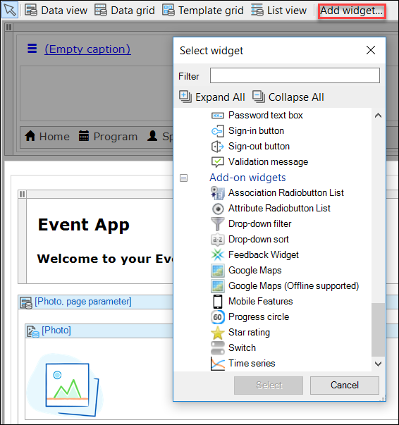

    * Right-click the field in which you want to use the widget, select **Add Widget** > **Add-on**, and select it from the list of all the widgets you have downloaded:

        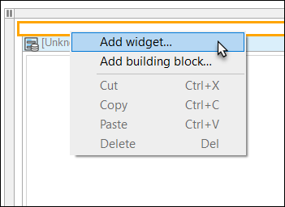

    To delete a widget, remove the *.mpk* file from your project's widgets folder.

3.  Select the **Attribute Radiobutton List** widget, which will be placed within your page:

    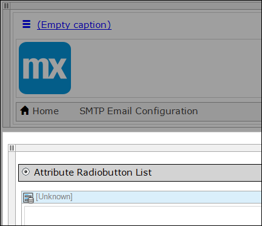

### 4.2 Using the Downloaded Widget in the Desktop Modeler

Each widget that you download from the App Store is different and has different ways of being used. For more information on what the widget does and how it can be implemented, check out the **Documentation** tab specific to each widget in the App Store:

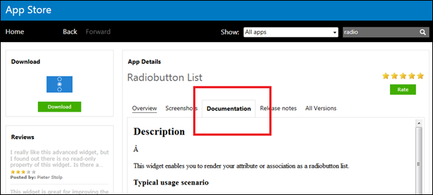

Most widgets will require you to configure them. This is why when you drop the widget into a page, you will often see an error in the **Errors** list.

To resolve the radio button error, follow these steps:

1. Open the error view and review the error message.

    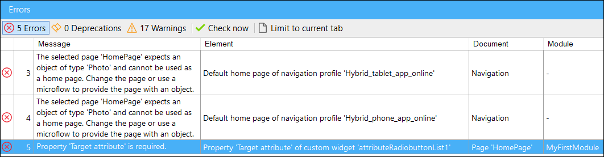

    In this example, the **Target attribute** property in the radio button is required.
2. Double-click the radio button to open all of its options in the **Edit Custom Widget** editor. Notice that the **Target attribute** is empty or set to none:

    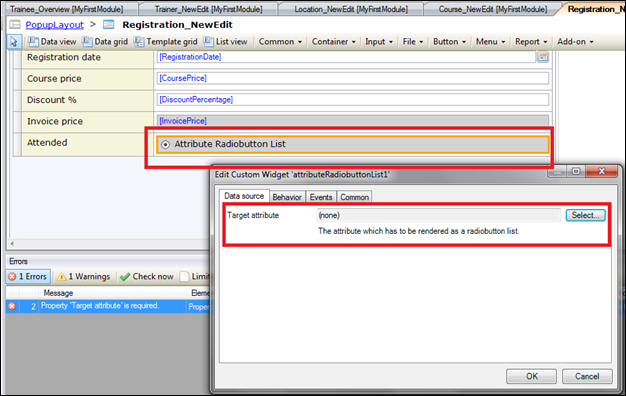

3. Double-click **Select**, which will open the **Select Attribute** dialog box.
4. Select the attribute that you want to display as a radio button. Note that the radio button works on Booleans and enumeration attribute types.

    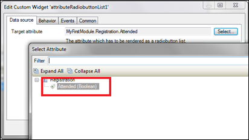

## 5 Using a Module from the App Store

In addition to widgets, you can download entire modules from the App Store (for example, Excel Importer, Forgot Password, E-mail with Templates, and LDAP Synchronization). The modules include whole functionalities and integrations that can be very helpful when you are building your applications.

In this section of the how-to, you will learn how to add the Google Maps module as an example scenario. You can follow the same steps to download any App Store module you need.

### 5.1 Adding a Module from the App Store

To add the Google Maps module from the App Store via the Desktop Modeler, follow these steps:

1. Download the **Google Maps Module** by following the steps in [3 Downloading Content from the App Store via the Desktop Modeler](#DownloadingContentfromtheAppStoreviatheModeler).

2.  On the **Import Module** dialog box, **Add as a new module** is the default option when the module is being downloaded for the first time, which means that new entities will be created in your project:

    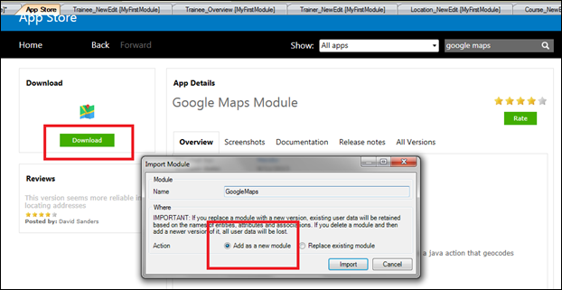

    {}

    If you have made any edits or customization to a module that you have already downloaded, be aware of the "Replace existing module" option. This will override all of your changes with the standard App Store content, which will result in the creation of new entities and attributes, the deletion of renamed entities and attributes, and the deletion of their respective tables and columns represented in the database. Therefore, unless you understand the implications of your changes and you will not update your content in the future, making edits to the downloaded modules is not recommended.

    {}

3. Click **Import** on the **Import Module** dialog box, and a pop-up stating that “The app was successfully imported into the project” will appear. Click **OK**.
4. Open the **Project Explorer** to view the Google Maps module. Note that unlike a widget, a module will be visible in your Project Explorer and will contain a domain model, pages, and microflow logic. A module downloaded from the App Store will store files if the module contains files (for example, userlib or resource files). In addition, a module downloaded from the App Store will have a light blue icon to differentiate it from the development modules.

    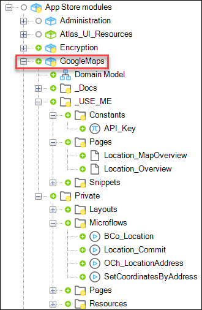

### 5.2 Using the Downloaded Module in the Desktop Modeler

Each module that you download from the App Store is different, and some modules might lead to errors because they are connected to other modules. For example, if you download the Excel Importer module, you will also need to download the Mx Model Reflection module to make the 336 errors disappear. If you run into any problems, always check the **Documentation** tab specific to the module for installation guidelines and details on any dependencies.

{}

Sometimes additional widgets are added when you download a module. For example, the Google Maps widget is included when you download the Google Maps module.

{}

To use the Google Maps module in the Desktop Modeler, follow these steps:

1. Add **Home** and **ViewAllLocations** to your navigation:

    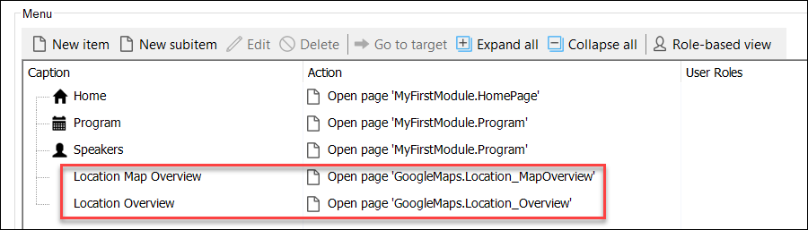

2. Review the Google Map by running your app locally and adding some locations.

## 6 Using Other App Store Content

There are also guidelines for using projects, layouts, and themes from the App Store.

### 6.1 Using a Project or Layout from the App Store

Downloading a project or layout will create a new project structure in the the location that you enter. After clicking **Download**, a pop-up window will appear where you can specify how the project should be created.

{}

You cannot create a new project in an existing repository that is not empty.

{}

### 6.2 Using a Theme from the App Store

Downloading a theme is very similar to downloading a widget. Like a widget, a theme is added to the project structure, in the **theme** folder of your project. A theme downloaded from the App Store will immediately be set as the active theme for your project. You can find out which theme is active for your project in the project **Settings**.

To delete a theme, remove the *.zip* file from your project's **theme** folder.

## 7 Related Content

* [App Store Overview](app-store-overview)
* [How to Share App Store Content](share-app-store-content)
* [App Store Content Support](app-store-content-support)
* [Common Widget Properties](/refguide6/common-widget-properties)
* [How to Create a Basic "Hello World" Custom Widget](/howto6/create-a-basic-hello-world-custom-widget)
* [How to Install the SMTP Email Module](/howto6/install-and-configure-the-smtp-module)
* [How to Plan Mendix SQL Maintenance](/deployment/on-premises/mendix-sql-maintenance-plans)
* [How to Restore an SQL Server Database](/deployment/on-premises/restoring-a-sql-server-database)
* [How to Set Up a New SQL Server Database](/deployment/on-premises/setting-up-a-new-sql-server-database)
* [Feedback Widget: Bridging the Gap Between Developers and Business Users](http://www.mendix.com/blog/feedback-widget-bridging-the-gap-between-users/)
* [My Top 5 Mendix Widgets for Speeding Application Development](http://www.mendix.com/blog/top-5-mendix-widgets-speeding-application-development/)
