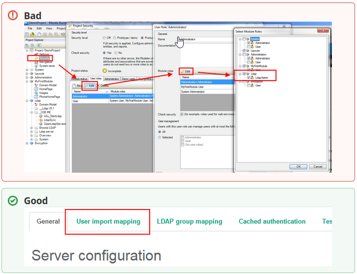
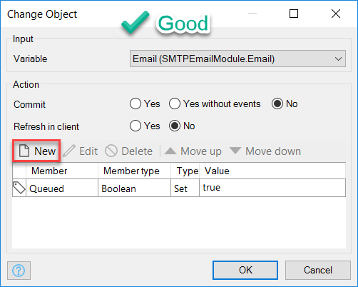

## 1 Introduction

This document presents guidelines for creating a common voice, style, and structure for the Mendix documentation. The goal of our documentation is to attract and teach new Community developers. With that in mind, please read these guidelines to help us keep the documentation consistent.

## 2 Types of Documentation

### 2.1 Reference Guide

The Mendix Reference Guide contains abstract factual data about the various Mendix components. Each component has its own page or section that explains what the component does and the methods and parameters for using it. The reference guide also presents useful examples that make it easy to use the specific component in Mendix projects. The guide does not contain detailed sections on how to use Mendix in various ways or in specific situations.

Here are some important details on the reference guide:

* Each reference guide topic should contain an introduction that explains what feature is being described and what its purpose is
* Each reference guide topic should contain descriptions of the feature's screens, properties, and possible values
* Each feature should contain at least one relevant example (the more examples the better!)

### 2.2 How-to's

The how-to's are contextual and version-specific guides on Mendix topics that take you through the necessary steps to achieve a goal, whether it is adding a widget to your app's UI, importing Excel files, or consuming a web service. The how-to's use relevant information on Mendix components to create realistic scenarios with specific contexts and they should deliver functionality.

Here are some important details on the how-to's:

* This documentation should provide solutions and insights to common scenarios, business cases, and frequently asked questions
* At the end of each how-to, the reader should have increased knowledge about Mendix functionality and should know how to apply it in relevant situations

### 2.3 API Documentation

The API documentation provides information about the various public APIs available in Mendix. The documentation explains the function of the API and gives examples of the methods that can easily be used and adjusted in projects.

Here are some important details on the API documentation:

* Each part of the API documentation should contain an introduction that explains what API is being described and what its purpose is
* Each method should have a description (including its properties and functions) and at least one relevant example (the more examples the better!)

## 3 Style Guidelines

When contributing to the Mendix documentation, please consider these style guidelines:

* All written communication should be in American English
* Focus on the questions you want to answer in the documentation
* Put yourself in the position of the end-user (and consider their skill level)
* Keep it short, simple, and to the point
* Review your content and delete anything that might be unnecessary
* The tone of the Mendix documentation is relaxed, conversational, and straight-forward
* Define obscure acronyms and write them out fully the first time before using them throughout the rest of the document
* Avoid adverbs such as “simply,” “possibly,” “might,” “could,” “actually,” and “potentially,” as these words add uncertainty and cloud the true meaning of sentences
* Be inclusive with your language and do not use just "he," use "the user" or "they" instead

Need an extra hand with spelling and grammar? Load your article into [Hemmingway](http://www.hemingwayapp.com/) to spot any potential errors.

## 4 Guidelines for Markdown

For details on the Markdown syntax, see the [GitHub Guide to Mastering Markdown](https://guides.github.com/features/mastering-markdown/).

### 4.1 Text Styling

Use **bold** when identifying buttons, windows, fields, and other entities that appear in the UI. For example: "Add a **Retrieve** activity to the microflow."

Use *italics* when the user needs to enter text. For example: "In the **Name** field, enter *Customer_NewEdit_Commit*."

### 4.2 Embedding a Model Share

To embed a model share in the documentation, paste the iframe, for example:

```html
<iframe width='100%' height='491px' frameborder='0' src='https://modelshare.mendix.com/models/fb092960-6fc1-41c0-bb64-d9e70c012bc5/save-example?embed=true' allowfullscreen></iframe>
```

This will render as:

<iframe width='100%' height='491px' frameborder='0' src='https://modelshare.mendix.com/models/fb092960-6fc1-41c0-bb64-d9e70c012bc5/save-example?embed=true' allowfullscreen></iframe>

### 4.3 Specific Formatting Tips

Some tips to consider when formatting Markdown are listed below.

#### 4.3.1 Note Styles

To format note styles, implement the code below.

For the "info" type:

```html
{}
Your note.
{}
```

{}
Your note.
{}

And for the "warning" type:

```html
{}
Your note.
{}
```

{}
Your note.
{}

## 5 Guidelines for How-to's

This section presents detailed guidlines for writing a how-to. Read this section while referencing the [How-to Template](the-how-to-template-page).

### 5.1 How-to Sections

#### 5.1.1 Title

Write the title of the how-to so that it's clear and attractive to people not familiar with Mendix.

In addition, write the title from a problem-solving perspective (do not just state that you're implementing a solution).

Use an infinitive verb (without "to") at the beginning of your title (for example, "Implement Application Logic Using Microflows"). This way, the full title can include "How to" when it is used in a cross-reference or another situation (for example, "For details, see How to Implement Application Logic Using Microflows").

You can use this title structure: **[goal/problem to be solved]** + **[Mendix terminology]** (for example,"Work with Object Events").

#### 5.1.2 Introduction

The introduction should explain the business case of the how-to, what problems the document solves, and why end-users should read it.

In the **This how-to will teach you . . .** section, sum up the key points that end-users will have learnt after reading the how-to (make this as clear and concrete as possible).

For example:

{}
**This how-to will teach you how to do the following:**

* Create an app in Mendix
* Deploy an app with Mendix
* Create overview and detail pages
{}

#### 5.1.3 Prerequisites Section

Use the prerequisites section to let end-users know what they should have completed before starting the how-to. This prevents having to explain certain steps in detail.

You can tell end-users that they need to have installed certain software requirements or have performed specific configurations before starting the how-to. You can also list other how-to's here that should be referenced.

{}
For example:

Before starting with this how-to, make sure you have completed the following prerequisites:

* Start a GitHub account
* Fork the repo on GitHub
{}

#### 5.1.4 Exercises

When writing exercise steps, it is especially important to focus on the styling and formatting so that the reader is clear on what is being done in the exercise.

##### 5.1.4.1 Numbered Lists

Start each exercise with an introductory sentence about what the goal is (for example, "To enable batch translation, follow these steps").

Keep the steps short and clear. Do not combine more than two simple actions in one step.

{}
For example:

1. Open the **Activity** properties.
2. Click **Select** for the source.
3. Select the microflow you created earlier, and click **OK**.
{}

If you want to use an image in your numbered list, add it after the related exercise step.

##### 5.1.4.2 Images

Add images that clearly show the specific functionality of the related step (so the reader can check that the image matches what they see on their screen). For example, the arrows and flow on this screenshot are too busy and not clear enough for the user:



Add boxes, indicators, arrows, and other information to an image only if it makes the image more understandable:



Keep the images as simple as possible, because having too many arrows on an image can make it confusing!

Images can be given a maximum width. This is done through the ``image_container`` short code, for example:

```html
{}

{}
```

This example sets the maximum width to `200px`:

{}

{}

### 5.2 How-to Content

#### 5.2.1 Documenting Microflows

When documenting microflows, explain how to drag actions from the Modeler Toolbox to the microflow. This is one complete step and it saves time compared to clicking the toolbar, adding an activity, etc.

Always show the result of a microflow assignment so that the user knows what it should look like.

#### 5.2.2 Using Beta Content Warning

Provide a warning note when you are releasing documentation about a feature that is in beta.

For example:

{}
The documentation in this section describes a new feature that is in beta, so it is subject to change before the final release.
{}

#### 5.2.3 Using International Test Data

Use English-language and international test data if applicable.

{}
For example:

* Boston, New York, London, Paris, Amsterdam
* dollars, $
  {}

#### 5.2.4 Writing Detailed and Short Explanations

Explain something in detail once, and use the short version after that.

For example, this could be a "first time" explanation:

1. Open the **Toolbox**.
2. Drag a data grid to the page. The Tooblox should be in the bottom-right corner. If it’s not open, you can reopen it from the **View** menu.
3. ...

And this could be the "short version" explanation:

1. Add a data grid to the page.
2. ...

## 6 Guidelines for the Reference Guide

When writing for the Mendix Reference Guide, consider these guidelines:

* Clarify the explanations of how each feature works
* Add examples for each feature being documented
* Add images that clearly show the specific functionality being described (so the reader can check that the image matches what they see on their screen)
* Add **Related Content** links if possible
