## 1 Introduction

The purpose of the Partner Profile is to provide the Mendix community and customers with a transparent overview of each partner company's knowledge, skills, experience, reviews, and culture. The profile is a simple and clear way for each partner to present themselves through an aggregated view of the developers in the organization, including the number of certified developers. It is also possible to add projects, customer reviews, contact information, a company video, and a description to each profile.

**This how-to will teach you how to do the following:**

* Set up and edit the Mendix Partner Profile
* Add projects to the profile
* Add developers to the profile

## 2 Prerequisites

Before starting this how-to, make sure you have completed the following prerequisite:

* Have a Community Profile (register [here](https://www.mendix.com/try-now/?utm_source=documentation&utm_medium=community&utm_campaign=signup) and see [How to Set Up Your Community Profile](how-to-set-up-your-profile) for more information)

## 3 Logging In to the Partner Profile

To log in to the Partner Profile, edit it, and make it public, follow these steps:

1. Log in to your own Mendix Community Profile [here](https://developer.mendixcloud.com/openid/login?immediate=true&continuation=link/ownprofile/). Now Mendix knows who you are and which company is attached to your account.
2. At the top of your Community Profile, you will see your role and comapny (for example, "Senior Developer at **Finaps**"). When your company is a partner, the company name is clickable. Click your company name to go to its Partner Profile. 
3.  If you are authorized as a Partner Profile Editor, click **Edit Partner Profile** to edit the profile:

    

    If you are not authorized to edit the profile but your colleagues are, a list with their email addresses is shown. To gain access to editing the profile, you can contact them so that they can add you as an editor (for details, see [9 Changing the Profile Editor](#editors)). If none of your colleagues are authorized, click **Feedback** on the right side of the screen and submit a feedback item to gain access. 

4.  Once you are in edit mode, click this icon to edit each field of the Partner Profile:

    
    
    For details about editing, start with [5 Editing the Overview](#editing). 
    
5.  After you have finished editing, you can set the profile to public so that the Mendix community and customers can view it. To do this, simply click **View Public Profile**:

    

## 4 Editing the Partner Profile Header

### 4.1 Header Elements

The header of your Partner Profile has important contact details about your company:

You must complete the **Address** and **Email Address** fields before you can make your Partner Profile public. So, click the edit icon and add this information to the header (the email address will allow customers to contact you via the **Contact us** button): 

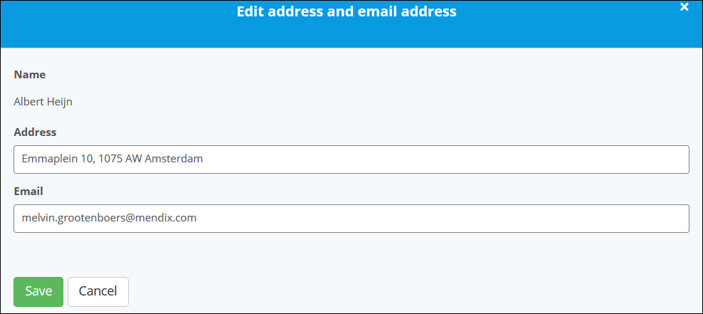

### 4.2 Capability Tracks

The header also displays whether the company is **Authorized**, **Expert**, or **Professional**. These capability tracks are defined as follows:

* **Authorized** — this type of partner has qualified and certified resources to support customers with Mendix initiatives 
* **Professional** — this type of partner can successfully deliver complex mission-critical Mendix applications and solutions for businesses
* **Expert** — this type of partner can support an enterprise in its successful positioning and adoption of the Mendix platform with all elements of the Mendix "4 P's" (portfolio, people, process, and platform; for details, see [How to Implement Bimodal IT: Focus on the 4 P’s](https://www.mendix.com/blog/how-to-implement-bimodal-it-focus-on-the-4-ps/))

These capability tracks are defined through an assessment of your company's developer certification levels, delivery expertise, and delivery references. For more information, please contact your Mendix Customer Success Manager.

## 5 Editing the Overview

Follow these steps to edit the most important fields on your Partner Profile:

1. Add a **Summary Title** and a company **Summary**:

    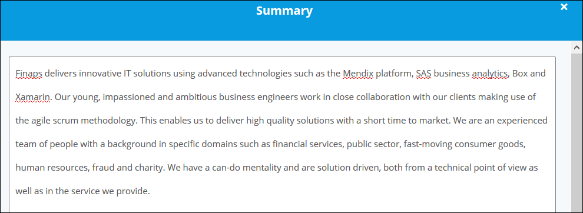

2. Add a company **Video** (YouTube or Vimeo) or **Project**:

    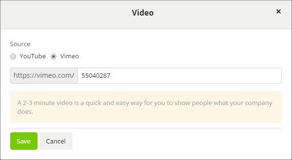

    Selecting **Project** will link a project that you have have added on the **Projects** tab of the Partner Profile (for more details, see [6 Adding Projects](#projects). 

3.  Add your company's focus **Industries**. These will be used in the filter options on the **Meet our partners** page so that Mendix customers can search for partners in a specific industry.

    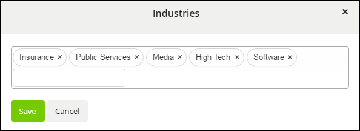

4. Select the **Types of Service** your company provides:

    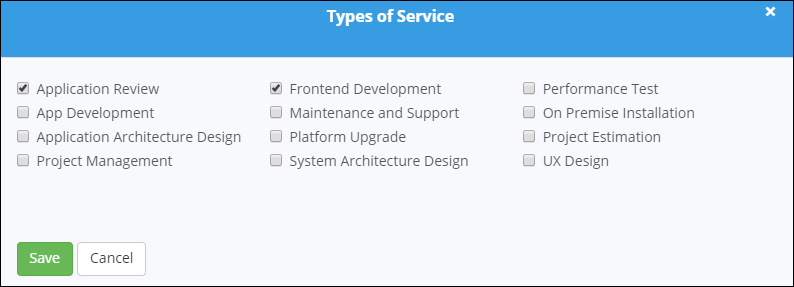

5.  Under **Skills**, add the types of skills your company team members can perform:

    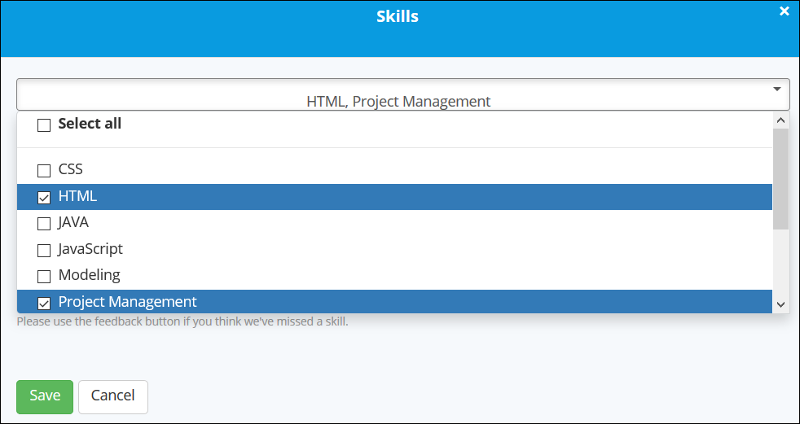

    For more information on company team members, see [7 Editing Team Members](#team).

6.  In **Geographical Focus**, add the countries where your company is active and/or has coverage. This will be used in the filter option on the **Meet our partners** page so that Mendix customers can search for partners in a specific country.

    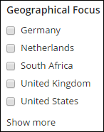
    
{}
If you're missing an input option (for example, an industry or skill), click **Feedback** on the right side of the screen and let us know!
{}

## 6 Adding Projects

To add a project to your Partner Profile, go to the **Projects** tab and click **Add Project**:

This will open the project editor. There are tips in the editor for what you should enter in each field:

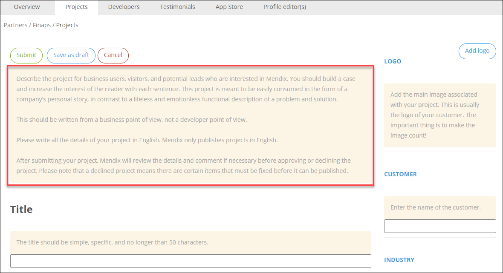

All of the fields in the project editor must be filled out before submitting the project. Click **Submit** to save and submit your project:

{}
All projecs are reviewed by Mendix Techncial Writers upon submission. After their approval, the project will be shown in the **Published** project section.
{}

Published projects are listed in the **Published** projects section, where the following buttons are available for each published project:

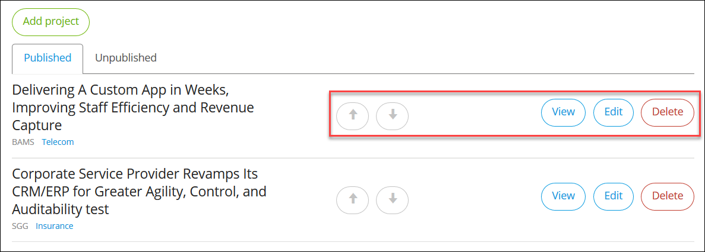

* Arrow buttons – moves the project up or down in the list of projects on your Partner Profile's **Projects** tab
* **View** – opens the published project so you can view it
* **Edit** – opens the project editor so you can make more edits
* **Delete** – deletes the project

If you do not want to publish a project right away, click **Save as draft** in the project editor. The project draft will be available in the **Unpublished** projects section for you to finish later where the following buttons are available for each project draft:

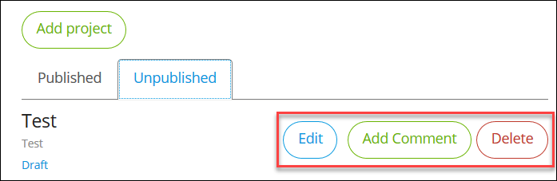

* **Edit** – opens the project editor so you can make more edits on the draft
* **Add Comment** — opens a dialog box where you can add a comment on the project draft; comments can be viewed in the **Unpublished** projects section

    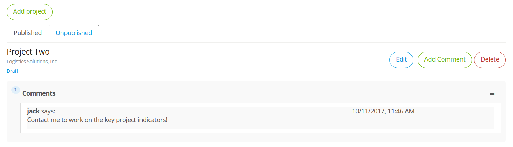

* **Delete** – deletes the project draft

## 7 Editing Team Members

This section presents information on adding the most valuable assets of your company: your certified Mendix developers. Before you can add a developer to the Partner Profile, their Community Profile needs to be set to public (for details on how to do this, see [How to Set Up Your Community Profile](how-to-set-up-your-profile).

To add developers to the Partner Profile, follow these steps:

1.  Go to the **Developers** tab, where all the certified Mendix developers in your company are shown:

    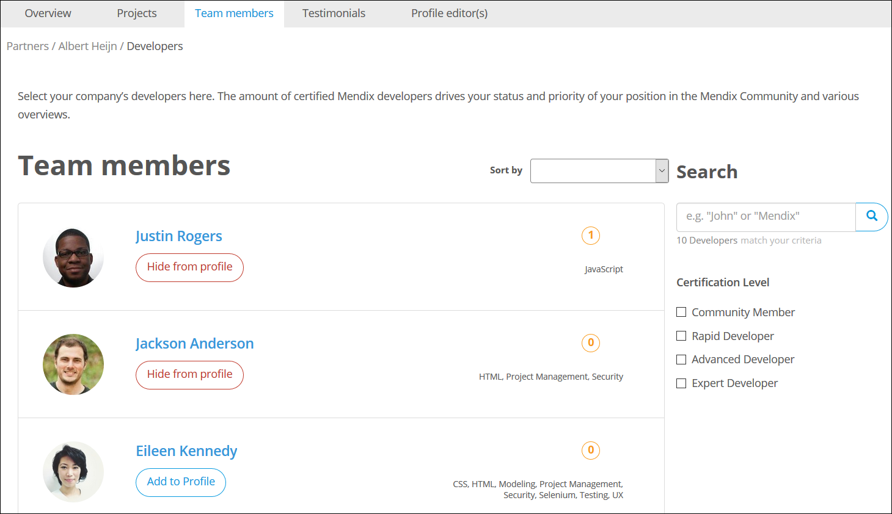

    You can use the **Sort by**, **Search**, and **Certification Level** features to find a specific team member.

2.  Select the active team members within your organization whose certifications you want to be visible on your Partner Profile by clicking **Add to profile**. The certification of each developer added to the profile will be visible in the statistics in the profile header, where numbers for **Rapid Developers**, **Advanced Developers**, **Expert Developers**, total **Mx Developers** (all developers added to the profile), and total **Mx Developers** (all existing developers) are displayed.

    Only the certifications and points of the added developers will be counted in the Partner Profile. The highest rank of certification will be added to the overview.

{}

Make sure you offboard the developers who no longer work at your company through the company administration in the Mendix platform. These former employees will still be visible in the overview. It is important that you deactivate these developers in the Developers Portal so that they don’t have access to projects.

{}

## 8 Editing Testimonials

On the **Testimonials** tab, all the testimonials on your company and projects are available. These testimonials are approved by your company's Profile Editor before they are displayed on the profile. 

You can do further editing to the testimonials with the following buttons:

* **Edit** – opens the testimonial editor, where you can edit details of the testimonial

    {}
    Providing accurate testimonials is an important part of participating in the Mendix community, as is respecting the testimonials that have been given. So, while you are able to edit the details of a testimonial about your company, please respect the original intent of the writer of a testimonial that has already been approved by your company's Profile Editor.
    {}

* **Delete** – deletes the testimonial
* **Show on profile** – displays the testimonial on your company's Partner Profile

## 9 Changing the Profile Editor

To make a colleague a profile editor, follow these steps:

1. On the Partner Profile, click the **Profile editor(s)** tab.
2. The **Select profile editor(s)** dialog box displays all the employees of your company. Select the colleague who you want to make a profile editor.
3. Click **Make Profile Editor**.

## 10 Sorting on the Partners Overview Page

The [Meet our partners page](https://developer.mendixcloud.com/openid/login?immediate=true&continuation=link/partneroverview) presents all the partners in the Mendix community. The sorting is based on a combination of the following KPIs:
* Whether your company is Expert (which will get the most weight in sorting), Professional, or Authorized (for more information, see [4.2 Capability Tracks](#capability))
* The total amount of certified developers (note that developers with multiple certifications count as one certified developer)

* The total number of projects you have published on your Partner Profile

## 11 Related Content

* [How to Set Up Your Community Profile](how-to-set-up-your-profile)
