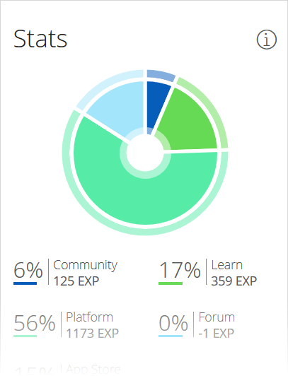
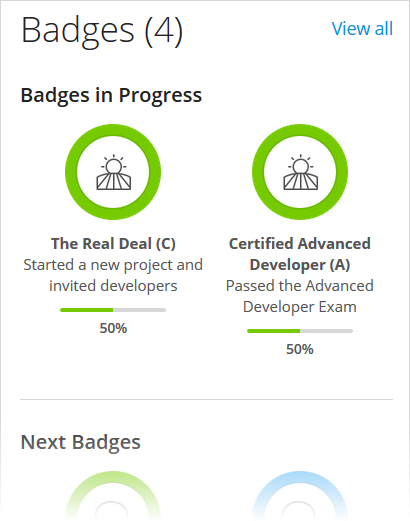
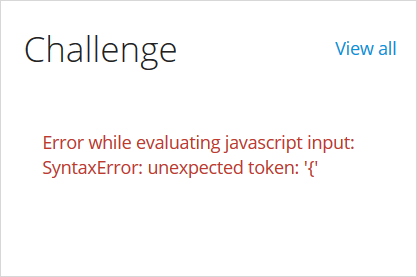
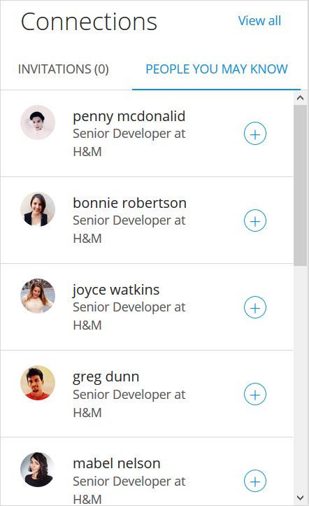
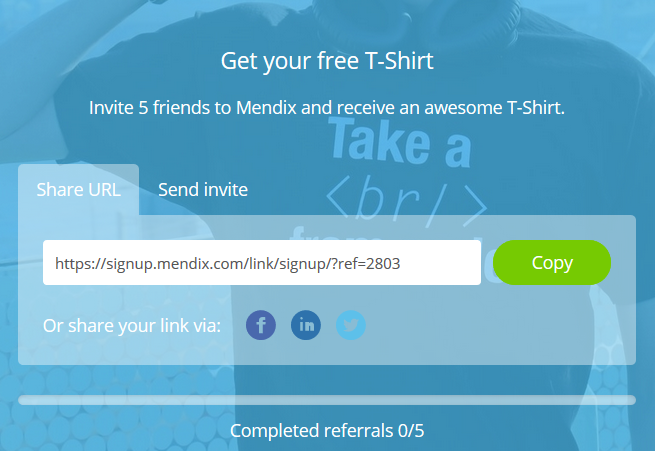
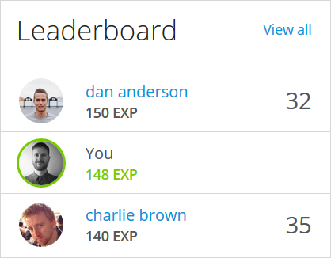

## 1 Introduction

So you’ve decided to check out your new Mendix Community Profile page, but you've found it suspiciously empty. Don’t worry, we're here to help you set up your profile so you can show the world what a real Mendix developer looks like!

**This how-to will teach you how to do the following:**

* Set up your Community Profile
* Make your profile public
* Merge your accounts

## 2 Prerequisites

Before starting this how-to, make sure you have completed the following prerequisites:

* Sign up for Mendix [here](https://www.mendix.com/try-now/)

## 3 My Profile

**[ADJUST HEADINGS VIA FINAL CONTENT]**

To access your [Community Profile](https://developer.mendixcloud.com/link/profile), hover over your picture on the right side of the navigation bar and select **My Dashboard** from the context menu.

**[LINK NAME ABOVE GOING TO  CHANGE?]**

### 3.1 Overview

Your profile will open to the **Overview** tab. In the header of your profile, you see your personal information (which is also presented on the **Personal Info** card). These details can be easily edited to present accurate personal details, project roles, and skills you have gained. Click the **Settings** cog icon to edit your job function and biography. The header also presents your location, number of [connections](#connections), Mendix points, [credits ](#credits), and [badges](#badges).

Below the header, the first card you see presents your **Stats**. The chart and its legend display your points divided between various Mendix products and activities. For details on gaining points, see the [Points System FAQ](https://developer.mendixcloud.com/link/faq). When analyzing your points, be sure to also check out the [Leaderboard](#leaderboard) card on this tab to see the top Mendix community contributors!

The tabs of your Community Profile are described below.

### 3.2 Badges {#badges}

In addition to the **Stats** chart, on the **Overview** tab you can gain an overview of your **Badges**, which represent your achievements and progress on the Mendix Platform. You can see your **Badges in Progress** as well as **Next Badges**. The badges are color-coded based on their rarity, from green (least rare), to blue, purple, and orange (most rare). You can see all of your badges on the **Badges** tab of your profile. And for all the details on the badges—which will help you determine which next badges you can work towards—check out the [Badge Overview](https://developer.mendixcloud.com/link/badges).

### 3.3 Challenges

The **Challenge** card lists activities you can complete on the Mendix Platform to gain various Mendix badges and credits. The platform suggests the best order for your challenges, but you can complete these activities in any order you like. The activities you complete and badges you gain are pushed to the top of the card, so you can see what you still have to do. Once you complete a challenge, you get a **Challenge** badge. **[STILL ACCURATE?]** 

There is also a featured challenge on your profile. The featured achievement presents a [multi-level badge](https://developer.mendixcloud.com/link/badges) you can strive to win by working on the Mendix Platform and completing certain tasks. The header will always feature the next badge level for you to work towards. **[STILL EXISTS?]**

Clicking **View all** will bring you to the **Challenges** tab of your profile, which gives you more details on your challenges and credits. For each challenge, a certain amount of credits can be gained, with which you can claim rewards.

In the **Prizes you can claim** section, you can see a list of rewards you have gained by completing challenges and gaining credits. Click **Claim Reward** **[ACCURATE?]** to claim your prize. Click **View Shop** to go to the Mendix shop and see all the sweet Mendix swag on offer!

Completing your challenges and gaining badges is a great way to stay engaged with the Mendix community. And there are always new prizes available!

### 3.4 Connections {#connections}

One of the greatest strengths of Mendix is our awesome developers community, and the **Connections** card is the perfect place to start networking with fellow developers and Mendixites. When you are invited by a Mendixite to connect, you can check out their profile and make a decision to accept or ignore the invitation. **[IGNORE OR REJECT?]**  You can also see a list of people you may know so that you can add further connections to your profile.

Clicking **View All** on the card will bring you to the **Connections** tab. On this tab, you can invite friends and colleagues to Mendix in two ways:

* **Share URL** – copy the personalized invite link and share it on your personal website, blog, and social media channels, or share it directly via specific social media
* **Send invite** – send someone a Mendix invite by entering their email address and clicking **Send invite**

**[STILL ACCURATE BELOW, OR HOW DOES THIS WORK NOW?]**

After you click **Invite Friends**, a pop-up window titled **Get your free t-shirt** appears. There are two tabs available here. On the **Share URL** tab, you can copy the personal invite link that is provided and then share it on your personal website, blog, and social media channels to invite more people to Mendix. On the **Send invite** tab, you can send someone a Mendix invite by entering their email address and clicking **Send invite**. 

You will earn some Mendix swag with five successful invites!

**[BELOW STILL NECESSARY?]**

After you have invited someone to Mendix, click **Invite Friends / View Status** to see their name and status listed at the bottom of the pop-up window. Their status is determined via these steps:

1. If you invited them via email, they will first get the **Invited** status.
2. When they click **Sign up for Mendix** and receive a confirmation email, they will get the **Confirmation e-mail sent** status.
3. When they complete the guided product introduction tour in the Mendix Web Modeler, their status will change to **Successful**.

Once five of your referred users reach the **Successful** status, you will see the **Claim your t-shirt** link on your dashboard. Click this to fill in some details and receive your awesome Mendix t-shirt. Yay!

{}

One more thing about Mendix invites – when you invite someone and they sign up for Mendix, they will receive a voucher for the [Mendix Rapid Developer Certification Exam](https://gettingstarted.mendixcloud.com/link/certification/rapid) that is valid for six weeks. So encourage your friends to try something new and get certified by Mendix!

{} 

### 3.5 Leaderboard {#leaderboard}

This card presents a selection **[WHICH EXACTLY?]** of the leading Mendix developers by points.

Clicking **VIew all** takes you to the **Leaderboards** page, which presents all the boards available for viewing Mendix Platform user activity: **Top Overall**, **Top Forum**, **Top App Store**, **Top Platform**, **Top Community**, and **Top Learning**.

For details on how to gain points and climb the leaderboards, see the [Points System FAQ](https://developer.mendixcloud.com/link/faq).

### 3.5 Portfolio

The **Portfolio** card presents a selection of Mendix app projects you have worked on. Click the project name to see more details about it (including a description of the app, business need, solution, results, and collaborators), or click **View all projects** to be taken to the  **Portfolio** tab, which presents a complete view of all your projects. 

To add a project to your portfolio, click **Add Project**, which will open the project editor. There are tips in the editor for what you should enter in each field. All of the fields in the project editor must be filled out before submitting the project.

If you do not want to publish a project right away, click **Save as Draft** in the project editor to finish it later. The project draft will be visible only to you in your **Portfolio** tab and available for further editing.

**[WHAT HAPPENS IF YOU TRY TO SAVE/PUBLISH A PROJECT WITH EMPTY REQUIRED FIELDS? SAVES AS DRAFT? IF SO, ADD  NOTE]**

{}
All projects published before October 16, 2017 will be in the **Draft** status in the edit mode. To improve the quality of the projects and the design of the Community Profile, we have new required fields. Please fill in the empty required fields to publish your project again.
{}

**[ACCURATE]**

### 3.6 Activity

This tab presents all of your latest activity.

**[WHAT SHOULD GO HERE? NECESSARY?]**

# OLD

**[SECTIONS BELOW TO BE USED?]**

### Writing User Reviews of Mendix

Once you start using Mendix regularly and are familiar with all the capabilities of the platform, you can write user reviews on [Gartner Peer Insights](https://www.gartner.com/reviews/market/mobile-application-development-platforms/vendor/mendix/product/mendix-platfor), [TrustRadius](https://www.trustradius.com/products/mendix/reviews), and [G2 Crowd](https://www.g2crowd.com/products/mendix/reviews). This is another way for you to earn Mendix swag!

{}
There is no opportunity for Mendix partners to leave reviews on Gartner Peer Insights due to their policy.
{}

To write a user review and earn a fashionable pair of Mendix socks, follow these steps:

1. Click **Write Review** under **Get your free socks** on your dashboard.
2.  On the pop-up window, click the link to the software review website next to **Write your review here**:
3. Write and save your user review on the website.
4. Copy the URL to your review, paste it in the field on the pop-up window, and click **Submit Review**. Please note that you cannot submit a link to a review that has already been written and submitted.

The submitted review is then verified by Mendix. You can check the status of your review by clicking **Write Review** and looking at the bottom of the pop-up window:
* **Pending** – Mendix is still verifying the review
*  **Successful** – the review has been verified and is published, so you can claim your swag!

Once your review has been verified as successful, you will see the **Claim your socks** link on your dashboard. Click this to fill in some details and receive your nice warm pair of Mendix socks!

{}
If your review has been declined, you can write a new one and submit it.
{}

{}
You can only earn a pair of socks for your first Mendix user review. Subsequent reviews will still earn you Mendix points.
{}

### Editing Your Public Profile

To start editing your Community Profile, click the **My Public Profile** tab. This is the main public page of your profile with your Mendix badges, Mendix points, personal **Summary**, **Industry Experience**, **Skills**, **Project Roles**, **Activity**, **Projects**, and more.

Click **Edit Profile** to go into edit mode:

To edit a specific field on your profile, click this icon:

In the header of your profile, you can edit the following details:

* **Name**
* **Function**
* **Location**
* **Country**
* Whether you are looking for a **job**, a **project**, both, or neither
*  Your social media links (GitHub, Twitter, LinkedIn, and Skype)

{}

In order to receive Mendix points for your contributions to Mendix GitHub repositories (for example, [mendix / docs](https://github.com/mendix/docs)), you are required to authorize the connection to your GitHub profile. For more information on gaining Mendix points, see the [Points System FAQ](https://developer.mendixcloud.com/link/faq) and [How to Contribute to the Mendix Documentation](../documentation/contribute-to-the-mendix-documentation#GainingMendixPoints).

{}

In the body of your profile, you can edit the following elements:

* **Summary**
* **Industry Experience**
* **Skills**
* **Reviews** – URLs of the reviews of Mendix you have written
    * Links to these reviews will not appear on your public profile, but writing one review is required to make your profile 100% complete
    * For details on writing reviews of Mendix, see section [3.2 Writing Reviews of Mendix](#review)
* **Projects** – for details on adding a project, see section [5 Adding a Project](#project)

Be sure to complete the following items, which are necessary to make your Community Profile public:

* Add an avatar
* Enter a **Function**
* Enter a **Location**
* Confirm if you are looking for a **job**, a **project**, both, or neither
* Enter a **Summary**
* Add at least 1 **Skill**
* Add at least 1 **Industry Experience** item

Once you have completed those items, click **View Public Profile** in the header to see how your public profile looks:

If you have not been able to complete all of these steps, the **Profile Completeness** bar and **Profile Completion Tips** will remind you of what needs to be done to make your Community Profile complete:

### Merging Your Accounts

With use of the Community Profile, you can merge your old Mendix account(s) into your current Mendix account. This action combines all your hard-earned points, certifications, and achievements in your efforts to climb the leaderboards.

These are the quick and easy steps to follow when merging your accounts:

1. Go to your [Community Profile](https://developer.mendixcloud.com/link/ownprofile/).
2. Click **Edit Profile**.
3. Click **Manage Account** on the right side of the screen.
4. Under **Merge your accounts**, enter the email address of the account you want to merge with your current account.
5. Click the send button to send a merge request.

We’ll take things from there. The email address of the merged account will be shown in this list when the accounts have been merged:

{}

With this action we only combine the accounts. We do not deactivate the old account(s). This should be done by that company’s administrator.

{}

### Profile Visibility

If you want to make your profile private, these are the quick and easy steps to follow:

1. Go to your [Community Profile](https://developer.mendixcloud.com/link/ownprofile/).
2. Click **Edit Profile**.
3. Click **Manage Account** on the right side of the screen.
4. Under **Profile visibility**, click **Make this profile private**.
