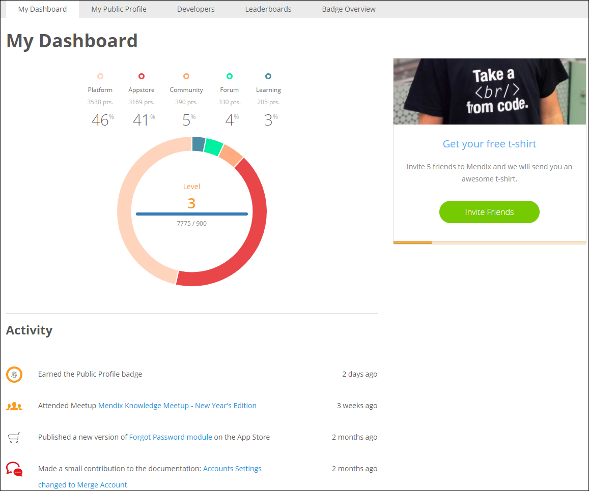
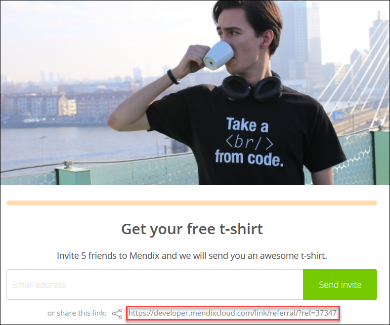
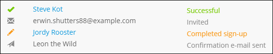
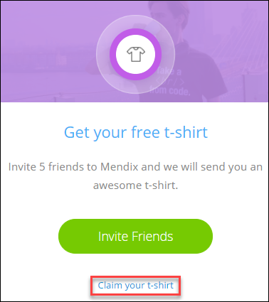
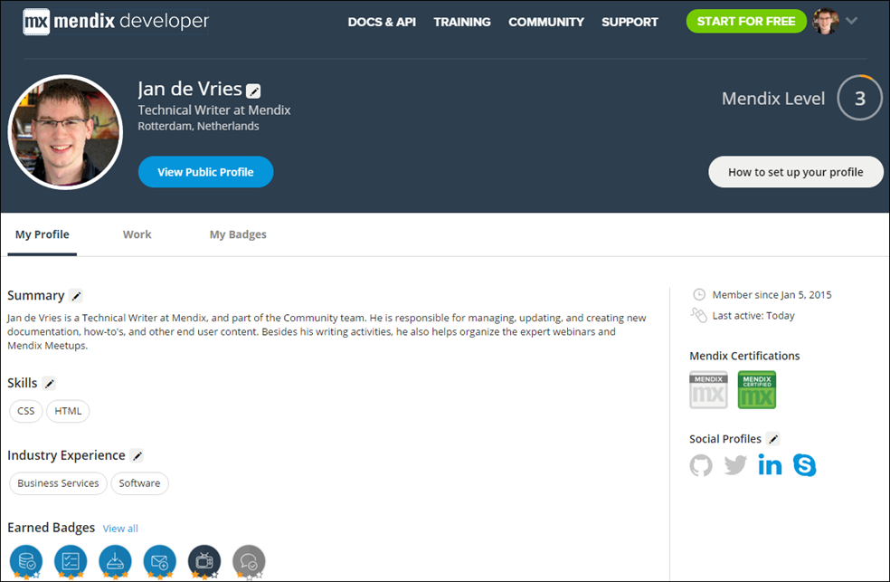
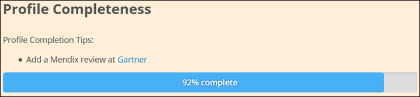
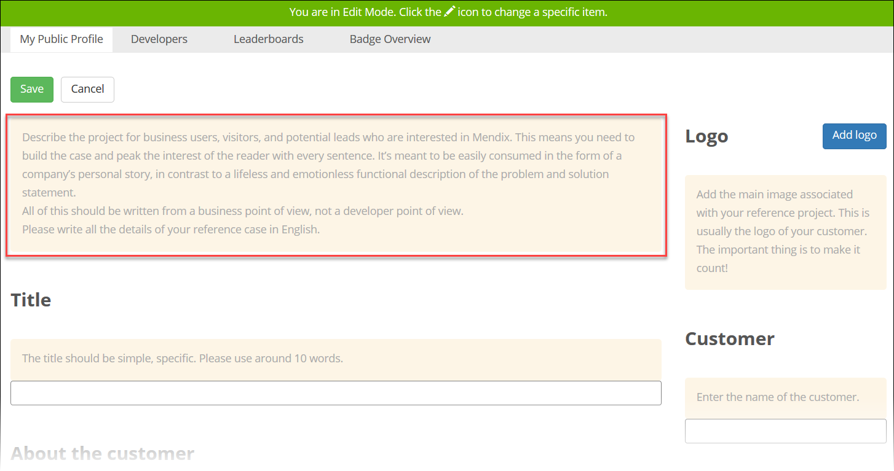
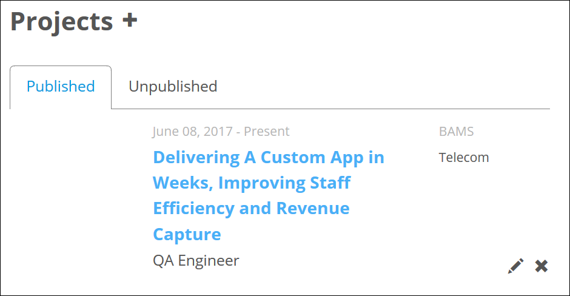
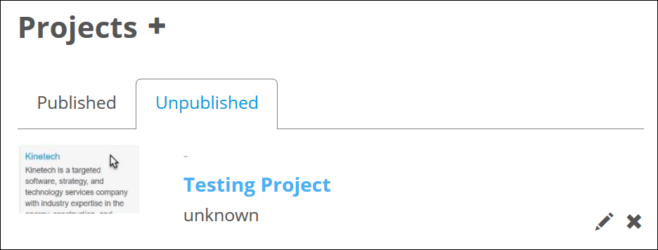
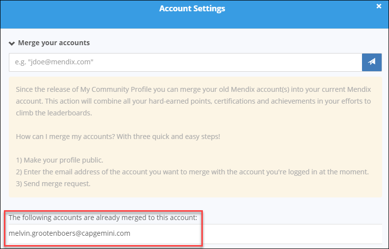

## 1 Introduction

So you’ve decided to check out your new Mendix Community Profile page, but you've found it suspiciously empty. Don’t worry, we're here to help you set up your profile so you can show the world what a real Mendix developer looks like!

**This how-to will teach you how to do the following:**

* Set up your Community Profile
* Make your profile public
* Merge your accounts

## 2 Prerequisites

Before starting this how-to, make sure you have completed the following prerequisites:

* Open a Mendix account (register [here](https://www.mendix.com/try-now/))

## 3 My Dashboard

To access your [Community Profile](https://developer.mendixcloud.com/link/profile), hover over your picture on the right side of the navigation bar and select **My Profile** from the context menu.

Your profile will open to the **My Dashboard** tab, where you can see your points chart. The chart and its legend present the division of your points between various Mendix products and activities. For details on gaining points, see the [Points System FAQ](https://developer.mendixcloud.com/link/faq). When analyzing your points, be sure to also check out the **Leaderboards** tab to see the top Mendix community contributors!

You can also see your Mendix **Activity**, which is a list of the most important public events for which you have gained Mendix points.

### 3.1 Inviting Friends and Colleagues to Mendix

On your dashboard, you can invite friends and colleagues to join Mendix. After you click **Invite Friends**, a pop-up window titled **Get your free t-shirt** appears where you can invite someone by entering their email address and clicking **Send invite**. There is also a personal referral link provided, which you can share on your personal website, blog, and social media channels to get more referrals. You will earn some Mendix swag with five successful invites.

After you have invited someone to Mendix, click **Invite Friends / View Status** to see their name and status listed at the bottom of the pop-up window:
1. If you invited them via email, they will first have the **Invited** status.
2. When they click sign up for Mendix and recieve a confirmation email, they will have the **Confirmation e-mail sent** status.
3. When they complete the signup process and their account is active, their status will change to **Completed sign-up**.
4. When they complete the guided product tour in the Mendix Web Modeler, their status will change to **Successful**.

Once five of your referrals reach the **Successful** status, you will see the **Claim your t-shirt** link on your dashboard. Click this to fill in some details and receive your awesome Mendix t-shirt. Yay!

## 4 Editing Your Public Profile

To start editing your Community Profile, click the **My Public Profile** tab. This is the main public page of your profile with your Mendix badges, Mendix points, personal **Summary**, **Industry Experience**, **Skills**, **Project Roles**, **Activity**, **Projects**, and more.

Click **Edit Profile** to go into edit mode:

To edit a specific field on your profile, click this icon:

In the header of your profile, you can edit the following details:

* **Name**
* **Function**
* **Location**
* **Country**
* Whether you are looking for a **job**, a **project**, both, or neither
*  Your social media links (GitHub, Twitter, LinkedIn, and Skype)

{}

In order to receive Mendix points for your contributions to Mendix GitHub repositories (for example, [mendix / docs](https://github.com/mendix/docs)), you are required to authorize the connection to your GitHub profile. For more information on gaining Mendix points, see the [Points System FAQ](https://developer.mendixcloud.com/link/faq) and [How to Contribute to the Mendix Documentation](../documentation/contribute-to-the-mendix-documentation#GainingMendixPoints).

{}

In the body of your profile, you can edit the following elements:

* **Summary**
* **Industry Experience**
* **Skills**
* **Reviews** – URLs of the reviews of Mendix you have written at [Gartner Peer Insights](https://www.gartner.com/reviews/market/mobile-application-development-platforms/vendor/mendix) and [TrustRaduius](https://www.trustradius.com/products/mendix/reviews)
    * Links to these reviews will not appear on your public profile, but these two reviews are required to make your profile 100% complete
* **Projects** – for details on adding a project, see section [5 Adding a Project](#project)

Be sure to complete the following items, which are necessary to make your Community Profile public:

* Add an avatar
* Enter a **Function**
* Enter a **Location**
* Confirm if you are looking for a **job**, a **project**, both, or neither
* Enter a **Summary**
* Add at least 1 **Skill**
* Add at least 1 **Industry Experience** item

Once you have completed those items, click **View Public Profile** in the header to see how your public profile looks:

If you have not been able to complete all of these steps, the **Profile Completeness** bar and **Profile Completion Tips** will remind you of what needs to be done to make your Community Profile complete:

## 5 Adding a Project

{}
All projects published before October 16, 2017 will be in the **Unpublished** status in the edit mode. To improve the quality of the projects and the design of the Community Profile, we have new required fields. Please fill in the empty required fields to publish your project again.
{}

To add a project to your Community Profile, click this icon next to **Projects**

This will open the project editor. There are tips in the editor for what you should enter in each field:

All of the fields in the project editor must be filled out before submitting the project.

Click **Submit** to save and publish your project:

Published projects are listed in the **Published** projects section in the edit mode:

If you do not want to publish a project right away, click **Save as draft** in the project editor:

The project draft will be available in the **Unpublished** projects section for you to finish later:

{}
Project drafts with empty required fields also appear in the **Unpublished** projects section.
{}

## 6 Merging Your Accounts

With use of the Community Profile, you can merge your old Mendix account(s) into your current Mendix account. This action combines all your hard-earned points, certifications, and achievements in your efforts to climb the leaderboards.

These are the quick and easy steps to follow when merging your accounts:

1. Go to your [Community Profile](https://developer.mendixcloud.com/link/ownprofile/).
2. Click **Edit Profile**.
3. Click **Merge Account** on the right side of the screen.
4. Under **Merge your accounts**, enter the email address of the account you want to merge with your current account.
5. Click the send button to send a merge request.

We’ll take things from there. The email address of the merged account will be shown in this list when the accounts have been merged:

{}

With this action we only combine the accounts. We don’t deactivate the old account(s). This should be done by that company’s administrator.

{}
