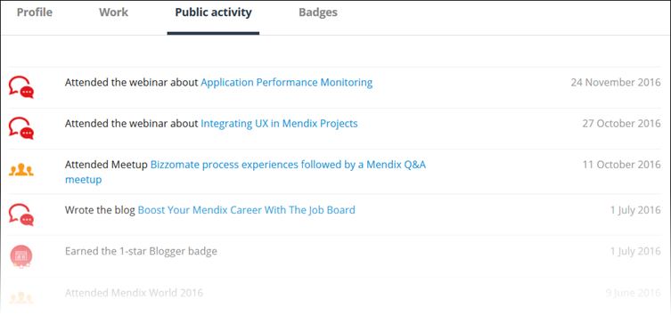
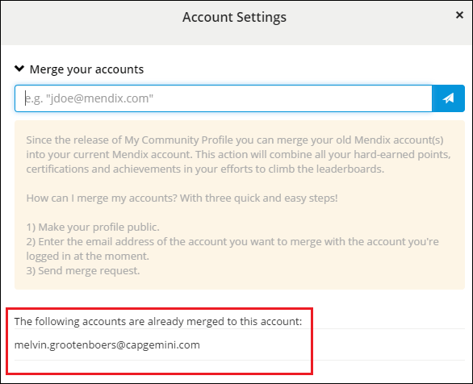

## 1 Introduction

So you’ve decided to check out your new Mendix Community Profile page, but you've found it suspiciously empty. Don’t worry, we're here to help you set up your profile so you can show the world what a real Mendix developer looks like!

**This how-to will teach you how to do the following:**

* Set up your Community Profile
* Merge your accounts
* Make your profile public

## 2 Prerequisites

Before starting this how-to, make sure you have completed the following prerequisites:

* Start a Mendix account (register [here](https://www.mendix.com/try-now/))

## 3 My Public Profile

The first thing you need to do is edit your [Community Profile](https://developer.mendixcloud.com/link/profile) page. To get there, hover over your picture in the right side of the navigation bar and select **MY COMMUNITY PROFILE**.

Your profile will open on the **My Public Profile** tab, which is the main page of your profile with your summary, industry experience, skills, projects, and other details.

[**Update screenshot**]

When you access your profile page through the **MY COMMUNITY PROFILE** link, it is automatically in edit mode so that you can easily update your profile. To make any edits on your profile, click this icon:

{}

If you access your profile via the **Developers** or **Leaderboards** tabs after clicking **Community** > [OUR COMMUNITY](https://developer.mendixcloud.com/link/community) in the navigation bar, your public profile will be displayed. Click **Edit Profile** to go into edit mode:

{}

You can edit the following header details:

* **Name**
* **Function**
* **Location**
* **Country**
* Whether you are looking for a **job**, a **project**, both, or neither
*   Your social media links (GitHub, Twitter, LinkedIn, and Skype)

    {}
    In order to receive Mendix points for your contributions to Mendix GitHub repositories (for example, [mendix / docs](https://github.com/mendix/docs)), you are required to authorize the connection to your GitHub profile. For more information on gaining Mendix points, see the [Points System FAQ](https://developer.mendixcloud.com/link/faq) and [How to Contribute to the Mendix Documentation](../documentation/contribute-to-the-mendix-documentation#GainingMendixPoints).
    {}

In the body of your public profile, you can edit the following elements:

* **Summary**
* **Industry Experience**
* **Skills**
* **Reviews**
*  **Projects** — to add a new project, click this icon:

    

    For details on adding a project, see [4 Adding a Project](#project)

[**Verify: what are reviews?**]

At each stage of editing your Community Profile and saving your changes, click **View Public Profile** to see how your profile looks:

To make your profile public, the following requirements must be met:

* You added an avatar
* You entered a **Function**
* You entered a **Location**
* You entered a **Summary**
* You added at least 1 skill
* You added at least 1 industry experience item
* Confirm if you are looking for a job or project

[**Verify**]

## 4 Adding a Project

[**Copy from Partner Profile**]

To add a new project, you 

## 6 My Badges

You can view your earned badges on this tab, but you cannot actually change anything here:

For details on how to earn badges, see [Become True Mendix Blue](https://developer.mendixcloud.com/link/faq).

## 7 Making Your Profile Public

When you’re done setting up your Community Profile, click the big blue **Make my profile public** button:

Make sure you meet all the requirements before making your profile public:

* You added an avatar
* You entered a **Function**
* You entered a **Location**
* You entered a **Summary**
* You added at least 1 skill
* You added at least 1 industry experience item
* Confirm if you are looking for a job or project

## 8 Public Activity

After you make your profile public, a new tab will be available on your public profile called **Public Activity**:

This tab lists the activities for which you have gained Mendix points. For details on gaining points, see the [Points System FAQ](https://developer.mendixcloud.com/link/faq).

## 9 Merging Your Accounts

Since the release of the Community Profile, you can merge your old Mendix account(s) into your current Mendix account. This action combines all your hard-earned points, certifications, and achievements in your efforts to climb the leaderboards.

There are five quick and easy steps to merge your accounts:

1. Go to your [Community Profile](https://developer.mendixcloud.com/link/ownprofile/).
2. Click **Make my profile public** to make your Community Profile public (for more information, see [6 Making Your Profile Public](#MakingYourProfilePublic)).
3. Click **Account Settings** on the right side of the screen.
4. Under **Merge your accounts**, enter the email address of the account you want to merge with your current account.
5. Click the send button to send a merge request.

We’ll take things from there, and the email address of the merged account will be shown in the list when the accounts have been merged:

{}

With this action we only combine the accounts. We don’t deactivate the old account(s). This should be done by that company’s administrator.

{}
