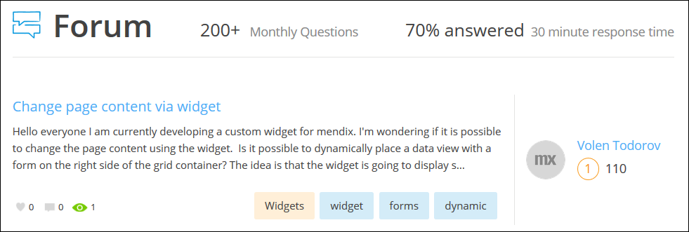
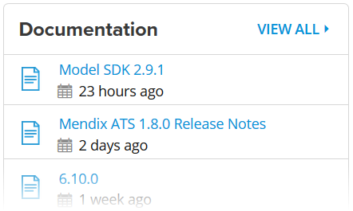
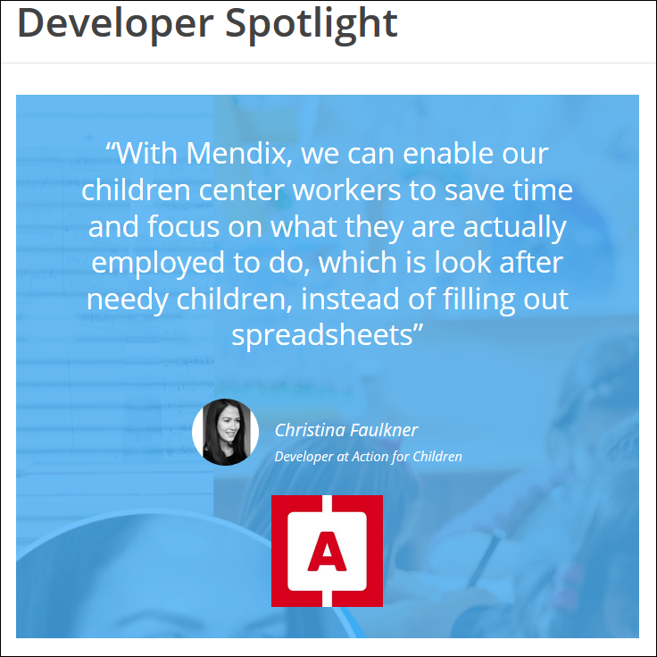
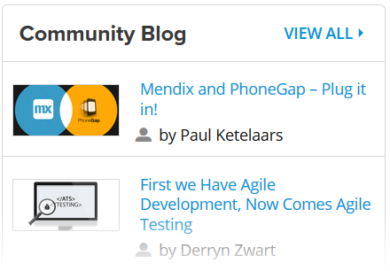
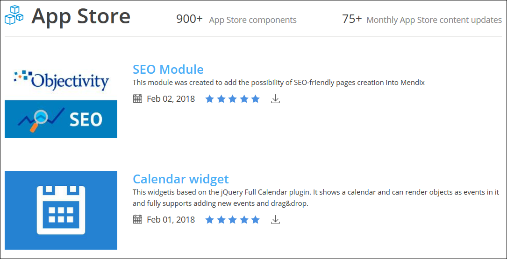
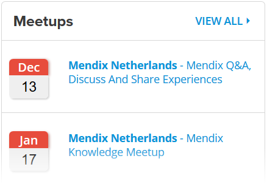
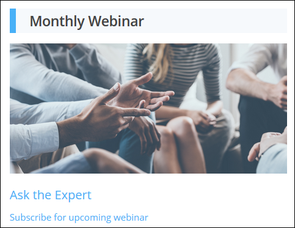

## 1 Overview

You can go to the [Mendix Community site](https://developers.mendix.com/) for all the information you need as a member of the Mendix community. Each section of the site is a community tool that is updated with all the new Mendix content and exciting developments. In addition, the content on the site is not only created for Mendix community developers, it's created by Mendix community developers.

## 2 Forum

On the [Mendix Forum](https://forum.mendixcloud.com/index3.html), you can ask questions and explore the knowledge offered by the entire Mendix Commnity. There are questions and answers on various topics as well as a specific **Idea Forum** for the submission of unique ideas on changes and improvements to the Mendix app platform.

The **Forum** section of the Mendix Developers site presents the latest questions being asked on the forum along with the author of the question and how long ago it was asked:

Click any question to go to that specific question page in the forum. Click **VIEW ALL** to go to the main Mendix Forum page, where you can browse all of the Community questions, answers, and ideas on many different topics.

For more information the Mendix Forum, see [The Mendix Forum](the-mendix-forum).

## 3 Documentation

The [Mendix Documentation](https://docs.mendix.com/) covers all aspects of the Mendix product. The reference guide documents the app platform and provides in-depth information on the Modeler and Team Server, for example. The how-to's present detailed instructions for building and customizing apps with Mendix. The API documentation contains several different sections, such as the business server API, the client API, and the Team Server API.

The **Documentation** section of the Developers site presents the latest documents to be published on the documentation site:

Click a document title to go to that specific page in the documentation. Click **VIEW ALL** to go to the main Mendix documentation page, where you can browse the how-to's, reference guide, API and SDK, documentation on Community tools, and documentation for APM, ATS, and AQM.

## 4 Developer Blog

The [Mendix Developer Blog](https://www.mendix.com/tag/developers/) presents blog posts from Mendix insiders on various topics that are of interest to the Community. This includes topics that are more technical in nature (for example, "Advanced Branching and Merging Strategies") as well as ones that deal with Community tools (for example, "the New Mendix Forum").

The **Developer Blog** section of the Developers site presents the latest developer blog posts:

Click any blog post title to go to the full text of that post. Click **VIEW ALL** to go to the Developer Blog page, where you can browse all of the different posts and read the ones that look most interesting to you.

## 5 Community Blog

The [Mendix Community Blog](https://developers.mendix.com/spotlight/) presents links to posts written by members of the Community on their own personal blogs. When a Comminity developer writes a great new blog post about what they've built with Mendix, they can submit it and it will be featured here.

The **Community Blog** section of the Developers site presents the latest Mendix Community blog posts:

Clicking any title will bring you to the full text of that blog post. Clicking **VIEW ALL** will bring you to the Community Blog page, where you can browse all the different posts and check out the perspectives of a variety of Community developers.

## 6 App Store

The [Mendix App Store](https://appstore.home.mendix.com/index3.html) is where you can find all the free sample apps, widgets, and modules made by Mendix Community members. This is all reusable content that can help you speed up your Mendix app development process.

The **App Store Updates** section of the Developers site presents the latest updates to the App Store content (for example, an update of the Bootstrap Tooltip widget):

Clicking any App Store content name will bring you to that specific page in the App Store, where you can read a detailed description of the content and check out some user reviews. Clicking **VIEW ALL** will bring you to the main Mendix App Store page, where you can see featured and new content, recent updates, reviews, and the top contributors to the App Store.

For more information, see the [App Store Overview](/community/app-store/app-store-overview).

## 7 Job Board

Because Mendix customers and partners are committed to changing their business and markets through digital innovation, they need top talent like you to make an immediate impact and a lasting difference. With the [Mendix Job Board](https://developers.mendix.com/jobs), you can find your next great career opportunity right now.

The **Jobs** section of the Developers site presents the latest job opportunities to be posted on the job board:

Clicking any job title will bring you to that specific page of the job board, where you can find all the details necessary on that particular job opportunity. Clicking **VIEW ALL** will bring you to the main page of the Mendix job board, where you can see all of the job postings.

For more information, see the [Mendix Job Board](the-mendix-job-board).

## 8 Meetups

Mendix regularly organizes and hosts knowledge meetups and Q&A sessions where Mendix enthusiasts can share knowledge and best practices as well as discuss experiences of working with the Mendix app platform.

The **Meetups** section of the Developers site presents the upcoming scheduled meetups:

Clicking any meetup title will bring you to that specific page on the [Mendix Developers Netherlands](http://www.meetup.com/Mendix-Netherlands/) site. Clicking **VIEW ALL** will bring you to the *meetup.com* site where you can search for and browse all of the meetups that Mendix offers.

## 9 Developer Interviews

Mendix loves interviewing its active Community developers about their background, experience with the Mendix app platform, and any "a-ha moments" they have experienced and then sharing this content with the world.

The **Developer Interviews** section of the Developers site lists the most recent interviews:

Click a title to go to the full text of that interview. Click **VIEW ALL** to see the full list of developer interviews available for your reading.

## 10 Webinars

There are many interactive and free webinars that Mendix produces available for the Community to gain an in-depth understanding of the inner workings of the app platform.

The **Latest Webinar** section of the Developers site presents the most recent expert webinar video:

Clicking **VIEW ALL** will bring you to the On-Demand Expert Webinars page, where you can browse all the available webinars and watch the ones you find interesting.

## 11 Training

[Mendix Learn](https://gettingstarted.mendixcloud.com/index3.html) offers both self-paced online training and classroom instruction from our team of experts. These training opportunities can be used in coordination with the Mendix Developer Certification Program to develop and validate your Mendix expertise.

The **Training** section of the Developers site presents a list of upcoming classroom courses and certification exams:

Clicking a specific training or exam session will bring you to the Mendix Academy Portal, where you can register for the event. Clicking **VIEW ALL** will bring you to the main page of the Mendix Academy, where you can read detailed information on the Mendix developer training certification program.
