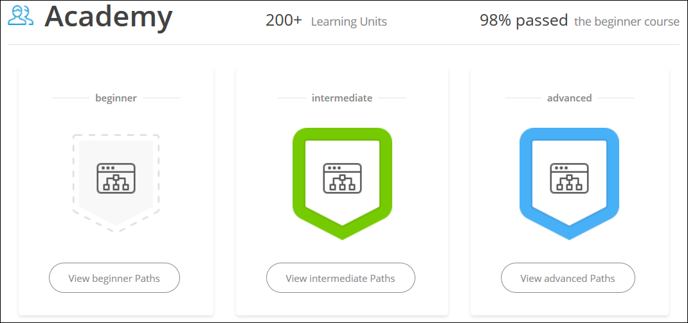
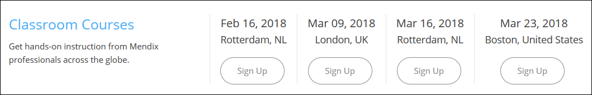

## 1 Introduction

You can go to the [Mendix Community site](https://developers.mendix.com/) for all the information you need as a member of the Mendix community. Each section of the site is a community tool that is updated with all the new Mendix content and exciting developments. In addition, the content on the site is not only created for Mendix community developers, it's created by Mendix community developers.

## 2 Forum

On the [Mendix Forum](https://forum.mendixcloud.com/index3.html), you can ask questions and explore the knowledge offered by the entire Mendix Commnity. There are questions and answers on various topics as well as a specific **Idea Forum** for the submission of unique ideas on changes and improvements to the Mendix app platform.

The **Forum** section at the top of the Mendix Community site presents the latest questions being asked on the forum along with the author of the question and how long ago it was asked:

Click any question to go to that specific question page in the forum. Click **Ask a question** to submit your own question to the forum.

For more information the forum, see [The Mendix Forum](the-mendix-forum).

## 3 Monthly Webinar

There are many interactive and free webinars that Mendix produces available for the community to gain an in-depth understanding of the inner workings of the app platform.

The **Monthly Webinar** section of the Mendix Community site presents a link to the upcoming webinar:

Don't worry if you can't make it for the next webinar. You can easily watch all past webinars on our [Webinars](https://gettingstarted.mendixcloud.com/link/webinar) page!

## 4 Meetups

Mendix regularly organizes and hosts knowledge meetups and Q&A sessions where Mendix enthusiasts can share knowledge and best practices as well as discuss experiences of working with the Mendix app platform.

The **Meetups** section of the Mendix Community site presents the upcoming scheduled meetups:

Click a meetup title of your interest to find out details about the location and agenda of the next meetup.

## 5 Academy

The Mendix Academy offers both self-paced online training and classroom instruction from our team of experts. These training opportunities can be used in coordination with the Mendix Developer Certification Program to develop and validate your Mendix expertise.

In the **Academy** section of the Mendix Community site, you can see links to our beginner, intermediate, and advanced learning paths on the [Mendix Learn](https://gettingstarted.mendixcloud.com/index3.html) platform:

Below that, you can see sign-up links for upcoming [Classroom Courses](https://gettingstarted.mendixcloud.com/link/classroom):

To figure out what you will learn next, check out the wealth of resources the Mendix Academy offers.

## 6 App Store

The [Mendix App Store](https://appstore.home.mendix.com/index3.html) is where you can find all the free sample apps, widgets, and modules made by Mendix community members. This is all reusable content that can help you speed up your Mendix app development process.

The **App Store** section of the Mendix Community site presents the latest updates to App Store content (for example, an update of the Bootstrap Tooltip widget):

Click the content item name to go to its page in the App Store, where you can read a detailed description of the content and check out some user reviews. Click **View all Apps** to go to the main Mendix App Store page, where you can see featured and new content, recent updates, reviews, and the top contributors to the App Store.

For more information, see the [App Store Overview](/community/app-store/app-store-overview).

## 7 Documentation

The [Mendix Documentation](https://docs.mendix.com/) covers all aspects of the Mendix Platform. The reference guide provides in-depth information on the Destkop Modeler, Web Modeler, and Team Server, for example. The how-to's present detailed instructions for building and customizing apps with Mendix. The API documentation contains several different sections, such as the Deploy API and Team Server API.

The **Documentation** section of the Developers site presents the latest updates on the documentation site:

Click a document title to go to that specific page in the documentation. Click **Documentation** to go to the main Mendix documentation page, where you can browse the reference guide, how-to's, release notes, API and SDK, ATS and AQM documentation, and much more.

## 8 Developer Spotlight

The **Developer Spotlight** section highlights [Mendix Developer Blog](https://www.mendix.com/tag/developers/) posts from Mendix insiders on various topics that are of interest to the community. This includes topics that are more technical in nature (for example, "Advanced Branching and Merging Strategies") as well as ones that deal with Community tools (for example, "the New Mendix Forum").

Click any blog post title to go to the full text of that post. There is a lot of great content on what Mendix developers are doing located here!
