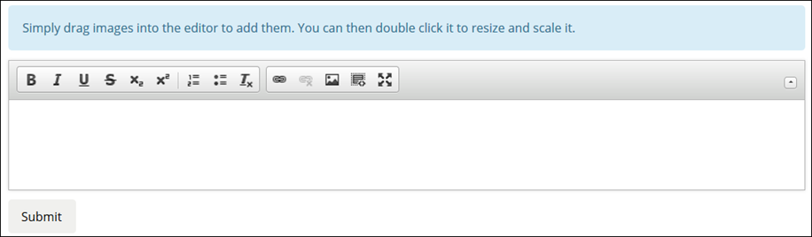

## 1 Introduction

The [Mendix Forum](https://forum.mendixcloud.com/index3.html) is where the Mendix Community comes together to help each other out with questions and answers and to propose ideas for improving the Mendix platform.

The forum is closely integrated with the Community Profile so that Mendix community members can see all the interesting and useful information about who is participating in the forum. If someone clicks your name anywhere on the forum, your Community Profile will open, so make sure you set your profile to public so everyone can see your details and progress!

There are two tabs available in the Mendix Forum: **Questions** and **Ideas**.

## 2 Questions Tab

**[Added created date and all contributors; name/avatar/etc. of dev who asked the question, not last updated; new screenshot of hovering; no more search box, new search functionality (update filter screenshot, take search box out); no longer click Copy to copy deep link (add note that URL is unique for each question/idea); favorite with heart, not star; new screenshots; Top Forum Contributors section (?): only available on Questions tab - use same text, make new screenshot; submit a question section (?); automatically subscribed for ones you add, click to unsubscribe]**

### 2.1 Questions Overview

On the **Questions** tab, you can see an overview of the questions that have been asked.

Here is an example of a question on the overview page:

Each question has a descriptive title (**1**). Clicking the question title opens the specific question and answers details page under the **Question** tab (for more information, see [2.2 Question and Answer Details Page](#QuestionDescriptionPage)).

Each question specifies the following elements:

* The beginning of the question description (**2**)
    * This is taken from the [question and answer details page](#QuestionDescriptionPage)
* The number of favorites (**3**), answers (**4**), and views (**5**) the question has received
* The category (**6**)
    * For example, **Microflows**
    * This is set when asking a question (for details, see [2.3 Asking a Question](#AskingaQuestion))
    * When you click a category, the overview page will list questions with that same tag
* The tags applied to question (**7**)
    * For example, **test**, **datagrid**, and **conditional-visibility**
    * These are set when asking a question (for details, see [2.3 Asking a Question](#AskingaQuestion))
    * When you click a tag, the overview page will list questions with that same tag
* The member of the Mendix community who asked the question (**8**)
* The member(s) of the Mendix community who answered the question (**9**)
* When the question was created (**10**)

Hovering your mouse cursor over the developer name brings up the developer profile card:

The developer profile card presents the Mendix points for the developer. Clicking the developer name on the card will bring you to their Community Profile.

#### 2.1.1 Sorting the Questions

The **Sort by** drop-down menu at the top of the screen has three options for sorting the questions on this page: **Last Updated**, **Newest**, and **Most Popular**.

#### 2.1.1 Searching the Questions

In addition to sorting, you can search the entire forum (both for questions and ideas) by clicking the search icon in the upper-right corner of the screen and entering keywords into **Search Mendix**.

Notice the following search details:

* The **Source** will be set to **Forum** by default; if you want to search other resources, set the source to **Documentation**
* You can set the **Type** of search results for the forum to **Question**, **Idea**, or both (default)
* You can filter by **Category** to get more refined results

#### 2.1.2 Filtering the Questions

To filter the questions that appear on the overview page, select from the following criteria on the right side of the screen:

* **My favorites** – the questions you have marked as favorites (for details on how to favorite an item, see [2.2 Question and Answer Details Page](#QuestionDescriptionPage))
* **My own questions** – the questions you have asked (for more information, see [2.3 Asking a Question](#AskingaQuestion))
* **Status** – the status of a question according to whether it remains **Unanswered**, has been **Answered**, or has been **Accepted answered** (meaning, it has been answered and the answer has been accepted)
* **Categories** – the categories set when the questions were asked (for more information, see [2.3 Asking a Question](#AskingaQuestion))
* **Tags** – the tags set when the questions were asked (for more information, see [2.3 Asking a Question](#AskingaQuestion))

    

### 2.2 Question and Answer Details Page

#### 2.2.1 Question Details

Clicking the title of a question will bring you to the details page for that question:

On this page, you can read the full descriptive text of the question and do the following:

* View the following question details (**1**):
    * When the question was **Asked**
    * How often the question has been **Viewed**
    * The date and time of the **Last activity** on the question (meaning, when it was last updated)
    * The **Category** of the question
    * The **Tags** applied to the question (when you click a tag, the overview page will list questions with that same tag)
    * The **Modeler version** set when the question was asked (for more information, see [2.3 Asking a Question](#AskingaQuestion)
* Click the up or down arrow buttons to upvote or downvote the question based on its usefulness (**2**)
* Click the heart to favorite the question (**3**)
* Click **Add comment** to write and submit a comment on the question (**4**)

#### 2.2.2 Answers

Below the question details are the answer(s) to the question. Click the up or down arrow buttons to upvote or downvote the answer based on how it addresses the question. You can also click **Add comment** to comment on an answer, as "Anthony Dickinson" did here:

Below the answer(s), you can contribute to the forum by writing your own answer in the editor and then clicking **Submit answer**:

{}

You can easily upload your images in the forum by dragging them directly into the text editors. In order to resize and position an image, double-click it in the editor or click the image button in the toolbar:

{}

### 2.3 Asking a Question

It's never been easier to ask a question on the Mendix Forum. But before you submit a new question, be sure to search the forum for similar questions that have already been asked. There may be someone else who has already posted the same question!

To ask your own question on the forum, follow these steps:

1. Click **Ask a question** on the main page of the [Questions tab](#QuestionsTab):

    

2. On the **Ask your question** page, fill in the following details in the editor:

    

    * The **Title** of your question (remember, this is how forum users will first see your question, so make the title descriptive and interesting)
    * The **Text** of your question (add all the details about your question to make it searchable and so other users can answer it; consider including steps to reproduce the issue)
    * The **Modeler version** on which you encountered the issue you have a question about
    * The **Category** that reflects your question (for example, **Connectors**, **Databases**, **Security**)
    * The **Tag(s)** that reflect the topic of your question (which other users can use to filter the list of questions)

3. Click **Ask your question**.

#### 2.3.1 Accepting an Answer

Once a question you have asked receives several answers (for more details on answering questions, see [3.1.2 Answers](#Answers)), you can accept an answer by clicking this button:

You should accept the answer that properly and accurately responds to your question in the best way possible.

## 3 Ideas Tab

**[delete copy deep link; new screenshots; automatically subscribed for ones you add, click to unsubscribe]**

### 3.1 Ideas Overview

This tab presents an overview of ideas and feature requests for improving the Mendix platform that have been submitted by Mendix Community members.

All the submitted ideas are publicly visible, and each idea has a descriptive title (**1**). Clicking the idea title opens the specific idea details page under the **Ideas** tab (for more information, see [4.1 Idea Details Page](#IdeaDescriptionPage)).

Each idea specifies the following elements:

* The number of **Votes** (**2**), **Comments** (**3**), and **Views** (**4**) for the idea
* The beginning of the idea description (**5**)
    * This is taken from the [idea and comment details page](#IdeaDescriptionPage)
* Tags (**6**) (for example, **datagrid**, **listen-target**, **conditional-visibility**)
* The category (**7**) of the idea
    * This is set when submitting an idea (for details, see [4.2 Submitting an Idea](#SubmittingAnIdea))
* When the idea was created (**8**)
* The name, avatar, points, and level of the developer created the idea (**9**)

The **Sort by** drop-down menu at the top of the screen has three options for sorting the ideas on this page: **Last Updated**, **Newest**, and **Most Votes**.

In addition to sorting, you can filter the ideas by entering keywords into the search box or by selecting from the following criteria on the right side of the screen:

* **My favorites** – the ideas you have starred and marked as favorites (for details on how to favorite an idea, see [4.1 Idea and Comment Details Page](#IdeaDescriptionPage))
* **My own ideas** – the ideas you have submitted (for more information, see [4.2 Submitting an Idea](#SubmittingAnIdea))
* **Categories** – the categories set when the ideas were submitted (for more information, see [4.2 Submitting an Idea](#SubmittingAnIdea))
* **Tags** – the tags set when the ideas were submitted (for more information, see [4.2 Submitting an Idea](#SubmittingAnIdea))

### 3.2 Idea and Comment Details Page

Clicking the title of an idea will bring you to the details page for that idea:

On this page, you can read the full descriptive text of the idea and do the following:

* View the following question details (**1**):
    * When the ideas was submitted (**Asked**)
    * How often the idea has been **Viewed**
    * The date and time of the **Last activity** on the idea (meaning, when it was last updated)
    * The **Status** of the idea – these are the possible statuses:
        * **Open** – the idea has not been reviewed yet
        * **Scheduled** – the idea has been accepted by the Mendix Product Managers and scheduled for implementation
        * **Implemented** – the idea has already been implemented
        * **Closed** – the idea has been reviewed by the Product Managers but it has not been accepted
    * The **Tags** applied to the idea (clicking a tag will list ideas with that same tag under the **Ideas** tab)
    * The **Category** of the idea
* Click **Copy** to copy the deep link to the idea and share it (**2**)
* Click **Vote** to upvote the idea (**3**)
    * By upvoting ideas, you can show the Mendix Community and the Product Managers what you would like to see added to the Mendix platform
    * The upvotes will be used as input for the Product Managers and the Mendix Community MVPs to decide which features will be nominated for implementation.
* Click the star to favorite the idea (**4**)

Below the idea details are the comments on the idea:

Below the comments, you can write your own comment in the editor and then click **Submit**:

### 3.3 Submitting an Idea

If you have a great idea that you would like to see implemented on the Mendix platform, we want to hear it! But please make sure you search the idea forum for similar ideas before submitting a new idea. There may be someone else who has already posted the same idea!

To submit your own idea to the idea forum, follow these steps:

1. Click **Submit idea** on the main page of the [Ideas tab](#IdeasTab):

    

2. On the idea editor page, fill in the following information:

    

    * The **Title** of your idea (this is how forum users will first see your idea, so make the title descriptive and interesting)
    * The text of your idea (add all the details about your idea to make it searchable and so other users can vote and comment on it)
    * The **Category** that reflects your idea (for example, **App Store**, **Connectors**, **Microflows**)
    * The **Tag(s)** that reflect your idea (which other users can use to filter their searches)

3. Click **Save idea**.
