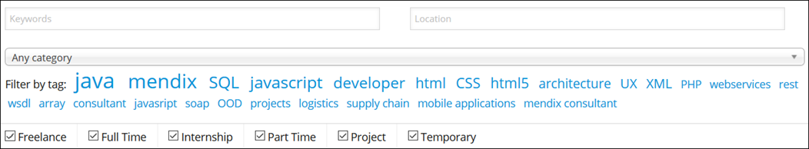
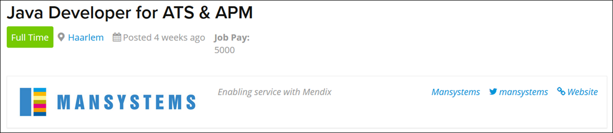
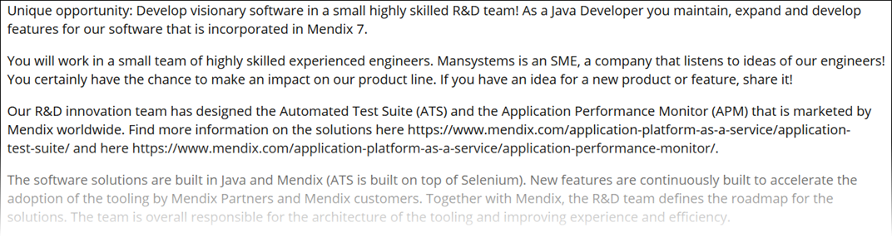
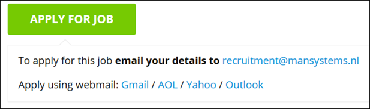
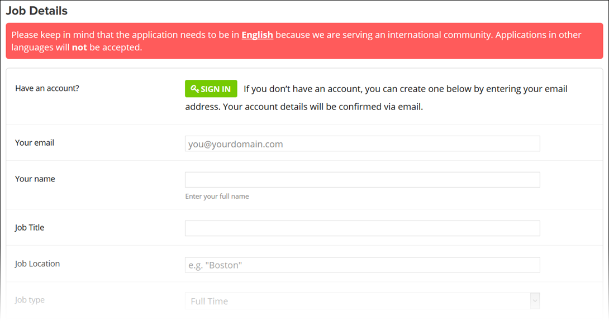
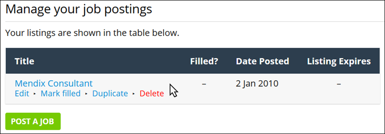

## 1 Introduction

On the [Mendix job board](https://developers.mendix.com/jobs/), anybody can post and find a Mendix-related job. The Mendix job board benefits employers, job seekers, those looking to start with Mendix, as well as the whole Mendix Community.

The job board brings the Mendix customers, partners, and developers together in one place. With tens of thousands of visitors each month, the job board is the perfect place for employers to post their jobs and find the right developers for their team. Mendix Community developers can use the job board to find potential new challenges, jobs, and projects.

In addition to being a platform for finding and posting jobs, the job board enables discovering the advantages of becoming a Mendix developer. Mendix has a customer list that is growing fast, which means that as the number of implementations increases, the need for Mendix developers increases as well. Developers looking to get into Mendix can easily see the high demand for Mendix developers, proving that their choice to switch to Mendix is the right one.

## 2 Finding a Great Job

When browsing the list of jobs on the [Mendix job board](https://developers.mendix.com/jobs/), you can narrow your search with the following options:

* There are two search boxes above the list of jobs where you can filter according to **Keywords** describing the job (for example, a specific job title) and the **Location** of the job
* In the category drop-down menu, the default is **Any category**
    * You can refine your search by selecting the **Jobs** category (for permanent positions) or the **Projects** category (for specific projects) in this drop-down menu
* You can **Filter by tag** by clicking a specific tag (for example, "java," "SQL," "consultant"), because each posted job has a maximum of three tags
* You can filter according to the job type by selecting or clearing the following check boxes: **Freelance**, **Full Time**, **Internship**, **Part Time**, **Project**, and **Temporary**

Each job listing on the job board presents the following information:

* Company name
* Job title
* Location
* When the job was posted
* Type of job

When you find a job you are interested in, click the job title (for example, "Java Developer for ATS & APM," "Mendix Engineer," "Mendix Consultant") to go to the job details page. The job details page presents the following details in the header:

* Job title
* Type of job
* Location (click this to see the location on a map)
* When the job was posted
* Job pay
* Company name, logo, and tagline
* Company name for filtering (click this to view more jobs at this company)
* A link to the company's Twitter account
* A link to the company's website

Below the header, there is a full description of the job:

To apply, click **APPLY FOR JOB** at the bottom of the job details page, which will open up details on applying for this specific job by sending an email or going to the company's website:

{}

Newly posted are also announced on the [@MendixDeveloper](https://twitter.com/MendixDeveloper) Twitter account!

{}

## 3 Posting a Job

To hire the best of the best for your next Mendix application, click **POST A JOB** on the main page of the [Mendix job board](https://developers.mendix.com/jobs/), which will open up the **Post a New Job** page. To post a job listing, you need a Mendix job dashboard account:

* If you have an account already, click **SIGN IN** in the **Job Details** section to sign in and then post your job
* If you are posting a job for the first time, enter **Your email** address (in addition to all the **Job Details** and **Company Details** for the job listing), and an account will be automatically created for you
    * Your username will be created based on the email address you enter
    * With this account, you can manage all of your job listings (for more details, see [4 Mendix Job Dashboard](#MendixJobDashboard))

After you enter all the **Job Details** and **Company Details** for the job, press **Preview** at the bottom of the page. On the preview page, you can examine your job listing before submitting it. To edit the job listing further, click **EDIT LISTING**. To submit the listing to the job board, click **SUBMIT LISTING**.

Each submitted job listing is reviewed and proofread by Mendix. If there is any issue or question, you will be contacted to update the job listing and resubmit it.

## 4 Mendix Job Dashboard

With a Mendix job dashboard account, you can post job listings regularly on the Mendix job board as well as manage these listings. To manage the job listings, click **ACCESS JOB DASHBOARD** on the main page of the [Mendix job board](https://developers.mendix.com/jobs/).

The [Mendix job dashboard](https://developers.mendix.com/jobs/job-dashboard/) lists the jobs you have posted. Each job listing includes the job’s title, if the position has been filled, and the date the listing was posted.

Hovering your mouse cursor over a job listing will enable the following action buttons:

* **Edit** — click this to edit any detail of the listing 
    * You can edit jobs you have already submitted as well as jobs that are still pending approval
    * This way, you can easily edit these details without having to contact Mendix or post a new job
* **Mark filled** – click this to mark the job as filled
    * This will grey out the job on the job board, but it will not remove the listing
    * This way, the Community can see what the job offering was, even though the position has been filled
* **Duplicate** — click this to duplicate the selected job into a new draft job for editing
    * This is useful when you're posting multiple positions that have similar descriptions
* **Delete** — click this to delete old and obsolete jobs
    * Keep in mind that this is permanent and cannot be reversed!
