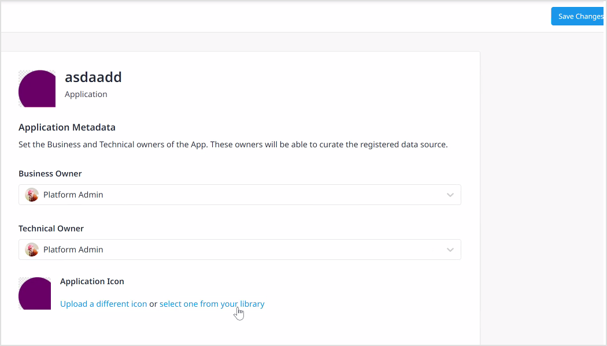
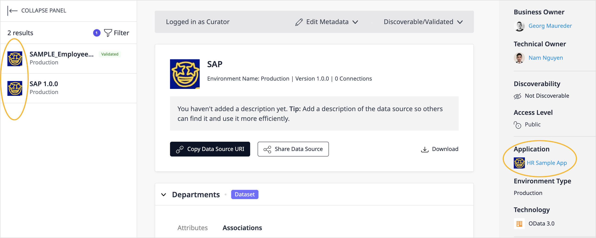
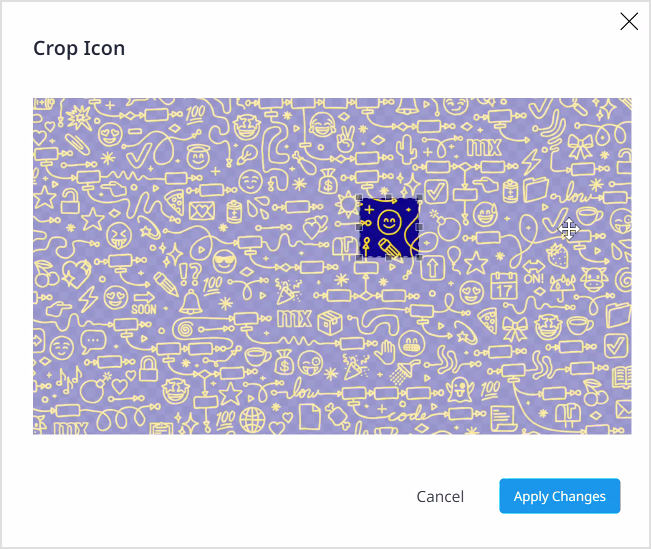
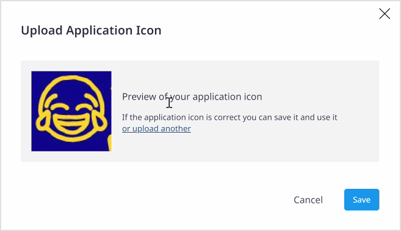
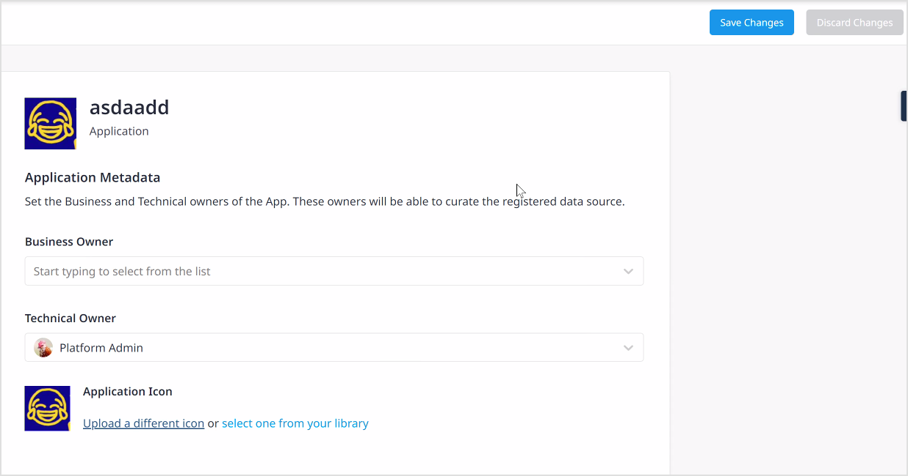
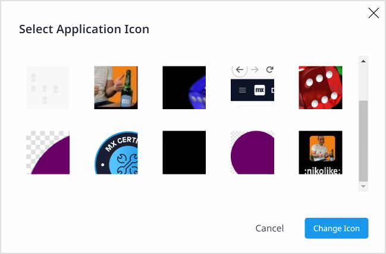

## 1 Introduction

Owners of data assets, curators, and Mendix Admins can curate registered assets. Curation in Data Hub is the process of enriching the metadata and providing further information about the exposed data sources, datasets and attributes. You can add custom application icons, Catalog-specific descriptions, and tags to supplement the registered metadata. Curate functions in Data Hub include setting the [Discoverability](#discoverability) of data sources, indicating whether the data source is [validated](#validated), and specifying the [Business and Technical Owners](#custom-owner).

Users who can curate assets in Data Hub Catalog are as follows:

* Owners of a registered service – can curate their own services which includes those that have been set to non-**Discoverable**
* [Data Hub Curators](/data-hub/#curator) and [Mendix Admins](/data-hub/#admin) – can curate and find all registered assets in the Catalog

Owners and Curators can also get an overview of the registered assets they own and curate from the [Curate](#curatelist) tab of Data Hub.

{}
Information that is added or changed during curation is stored in the Data Hub Catalog for that item. It will not be added to the OData service contract or metadata files or affect any of the values in the metadata files associated with the service or the data associated with the exposed datasets.
{}

## 2 Curate List {#curatelist}

Owners and curators of registered assets can click **Curate** from the **Data Hub** screen to see the **Curation List** screen which provides an overview of all the registered assets that you can curate as an owner under the **My Assets** tab. Curators will also see the **Company Assets** tab that lists all the registered assets:

In both cases, the list includes registered data sources and also individual datasets that are exposed for the data source.

You can search for specific assets by entering a search string in the search bar or **Filter By:** **Environment** or **Validated** assets.

The list can be also be sorted by any of the columns by clicking on the column header.

Click **View** to display the asset details. You can then perform curate actions to add Catalog specific information to the asset metadata.

## 3 Curation Bar

Curation is performed from the [asset details screen](search#search-details). If you are an owner of an asset or are a curator, you will see the **Curation Bar** for the selected item. The following shows the curation bar for a selected service:

{}
Owners of registered assets and can only curate their services.
{}

On the **Curation bar**, information about the role of the current user is displayed: **Owner** or **Curator**.

When a data source is selected in the **Search Results**, the following options are displayed via **Edit**:

* **Edit Metadata** – edit the description of the data source and datasets, add tags, or specify business and technical owners and add change the application icon
* [Discoverable/Validated](#discoverability) – set the **Discoverable** and **Validated** settings for the data source from the drop-down menu
 * **Discoverable** defines whether the service is visible and can be found (and consumed) by users of the Data Hub; if a service is set to **Non-discoverable**, only the owners of the service (**Business** and **Technical**) and curators can find the registered data source
 * **Validate** indicates that the data source and datasets have been validated.
 * **Delete Data Source** allows Owners to delete their own data sources, while Curators or Admins can delete any data sources in the company.

When a dataset is selected in the **Search Results**, the **Edit Dataset Details** option is displayed for editing the dataset and attribute descriptions.

## 4 Editing the Metadata of an App {#curate-application}

The curate functions that are available for a selected data source are to change **Application Details** or **Data Source Details**. This section describes the application details that can be changed: changing owners or changing the application icon.

You can curate Application Details from the **Application Details** screen as follows:

1. In the **Curation Bar** click **Edit** > **Edit Metadata** > **Application Details**.
2. The **Application Metadata** screen is displayed:

   

### 4.1 Changing Owners of an App {#changing-owners}

The **Technical** and **Business Owners** are displayed as a link in the asset **Metadata** pane so that users can contact them through the email that is provided for them.

By default, the **Technical Owner** for a registered asset is the user who registered the data source when registration is done through the deployment pipeline in Studio Pro. The owners can also be specified during manual registration using one of the connectors in the Data Hub Home and also when registering assets using the Data Hub API.

{}
**Business** and **Technical Owners** have curation rights for the registered data source in the Data Hub Catalog only if they are *registered users* on the Mendix Platform. If a **custom owner** is *created* with the process described in this section, the link to contact them will be displayed for the asset but this does not mean that they are able to access the asset in Data Hub or curate it.{}

App owners can be changed by users with curation rights (owners and curators) from the **Application Details** screen.

{}
If you as a **Technical Owner** curate the application and change the technical owner to a different user, then you will no longer have curation rights to the asset once you save the changes. If the [Discoverability](#discoverability) is turned off for the asset, then you will also not be able to find the asset in the Catalog.{}

{}
Curators and Mendix Admins can manage the lists of custom owners as part of **Administration** functions. For details, see the [Owners](/developerportal/control-center/data-hub-admin#custom-owners) section of *Data Hub Administration*.
{}

#### 4.1.1 Changing the Business & Technical Owners of an App {#changing-owner}

To change the **Business Owner** or **Technical Owner**, from the **Application Metadata** screen, click in the name field of the **Business** or **Technical** owner. You can start typing or select from the drop-down list of names. Mendix platform users will be displayed with their avatar and custom owners will be shown with an avatar that displays their initials.

#### 4.1.2 Adding a Custom Owner {#custom-owner}

When curating the owners of an application, you can specify an owner who is not a registered Mendix user but is the technical contact point for the application, or the owner of the data that is made available in the app – the **Business Owner**. The name and the contact email must be provided.

Curators can manage the lists of custom owners as an **Administration** task. For more details, see the [Owners](/developerportal/control-center/data-hub-admin#custom-owners) section of *Data Hub Administration*.

To add a custom owner follow these steps:

1. From the **Application Metadata screen** if you start typing the name of an owner and it is not in the drop-down list, you will be prompted if you want to **Create** it. Click on the prompt and the **Enter New Custom Owner Details** pop-up is displayed:

    {}{}

1. Enter the **Name** and **Email** of the owner and click **Save**.

    {}When you create or select a custom owner for an application, this will be displayed in the **Asset Metadata** pane as a link to the email specified. Custom owners will have curate or access rights to the Catalog or the asset in the Catalog. Only Mendix users that are added as an owner can curate assets they own. {}

1. Click **Save** to return to the **Application Metadata** screen. Click **Save Changes** to return to the asset details screen where the changes will be displayed in **Metadata** pane.

### 4.2 Changing the App Icon {#application-icon}

You can change the icon that is displayed for the app and the data source by uploading your own custom application icon or selecting one from Data Hub the icon library. The selected icon will be displayed for all endpoints of the application and data source such as the Catalog search results and also in the Mendix Studio Pro [Data Hub pane](/refguide/data-hub-pane) and Studio **Data Source** pane.

{} When you change an application icon all data sources (published OData services) that are registered in the Catalog for that application will show the new icon. For example, the following shows two data sources that are published from the **HR Sample App** which are listed in the search results pane (**SAMPLE_Employee…** and **SAP 1.0.0**). They both display the same icon that was set for the app:

 {}

Currently, by default, the application icon is determined by the application type when the data source is registered. For example, for Mendix apps the Mendix Icon is displayed which identifies the technology of the source app.

#### 4.2.1 Uploading a Custom Icon Image File

When you want to upload a custom icon or image, the following apply:

* The accepted file types are *.png*, *.jpg*, and *.jpeg*

* The maximum accepted file size is 50 KB

  {} You will be able to upload a large file, and crop it to reduce the file size during the operation.{}

* The *minimum* recommended size of the image is 64 pixels x 64 pixels. You can crop larger images and select the area you want to display during the upload operation.

   {}If smaller images are selected, they will be expanded to meet the 64 x 64 size which may result in degradation of image quality. Ensure that your original file meets the recommendations for an optimal display.{}

* Custom icons that are uploaded will be saved to the **Icon Library** and can be used for other apps.

To **upload a different icon** for the app follow these steps:

1. In the **Application Metadata** screen of the selected data source, click **Upload a different icon** to display the **Upload Application Icon** pop up:

    {}{}

2. Drag the image file into the upload area or click **Upload** to browse and select a file from your file system. Click **Step 2: Crop image** to proceed.

3. Move the wire-frame to select an area of the loaded image and change the size of the wire-frame to crop the image to the area that you want to use. When you are satisfied, click **Apply Changes**:

    {}{}

    {}For high-resolution images, if the selected are exceeds the size limit there will be a warning. Select a smaller area of the image to reduce the file size.{}

4. A preview of the application icon is shown. Click **Save** to upload the selected icon.

    {}{}

5. The **Application Metadata** screen will now show the selected icon for the application:

    

6. Click **Save Changes** to return to the data source details page. The custom icon will be stored in the **Icon Library**.

#### 4.2.2 Selecting an Icon from the Library

An alternative to uploading an icon is to use an existing icon by clicking **select one from your library**. The icons for your Data Hub will be shown and you can select one and click **Change Icon**.

{}{}

## 5 Editing the Metadata of a Data Source {#service-details}

You can curate data sources to add a Catalog description and add tags.

### 5.1 Adding or Editing a Catalog Description

If a description was included in the OData metadata contract, this will be displayed in the asset details screen for the selected data source. You can curate a data source to add a catalog description that could include further details on, for example, the data usage and relevancy.

As search in the Data Hub also includes searching the contents of the description fields of registered assets (data sources, datasets, attributes, and associations), adding relevant descriptions can help in the right users finding these shared assets.

You can also specify if the OData service **Contract Description** or the **Catalog Description** is displayed in the Data Hub Catalog.

{}If there is a **Catalog Description** for a service, both descriptions will be retained for the service in the Catalog regardless of the one that is selected for display in the **Asset Details** screen. {}

To edit the asset metadata, follow these steps:

1. In the **Curation Bar**, click **Edit** > **Edit Metadata** > **Service Details** to display the **Service Metadata** box:

    

2. The description from the OData service metadata is displayed in the **Contract Description**. This cannot be changed, as it is part of the OData service definition. You can provide an alternative description by toggling **Use the catalog description** to display the **Catalog Description** box:

    

3. Add a catalog description. This will be stored with the service details in the Catalog.

    {}If a **Catalog Description** has been given for a service, both descriptions will be registered with the service in the Catalog. If you have selected to display the **Contract Description**, the **Catalog Description** will be retained providing the option for curators to display this as desired. {}

4. Click **Save Changes** to save the changes that you have made to the **Edit Service Metadata** screen and return to the **Service Details** screen, which will now display the selected description.

{}If you leave a metadata editing session without saving your change, you will loose all the changes from that session. {}

### 5.2 Adding or Editing Tags to a Service {#tags}

Add tags to categorize a registered service and provide additional means for finding the service. Tags that are specified for a service also apply to the datasets and attributes that are exposed in the service. Specify tags for the selected service by following these steps:

1. In the **Search Details** screen of a selected service, click **Edit** > **Edit Metadata** > **Service Details** in the **Curation Bar** to display the **Service Metadata** box.

2. To add tags, click the empty **Tag** input area:

    

3. To add or edit the tags, enter a tag string and press **Enter** or select one from the list of existing tags that are used in the Data Hub Catalog and displayed when you start typing in the **Tag** field. To separate multiple tags, use spaces.

    {}Tags can only contain lower-case letters, numbers, and underscores. They must have a minimum of 2 characters. If you use capital letters when typing the tag string, they will be converted to lower-case. {}

4. You can enter multiple tags separated by spaces. You can remove tags by clicking the **x**:

    

5. When you are finished specifying the tags, click **Save Changes** to register the changes and the tags will be shown in the **Service Metadata** pane.

    {} If you leave a metadata editing session without saving your change, you will loose all the changes from that session. {}

## 6 Discoverable & Validated {#discoverability}

The discoverable and validated properties of registered assets can be set from the Curate bar for the selected asset.

### 6.1 Discoverable

The discoverability is set at a data source level. When a data source is registered in the Data Hub catalog, **Discoverable** is set to the company default value, which is configured by the Mendix Admin in [Control Center](/developerportal/control-center/data-hub-admin#settings). If **Discoverable** is on for a data source, all users can find the asset and see the details of it. The **Discoverable** setting will apply to all datasets that are exposed in the data source.

When the **Discoverable** setting is turned off, it will only be visible to the owners of the service and curators and the Mendix Admin. All other users of Data Hub (also through the Data Hub integrations in Studio Pro and Studio) will not be able to see an asset whose discvorabilty is turned off.

When a data source is set to non-**Discoverable**, the data source, and the datasets that are exposed cannot be found by other users (except by owners and curators). However, there may be instances of the same datasets in the Catalog, from the same apps, that are available through other discoverable services.

{}The **Share Data Source** and **Share Dataset** links will not be accessible to users for a not-discoverable data source and the exposed datasets (unless they are an owner or a curator).
{}

{}To enable users of Mendix Studio and Studio Pro (and any Data Hub API clients) to consume datasets from registered data sources, owners must ensure that Discoverability is turned on. Data sources that are set to **not Discoverable** in the Catalog will not be included in the search results for *any* user for these clients. {}

To change the discoverability of a service, follow these steps:

1. In the Data Hub Catalog, select the service to display the **Search Details**.

2. If you have curation rights, the **Curation Bar** is displayed. Click the drop-down **Discoverabile/Validated** menu:

   

3. Click the **Discoverable** toggle to turn it on or off. A message is displayed to indicate the discoverability of the asset and the discoverability icon is updated in the search results and the data source details.

   

### 6.2 Validated {#validated}

The **Validated** property can be assigned to a data source or a dataset to indicate, for example that it has been qualified and is a reliable asset. It can turned on and off by clicking the **Validate** toggle. A validated data source or dataset is indicated by the validation shield on the data source details screen and also in the search results pane.

Setting an asset as **Validated** contributes to the weighting of the asset in the search results. This means that **Validated** assets will be listed before not-validated assets in the results. The weigting of the validation property is also cumulative for a data souce and the consituent datasets. For example, if there is a dataset named **Customer** that is **Validated** in a **Validated** data source, the search results will list this higher than a dataset of the same name that is not **Validated** in a **Validated** data source.

## 7 Curating Datasets & Attributes {#curate-datasets}

Datasets and their exposed attributes can be curated to add **Catalog descriptions**. Catalog descriptions are stored in the Data Hub Catalog and you can specify which description is displayed: the service contract or the Catalog.

To change dataset and attribute descriptions, follow these steps:

1. In the **Search Details** screen for the selected dataset, click **Edit Dataset Details** on the **Curate** bar to display the **Dataset Metadata** box:

    

2. The service metadata contract description is displayed. To edit and use a **Catalog Description**, click the toggle and enter a description.
3. When there are a large number of attributes for a dataset, you can use the search area to find specific attributes.
4. Click **Save Changes**.

{}If a **Catalog Description** has been specified for a dataset or attribute, this will be retained even if the toggle is set to display the **Contract Description**.{}
