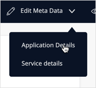

## 1 Introduction

Curation is the processes of maintaining registered services and enriching the metadata of registered assets in the Data Hub Catalog to provide further information about the services as well as the entities and attributes exposed in the services. You can add catalog descriptions and tags to supplement the registered metadata in order to categorize the shared data. A primary curate function is setting the [**Discoverability**](#discoverability) of registered assets, which determines if users can see (find and use) the registered asset. 

Users with curation rights for the Data Hub Catalog are as follows:

* Business Owners and Technical Owners of a registered service – can curate their own services and find non-discoverable services that they own
* [Data Hub Curators](../index#curator) and [Data Hub Admins](../index#admin) – can curate and find all registered assets, discoverable and non-discoverable

{}
Information that is added or changed during curation is stored in the Data Hub Catalog for that item. It will not be added to the OData service contract or metadata files or affect any of the values in the metadata files associated with the service or the datasets associated with the exposed entities. 
{}

## 2 Curation Bar

Curation is performed in the Search Details** screen. Users with curation rights will see the **Curation Bar** in the **Search Details** screen of the selected item: 

{}
Owners of registered assets and curators can only curate their services.
{}

On the **Curation bar**, the following details are displayed:

* Information about the role of the current user: owner or curator
* When a service is selected in the **Search Results**: 
	* **Edit Metadata** – edit the description of the service and entities, add tags or specify Business and Technical Owners
	* **Discoverable/Validated** – set the service as **Discoverable** and **Validate** from the drop-down menu. 
	  * **Discoverable** defines whether the service can be found (and consumed) by users of the Data Hub; if a service is set to **Non-discoverable**, only the owners of the service (**Business** and **Technical**) can find the registered service. 
	  * **Validate** indicates that the service and data set have been validated.
* When an entity is selected in the **Search Results**, **Edit Entity Details** – to edit entity and attribute descriptions 

## 3 Setting the Discoverability of a Service{#discoverability}

By default, when a service is registered in the Data Hub catalog, it is set to **Discoverable**, which means that all users can find, consume, and see details of the service. 

When a service is set to **Not Discoverable**, it will only be visible to the owners of the service and curators and not be visible to other users of the Data Hub Catalog. This means that it cannot be found, either in the Data Hub Catalog or by users of the Data Hub integration in Studio Pro and Studio.

{}
When a service is set to **Not Discoverable**, neither the service nor the entities that are exposed by the service can be found by other users. However, there may be instances of the same entities being available through other services that are published in the Data Hub Catalog.
{}

To change the discoverability of a service, follow these steps:

1. In the Data Hub Catalog, select the service to display the **Search Details**.
2.  If you have curation rights, the **Curation Bar** will be displayed. Click **Discoverability** to display the **Discoverable** toggle:

	

3. To turn off **Discoverability**, click the toggle. A message will be displayed to indicate that the service is no longer discoverable.

	 

## 4 Curating Services 

A service can be curated to specify the owners of the app and also add or edit the descriptions and tags for the selected service. 

### 4.1 Changing the Technical and Business Owners of an App

By default, the **Technical Owner** for a registered service is the user who registered the service when registration is done through the deployment pipeline in Studio Pro or specified during manual registration. Services can be curated to add a business owner. The Technical and Business Owners are displayed in the **Service Metadata** pane and provide a contact point for users. 

{}
Both Business and Technical Owners have curation rights for the registered service in the Data Hub Catalog.
{}

To change the owners of the app of the selected service, follow these steps:

1.  In the **Service Details** screen for the selected service, in the **Curation Bar** click **Edit Metadata** > **Application Details**:

	

2.  The **Application Metadata** dialog box is displayed. You can set or change the **Business Owner ** and **Technical Owner** from this page. They will be displayed in the **Service Metadata** panel in the **Search Details** screen.

	
	
3. Click **Back to** to return to the **Service Details** screen.

### 4.2 Changing the Service Description

If a description was included in the OData metadata contract, this will be displayed in the **Search Details** screen for the selected service. You can curate a service to add a catalog description to include further details on data usage and relevancy. As search in the Data Hub Catalog also includes searching the contents of the description fields of registered services, entities, and attributes, adding relevant descriptions can help in the right users finding these shared assets.

You can also specify if the OData service **Contract Description** or the **Catalog Description** is displayed in the Data Hub Catalog. 

{}
If a **Catalog Description** is given for a service, both descriptions will be registered for the service in the Catalog and can be curated to set whether the catalog or the contract description is displayed. 
{}

To edit the service metadata of a selected service, follow these steps: 

1.  In the **Curation Bar**, click **Edit Metadata** > **Service Details** to display the **Service Metadata** box:

	

2.  The description from the OData service metadata is displayed in the **Contract Description**. This cannot be changed, as it is part of the OData service definition. You can provide an alternative description by toggling **Use the catalog description** to display the **Catalog Description** box: 

	

4.  Add a catalog description. This will be stored with the service details in the Catalog. 

	{}If a **Catalog Description** has been given for a service, both descriptions will be registered with the service in the Catalog. If you have selected to display the **Contract Description**, the **Catalog Description** will be retained providing the option for curators to display this as desired.
	{}

5.  Click **Save Changes** to save the changes that you have made to the **Edit Service Metadata** screen and return to the **Service Details** screen, which will now display the selected description.

	{}If you leave an **Edit Metadata** session without saving your change, you will loose all the changes from that session. 
	{}

### 4.3 Adding or Editing Tags for a Service{#tags}

Add tags to categorize a registered service and provide additional means for finding the service. Tags that are specified for a service also apply to the entities and attributes that are exposed in the service. Specify tags for the selected service by following these steps:

1. In the **Search Details** screen of a selected service, click **Edit Metadata** > **Service Details** in the **Curation Bar** to display the **Service Metadata** box.
2.  To add tags, click the empty **Tag** input area:

	

3. To add or edit the tags, enter a tag string and press **Enter** or select one from the list of existing tags that are used in the Data Hub Catalog and displayed when you start typing in the **Tag** field. Tags can be made up of alphanumeric and underscore characters. To separate multiple tags, use spaces.

	{}Tags can only contain lower-case letters, numbers, and underscores. They must have a minimum of 2 characters. 
	{}
	
	{}If you use capital letters when typing the tag string, they will be converted to lower-case.
	{}

4.  You can enter multiple tags separated by spaces. You can remove tags by clicking the **x**:

	

5. When you are finished specifying the tags, click **Save Changes** to register the changes and the tags will be shown in the **Service Metadata** pane.

	{}If you leave an **Edit Metadata** session without saving your change, you will loose all the changes from that session. 
	{}

## 5 Curating Entities and Attributes

Entities and their exposed attributes can be curated to add **Catalog descriptions**. Catalog descriptions are stored in the Data Hub Catalog and it is possible to specify if the description provided in the service contract metadata or the Data Hub Catalog descriptions are displayed for the item.

To change entity and attribute descriptions, follow these steps:

1.  In the **Search Details** screen for the selected entity, click **Edit Entity Details** on the **Curate** bar to display the **Entity Metadata** box:

	

2. The service metadata contract description is displayed. To edit and use a **Catalog Description**, click the toggle and enter a description. 
3. If a **Catalog Description** has been provided for the entity or attribute but the toggle is set to use the contract description for the entity or attribute, the **Catalog Description** will still be retained for the item.

4. When there are a large number of attributes for an entity, you can use the search area to find specific attributes.
5.  Click **Save Changes**. 

	{}If a **Catalog Description** has been specified for an entity or attribute, this will be retained even if the toggle is set to display the **Contract Description** for the entity or attribute. 
	{}
