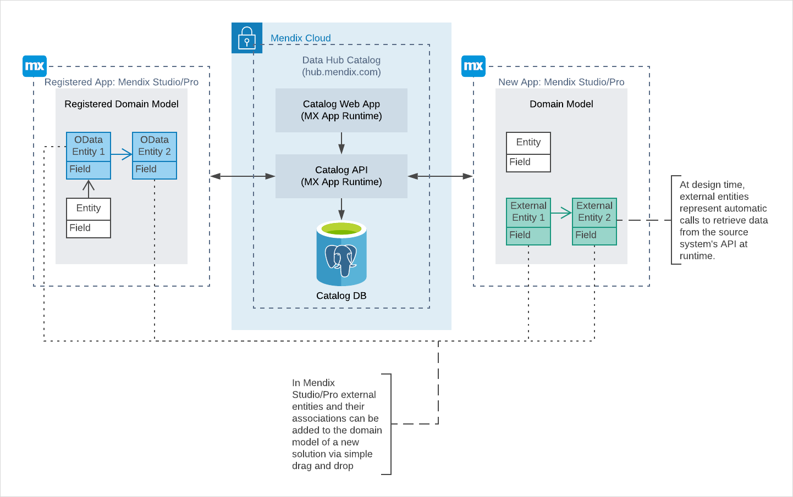

## 1 Introduction

The Data Hub Catalog collects metadata from exposed services and currently supports only OData v3 and v4 XML resources. If you want to connect something other than OData, you can do so by wrapping it in OData and then registering the data source contract file in the Data Hub Catalog. Afterwards, you can make it available for being consumed in Mendix Studio Pro. Currently there are two ways to wrap data in OData:

- [Expose OData via a Mendix app](#use-mendix-app)
- [Expose OData via a service wrapper (a custom solution)](#use-service-wrapper)

## 2 Expose OData via a Mendix App {#use-mendix-app}

To expose OData via a Mendix app, replicate and save your persistent entity data in a module. In this module, expose the persistent entities as published OData services. This will allow read-only access to the external entity data within the Mendix landscape. For more information, see [Published OData Services](/refguide/published-odata-services). 

An example of this approach is the [SalesForce Connector](https://marketplace.mendix.com/link/component/111393) module – it converts the SalesForce Rest API into an OData service to be used in Mendix Data Hub.

## 3 Expose OData via a Service Wrapper {#use-service-wrapper}

As a custom solution, you can expose OData via a service wrapper. If you have a web server and a custom application with a non-OData data source, it is possible to build a service wrapper that converts the app data to OData. It is possible to create an OData API wrapper on top of different types of data sources like REST API and Async API. For example, you can use the Apache Olingo library to create an OData service.

There are certain limitations on consumed OData services. For more information on limitations, see the [OData Services and External Entities](/refguide/consumed-odata-services#external-entities) section in *Consumed OData Services*. 

The diagram below represents how an OData API wrapper can be used to connect a custom app data source to a Mendix Studio Pro app:

Once the OData service is available, find the generated *$metadata* file for your data, and use that to register your service in the Data Hub Catalog via the connector on the home page. For more information on setting up the connection, see [Published OData Services](/refguide/published-odata-services).

