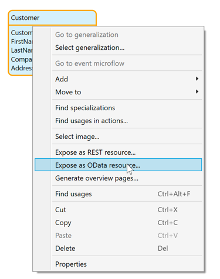
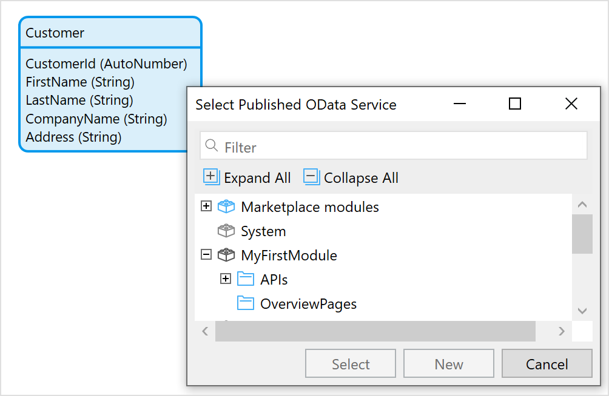
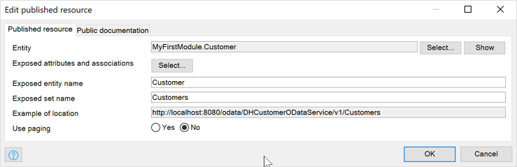
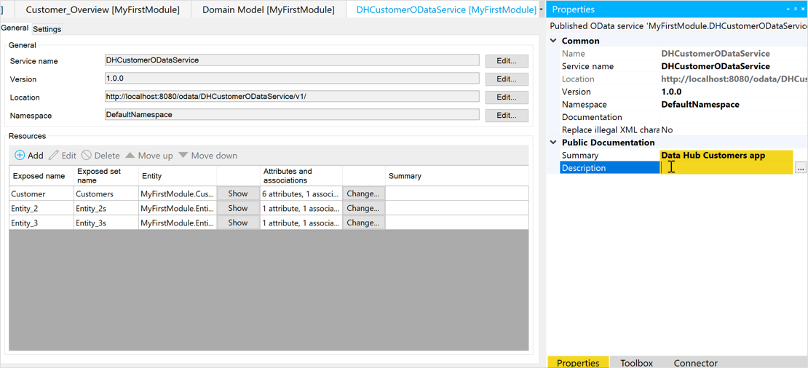
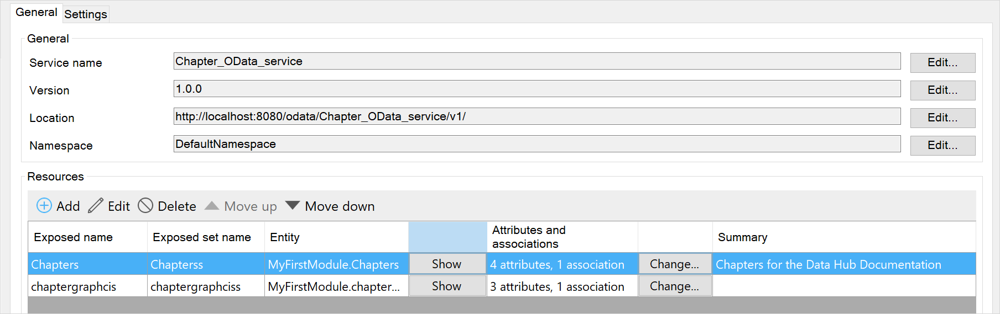
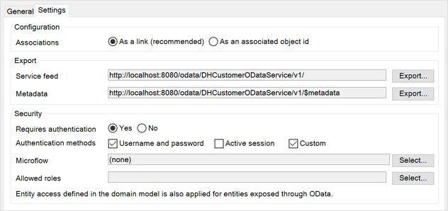

## 1 Introduction

All shareable datasets can be registered in the Data Hub Catalog by exposing them in an OData service. The registration includes the following:

* Location – where the data can be accessed
* Structural metadata – what the data looks like
* Descriptive metadata – information that indicates the applicability of using the asset for a particular app
* Further information – additional information added to registered assets (datasets and data sources) in the Catalog when they are curated

For Mendix apps deploying to the Mendix cloud, there is a deployment pipeline that registers the published OData v3 services published in the app to expose datasets that can be shared. This means that in Studio Pro, upon deployment of an app (via **Run**), the OData services are automatically registered in the Data Hub Catalog. For further information on deployment on the Mendix Platform, see [Deployment](/developerportal/deploy/) in the *Developer Portal Guide*.

{}Mendix apps that are not hosted in the Mendix Cloud can use the [Data Hub API](/apidocs-mxsdk/apidocs/data-hub-apis#datahubapis) and the [Transform API](/apidocs-mxsdk/apidocs/data-hub-apis#transform) for their Data Hub registration pipeline. {}

Datasets from other enterprise applications can also be registered in the Catalog in any of the following ways:

* Datasets from specific business applications can be manually registered from the Data Hub **Home**. They must be exposed in an OData v4 service. Click the business application and follow the steps to [register data sources from enterprise applications](#register-data).
* A registration pipeline can be set-up to register data sources that are exposed as OData v3 and OData v4 services to the Catalog using the [Data Hub API](/apidocs-mxsdk/apidocs/data-hub-apis).

This section starts with guidelines and best practice for registering data sources and datasets in the Data Hub Catalog. The steps for registering an OData Service from Studio Pro are described in [Publishing an OData Service in Studio Pro to Register Entities](#odata-service-reg) section below.

The steps for updating a consumed OData service in Studio Pro for which a new version is available are described in the [Updating a Published OData Service in Studio Pro](#updating-service) section below.

{} Every new version of a data source must be registered separately in the Catalog. {}

## 2 Best Practices for Registering Data Sources and Shared Datasets

This section provides advice and best practices when registering your services in the Data Hub Catalog either from Studio Pro or through manual registration.

### 2.1 Data Sharing Policy

App owners should refer to their Data Hub Admin and Data Hub Curator to align with their organization's data registration policy and methods. This can include naming and grouping the datasets that define specific data, access and security, and also the guidelines for issuing new versions of services.

Some datasets may be available in several OData services as a way of logically grouping the sets of data. App owners must ensure that they update and maintain services and inform consumers of any changes.

User access rights to the dataset (or entity set) and the associated data are published in the OData service and this is applied to the datasets that are consumed in an app. For details on security in Studio Pro, see [Security](/refguide/security) in the *Studio Pro Guide*.

### 2.2 OData Services and Versions {#odata-service-version}

Services that are updated should be clearly documented and version numbers maintained and registered.

It is a good practice to adopt a strict convention for versioning. For example, any revisions or changes made to a service that is deployed to the same location can be indicated using a semantic numbering convention and communicated to all apps consuming the service. This means that major version numbers are assigned for significant changes to the service (for example, removing entities or attributes, or requiring input parameters that would be incompatible for the consuming apps and  result in a break or failure). You can assign minor version numbers for revisions that will "not break" consuming apps (for example, when adding new fields to the service or adding new operations), for which the clients will continue to work.

It is also good practice to expose major revisions to a data source to a new service at a different endpoint. If the publisher wants to drop support for the old service, it can be deprecated, with a grace period for consumers to transfer to the superseded service and eventually remove it when there are no more connections to the old service. The consequences of signficant changes to a service deployed to the same endpoint as the previous version may cause apps consuming from the endpoint to break.

Notify the **Business Owner** and **Technical Owners** of apps that consume datasets when there is a change to a service or entity.

### 2.3 Environments

Deployment [environments](/developerportal/deploy/environments) should be clearly defined for the organization. The environment that an app is deployed to is important and indicates the quality and reliability of the app and data.

The OData service that is published when an app is deployed is associated with the environment that the app is deployed to. The service endpoint is therefore a combination of the application environement URL and the relative path of service contract. This provides the link to the exposed datasets.

When exposing datasets through an OData service for use in other apps, it is important to inform users of the quality and reliability of the datasets that are available from that deployment. The deployment environment of the app (and the published data sources) provides a good indication of the data quality in combination with the **Environment Type**: **Production**, **Non-production**, and **Sandbox** (the Mendix free app environment).

We recommend that apps sharing data should to be deployed to a reliable *production* environment where the data for the apps is valid, stable and reliably maintained. When apps are being developed, ensure that there is a representative set of data available in the test or development environments so that the services can be properly tested in the consuming apps. For example, in the case of an app for Human Resources, the developer should have representative test data with the different access levels to ensure that in consuming apps the correct data is available to users of differing access levels.

### 2.4 Datasets, Entities and Associations

Currently datsets (in Mendix entity sets) of [persistable](/refguide/persistability) entities can be exposed for sharing by another app. The dataset associated with the entity is used in the consuming app.

When selecting the entities to expose in a service, consider including associated entities so that the relationship between the data is also maintained.

When exposing Mendix entities that are generalizations and specializations in the same service the specialized entities will be defined in the published OData service as discrete entities which include the inherited attributes and associations. The inheritance relationship will not be present in the metadata contract, and also not when the entities are consumed in Mendix Studio Pro.

{}The association of a generailsed entity that is exposed in the same service as the specializations is not supported for both entities when consumed. The same association cannot be consumed for the two different entities. In this case, the inherited association should not be included when exposing the specialization.{}

## 3 Publishing an OData Service in Studio Pro{#odata-service-reg}

This section describes how to register entities from your Mendix app in the Data Hub Catalog in Studio Pro. For details on publishing an OData resource, see [Published OData Resource](/refguide/published-odata-resource) in the *Studio Pro Guide*.

{}Mendix apps that are not hosted in the Mendix Cloud are not automatically registered in the Data Hub Catalog through the deployment pipeline. For example, if you have an app running on-premises or anywhere else outside the Mendix Cloud, there will not be any auto-registration. These services have to be registered using the [Data Hub API](/apidocs-mxsdk/apidocs/data-hub-apis). {}

{} A published OData service is an API to your Mendix app. Some apps may have several published services exposing different combinations of entities. In Studio Pro, it is good practice to group them in a separate folder under each [module](/refguide/modules) to make location and maintenance easier. {}

1. In the [domain model](/refguide/domain-model), right-click the entity to be exposed and from the menu select **Expose as OData resource**:

     {}{}

2. In the **Select Published OData Service** dialog box, select the folder in the module that you want to use to organize your APIs, and click **New** to add a new OData service to that folder:

	 {}{}

3. Enter a meaningful name that indicates the entities and data that are going to be exposed for the published OData service and click **OK**.

4. The OData service document is added to the module, and the **Edit published resource** dialog box is displayed for the selected entity. The information in this will form the metadata definition for the entity:

    

    * **Entity** – the name and module of the entity

      * **Select** – click to display list of entities available in the module and select another entity to expose
      * **Show** – click to see the entity in the domain model
    * **Exposed attributes and associations** – click **select** to view and select the attributes and associations to expose for this entity
    * **Exposed entity name** – you can customize the name of the entity in the OData service
    * **Exposed set name** – the name of the dataset associated with the entity that is exposed

    {} The **Exposed set name** will be shown in the Data Hub Catalog for the registered service as the [Datasource](/data-hub/data-hub-catalog/search#search-details) for the exposed **Entity**. {}

    * **Example of location** – the location of the dataset for the entity
    * **Use paging** – the maximum number of data objects that are retrieved in a single call (with a link to the next set)

    **Public documentation** tab – a summary and a description of the entity can be added here

    For further details, see [Published OData Resource](/refguide/published-odata-resource) in the *Studio Pro Guide*.

5. Click **OK** to see the [OData Service](#odata-service-general) page. If you want to publish several entities in the same service, add them here by clicking **Add** for the **Resources**.

6. If you add an entity that is associated with another entity that is exposed in the same OData service, the association between the two entities will be included under **Attributes and associations**.

    {}When a specialized entity is published, in the published OData Service contract this will be a discrete entity that has all the attributes and associations of the generalization. Care has to be taken if the generalized entity (and its association) is also exposed in the same service. In this case, the association in the specialized entity that is (inherited from the generalization) should not be published as this will result in errors. The same association cannot be exposed for two different entities in the same service. In this case, it is recommended that the inherited association is not checked in the specialized entity.  {}

7. Add a **Summary** and **Description** of the service In the **Properties** pane:

8. Add a **Summary** and **Description** of the service In the **Properties** pane:

    

    {}  The description will be included in the published service metadata file and displayed for the service in the Data Hub Catalog. If no description is available, then the **Summary** will be used.  {}

    {}If you are updating a service (with a new service version), you can provide a summary of the changes from the previous version in the description. You can copy and paste the description from the previous version of the service and edit this with the new details. For further details, see the [Updating a Published OData Service in Studio Pro](#updating-service) section below.  {}

9. When the app is deployed with **Publish**, the OData services defined for the app will automatically be registered in the Data Hub Catalog.

{}
The app has to be deployed to the Mendix Cloud using **Publish** for the service to be registered in the Data Hub Catalog. If you are deploying to another environment, then you will have to use the  [Data Hub API](/apidocs-mxsdk/apidocs/data-hub-apis) to set-up a deployment pipeline.
{}

## 4 OData Service Screen {#odata-service-general}

The OData service screen contains all the details that will be included in the OData service contract or *$metadata* file that is registered in the Data Hub Catalog. Entities can be added and removed and changes to attributes and associations for included entities can also be made in this document.

{} The **Version** number that is assigned to a service is significant – it forms part of the service endpoint. This enables several versions of the same OData service to be registered in the Data Hub Catalog at the same time. A connection to an entity by a consuming app will be through the unique endpoint URL and therefore to the version of the service accessing the datasets of the app deployed to the specific environment. {}

### 4.1 General Tab

The **General** tab contains all the details for the published metadata and the details of the entities that will be exposed in the service as follows:

* **Service Name** – the name of the service
* **Version** – the version of the service
* **Location** – the URL of the service metadata
* **Namespace** – the namespace or uniform resource identifier (URI) for the service (for further details, see [Namespace](https://en.wikipedia.org/wiki/XML_namespace))
* **Entities** – the entities that are included in the service:

  * **Add**, **Edit**, **Delete** – click to add, edit, or remove an entity from the OData Service, respectively

  * **Entity** *entity name* – for the selected entity on the left, the details of attributes and associations is displayed on the right. Click **Add**, **Edit**  or **Delete** to add, edit or remove an attribute or listed association.
  * When you click **Edit** the **Edit published attribute** dialog is displayed that will show information about the item. For **Exposed name** you can specify the name that the attribute or association will be exposed as in the service.

      {}This will not change the name of the item, only how it will be shown in the published service.
      {}

    {}If you do not *explicitly* choose to expose the association of two associated entities, then this association will not be registered for the entities in the service.  {}

For more detail, see [Published OData Resource](/refguide/published-odata-resource).

### 4.2 Settings Tab

In the **Settings** tab, you can set configurations of associations between entities, the export location of the service, and the metadata file. You can also specify access to the entities exposed:

#### 4.2.1 Configuration

For **Associations**, select **As a link** for your published OData service to ensure that the association between entities is exposed.

#### 4.2.2 Export

This section contains the following properties:

* **Service feed** – displays the service endpoint; click **Export** to create an export file of the service feed
* **Metadata** – displays the OData service contract file; click **Export** to create an export file of the service contract

#### 4.2.3 Security

This section is displayed if [project security](/refguide/project-security) is enabled. For further details, see the [Security](/refguide/published-odata-services#security) section of *Published OData Services*.

This section contains the following properties:

* **Requires authentication**– specify if the consuming apps have to authenticate access to the data associated to the exposed entities
  * **Yes** will require the specified authentication
  * **No** means for no restriction to access to the data
* **Authentication methods** – one or more of the following authentication methods can be checked:
  * **Username and password** – for “basic authentication” with a username and a password
  * **Active session** – for access to the data within the current app session
  * **Custom** – to specify custom authentication using a microflow that is called every time a user wants to access the data to an entity

    {}If more than one authentication method is specified, the order or authentication is **Custom**, then **Username and password**, and then **Active session**. {}

* **Microflow** – when **Custom** authentication is checked, specify the authentication microflow that will be used
* **Allowed roles** – refers to the [module roles](/refguide/module-security#module-role) that a user must have to access the consumed entity

## 5 Updating a Published OData Service in Studio Pro {#updating-service}

For guidelines on when to update a published OData service and when to publish a new one, see the [OData Services and Version](#odata-service-version) section above.

{} When a new version of a service is published to replace an existing one, due notice has to be given to users if the preceding version is going to be deleted. A deprecation notice should be given to all apps consuming the service, and the period of time when both services are available. {}

Registered OData services for Mendix apps can be updated in Studio Pro in the [OData service](#odata-service-general) document. You can access the **OData Service** page from the **App Explorer** in Studio Pro by double-clicking the published OData service document to be updated.

To update a published OData service, follow these steps:

1. Create a duplicate of the old service document to make your changes to by right-clicking in **App Explorer** the OData service that you want to update and then clicking **Duplicate**. A copy of the service will be created. You can rename the new service by right-clicking and selecting **Rename**.
2. Double-click this service to open the service document. You can now make the changes to the service.
3. Indicate the level of the change to the service by changing the version number. We recommend that you follow semantic numbering to indicate the severity of the change. If you are making updates that would not break consuming apps, then the version number can be incremented after the decimal point. A major update that may break consuming apps would be indicated by an incremental increase in the integer.
4. For a major update to the service, change the **Location** where the service will be deployed to, the *service endpoint*, to ensure that consuming apps will not be affected. Minor updates can be deployed to the same endpoint.
5. Change the **Description** (in the **Properties** pane) of the service to describe to all users the changes that have been made to the service.
6. Make the changes to the service, taking care when removing entities, attributes, and associations. The guideline is removing exposed entities, attributes and association from a published service, this would have to be a major service update that is deployed to a different endpoint.
7. Deploy the app to register the services in the Data Hub Catalog. If you have specified a different endpoint for the new service version, both versions of the service will now be registered.
8. In the Data Hub Catalog, curate the new service and add tags and further descriptions as necessary.
9. Inform consuming apps of the changes. You can see all apps that are consuming previous versions of the service in the Data Hub Catalog and also the visual network of dependencies in the [Data Hub Landscape](/data-hub/data-hub-landscape/). Use the **Business Owner** and **Technical Owner** links to make contact with the users.
10. For major changes, and when a new service is published that will replace an existing one, provide deprecation notices to all consuming apps if they have to change to the new version within a certain length of time if the previous version is going to become inactive.
11. It is good practice to remove old (unused services) from your app by deleting them in the **App Explorer** only when you are sure that they are no longer being consumed by any other apps. You can verify this by looking in [Mendix Data Hub](https://hub.mendix.com/) and searching for the service in the **Catalog** or checking out the network of dependencies in Data Hub **Landscape**.
