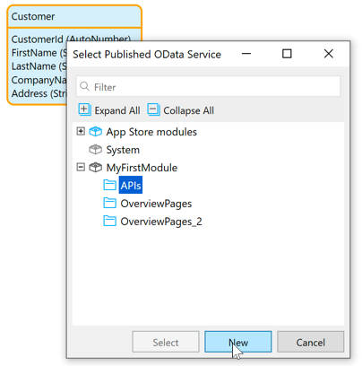
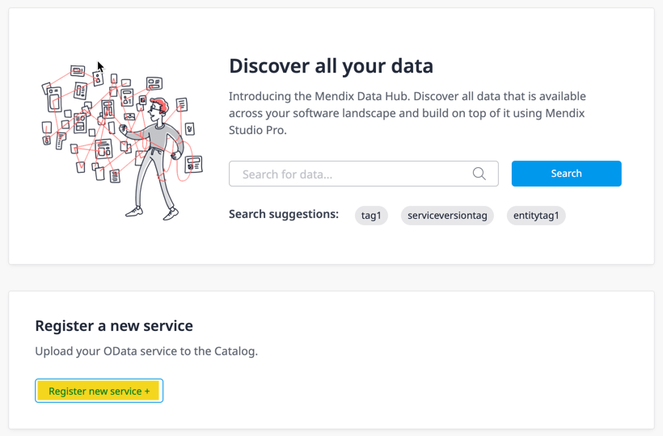

## 1 Introduction

All shareable entities can be registered in the Data Hub Catalog by exposing them in an OData service. The registration includes the following:

* Location – where the data can be accessed
* Structural metadata – what the data looks like
* Descriptive metadata – information that indicates the applicability of using the asset for a particular app

For Mendix apps, there is a deployment pipeline which registers OData v3 published services for entities that are to be exposed in an OData service. This means that in Studio Pro, upon deployment of an app (via **Run**), the OData v3 services are automatically registered in the Data Hub Catalog. For further information on deployment on the Mendix Platform, see [Deployment](/developerportal/deploy/) in the *Developer Portal Guide*.

For non-Mendix apps (for example, from third-party public REST APIs), entities can be included in an OData v4 service and this can be manually registered through the [service registering](#registration-form) process.

This section starts with guidelines and best practice for registering services and shared entities in the Data Hub Catalog. The steps for registering an OData Service from Studio Pro are described in [Publishing an OData Service in Studio Pro to Register Entities](#odata-service-reg) section below.

The steps for updating a consumed OData service in Studio Pro for which a new version is available are described in the [Updating a Published OData Service in Studio Pro](#updating-service) section below.

## 2 Best Practices for Registering Services and Shared Datasets

This section provides advice and best practices when registering your services in the Data Hub Catalog either from Studio Pro or through manual registration.

### 2.1 Data Sharing Policy

App owners should refer to their [Data Hub Admin](../index#admin) and [Data Hub Curator](../index#curator) to align with their organization's data registration policy and methods. This can include naming and grouping the entities that define specific data, access and security, and also issuing new versions of services.

Some datasets may be published in several OData services as a way of grouping and publishing sets of data. Updating and maintenance has to be managed and maintained by the app owners.

User access rights to the dataset (or entity set) and the associated data are published in the OData service and this is applied to the datasets that are consumed in an app. For details on security in Studio Pro, see [Security](/refguide/security) in the *Studio Pro Guide*.

### 2.2 OData Services and Versions {#odata-service-version}

Services that are updated should be clearly documented and version numbers maintained and registered.

It is a good practice to adopt a strict convention for versioning. For example, any revisions or changes made to a service that is deployed to the same location could be indicated using a semantic numbering convention and communicated to all apps consuming the service. This means that major version numbers are assigned for significant changes to the service (for example, removing entities or attributes, or requiring input parameters that would be incompatible for the consuming apps and would result in a break or failure). You can assign minor version numbers for revisions that will "not break" consuming apps (for example, when adding new fields to the service or adding new operations), for which the clients will continue to work.

It is also good practice to expose major revisions to a new service. If the publisher wants to drop support for the old service, it can be deprecated, with a grace period for consumers to transfer to the replacement service and eventually remove it when there are no more connections to the old service. The consequences of changing the properties of a service with the same version when the service is being consumed by other apps is that the apps will break.

You should ensure that all apps that consume entities are notified when there is a change to a service or entity.

### 2.3 Environments

The [environment](/developerportal/deploy/environments) that an app is deployed to is important and indicates the location of the data for the app. The OData service for this deployment of the app is also located in the same environment and provides the connection to the data by consuming apps. Apps sharing data have to be deployed to a reliable production environment where the data for the apps is stable and reliably maintained.

When apps are being developed, ensure that there is a representative set of data available in the test or development environments so that services can be properly tested in the consuming apps. For example, in the case of an app for Human Resources, the developer should have test data with the different access levels to ensure that the correct data is available to users of differing access levels.

### 2.4 Entities and Associations

Currently only [persistable](/refguide/persistability) entities can be exposed for sharing by another app. The data associated with the entity is used in the consuming app.

When selecting the entities to expose in a service, consider including associated entities so that the relationship between the data is also registered.

When exposing Mendix entities that are generalizations and specializations in the same service the specialized entities will be defined in the published OData servcie as discrete entities which include the inherited attributes and associations. The inheritance relationship will not be present in the metadata contract, and also not when the entities are consumed in Mendix Studio Pro.

{}
The association of a generailsed entity that is exposed in the same service as the specializations is not supported for both entities when consumed. The same association cannot be consumed for the two different entities. In this case, the inherited association should not be included when exposing the specialization.
{}

## 3 Publishing an OData Service in Studio Pro to Register Entities {#odata-service-reg}

This section describes how to register entities from your Mendix app in the Data Hub Catalog in Studio Pro. For details on publishing an OData resource, see [Published OData Resource](/refguide/published-odata-resource) in the *Studio Pro Guide*.

{}
A published OData service is an API to your Mendix app. Some apps may have several published services exposing different combinations of entities. In Studio Pro, it is good practice to group them in a separate folder under each [module](/refguide/modules) to make location and maintenance easier.
{}

1.  In the [domain model](/refguide/domain-model), right-click the entity to be exposed and from the menu select **Expose as OData resource**:

	

2.  In the **Select Published OData Service** dialog box, select the folder in the module that you want to use to organize your APIs, and click **New** to add a new OData service to that folder:

	

3. Enter a meaningful name that indicates the entities and data that are going to be exposed for the published OData service and click **OK**.

4.  The OData service document is added to the module, and the **Edit published resource** dialog box is displayed for the selected entity. The information in this will form the metadata definition for the entity:

	

	* **Entity** – the name and module of the entity
		* **Select** – click to display list of entities available in the module and select another entity to expose
		* **Show** – click to see the entity in the domain model
	* **Exposed attributes and associations** – click **select** to view and select the attributes and associations to expose for this entity
	* **Exposed entity name** – you can customize the name of the entity in the OData service
	* **Exposed set name** – the name of the dataset associated with the entity that is exposed
	* **Example of location** – the location of the dataset for the entity
	* **Use paging** – the maximum number of data objects that are retrieved in a single call (with a link to the next set)
	* **Public documentation** tab – a summary and a description of the entity can be added here

	For further details, see [Published OData Resource](https://docs.mendix.com/refguide/published-odata-resource) in the *Studio Pro Guide*. 

5. Click **OK** to see the [OData Service](#odata-service-general) page. If you want to publish several entities in the same service, add them here by clicking **Add** for the **Resources**.

6. If you add an entity that is associated with another entity that is exposed in the same OData service, you will be asked whether you want to include the association in the service definition. Click **Yes** and the association between the two entities will be included under **Attributes and associations**.

   In the example illustrated below, you will see that for **Entity_2** under **Attributes and associations** there is currently **0 association**. 

   When **Entity_3** is added to the service which has an association to **Entity_2**, you will see that **Entity_3** has listed that it has **1 association** and there is a further prompt **Would you like to publish the other side of this association as well** with the name of the association showing the entities being connected.

   

   Click **Yes** and the association for **Entity-2** is now updated to **1 association**:

   

   {}When a specialized entity is published, in the published OData Service contract this will be a discrete entity that has all the attributes and associations of the gernailzation. Care has to be taken if the generailsed entity (and its association) is also exposed in the same service. In this case,  the association in the specialized entity that is (inherited from the generalization) should not be published as this will result in errors. The same association cannot be exposed for two different entities in the same service. In this case, it is recommended that the inhertited association is not checked in the specialized entity.
   {}

7.  Add a **Summary** and **Description** of the service In the **Properties** pane: 

	

	{}The description will be included in the published service metadata file and displayed for the service in the Data Hub Catalog.  If no description is available, then the **Summary** will be used.
	{}

	{}If you are updating a service (with a new service version), you can provide a summary of the changes from the previous version in the description. You can copy and paste the description from the previous version of the service and edit this with the new details. For further details, see the [Updating a Published OData Service in Studio Pro](#updating-service) section below.
{}
	
8. When the app is deployed with **Run**, the OData services defined for the app will automatically be registered in the Data Hub Catalog.

{}
The app has to be deployed to the Mendix Cloud or to your organization's environment using **Run** for the service to be registered in the Data Hub Catalog.
{}

## 4 OData Service Screen {#odata-service-general}

The OData service screen contains all the details that will be included in the OData service contract or *$metadata* file that will be registered in the Data Hub Catalog. Entities can be added and removed and changes to attributes and associations for included entities can also be made in this document.

{}
The **Version** number that is assigned to a service is significant – it forms part of the service location and the definition of the service endpoint for consumed entities. Several versions of the same OData service registered can be registered in the Data Hub Catalog. A connection to an entity by a consuming app will be through the unique URL and the version number of the service and the data connected to the app deployed to a specific environment.
{}

### 4.1 General Tab

The **General** tab contains all the details for the published metadata and the details of the entitites that will be exposed in the service as follows:

* **Service Name** – the name of the service
* **Version** – the version of the service
* **Location** – the URL of the service metadata 
* **Namespace** – the namespace or uniform resource identifier (URI) for the service (for further details, see [Namespace](https://en.wikipedia.org/wiki/XML_namespace))
* **Resources** – the entities that are included in the service: 
	* **Add**, **Edit**, **Delete** – click to add, edit, or remove an entity from the OData Service, respectively
	* **Show** – click to see the entity in the domain model

	* **Attributes and associations** – this column shows the attributes and association for the selected entity
* **Change** – click this to display the **Select Attributes and associations** dialog box for the selected entity: 
	
	

	You can specify which attributes you want to include for the service, customize the **Exposed names** of the attributes and associations for the OData service.

	{}If you do not EXPLICITLY choose to expose the association of two associated entities, then this association will not be registered for the entities in the service.
{}

For further details, see [Published OData Resource](/refguide/published-odata-resource).

### 4.2 Settings Tab

In the **Settings** tab, you can set configurations of associations between entities, the export location of the service, and the metadata file. You can also specify access to the entities exposed: 

#### 4.2.1 Configuration

For **Associations**, select **As a link** for your published OData service to ensure that the association between entities is exposed.

#### 4.2.2 Export

This section contains the following properties:

* **Service feed** – displays the service endpoint; click **Export** to create an export file of the service feed
- **Metadata** – displays the OData service contract file; click **Export** to create an export file of the service contract

#### 4.2.3 Security

This section will be displayed if [project security](/refguide/project-security) is enabled. For further details, see the [Security](/refguide/published-odata-services#security) section of *Published OData Services*.

This section contains the following properties:

* **Requires authentication**– specify if the consuming apps have to authenticate access to the data associated to the exposed entities
	* **Yes** will require the specified authentication
	* **No** means for no restriction to access to the data
* **Authentication methods** – one or more of the following authentication methods can be checked:
	* **Username and password** – for “basic authentication” with a username and a password 
	* **Active session** – for access to the data within the current app session
	* **Custom** – to specify custom authentication using a microflow that is called every time a user wants to access the data to an entity

	{}If more than one authentication method is specified, the order or authentication is **Custom**, then **Username and password**, and then **Active session**.
	{}

* **Microflow** – when **Custom** authentication is checked, specify the authentication microflow that will be used
* **Allowed roles** – refers to the [module roles](/refguide/module-security#module-role) that a user must have to access the consumed entity

## 5 Deployment Environments

The OData service that is created when an app is deployed will be associated with the environment that the app is deployed to. This will also be the link to the data set associated with the exposed entities. 

When sharing entities through an OData service for use in other apps, it is important that the app is deployed to a stable environment so that the data for the app is maintained in this environment. Usually this will be a production environment. 

## 6 Updating a Published OData Service in Studio Pro {#updating-service}

For guidelines on when to update a published OData service and when to publish a new one, see the [OData Services and Version](#odata-service-version) section above.

{}
When a new version of a  service is published to replace an existing one, due notice has to be given to users if the preceding version is going to be deleted. A deprecation notice should be given to all apps consuming the service, and the period of time when both services are available. 
{}

Registered OData services for Mendix apps can be updated in Studio Pro in the [OData service](#odata-service-general) document. You can access the **OData Service** page rom the **Project Explorer** in Studio Pro by double-clicking the published OData service document to be updated. 

To update a published OData service, follow these steps:

1. Create a duplicate of the old service document to make your changes to by right-clicking in **Project Explorer** the OData service that you want to update and then clicking **Duplicate**. A copy of the service will be created. You can rename the new service by right-clicking and selecting **Rename**.
3. Double-click this service to open the service document. You can now make the changes to the service.
4. Indicate the level of the change to the service by changing the version number. We recommend that you follow semantic numbering to indicate the severity of the change. If you are making updates that would not break consuming apps, then the version number can be incremented after the decimal point. A major update that may break consuming apps would be indicated by an incremental increase in the integer.
4. For a major update to the service, change the **Location** where the service will be deployed to, the *service endpoint*, to ensure that consuming apps will not be affected. Minor updates can be deployed to the same endpoint.
5. Change the **Description** (in the **Properties** pane) of the service to describe to all users the changes that have been made to the service. 
6. Make the changes to the service, taking care when removing entities, attributes, and associations. The guideline is removing exposed entities, attributes and association from a published service, this would have to be a major service update that is deployed to a different endpoint.
7. Deploy the app to register the services in the Data Hub Catalog. If you have specified a different endpoint for the new service version, both versions of the service will now be registered.
8. In the Data Hub Catalog, curate the new service and add tags and further descriptions as necessary. 
9. Inform consuming apps of the changes. You can see all apps that are consuming previous versions of the service in the Data Hub Catalog and also the visual network of dependencies in the [Data Hub Landscape](../data-hub-landscape/index). Use the **Business Owner** and **Technical Owner** links to make contact with the users.
10. For major changes, and when a new service is published that will replace an existing one, provide deprecation notices to all consuming apps if they have to change to the new version within a certain length of time if the previous version is going to become inactive.
11. It is good practice to remove old (unused services) from your app by deleting them in the **Project Explorer** only when you are sure that they are no longer being consumed by any other apps. You can verify this by looking in [Mendix Data Hub](https://hub.mendix.com/) and searching for the service in the **Catalog** or checking out the network of dependencies in Data Hub **Landscape**. 

## 7 Manually Registering OData V4 Services {#registration-form}

OData v4 services that are published from Mendix apps which are not hosted in the Mendix Cloud are not automatically registered in the Data Hub Catalog through the deployment pipeline. For example, if you have an app running on-premises or anywhere else outside the Mendix Cloud, there will not be any auto-registration. These services can be manually registered in the catalog.

During manual registration, you can enter additional information about the service (such as a description) and assign tags to categorize the service so that it can be found for specific uses.

This section describes the sequence of steps to manually register a service in the Data Hub Catalog.

{}
New versions of previously registered services also have to be registered manually by following the steps below and specifying **Existing application** and **Existing environments**.
{}

###  7.1 Preparing the v4 OData Service Documents

The files for an OData v4 service contract may comprise the base schema definition and additional associated schema documents to complete the full service definition.  The files formats of the v4 OData Service contracts that are accepted are *.xml* (for a single file) and  *.zip* (when the contract is comprised of several files). 

### 7.2 Registering the Service – Application and Environment {#new-service}

To register the service, follow these steps:

1.  On the [Data Hub](../index) screen, click **Register new service** to display the **Application and Environment Form**.

	

2.  Enter the details of the app from which the OData v4 service was issued. This information will be displayed in the **Service Details** in the Data Hub Catalog and provide the link to the app.

	

3.  Specify the details of the **Application**:

	* **Use Existing Application**
		* **Yes** – click this if the app is already registered in the Data Hub Catalog (for example, when you are registering a new service for a previously registered app, or when you are registering a new version of an existing service)
		* **No** – click this when registering a new app that is not currently registered in the Catalog
	* **UUID** – paste the UUID here for an existing app registered in the Data Hub Catalog (for a new app, the UUID is automatically generated)
		* You can copy the UUID of an already registered app from **Settings** > [General](/developerportal/settings/general-settings) in the Developer Porta
		* For further information on deep links for an app, see [How to Manage Deep Links](/developerportal/settings/manage-deeplinks).
	* **Name** – enter the name of the application as it should appear in the details page of the service
	* **Business Owner** – enter the name of the business owner of the data that is made available through the service

4.  Enter the **Environment** details of the deployed app:
	
	* **Use Existing Environment**
		* **Yes** – click this when the deployed app in an existing environment is already registered in the Data Hub Catalog (for example, when you are registering a new service for the app deployed to this environment, or when you are registering a new version of an existing service deployed to this environment)
		* **No** – click this for a new deployment to an environment
	* **UUID**
		* For an existing app registered in the Data Hub Catalog to this environment, paste the UUID here
		* If you clicked **No** above for **Use Existing Environment**, the enviroment UUID is automatically generated
	* **Name** –  enter the name of the environment as it will be rendered in the catalog
	* **Location** – enter the URL of the environment location
   
5. Click **Next Step** to proceed to the **Upload contract** form.

### 7.3 Uploading the OData Contract and Selecting Main Schema

You will now select and upload the OData contract and select the schema.

1. Browse and upload the *.zip* file of the OData v4 service you want to register and click **Validate zip file**.
2.  The file will be validated, and the OData schemas that are available will be listed:

	

3.  You can examine the schemas by clicking **+** to display the schema: 

	

4.  Select the primary schema from the list that defines the service by checking the box.

	{}When there are several schemas for a v4 OData service, these contracts are part of the complete service definition and are necessary. The primary contract references the other schemas to form the full specification of the service. It is important that the correct schema is selected as the **Main schema**; otherwise, constituent elements may not be referenced.
	{}

5. Click **Next Step** to proceed to the **Service Details** form.

### 7.4 Entering Further Service Details

In the final step of the manual registration process, use the **Service Details** screen to specify further details that will be displayed in **Service metadata** pane: 

1. In **Service Name**, enter the name of the OData service.
2.  In **Service Version**, enter the version number for the service.

	{}When registering another version of a registered service, ensure that the version numbering indicates the degree of change between versions.
   {}

3. In **Relative service location**, enter the relative URL for the service.
4. In **Service Description**, enter a description of the service that will be displayed in the **Search Details** and also used in the catalog search.
5. In **Tags**, enter tags that can be used to categorize registered services and thus make them discoverable for specific uses. Add tags by entering alphanumeric strings separated by spaces. To remove a tag, click the **x**. 
6. When all the information has been completed, click **Save your service**. 
7. The contracts will be interpreted and the service registered in the Data Hub Catalog. On successful registration, you will be informed:

    

The service is now registered in the Data Hub Catalog.

