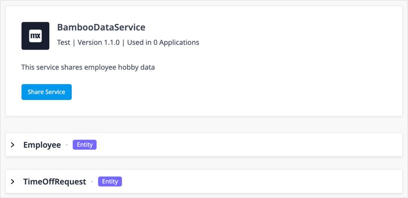

## 1 Introduction

Finding the right data to use in your app development is made easier using the search functionality in the Data Hub Catalog. The details of registered data assets can be accessed via the [Data Hub Search API](/apidocs-mxsdk/apidocs/data-hub-apis), or viewed in the [Asset details](#search-details) screen of the Catalog or the [Data Hub pane](/refguide/data-hub-pane) in Studio Pro.  This document describes the functionality of the Data Hub Catalog.

## 2 Details of Registered Assets

You can start searching from the [Data Hub Home](#data-hub-home) page, or click the [Catalog](#search-tab) tab to go to the **Search** pane and **Asset Details** screen. This section describes important properties of registered assets: data sources, datasets, and attributes.

{}The **Dataset** is the name of the **Entity set** of a published **Entity** in Mendix Studio Pro, which by default, is the entity name with an "s" appended to it. For example, if an entity named `Customer` is published in an OData service, the **Dataset** name in the **Search Details** will be `Customers`.{}

### 2.1 Versions

Every published OData service (or data source) has a version number. Apps that consume a data source will consume from a specific version. Updates and changes to a service will be indicated by a change in the version number. Several versions of a registered data source may be available in the Catalog. The data source version is displayed in the [Asset Details](#search-details).

### 2.2 Environments

The Data Hub Catalog is a register of published OData services (or data sources) that are deployed to a particular environment. Each registered data source is a unique **endpoint** combination of service version and environment.

The environment also provides an indication of the quality of the dataset that is available. Shared datasets that are available from a *production environment* will have production-level data, while those in non-production environments (*acceptance*, *development*) could be populated with data that may not be reliable for building stable apps but be useful for development work.

Search results show the data source endpoints. If a version of a service is deployed on both a test and acceptance environment, two endpoints are shown in the search results.

{}
By default, search results in the Data Hub Catalog are filtered to show only hits in the **Production** environments. You can extend the search to **Non-production** or **Mendix Free App (Sandbox)** environments by checking them in the search pane **Add Filter** list. For more details, see the[Filters](#filter) section below.
{}

### 2.3 Asset Descriptions

The description that is included as part of the published service metadata. This description can be further curated at the data source, dataset, and attribute level by owners and curators to provide further details of the exposed datasets and the associated data.

{}
In Studio Pro, when publishing an OData service, it is possible to specify a summary of the service and a description. Only the description is included in the OData service contract document and displayed in the Data Hub Catalog.
{}

## 3 Search in the Data Hub Catalog {#data-hub-home}

When searching in the Data Hub Catalog, the following fields are searched:

* Data source or service endpoint: Name, Description, Tags
* Application: Name
* Dataset: Name, Description
* Attribute: Name, Description
* Association: Name

### 3.1 Searching for Assets

From the **Data Hub Home** page, you can search the Catalog in the following ways:


* Type a search term in the search box and click **Search** (search strings can be a minimum of three characters and consist of alphanumeric characters)
* Click one of the *tags* given in the **Search suggestions**
* Click one of the services under **Most Popular Services**
* Click the **Catalog** tab

Any of the above actions will take you to the **Search** screen.

### 3.2 Search Screen {#search-tab}

The **Search** screen is divided into the [search](#search-pane) pane on the left, the [asset details](#search-details) of the selected asset in the centre panel, and the [asset metadata](#metadata) panel on the right.


## 4 Search Pane {#search-pane}

The collapsable **Search** pane is used to search for registered assets in the Data Hub Catalog:

 {}{}

### 4.1 Specifying the Search

Enter a search string in the **Search** area comprising a minimum of 3 alpha-numeric characters.

The wildcard `*` can also be used to imply an empty search but it is not necessary as search without specifying any search string will return all registered items.

{}
Punctuation cannot be used as part of the search term.
{}

{}
Search is case-insensitive.
{}

The search is carried out asset metadata that includes the following:

* all application names
* data sources, datasets (or entity sets)
* attribute
* tags
* descriptions

### 4.2 Filters {#filter}

You can filter search results by environment type. By default, the **Production** environment filter is active and this restricts search to assets in the production environment.

To specify the environment type for the search, click **Filter**:


In the **Filters** dialog box, check the **Environment Type** that you want to restrict your search to and click, **Apply Filters**. The search results will only display hits for the specified search string in the checked environments.

{}
The **Sandbox** filter refers to apps deployed to the Mendix Free App environment.
{}

The number of filters that are active for the current search is displayed adjacent to the filter:

{}{}

Click **Clear Filters** to clear all the checked environments and click **Apply Filters** to see search results in all environments.

### 4.3 Search Results {#search-results}

The number of items satisfying the search criteria (search string plus filters) are shown above the search results list. Search results include assets that match the search string and satisfy the active filters. The order of the items presented in the search results will be a combination of the following:

* Closest match to the search string
* Popularity of the service (the number of connections)
* **Validated** assets before non-validated items

 {}The weighting in the search results is cumulative depending on the validate property being set for datasets in a data source. For example, if there is a dataset named **Customer** that is **Validated** in a **Validated** data source, this is listed higher in the search results list than a dataset of the same name that is not **Validated** in a **Validated** data source.{}

{}Assets that are set to [Non-discoverable](#discoverability-metadata) are not included in the search results unless you are a curator or owner of the asset.{}

When an item in the search results is selected, the **Catalog** tab displays the **Details** of the asset and the **Landscape** tab shows the network of connections and dependencies of the selected item in the [Data Hub Landscape](/data-hub/data-hub-landscape/).

## 5 Selected Asset Details {#search-details}

When you click on an asset (data source or dataset) in the search results, the details are displayed in this panel.

### 5.1 Details of a Selected Data Source {#service-details}

The contract of the published OData service (the *$metadata* document) contains the definitions details of what is exposed in the service. This includes the metadata of the exposed datasets (or entity sets in Mendix Studio Pro) and their exposed attributes, associations, types, and accessibility. The contract metadata is displayed in the Data Source details along with any Catalog-curated metadata.

When a data source is selected in the search results, the following details are displayed:



* Application icon

* Name of the data source

* **Non-discoverable** icon – if the data source has been set to non-discoverable (by default, no icon indicates that it can be seen by all users)

* **Validated** icon – if it has been set for the asset

* **Environment Name** – where the app is deployed

* **Version** number of the service

* **Connections** – number of apps that consume the service

* A description of the data source

* All **Datasets** that are exposed in the data source (you can expand each one to see details of the attributes and associations)

 {}In Mendix Studio Pro, the **Dataset** is the name of the **Entity set** of a published **Entity**, which by default, is the entity name with an "s" appended to it. For example, if an entity named `Customer` is published in an OData service, the **Dataset** name in the **Search Details** will be `Customers`.{}

You can perform the following actions from this screen:

* **Copy Data Source URI** – click to copy the URI of the data source contract to the clipboard. This URI can be used to integrate the data source in other enterprise applications.
* **Share Data Source** – click to copy the link to this asset detail page to the clipboard so that you can share it with others.
* [Download](#download-contract) – retrieve and save the OData contract from the data source endpoint to your computer.
* **Copy Dataset URI** – click to copy the URI of the dataset to the clipboard for use in other business applications.

### 5.2 Details for a Selected Dataset {#entity-details}

When a **Dataset** is selected in the search results, the following details are displayed in the **Search Details** panel.


#### 5.2.1 General Information

The source and endpoint details of the dataset are displayed:

* Dataset name

* **Part of** – a link to the data source details page that the dataset is exposed in

* **Version** number of the data source that the dataset is exposed in

* **Connections** – the number of apps that consume this dataset

* A description of the dataset

You can perform the following actions from this screen:

* **Copy Dataset URI** – click to copy the URI of the dataset to the clipboard for use in other business applications
* **Share Dataset** – click to copy the link to this dataset detail page to the clipboard so that it can be shared with others

#### 5.2.2 Dataset Information

 The **Attributes** tab lists the attributes that are exposed for the dataset in the OData service.

 Under the **Associations** tab for each dataset, the associations are displayed:

 

* **Name** – the name of the association that is exposed in the OData service contract.

* **Navigates to** – the dataset the association is made with. Click the link to see the details of the associated dataset in the Catalog.

## 6 Metadata Panel {#metadata}

The metadata panel at the right of the asset details screen displays details from the OData service metadata contract and values that have been curated in the Data Hub Catalog:

 {}{}

### 6.1 Tags

The tags that have been assigned to the data source during [curation.](curate#tags)
{}Tags assigned at a data source level propagate down to the datasets and attributes exposed in the service.{}

### 6.2 Business Owner

A link to the business owner of the data exposed in the data source. Business owners can be [added as a curation task](curate#changing-owners).

### 6.3 Technical Owner

The technical contact of the app; by default this is the owner who registered the OData service.

For apps hosted in the Mendix Cloud, the **Technical Owner** is the app developer that deployed the app.

Technical owners can be [changed as a curation task](curate#changing-owners).

### 6.4 Discoverability {#discoverability-metadata}

When a data source is registered, by default, it is **Discoverable** in the Data Hub Catalog. When this is set, all users can find it, view the details, and consume it. The owners of an asset and curators can set a data source as **non-discoverable**, which means it is not visible to users unless they are the owner or a curator.

See [Curate Bar](#curate-bar) for changing **Discoverability** as the owner of the data source or curator.

The following discoverability values can be set:

* **Discoverable** – all users of the Data Hub Catalog and Studio Pro can see and consume the asset provided they meet the requirements of the **Classification**
* **Non-Discoverable** – the asset is not visible in the Catalog and only owners, Data Hub curators, and the Data Hub Admin can find, use, and curate the service.
  {}A **Non-discoverable** asset is also not included in the search results in the **Data Hub** pane of Studio Pro, or any other client of the Data Hub API.{}

### 6.5 Validated

Indicates if the data source has been **Validated**. See [Curate Bar](#curate-bar) for changing **Validated** as an owner of the data source or curator.

### 6.6 Access Level

Displays the access classification of the data exposed by the service: end-users of the app will only be able to see the information must have the appropriate [user role](/refguide/user-roles) to access the data:

* **Public** – classified as public and available to all users, internal and external to the organization
* **Internal** – restricted to the members of the organization
  {}Classifications at a data source level propagate down to the datasets and attributes exposed in the OData service. {}

### 6.7 Application

A link to the application from which the data source was published in the given environment.

### 6.8 Environment Type

The environment type indicates the quality and the status of the data that the exposed datasets connect to. The following environment types can be specified:

* **Production**
* **Non-Production**
* **Sandbox** (the Mendix Free App environment)

## 7 Curate Bar {#curate-bar}

The **Curate Bar** is displayed in the asset detail screen if you are the owner of the selected asset or a curator:


The following actions can be carried out:

* **Edit Metadata** – edit information that is displayed in the Catalog for the asset:
  * for a selected data source you can edit [Application Details](./curate#curate-application) and [Data Source Details](./curate#service-details)
  * for a selected dataset you can edit [Dataset Details](./curate#curate-datasets)
* **Discoverable**/**Validated** – set the discoverability of the data source, and set a data source or dataset as validated
  * **Discoverable** – all users of Data Hub and Studio Pro can see and consume the service in combination with the classification of the data
  * **Not Discoverable** – the service is not visible; only owners of the service, Data Hub curators, and the Data Hub Admin can access the service
  * **Validated** – indicates if the data source or dataset has been validated

{}By default, newly registered services are set to **Discoverable** and visible to all users.{}

For further details, see [Curate Registered Assets](./curate).

## 8 Data Source and Dataset URIs

The data source URI is the location of the service contract of the data source – also known as the service endpoint. The endpoints of all exposed datasets (entity sets) are defined in the contract. From the details screen of the data source and dataset, you can copy the URIs to the clipboard by clicking the **Copy Data Source URI** and **Copy Dataset URI**, respectively. These URIs can be used for directly accessing the contract and resource in other BI applications.

## 9 Download the Metadata Contract of a Data Source {#download-contract}

For a selected data source, you can click **Download** to download the OData service contract that is located at the data source endpoint. A ***.zip*** file that includes the all the files that make up the full metadata contract is generated and downloaded.

The resulting ***.zip*** file is named as follows:

```DataHub_<service_name>_<service_version>_<technology>.zip```

The string `<technology>` identifies the OData version (`v3` or `v4`) in the file name.

For the following example:


When you click **Download** the following file is downloaded: `DataHub_SAP_Intelligence_1.0_OData4.zip`

This zip file has the folder: `DataHub_SAP_Intelligence_1.0_OData4` which contains the all the metadata files that define the service.

## 10 Viewing Search Results in the Data Hub Landscape

When an item is selected in the search results pane, you can click the [Landscape](/data-hub/data-hub-landscape/) tab to see the network of connections and dependencies for the selected asset. This provides a graphical representation to indicate the context and relevance of a selected item and the data for the exposed datasets.
