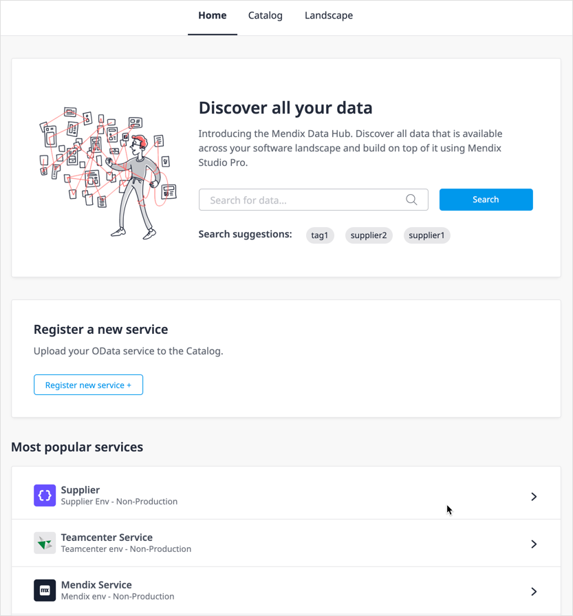
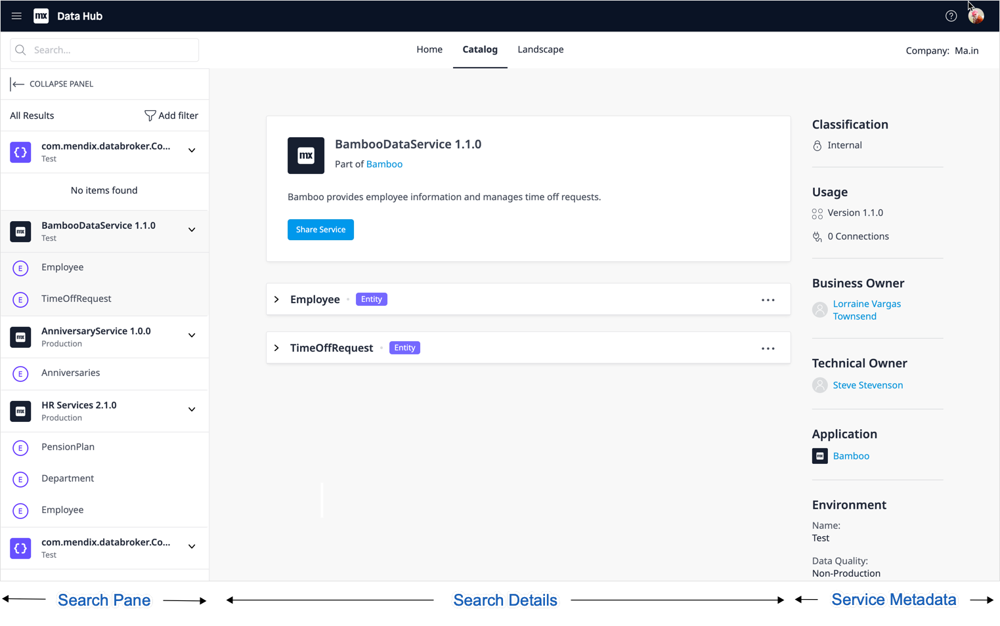
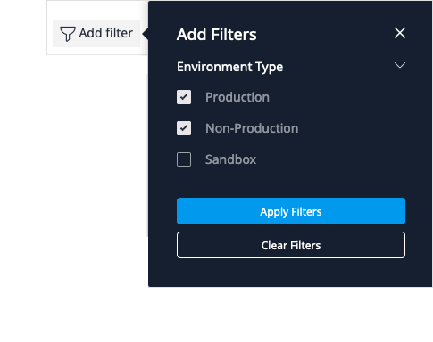
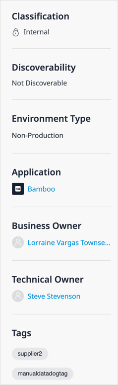

{}[PC-704 Discoverability]{}

## 1 Introduction

Finding the right data to use in your app is made easier by the Data Hub Catalog search functionality. The metadata for a registered service is displayed in the **Search Details** screen to help in identifying the correct data source to use to use in your app development. 

{}[AD: please verify that "Search Details" is in the UI to justify capitalizing/bolding; also add a cross-reference to doc where that screen is described more fully (if any).]{}

You can start searching from the **Data Hub** [Home](#data-hub-home) page or click the Data Hub [Catalog](#search-tab) tab to go to the **Search** pane and **Search Details** screen.

The [Data Hub pane](/refguide/data-hub-pane) in Studio Pro enables search in the Data Hub Catalog to use and connect to registered entities from your Mendix app.

This page describes the search functionality of the Data Hub Catalog and the the information that is available.

## 2 Details of Registered Assets

The [search details](#search-details) screen for a registered service, entity, or attribute displays information as provided in the published OData service contract that is used to register assets in the Data Hub Catalog. Registered services and the exposed entities can be curated to provide additional information such as **Tags** and **Descriptions** to ensure that they can be found by the appropriate users.

### 2.1 Published OData Service 

The OData service document contains the data that is registered in the Data Hub Catalog. The contract of the published service (the *$metadata* document) contains the details of what is exposed in the service and further links to the metadata of the entities exposed in the service for attributes, associations, types, and accessibility. The published OData service that is registered is shown in search details. 

For details on creating a published OData service in Studio Pro, see [How to Register Data Assets](register).

### 2.2 Versions 

Every published OData service has a version number, and apps consuming from a service will consume from a specific version. Updates and changes to a service will be indicated by a change in the version number. There may be several versions of a service available in the catalog. These will all be listed as separate items in the search results for a service.

The [search details](#search-details) screen in the Data Hub Catalog will show all available versions of the service under **Usage** and the number of connections made to each service.

{}[AD: a screenshot of that Usage section may be useful.]{}

### 2.3 Environments

The Data Hub Catalog is a register of apps that are deployed to a particular environment and the services published from the apps deployed to an environment. This means that the catalog registers the version of a service running in a specific environment. 

The search results will show these service endpoints (where a service endpoint is the combination of a service version deployed on a specific environment). So if a version of a service is deployed on both a test and acceptance environment, a search on the service name in the Data Hub Catalog will have two hits. 

The environment is therefore a major component of the definition and forms part of the URL for the endpoint being consumed. This, in combination with the OData version number, provides the link to the correct data for the entities that are exposed.

It is possible to filter search in the Data Hub Catalog to the following environments:

* Production
* Non-production
* Mendix Free App environment

{}[are we allowed to talk about Sandbox, include the official term; AD: cross-references to definitions/descriptions of environments above may be useful.]{}

### 2.4 URLs 

The service URLs provide the exact locations of the service documents. In turn, these define the endpoints for exposed entities and attributes and thereby access to the associated datasets by the consuming apps. 

### 2.5 Discoverability 

When a service is registered, by default it is "published" by being set to **Discoverable** in the Data Hub Catalog so that all users can find it and see details about it. Owners and curators of a registered service can set a service to be **non-discoverable**, which means that it can only be found and consumed by them and is not available to other users.

### 2.6 Tags 

Tags help you to group services and entities and categorize them (for example, by department, process, or use). You can use tags to refine the search and filter search results in the Data Hub Catalog by doing the following:

* Add tags to the service as a curate function in the Data Hub Catalog after a service is registered by service owners and [Data Hub Curators](../index#curator)
* Add different tags to the different versions of the same service, as they will be two separate entries in the catalog (this is also a way to make different version identifiable)
* Add tags to a service because they also apply to the entities exposed in the service
* Add tags during the manual registration of OData services using the [register new service](register#new-service) form

### 2.7 Description

The description that is included as part of the published service metadata. This description can be further curated at the service, entity, and attribute level by Data Hub Curators to provide further details of the exposed entities and associated datasets.

{}
In Studio Pro, when publishing an OData service, it is possible to specify a summary of the service and a description. Only the description is included in the OData service contract document and displayed in the Data Hub Catalog.
{}

### 2.8 Contacts for Registered Apps and Services  

In the Data Hub Catalog, the search details for a service include a **Technical Owner** (for technical inquiries) and the **Business Owne**r who is responsible for the data sets. Both of these owners can curate their registered assets.

## 3 Searching in the Data Hub Catalog {#data-hub-home}

When searching in the Data Hub Catalog, the following fields are searched:

* Service Endpoint: Name, Description, Tags
* Application: Name
* Entity: Name, Description
* Attribute: Name, Description
* Association: Name

On the **Data Hub Home** page, you can search in the Data Hub Catalog in the following ways:

* Type a search term in the search box and click **Search** (search strings can only include the alphanumeric characters that are allowed for service names or entity names)
* Click one of the tags given in the **Search suggestions**
* Click one of the services under  **Most Popular Services**
* Click the **Catalog** tab

Any of the above actions will take you to the **Search** screen, which is described below.

## 4 Search Screen {#search-tab}

The **Search** screen is divided into the [Search](#search-pane) pane, the [Search Details](#search-details) page, and the [Service Metadata](#metadata) panel.

{}[AD: capitalization/bolding of these terms should be made consistent through all DHG documentation based on whether these appear as UI labels. If they do not - and it does not appear that they do in the screenshot below - they should be neither capitalized nor bolded?]{}

### 4.1 Search Pane {#search-pane}

The **Search** pane is used to search through registered assets in the Data Hub Catalog. When a search term is entered, search results can be refined by using filters. 

#### 4.1.1 Search Area

Enter a search term in the **Search** area comprising alpha-numeric characters.

{}
Punctuation cannot be used as part of the search term. 
{}

{}
Search is case-blind.
{}

{}[please explain "case-blind" in a clear non-metaphporic way that is more accessible]{}

#### 4.1.2 Filters

To refine search results, you can click **Add Filter**:

In the **Add Filters** dialog box,  select the **Environment Type** that you want to confine your search to and click **Apply Filters**. The search results will only display hits for the specified search string in the checked environments.

#### 4.1.3 Search Results

The number of items satisfying the search criteria (search string plus filters) are shown at the top of the search results.  Search results will include all registered services, entities, attributes, tags, and descriptions satisfying the search string and filters. Search results are listed in the following order:

* Closest match to the search string
* Popularity of the service (number of connections)

{}[I also had alphabetically - will this happen??]{}

If no search string is specified, all registered services will be listed in the search results in the above order showing the first five entities for each service.

When an item in the search results is selected, the **Catalog** tab will show the **Search details** and the **Landscape** tab will show the network of connections and dependencies of the selected item in the [Data Hub Landscape](../data-hub-landscape/index).

{}
In Studio Pro, searching the Data Hub Catalog through the **Data Hub** pane requires use of the wildcard `*` for an empty search. It is not possible to use the wildcard in combination with other characters. The wildcard can also be used in the Data Hub Catalog search but it is not necessary. 
{}

{}[for 0.23 search order is not specified but this is the list that we want to work towards]{}

### 4.2 Search Details {#search-details}

The Search Details displays the details of the selected item in the search results. 

#### 4.2.1 Search Details for a Selected Service

When a service is selected, the full details of the service are displayed:

* The name of the Service
* The name of the environment to the app is deployed
* The **Version** number of the service
* The number of connections (**Used in**)
* A description of the entity as given in the service metadata or curated in the Data Hub Catalog
* Clicking **Share Service** will copy the link to the service to the clipboard
* Each **Entity** that is exposed in the service (you can expand an entity to see details of the attributes and associations for the entity, as described below)

#### 4.2.2 Search Details for Selected Entity

When an **Entity** is selected in the search results, details for the entity are displayed in the **Search Details** window:

* The name of the Service
* **Part of** contains a link that will take you to the **Search Details** of the service in which the entity is exposed
* The **Version ** number of the service
* The number of connections (**Used in**)
* A description of the entity as given in the service metadata or curated in the Data Hub Catalog
* Clicking **Share Datasource** will copy the deep link of the entity (meaning, the entity endpoint) to the clipboard
* **Entity Information**

{}[AD: please verify they have fixed the button name to "Share Data Source]{}

For every entity, the attributes exposed in the service are listed showing the attribute types and description.

Under the **Associations** tab for each entity, the associations are shown:

* **Name** –  the name of the association that is exposed in the service
* **Navigates to** –  the deep link of the entity to which the association navigates
* **Multiplicity** –  the type of association

{}[find out what the navigates to does]{}

### 4.3 Service Metadata Panel {#metadata}

The service metadata panel at the right of the search details page displays details of the registered service from the OData metadata files and values that have been curated in the Data Hub Catalog:

