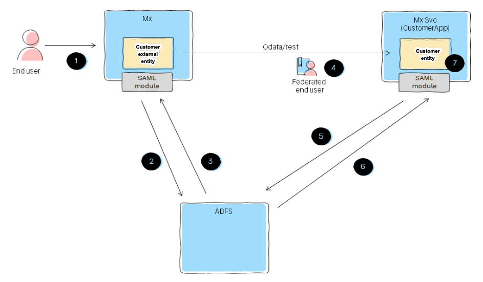

## 1 Introduction

When sharing data in an organization, access to and security of the data is a primary concern. 

Security for an app can be defined at the app project-level, module-level, and entity-level. Further authentication methods can also be specified to control access to the data associated with published entities.

This security level determines which end-users of the apps will have access to the data represented by the entity. For example, an app developer in Mendix Studio Pro working in an HR department can use the **Employees** entity in the Data Hub Catalog in their application. The developer must have access to representative test datasets that are made available in a test or acceptance environment to properly develop the app. However, at runtime, they may not be able to see all the actual employee data if they do not have the correct access permissions. Similarly, end-users of the consuming app will only be able to see the data for which they have clearance.  HR managers using this app will be able to see more data from the same employee entity database according to their access clearance.

For further information, see the [Security](https://docs.mendix.com/refguide/published-odata-services#3-2-security) section in *Published OData Services*.

Security is determined by the identification protocols of the organization and applied to all access to the data via Mendix apps. This how-to shows an example of applying [custom HTTP header validation](#http-header-validation).

{}[**AD: is this a how-to? If so, the intro needs to follow the template. If not, change the sentence with "how-to" above to something like: "For more information, see the [Using Custom HTTP Header Validation for Published Entities](#http-header-validation) section below."**]{} 

## 2 OData Security for Shared Data Entities

For Mendix apps that publish entities and those that consume shared entities in their apps as [external entities](), the following details apply:

{}[**AD: add cross-reference above, or that will break the build**]{} 

* The security for the OData-based service is defined in the publishing app – at the project, module, and entity level
*  The security that is defined at the module level will apply to the OData services that are published from the module and enforced when the entities from the service are used in a consuming app when end-users try to access the data

	{}The security for an OData service can only be set if the [project security](https://docs.mendix.com/refguide/project-security) is enabled.
	{}

* Classification of the data associated with the entities is defined in the service metadata and shown in the **Service Metadata** pane of the **Search Details** screen. This is further discussed below.

	{}[**AD: verify that "Service Metadata" and "Search Details" are in the UI to justify capitalizing and bolding those terms; add cross-references to page/details on that pane and that screen; "This is further discussed below" is not an appropriate cross-reference - add a link to an anchored section and standardize: "For details, see..."**]{} 

* Through the identification protocols used for establishing the user identity, the security rules for the user in the publishing app are applied
	
	* On the Mendix Platform, this is [Mendix SSO](/developerportal/deploy/mendix-sso),  but it can also be the organization's identification protocol
*  In the publishing app in Studio Pro, access can be defined at the entity level as follows:
	* None
	* Basic authentication on the user name and password
	* Customized where the publisher builds their own microflow which gets the header from the request to determine the user and what the user wants to do

For further details, see the [Entity Access](/refguide/module-security#entity-access) section of *Module Security*.

## 3 Classification of Registered OData Services

OData services registered in the Data Hub Catalog have the following classifications that apply to the data associated to the exposed entities:

* **Public**  – data is available to all internal and external users
* **Internal**  – data is restricted to the members of the organization

The classification of the asset indicates the runtime security on the data and defines what application users are allowed to see and use when running their application.

{}[**AD: "application" used twice above is a little confusing - is there another way to put that?**]{} 

The classification for a registered OData service is shown in the **Service Metadata** panel in the Data Hub Catalog. This classification applies to access to the data associated with the service or entity by end-users of the app that consumes the entity. 

{}[For Services that are classified as Internal,  further information on how the security is enforced (Mendix SSO or the organization's own identification protocol) is given in the **Security** field in the **Asset Metadata** pane and the end-user roles that may have access to the data in the resulting app which is shown in the **Visibility**.]{} 

## 4 Using Custom HTTP Header Validation for Published Entities {#http-header-validation}

{}[**EC: To be further verified and graphics and screenshots replaced**]{} 

For an example of how to implement authentication using security assertion markup language (SAML) and Active Directory Federation Services (ADFS),  the following illustrates how to use a custom HTTP headers microflow and a custom HTTP validation microflow to generate, set, and validate authentication tokens.

{}[**AD: what is "the following" referring to above? The following "steps"? The next sentence describes another "following." If the referent doesn't immediately follow "the following," use "below," as in, "the steps below." Please clarify.**]{} 

The following steps describe how the security proposal is set with 
[ADFS](https://docs.microsoft.com/en-us/windows-server/identity/active-directory-federation-services) and the [SAML](/appstore/modules/saml) Mendix App Store module:

{}[**AD: a diagram like this needs to be fully verified by the PM and then sent to Design so they can redesign it and bring it in line with Mendix standards - please request from Jeroen**]{}

{}[**IG: PM approves - this is in progress**]{}

1. The app end-user logs into an app that uses external entities.
2. The end-user is not yet authenticated, so the SAML module forwards the user to ADFS for authentication.
3.  If the correct credentials are provided, ADFS returns a cookie for SSO.

	{}[**IG: EC - SJ or GM - Does the cookie contain the  JWT tokens?** change graphic to one which does specify a valid microflow should the microflow name be the same]{} 

4.  When the end-user performs a query on a external entity, the JSON web tokens (JWTs) are set on the API call (and are validated with a microflow in the consumed OData service):

	

5.  The publishing app receives the request and uses the custom microflow specified in the settings of the published OData document to validate the tokens. If the tokens are not known, it calls ADFS to validate the user.

	

6. ADFS returns the user validation.
7. The customer authentication microflow on the OData service document returns the appropriate user which is used for retrieving the data. The entity access rules will use this user for authorization.
