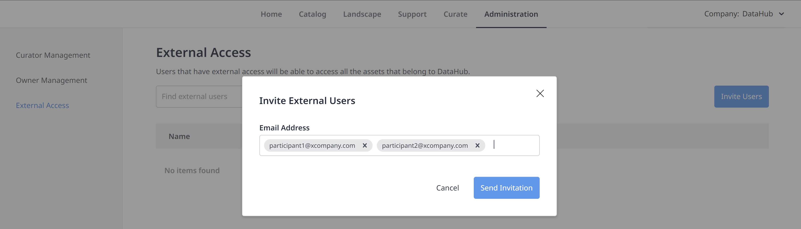

## 1 Introduction

Every organization has one Mendix Data Hub Administrator. The Data Hub Admin can assign any number of curators who can manage the day to day administration and perform curate functions on the the registered assets in the Data Hub Catalog.

In the **Administration** tab of **Data Hub**, the operations that can be performed by these two types of users are as follows:

* **Data Hub Admin**:
  * Assign curators
  * Manage the list of custom owners that have been added as **Business** or **Technical Owners** when a service has been [Curated](/data-hub/data-hub-catalog/curate#custom-owner).
  * Invite **External Participants**
* **Curators**:
  Manage the list of custom owners that have been added as **Business** or **Technical Owners** when a service has been [Curated](/data-hub/data-hub-catalog/curate#custom-owner).

{}
In the current release of Data Hub, the Data Hub Admin for the organization is assigned by [Mendix Support](https://support.mendix.com/hc/en-us): please contact your support representative.
{}

This how-to describes the following:

- How the Mendix Data Hub Admin can assign the curator role to users
- How curators and the Data Hub Admin can manage the list of custom owners and their contact details
- How the Mendix Data Hub Admin can invites External Participants in the company

## 2 Managing Curators {#curator}

The Data Hub Curator can perform day-to-day management functions on all registered assets in the Data Hub Catalog and also enrich the Catalog information on registered assets that is displayed.

Curators can see and curate all registered assets in the Data Hub Catalog. Mendix users who own registered assets can curate their own items, but not those that they do not own.

The Data Hub Admin can add or remove the curator role by following these steps:

1. From **Data Hub** screen, click the **Administration** tab:

	

2. The Data Hub Admin will see the **Curator Management** tab displaying  the list of Data Hub curators for the organization. To assign a curator role to a Mendix user, click **Add Curator**.

   {}A user with curator rights can access all assets registered in the Catalog. This also includes those that are set to **Non-discoverable**. Curators can also change the information that is registered for assets that are owned by other users. {}
   
3. If you want to remove the curator rights for a user, check the box against the name and confirm this by clicking **Remove Curator**.
   
    {}This will only remove the curator rights of the user, it will not remove the user as a Mendix platform user.{}

To search from the list of Mendix users in your organization, start typing in the search box and check the user(s) you want to assign the curator role to.

{}This list shows all Mendix users for your organizations. It does not include non-Mendix users that are  added as *Custom Owners* as described in [Managing Custom Owners](#customowners).{}

## 3 Managing Custom Owners {#custom-owners}

Custom owners are owners that have been added as the contact for a registered application. They may be added during the application [curation](/data-hub/data-hub-catalog/curate#custom-owner) or have been specified during app registration.

They are  the contacts for registered assets. Adding a custom owner does not give them access rights to the Catalog. Custom owners are displayed in the drop-down lists by an avatar that only displays their initials (Mendix users have their personalized avatar displayed).

Curators and the Data Hub Admin can manage the custom owner list under the **Owner Management** tab.

{}
Curators will only see  **Owner Management** under the **Administration** tab.
{}

From the **Owner Management** tab, you can do the following:

* Add owners – the **Add Owners** button allows you to add new owners by filling in their name and email. New owner will be listed when **Business** or **Technical Owners** are curated for registered assets.

	{}Custom owners in this list are not Mendix platform users but serve as contact for the registered assets.  They are not able to login to the Mendix Platform or curate registered assets in the Catalog. {}

* Edit the details of the listed owners by clicking the edit pencil icon.
* Delete names from the list by clicking the **x** icon and confirming your choice.

	{}If a custom owner is removed from the list, they will also be removed from any registered assets where they were set as the owner. This means that the asset will not have a contact.{}

New custom owners can also be added when assets are being curated as described in [Changing the Technical and Business Owners of an App](/data-hub/data-hub-catalog/curate#custom-owner).

## 4 Managing External Participants {#external-access}

**External Access** allows Data Hub Admin to invite members **(External participant)** from outside the organization. **External participant** has certain access such as searching published data sources or use them in projects. However external participants cannot register or curate content of the company unless they are the owner of the data source.

Data Hub Admin can manage the external participants list in the **External Access** screen. 

To invite new users, do the following:

1. From the **Data Hub** screen, go to the **Administration** tab > **External Access** screen.

2. Click the **Invite Users** button.

3. In The **Invite External Users** dialog box, fill in the email addresses of the users you would like to invite as external participants and click **Send Invitation**.     

    {}The users you are inviting should have a Mendix account. {}

    After users receive the invitation, they need to log into Data Hub and accept the invitation

    {}A user can only work in one organization at a time. To work actively in an organization as an external participant, they need to select an **Active company** option from the Catalog homepage.{}

   

   
