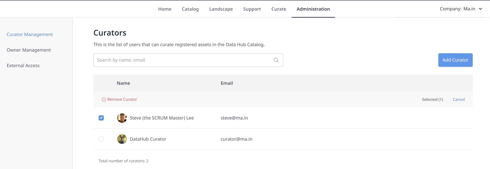
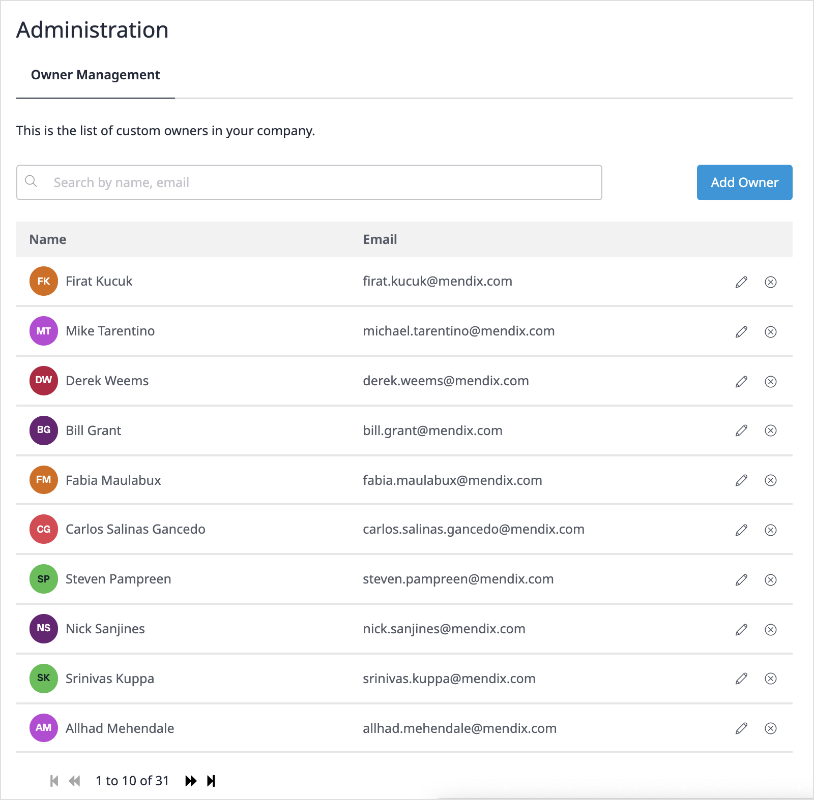

## 1 Introduction

The Mendix Data Hub Administrator can perform admin functions for the Data Hub such as assigning the curator roles from the **Administration** tab of **Data Hub**.

{}
The Data Hub Admin for the current release of Data Hub is assigned by [Mendix Support](https://support.mendix.com/hc/en-us): please contact your support representative.
{}

In addition, the Data Hub Admin and curators can also maintain the list of custom Owners that have been added as **Business** or **Technical Owners** when a service has been [Curated](../data-hub-catalog/curate#customowner). 

This how-to describes:

- how the Mendix Data Hub Admin can assign the curator role to users
- how curators and the Data Hub Admin can manage the list of owners and their contact details that have been added to the asset

## 2 Managing Curators {#curator}

The Data Hub Curator curates registered assets in the Data Hub Catalog to enrich the information on registered assets and maintain assets. 

Curators can see and curate all registered assets in the Data Hub Catalog, including the ones that are set to **Non-discoverable** by service owners. 

The Data Hub Admin can assign users the curator role by following these steps:

1. From **Data Hub** screen, click the **Administration** tab:

   

2. By default, the **Curator Management** tab is displayed showing the list of Data Hub curators for the organization.

3. To add a curator role to a Mendix user, click **Add Curator**.

4. To search from the list of Mendix users in your organization, start typing in the search box and check the user(s) you want to assign the curator role to.

5. If you want to remove the curator rights for a user, check the box against the name and confirm this by clicking **Remove Curator**.

   {}
   This will only remove the curator rights of the user, it will not remove the user as a Mendix platform user.
   {}

## 3 Managing Custom Owners {#customowners} 

**Business** or **Technical Owners** that have been added when a service has been [Curated](../data-hub-catalog/curate#customowner) can be managed in the **Owner Management** screen:

You can **Add Owners** which will be listed in the selection list for **Business** or **Technical Owners** when registered assets are curated. This will insert a link to the email that is specified here. 

{}
Custom owners in this list are not Mendix platform users but serve as contact for the registered assets. 
{} 

You can edit the details of the listed owners from this screen.

To delete names from the list, click the **x** and confirm the removal. 

{}
If a custom owner is removed from the list, they will also be removed from any registered assets where they were set as the owner. This means that the asset will not have a contact.
{} 

