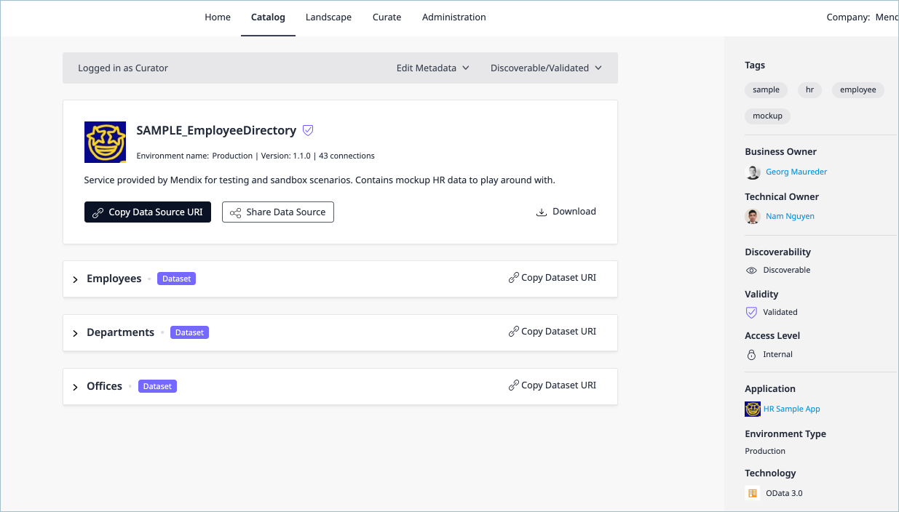

## 1 Introduction

This guide takes you through how to use and the [DataHubAPI](http://datahub-spec.s3-website.eu-central-1.amazonaws.com/) for searching and registering your data sources from your business applications to Data Hub and consuming them. 

The [DataHubAPI](http://datahub-spec.s3-website.eu-central-1.amazonaws.com/) is published as an OpenAPI 3.0 (formerly Swagger) specification which enables you to visualize the API. It has the latest documentation on the implemented calls.  For full definitions of the objects and schemas used in this how-to, refer to the specification.

You can see the process of search and registration to Data Hub in the [Share Data Between Apps](/data-hub/share-data) how-to. This demonstrates the integrated functionality of Data Hub in Mendix Studio Pro for registering data sources. Using the Data Hub API you can create a deployment process for your apps to register the OData v3 and OData v4 services from these apps and make them available for use in another app through the Data Hub Catalog. 

**Note**: To use the Mendix Data Hub a license is required.

**This how-to will teach you how to do use the API to do the following:**

- Search the catalog for a string – [Section 5](#api-search)
- Register the service in the Catalog –  [Section 6](#api-search)
- Register consumed datasets by an App – [Section 7](#consumed-ep)
- Search for data sets and data sources to consume by your business application for new app development [Section 9](#consume-data)

## 2 Prerequisites

Before starting this how-to, make sure you have completed the following:

- Have a registered Mendix Data Hub account
- To access the API you must obtain a Personal Access Token (PAT) as described in [Generating your Personal Access Token](/apidocs-mxsdk/apidocs/data-hub-apis#generatepat) to authenticate your integration’s API requests

## 3 Overview of the Data Hub API

- You can access the latest Data Hub API at: [http://datahub-spec.s3-website.eu-central-1.amazonaws.com](http://datahub-spec.s3-website.eu-central-1.amazonaws.com/).

- The base URL for all calls to the API is: https://hub.mendix.com/rest/datahubservice/v2/

- All requests that are made to the Data Hub API must include the access to the organization’s Data Hub. This is accomplished by including the PAT ( [Generating your Personal Access Token](/apidocs-mxsdk/apidocs/data-hub-apis#generatepat)) in the header of the request: `Authorization`:  `MxToken <your_PAT_Token>.` For more details see: [API calls and authentication](#authentication).

- For the full specifications of the parameters and schemas and the response status codes refer to the  [OpenAPI 3.0 spec](http://datahub-spec.s3-website.eu-central-1.amazonaws.com/). 

- The requests that can be made through the Data Hub API:

  - Search for registered assets (data sources, datasets, attributes and associations) in the Catalog using GET /data
  - Registering datasets:
	Registering datasets involves registering the data source (OData services) that the dataset is exposed in. The following requests must be made in the given order using the returned UUID values for the subsequent requests:
		1. Application that the dataset originates from: POST application
		2. Environment that the dataset is deployed to: POST environment
		3. Register the published services (data source) of the application: PUT
		4. Register the all the published services (data source) of the application
		5. Register consumed services (data source)

  - Find specific data sources and retrieve contracts to consume


## 4 Making the API Calls and Authentication {#authentication}

This how-to guides users in using the Data Hub API, for full details of all the objects and schemas that define the collections and arrays that are required refer to the [Data Hub OpenAPI 3.0 spec](http://datahub-spec.s3-website.eu-central-1.amazonaws.com).

For each request described in this document, the method and URL is given for the base call with a description of the parameters and body. An example is given that you follow to try out the calls. 

For some examples, the [curl](http://curl.haxx.se/) command is also given. You will be required to enter the specifics for your own registration such as the returned values for your requests. 

**Note:** curl is an open-source tool curl that is pre-installed on many Linux and macOS systems. Windows users can download a version at curl.haxx.se. When using HTTPS on Windows, ensure that your system meets the curl requirements for SSL.


### 4.1 Authentication

Authentication in the Data Hub API is established by defining the access to your organization’s Data Hub using the [PAT](https://docs.mendix.com/apidocs-mxsdk/apidocs/data-hub-apis#generatepa). You do not specify any *authorization* for your request but must include the following key:value pair as part of the header for *each* request:  `Authorization`:  `MxToken <your_PAT_Token>`

#### 4.1.1 Using Postman
If you prefer to use a tool with a graphical user interface when working with APIs, you can use a REST API client of your choice, for example, [Postman](https://www.getpostman.com/).  Using Postman, for each request, provide the request URI, the HTTP method, and, if required, the request parameters and body.  Authentication is specified in the request **Header**.  You can set your PAT token as a variable which can be conveniently called for each request.

####  4.1.2 Using a Command Line Tool such as Curl
If you are using the [curl](http://curl.haxx.se/) command to send your HTTP requests to the API  then you must include the authentication header as given in this example of a GET call: 

`curl --location --request GET 'https://hub.mendix.com/rest/datahubservice/v2/data' \
--header 'Authorization: MxToken <*yourMxToken>*' \`

Insert your `MxToken` for the the string <*your token*> for every request that you make.

### 4.2 Base Variables used in this How-to

For convenience and conciseness, throughout this how-to the following variables are used and should be substituted by the relevant values or those that are returned in the response:


- {{baseURL}} – the base URL for the Data Hub API:  https://hub.mendix.com/rest/datahubservice/v2/data
- {*AppUUID}* – insert the value returned in the API response for the UUID of the application
- {*EnvironmentUUID} -* insert the value returned in the API response for the UUID of the application

## 5 Searching in the Catalog{#api-search}

Search in the Catalog returns the registered assets that satisfy the search string and filters you have specified. The search is carried out on all registered assets in the catalog (data sources, data sets, attributes and descriptions of the registered items).

### 5.1 Method and Endpoint

`GET /data` 

### 5.2 Request Parameters

The following parameters can be specified for the `data` call:

| **Name**                | **Type** | **Required/Optional** | **DefaultValue**      | **Description**                                              |
| ----------------------- | -------- | --------------------- | --------------------- | ------------------------------------------------------------ |
| query                   | string   | optional              |                       | Search string                                                |
| productionEndpointsOnly | boolean  | optional              | false                 | Boolean filter to only return endpoints in a Production environment. False will return endpoints in Production, Non-production and Sandbox environments. |
| contractType            | string   | optional              | all                   | Protocol used by the service. Currently supported values: OData_3_0, OData_4_0_Xml, Kafka_1_0. |
| afterId                 | string   | optional              | first page of results | UUID of the last endpoint on the previous page               |
| limit                   | integer  | optional              | 20                    | The maximum number of items that could be returned. Default is 20, Maximum value = 100. |

### 5.3 200 OK Response

A successful 200 response returns the assets from the Data Hub that satisfies the search string and specified filters. This means that all the objects in the the returned `Data` array will have the string `sample` in the names and descriptions. 

#### 5.3.1 `SearchResults` objects {#api-search-results}

The endpoints (which are the data sources (services)) that are returned in the `SearchResults` object comprise the following.  For a full specification of the lower level objects and arrays refer to the [OpenAPI 3.0 spec](http://datahub-spec.s3-website.eu-central-1.amazonaws.com/).

| **Name**     | **Type** | I**ncluded in response?** | **Description**                                              |
| ------------ | -------- | ------------------------- | ------------------------------------------------------------ |
| Data         |          | always                    | An array of `Data` objects (5.3.2)                           |
| Links        |          | always                    | Array of `Link` objects.  Pagination links. 'First' provides the URL to the first page of results, 'Current' provides a URL to the current page of results, 'Next' provides URL to the next page of results. |
| Limit        | integer  | always                    | Limit for this request. Example: 1                           |
| LastId       | string   |                           | UUID of the last item returned in the `Data` array. Example: 69db538d-35d4-4a9f-825a-93db0eb8130f |
| TotalResults | integer  | always                    | Total number of results matching the search query. Example: 87 |

#### 5.3.2  `Data` Objects
The objects that are returned in the response  for  `Data`  which are the search results are shown in the representation below. (The blue indicates that the constituent objects are a collection (of further sub-objects which may not be shown here), the red an array, and the solid outline indicates if the object is always returned.) For full details of objects that define the arrays and collections, refer to the  [OpenAPI 3.0 spec](http://datahub-spec.s3-website.eu-central-1.amazonaws.com/). 

- [ ]  the schema table is not really necessary here as users can see the full details in the spec, however it does show at a glance what default values are etc.  The mind-map below shows the essence of the calls - can it be made clearer by adding the default values??? should it go down to a deeper level?


| **Name**               | **Type** | I**ncluded in response?** | **Description**                                              |
| ---------------------- | -------- | ------------------------- | ------------------------------------------------------------ |
| UUID                   | string   | always                    | UUID of the endpoint.<br>Example: 69db538d-35d4-4a9f-825a-93db0eb8130f |
| Name                   |          | always                    | Name of the service published at the endpoint. Example: test.acme.employeeinformation |
| Version                | integer  | always                    | Version of the service published by the endpoint. Example: 2.1 |
| ContractType           | string   | always                    | Protocol used by the service. Currently supported values: OData_3_0, OData_4_0_Xml, Kafka_1_0 Example: OData_3_0 |
| Description            | string   |                           | Description of the service published by the endpoint. Only returned if present. Example: Information about the employees of AcmeCorp |
| Connections            | integer  | always                    | Number of environments consuming this endpoint.  Example 42  |
| LastUpdated            | string   | always                    | UTC timestamp of the most recent update to the service. Example: 2019-01-01T15:22:58.981Z |
| SecurityClassification | string   | always                    | The classification of data for this service. Allowed string values (rather than enum): Public, Internal (restricted to company), or Confidential (restricted within company). Example: Internal |
| Validated              | boolean  | always                    | Indicates if the service is validated during curation. Example: true |
| SecurityScheme         |          | always                    | An array of objects defining the security scheme for the item. |
| Environment            |          | always                    | A collection of the objects specifying the deployment environment |
| Application            |          | always                    | A collection of objects specifying the application details of the service. |
| Tags                   |          | always                    | Tags on this endpoint.<br>example: List [ OrderedMap { "Name": "HR" }, OrderedMap { "Name": "Salary" }, OrderedMap { "Name": "PeopleManagement" } ]<br>An array of `Tag` objects |
| TotalItems             | integer  | always                    | The total number of items (such as data sources ) existing at this level.<br>Example: 17 |
| Items                  |          | Always                    | List of items (such as data sources) at this endpoint relevant to the search query. For example see [OpenAPI 3.0 spec](http://datahub-spec.s3-website.eu-central-1.amazonaws.com/) |
| Links                  |          | always                    | Catalog is a deeplink to the endpoint details page in the Catalog. Self is the URL with the endpoint details, including contracts. |


### 5.4 Example: Searching for Registered Assets in the Catalog that have the string:  `sample`

#### 5.4.1 Base Request URL
This example shows you how to search for assets that satisfy the following:

- the search string `sample` 
- in the production environments only (value `true`)
- for all registered contract types 

**The GET request URL is as follows**:

`GET {{baseURl}}/data?query=sample&productionEndpointsOnly=true`

**The  curl command for the above search is**:

```curl
curl --location --request GET 'https://hub.mendix.com/rest/datahubservice/v2/data?query=sample&productionEndpointsOnly=true' \
--header 'Authorization: MxToken <*your MxToken>*'
```


#### 5.4.2 Successful 200 Response
The 200 OK response returned that the `TotalResults` are 11 assets were found that statisfy the search string and parameters.

The response payload is shown below:

**Note:**  For conciseness in this how-to, of the 11 objects that are returned for the  `Data`  object only the second data source, **SAMPLE_EmployeeDirectory**, is shown fully in the response payload below, the other data sources have been represented as { … }.

```json
{
​    "TotalResults": 11,
​    "Links": [
​        {
​            "Href": "https://hub.mendix.com/rest/datahubservice/v2/data?query=sample&productionEndpointsOnly=true",
​            "Rel": "First"
​        },
​        {
​            "Href": "https://hub.mendix.com/rest/datahubservice/v2/data?query=sample&productionEndpointsOnly=true",
​            "Rel": "Current"
​        },
​        {
​            "Href": "https://hub.mendix.com/rest/datahubservice/v2/data?query=sample&afterId=c6afa18d-4b3d-49b2-a945-5a93b9a0868e&productionEndpointsOnly=true",
​            "Rel": "Next"
​        }
​    ],
​    "Data": [
​        {...   },
​        {
​            "Connections": 43,
​            "Validated": **true**,
​            "Description": "Service provided by Mendix for testing and sandbox scenarios. Contains mockup HR data to play around with.",
​            "SecurityClassification": "Internal",
​            "TotalItems": 3,
​            "Name": "SAMPLE_EmployeeDirectory",
​            "Version": "1.1.0",
​            "ContractType": "OData_3_0",
​            "Environment": {
​                "Type": "Production",
​                "UUID": "c2fee2c5-00da-4b8b-b3b3-71433b02f064",
​                "Name": "Production",
​                "Location": "https://hrsampleapp.mendixcloud.com"
​            },
​            "Links": [
​                {
​                    "Rel": "Self",
​                    "Href": "https://hub.mendix.com/rest/datahubservice/v2/applications/30aaf7ca-415f-306d-bd6e-458e6f821f06/environments/c2fee2c5-00da-4b8b-b3b3-71433b02f064/services/SAMPLE_EmployeeDirectory/1.1.0"
​                },
​                {
​                    "Rel": "Catalog",
​                    "Href": "https://hub.mendix.com/link/endpoint?EndpointUUID=d4369ff2-cb61-4db0-b77c-b0ba35b052e1"
​                }
​            ],
​            "Items": [],
​            "LastUpdated": "2021-03-09T13:47:04.482Z",
​            "UUID": "d4369ff2-cb61-4db0-b77c-b0ba35b052e1",
​            "SecurityScheme": {
​                "Types": [
​                    {
​                        "Name": "Anonymous"
​                    }
​                ],
​                "MxAllowedRoles": [
​                    {
​                        "ID": "8dd52bfa-6d7e-453b-b506-303c0a3d9567",
​                        "Name": "Administrator"
​                    },
​                    {
​                        "ID": "53f5d6fa-6da9-4a71-b011-454ec052cce8",
​                        "Name": "User"
​                    }
​                ]
​            },
​            "Application": {
​                "Type": "Mendix",
​                "TechnicalOwner": {
​                    "Email": "nam.nguyen@mendix.com",
​                    "OpenID": "https://mxid2.mendixcloud.com/mxid2/id?id=81b8f360-0e75-4195-b1b7-30aed6018eae",
​                    "Name": "Nam Nguyen"
​                },
​                "Icon": "https://hub.mendix.com/rest/documents/v1/images/944a6477-e83c-4236-a6b8-3374c6551657",
​                "UUID": "30aaf7ca-415f-306d-bd6e-458e6f821f06",
​                "RepositoryLocation": "https://sprintr.home.mendix.com/link/project/98c8f370-7bbe-4df5-8289-031c10383ece",
​                "BusinessOwner": {
​                    "Email": "georg.maureder@mendix.com",
​                    "OpenID": "https://mxid2.mendixcloud.com/mxid2/id?id=283b4e98-cee5-4181-88e9-3c87624944bb",
​                    "Name": "Georg Maureder"
​                },
​                "Name": "HR Sample App"
​            },
​            "Tags": [
​                {
​                    "Name": "sample"
​                },
​                {
​                    "Name": "hr"
​                },
​                {
​                    "Name": "employee"
​                },
​                {
​                    "Name": "mockup"
​                }
​            ]
​        },
​        { ... },
​        { ... },
​        { ... },
​        { ... },
​        { ... },
​        { ... },
​        { ... },
​        { ... },
​        { … }
​    ],
​    "Limit": 20,
​    "LastId": "c6afa18d-4b3d-49b2-a945-5a93b9a0868e"
}
```

#### 5.4.3 Example Search Results Viewed in the Catalog

The same search in the Data Hub returns the following showing the total list in the search results pane on the left and the details of the selected **SAMPLE_EmployeeDirectory** :


## 6 Registering an OData Contract {#reg-contract}

This section describes the steps for registering a data source – this can be an OData v3  or a OData v4 contract.
To register a data source to Data Hub you must register the following in the given sequence:


1. Application that the data source originates from: `POST application`
2. Environment that the data source is deployed to: `POST environment`
3. The published services from the application (data sources) : `PUT published-endpoints`

[Section 7](#consumed-ep) decribes how to register applications that consume a registered data source.

An example Odata v3 service  **DataHub_Sample_1.0.0_OData3**  is provided in [Section 9](#consumed-ep) which you can use for this how-to.  The service is defined by the metadata.xml file.

**Note:** OData service contract files must be included in the request body in escaped JSON format. There are several online converters available for converting your *.xml* files into this format such as one available from [Freeformatter.com](https://www.freeformatter.com/json-escape.html#ad-output). Just paste the contents of your files and convert them to the escaped format.  

### 6.1 Registering an Application in the Catalog using POST

The first step is to register the application that the service originates from. 

**Note**: If the application deployed to the same requirement as the service you want to register is already registered in the Catalog (for previously registered services, for example), you can proceed to 6.3 using the `AppUUID` and `EnvUUID` for the registered service.  These objects can be obtained from search results as described in [Search request response](#api-search-results). 

#### 6.1.1 Method and Endpoint
`POST /applications`

#### 6.1.2 Request Body
There are no parameters to this request only a payload that specifies the details of the application to be registered:

| **Name**           | **Type** | **Required/Optional** | **Default Value** | **Description**                                              |
| ------------------ | -------- | --------------------- | ----------------- | ------------------------------------------------------------ |
| Name               | string   | Required              |                   | Name of the application                                      |
| Description        | string   |                       |                   | Description of the application                               |
| RepositoryLocation | string   |                       |                   | Location of the development repository of the application    |
| Type               | string   |                       | Other             | Type of the application. Possible values are "Mendix", "Teamcenter", "Mindsphere", "Microsoft", "SAP" and "Other" (Default)<br>Enum:<br>[ Mendix, Teamcenter, Mindsphere, Microsoft, SAP, Other ] |
| BusinessOwner      |          |                       |                   | Business owner of the application comprising objects defining name and email. |
| TechnicalOwner     |          |                       |                   | Technical owner of the application comprising objects that define the name and email. |


#### 6.1.3 POST Response
A successful 201 response will indicate that the application has been registered in the Catalog and return an application `UUID`, which is the Catalog identifier for the registered app that must be used  when referring to the application in the next steps of the registration.

#### 6.1.4 Example: Registering the Howto5-App {#ex-reg-app}
In this example, you are going to register an app called **Howto5-App**. The details of the app are included in the JSON format request body given below.

##### 6.1.4.1 Base request URL
`POST {{baseURL}}/applications`

**The example curl command**

The curl command specifies the format of the the body content and the body data that is given in 6.1.4.2. 

```curl
curl --location --request POST '{{BaseURL}}' \
--header 'Content-Type: application/json' \
--header 'Authorization: MxToken <*yourMxToken>*' \--data-raw '{
  "Name": "Howto5-App",
  "Description": "This application is used to show how the DH API is used",
  "RepositoryLocation": "https://dhcorp5.test/",
  "Type": "Other",
  "BusinessOwner": {
​    "FirstName": "Bill",
​    "LastName": "Raine",
​    "Email": "bill.raine@dh123.co"
  },
  "TechnicalOwner": {
​    "FirstName": "Bob",
​    "LastName": "Raine",
​    "Email": "bill.raine@dh123.co"
  }
}
```

##### 6.1.4.2.  JSON Format Request Body

```json
{
  "Name": "Howto5-App",
  "Description": "This application is used to show how the DH API is used",
  "RepositoryLocation": "https://dhcorp5.test/",
  "Type": "Other",
  "BusinessOwner": {
    "FirstName": "Bill",
    "LastName": "Raine",
    "Email": "bill.raine@dh123.co"
  },
  "TechnicalOwner": {
    "FirstName": "Bob",
    "LastName": "Raine",
    "Email": "bill.raine@dh123.co"
  }
}
```

##### 6.1.4.3 Successful 201 Response Application Created {#app-registered}
The 201 response that is returned to indicate that the application is registered is given below: 

**Note**: that the response returned the  `"UUID": "2ab1410e-06d4-4e07-a82d-cc04b21d2622"`, which is the Catalog identifier for the application that must be used to identify it in subsequent steps of the registration of the data source.

```json
{
​    "Name": "Howto5-App",
​    "Description": "This application is used to show how the DH API is used",
​    "UUID": "2ab1410e-06d4-4e07-a82d-cc04b21d2622",
​    "RepositoryLocation": "https://dhcorp5.test/",
​    "Type": "Other",
​    "TechnicalOwner": {
​        "FirstName": "Bob",
​        "LastName": "Raine",
​        "Email": "bill.raine@dh123.co"
​    },
​    "BusinessOwner": {
​        "FirstName": "Bill",
​        "LastName": "Raine",
​        "Email": "bill.raine@dh123.co"
​    }
}
```

### 6.2 Registering an Environment using POST

The next step is to register the environment where the app and the service is deployed. 

#### 6.2.1 Method and Endpoint
`POST /applications/{AppUUID}/environments`

#### 6.2.2 Request Parameters and body

| **Name** | **Type** | **Required/Optional** | **DefaultValue** | **Description**                 |
| -------- | -------- | --------------------- | ---------------- | ------------------------------- |
| AppUUID  | string   | Required              |                  | Catalog UUID for registered app |


The Request must be accompanied by the following body: 

| **Name**        | **Type** | **Required/Optional** | **DefaultValue** | **Description**                                              |
| --------------- | -------- | --------------------- | ---------------- | ------------------------------------------------------------ |
| Name            | string   | Required              |                  | Name of the environment                                      |
| Location        | string   | Required              |                  | Location of the environment                                  |
| Type            | string   | Required              | Non-Production   | Value for the environment type, allowed values are: Production, Non-Production, Sandbox. Default value is Non-Production. |
| CustomLocations |          |                       |                  | An array of custom locations at which this environment can also be reached. |


#### 6.2.3 Successful POST Response
A 201 response indicates that the environment has been registered in the Catalog for the given application and returns the environment UUID for the environment. 

The unique combination of the App UUID and the environment UUID is the identifier used to register any published endpoints (data sources/services) for the application that are deployed to this environment. 

**Note:** You will also need these UUIDs registering if the apps consume data sources as described in [registering consumed endpoints](#consumed-ep).

#### 6.2.4 Example: Registering the Environment `Production`  for the Howto5-App 

For the app registered in 6.1.4.4 the following steps describe how to register the environment **Production** that the app and the service are deployed to.

##### 6.2.4.1 Base request URL:
`POST {{baseURL}} /applications/{appUUID}/environments`

##### 6.2.4.2.  JSON format request body for the Environment
 {
    "Name": "Production",
    "Location": "https://howtoenv5555.test",
    "Type": "Production",
    "CustomLocations": [
        "https://api.howto5555.test"
    ]
}

##### 6.2.4.4 Successful 201 Created Successful 200 {#env-registerd}
The 201 Created response returns the Catalog-generated identifier   `"UUID": "236c9acc-830c-48d9-a0ef-e1104a15d26d"` for the for the registered environment  `Production`.

```json
{
​    "Name": "Production",
​    "Location": "https://howtoenv5555.test",
​    "Type": "Production",
​    "CustomLocations": [
​        "https://api.howto5555.test"
​    ],
​    "UUID": "68005eaa-f652-438f-b71c-f76f0d52e372",
​    "Application": {
​        "Name": "Howto5-App",
​        "Description": "This application is used to show how the DH API is used",
​        "RepositoryLocation": "https://dhcorp5.test",
​        "Type": "Other",
​        "UUID": "32112bd7-6c87-4ff8-9542-36256df66259"
​    }
}
```

### 6.3 Registering the Published Services using PUT

This step describes the register service call for registering the services (endpoints) that are published by the app that are deployed to the same environment. 

When there are are multiple services for a given app each endpoint can be included in a single request as a part of the collection of `Endpoints`.

#### 6.3.1 Method and Endpoint
`PUT /applications/*{AppUUID}*/environments/*{EnvironmentUUID}*/published-endpoints`

#### 6.3.2 Request Parameters and Body

The parameters `AppUUID` and `EnvironmentUUID` of the deployed app are required as input parameters.

The request body is made up of the collection of objects for the `PutPublishedEndpointsRequest`. They include an array of the objects that define each service deployed by the app in the given environment –  `Endpoints` .

When defining each service in the `ServiceVersion` object specify all the details of the endpoints or service which includes the name, version number and the relative path `Path` of the contract definition files. The contract files that make up the service which can be found at the relative path must also be included as part of the `Contracts` object; they must be in an escaped JSON string format.

The objects that can be specified for the request body is shown in the following represenation. Not all the the lower levels are shown, for full schema definition refer to the [OpenAPI 3.0 spec](http://datahub-spec.s3-website.eu-central-1.amazonaws.com/).

(Blue indicates that the constituent objects are a collection, the red an array, and the solid outline indicates if the object is required.)


**Notes:** 

* For Odata contracts that are made up of several files, all the files must be included for each service.
- If an empty array is sent for `ServiceVersion`, then it will be interpreted that the application in the environment does not publish any services with this request. However, this will not affect any previously registered services.
- Previously registered services for the application/environment are not not affected by a PUT endpoints request. Any services that are already registered for the application/environment will still continue to be registered. Therefore the PUT call has the affect of "adding" services.
* When there are updates to a services, care must be taken when deciding to register the new contract at the same endpoint which means that the previous contract will be replaced or do a different endpoint. It is recommended that you use semantic numbering to indicate the severity of changes in the contract and that you follow a strict protocol when deciding on endpoints to ensure that apps consuming previous versions do not experience disruptions.
* If you want to "remove" services for an app, we recommend that you create a new version of the app, deployed to a different environment without the service you do not want included. In this way, you can maintain a historical version of the the assets, and ensure that consumers are notified of the new version, without affecting those that are consuming the previous version. 

#### 6.3.3  Successful 200 PUT Response
A successful 200 response returns the array of endpoints that are registered for the given environment and application.
For each endpoint a unique  `UUID` for is returned for each service.  

For each endpoint, the object  `Links`  provides the URL of the details page in the Catalog, and also the URI of the service.

The response also includes the number of applications/environments –  `Connections` – that consume this endpoint.


#### 6.3.4 Example: Registering the 5how-toODatav3-sample-service
In this example call, the service **5how-toODatav3-sample-service** is registered for the application registered in [6.1.4.4](#app-registered) and deployed to the environment registered in [6.2.4.4](#app-registered).

Two tags, `odata` and `sample` are defined as part of the registration.

For the `Contracts` object you can use the example OData v3 contract in Section 8 [Sample Contract](#sample-contract):  ` “Type”: “Metadata”`

##### 6.3.4.1 Base Request URL

`PUT` `{{baseURL}}/applications/{appUUID}/environments/{envUUID}/published-endpoints`

##### 6.3.4.2.  JSON format request body for the `Endpoints` **Object**
Each of the files that are used in this example have been provided in escaped JSON format in [Section 8: Sample Contract](#sample-contract). 

**Note:**  For conciseness the contents of the contract files not included in the following payload - it is respresented as  *<Insert example metadata from [metadata](#ex-metadata) >*.  You must insert the example contract file provided in Section 8 for the strings for this string, or alternatively use your own contract files - in escaped JSON format.

```json
{
    "Endpoints": [
        {
            "Path": "/5howto/v1",
            "SecurityClassification": "Public",
            "Discoverable": true,
            "Validated": false,
            "ServiceVersion": {
                "Version": "1.0",
                "Description": "A Sample OData v3 service",
                "Service": {
                    "Name": "5how-toODatav3-sample-service",
                    "ContractType": "OData_3_0"
                },
                "Tags": [
                    {
                        "Name": "odata"
                    },
                    {
                        "Name": "sample"
                    }
                ],
                "SecurityScheme": {
                    "SecurityTypes": [
                        {
                            "Name": "MxID",
                            "AppStoreModuleId": "a4f7847b-9562-4b5a-adc2-4a0bf41cc534"
                        }
                    ],
                    "MxAllowedRoles": [
                        {
                            "Name": "User",
                            "UUID": "91ca220e-9498-4d23-9d2e-90b9c19aca37"
                        }
                    ]
                },
                "Contracts": [
                    {
                        "Type": "Metadata",
                        "Value": "<Insert example metadata from [metadata](#ex-metadata) >
                    }
                ]
            }
        }
    ]
}
```

##### 6.3.4.3 Successful 200 OK Response

- [ ]  I  managed to register the application several times, therefore it had a different UUID, for the app and to the same name environment, but to a different location. Since location of env. is not shown, there were 2 identical entries in the catalog which had the same env. service. This is a problem - ref team. 

For the above request the following 200 OK response is received to provide the registration details of the service which includes the link to the URI of the service location, the URL to the catalog details page of the service and the service UUID. The Catalog entry for the service is also shown in [6.3.4.4](#ex-service-reg).

```json
{
​    "Endpoints": [
​        {
​            "Path": "5howto/v1",
​            "SecurityClassification": "Public",
​            "UUID": "ce825833-87b7-4f0f-8d8f-0fcfd40ccc57",
​            "Links": [
​                {
​                    "Href": "https://hub.mendix.com/rest/datahubservice/v2/applications/32112bd7-6c87-4ff8-9542-36256df66259/environments/68005eaa-f652-438f-b71c-f76f0d52e372/services/5how-toODatav3-sample-service/1.0",
​                    "Rel": "Self"
​                },
​                {
​                    "Href": "https://hub.mendix.com/link/endpoint?EndpointUUID=ce825833-87b7-4f0f-8d8f-0fcfd40ccc57",
​                    "Rel": "Catalog"
​                }
​            ],
​            "Connections": 0,
​            "LastUpdated": "2021-03-22T13:19:53.306Z",
​            "ServiceVersion": {
​                "Version": "1.0",
​                "Description": "A Sample OData v3 service",
​                "PublishDate": "2021-03-22T12:59:59.359Z",
​                "UUID": "9b813ec8-2725-446a-a189-b5337f5b9c9d",
​                "Service": {
​                    "Name": "5how-toODatav3-sample-service",
​                    "ContractType": "OData_3_0",
​                    "UUID": "3fba1292-0db2-4d68-9865-d5f30f5daa9e"
​                },
​                "SecurityScheme": {
​                    "SecurityTypes": [
​                        {
​                            "Name": "MxID",
​                            "AppStoreModuleId": "a4f7847b-9562-4b5a-adc2-4a0bf41cc534"
​                        }
​                    ],
​                    "MxAllowedRoles": [
​                        {
​                            "UUID": "91ca220e-9498-4d23-9d2e-90b9c19aca37",
​                            "Name": "User"
​                        }
​                    ]
​                },
​                "Tags": [
​                    {
​                        "Name": "odata"
​                    },
​                    {
​                        "Name": "sample"
​                    }
​                ]
​            },
​            "Validated": **false**,
​            "Discoverable": **true**
​        }
​    ]
}
```

##### 6.3.4.4 Registered Service in the the Data Hub Catalog and Landscape {#ex-service-reg}

The resulting entry in the Catalog for the registered service the entry in the Catalog is the following: 


This is shown in the Landscape as:


### 6.4 Removing Published Services for a Registered App

The PUT endpoints request does not affect any previously registered services for the application/environment.  Sending an empty PUT endpoints request will not remove previously registrations. Therefore PUT endpoints has the affect of "adding" services.

#### 6.4.1 Removing Services Deployed to an App/Environment

When you have a situation where you want to remove a published service for an app we recommend that you create a new version of the app, deployed to a different environment without the service you do not want included. 

For example:

**App1.0** publishes the following services

* App-1-premierservice1.0
* App-1-secondaryservice1.0
* App-1-tertiaryservice1.0

If you now want to remove **App-1-secondaryservice1.0** api to **App1.0** then a copy of App 1.0 can be made called **App1.1** and the secondary deleted from the published services.

**App 1.1** publishes the following services:

* App-1-premierservice1.0
* App-1-tertiaryservice1.0

In this example, the services in the two apps, must now be maintained in both apps and people consuming from the first app notified about the latest version of the app that is available.

In this way, you can maintain a historical version of the the registered assets, and ensure that consumers are notified of the new version, without affecting those that are consuming the previous version. 

#### 6.4.1 Services Versions and Endpoints

When there are updates to a services, care must be taken when deciding whether to deploy the new contract at the same endpoint or to a different endpoint as the changes may affect consuming apps.

Contract files deployed to the same endpoint of a registered service will mean that consuming apps must reload the changed contract.   

We recommend that you use semantic numbering for service versions to maintain a historical record and indicate the severity of changes. Further you should implement a strict protocol when updates are deployed to previoulsy registered endpoints. 

In all cases, you are advised to notify all consumers of changes and also new versions deployed to new endpoints. 

## 7 Registering Consumed Endpoints by an App using PUT {#consumed-ep}

For the app registered in [Section 6](#ex-reg-app),  you can register any datasets that it consumes by providing the endpoint details and the entities (datasets) that it consumes. This is registered in the Catalog and added to the number of **Connections** for the consumed service and also shown in the Data Hub Landscape which will show the network of publishing and consuming app and associated data sources.

**Note:** The PUT call for registering consumed entities will *update* the currently registered datasets for an app/environment. This means that when you want to *add* consumed endpoints to an app (indicating the services the app is consuming), all previously registered consumed endpoints must be included in the request payload of the new request. If the previously registered consumed endpoints are not included, the result will be that they will be *removed*.

### 7.1 Method and Endpoint

`PUT /applications/{*AppUUID*}/environments/{*EnvironmentUUID*}/consumed-endpoints`


### 7.2 Request Parameters and body

The body of the request must include an array of the objects consumed by the application.

Both parameters `AppUUID` and `EnvironmnetUUID` are required for the app that is consuming the service.

The Request body is comprised of the array of consumed endpoints `ConsumedEndpointRequestDetails`. 

For every consumed endpoint the unique identifier of the absolute URL of the endpoint must be provided for the  `EndpointLocation`. 
The `ConsumedItems` includes the name of the `EntitySet` that is consumed and the `Namespace` of the entity set to ensure that the correct consumed dataset can be registered.

**NOTE:**  Some apps may have the same named  `Entityset` which appears in several different `Namespaces` therefore,  while `Namespace` is not required, it is recommended that you include it.

The following is a representation of the request body. (Blue indicates that the constituent objects are a collection, the red an array, and the solid outline indicates if the object is required.)


### 7.3 POST Response

The 200 OK response returns an array of the consumed endpoints. It will provide the full details of each registered consumed endpoint,  the catalog UUID, and displays the and the total number of connections to it as registered in the Catalog. 

### 7.4 Example: Registering Consumed Endpoints by the Howto5-App

This example shows how to register that the **Howto5-App** consumes 2 datasets: **Employees** and **Offices** from the service **SAMPLE_EmployeeDirectory**. 

**Note**: For this example, the `Namespace` object for the `consumedItems` is called `DefaultNamespace` which is the default namespace for Mendix services.

#### 7.4.1 Base Request URL

`{{baseUrl}}/applications/{AppUUID}/environments/{EnvironmentUUID}/consumed-endpoints`

#### 7.4.2.  JSON Format Request Body to Register Consuming from SampleDH-App

To register the two consumed entities **Employees** and **Offices** from the HR Sample service at https://hrsampleapp.mendixcloud.com/odata/PubOdataEmployeeDirectory/v1

```json
{
    "Endpoints": [
        {
            "EndpointLocation": "https://hrsampleapp.mendixcloud.com/odata/PubOdataEmployeeDirectory/v1",
            "ConsumedItems": [
                {
                    "Type": "EntitySet",
                    "Name": "Employees",
                    "Namespace": "DefaultNamespace"
                },
                {
                    "Type": "EntitySet",
                    "Name": "Offices",
                    "Namespace": "DefaultNamespace"
                }
            ]
        }
    ]
}
```

#### 7.4.3 Successful 200 Created Response
The response that is returned shows the full details of the consumed service as part of the `Endpoints` object. The total number of connections to the service is 43: 

```json
{
​    "Endpoints": [
​        {
​            "Path": "odata/PubOdataEmployeeDirectory/v1",
​            "SecurityClassification": "Internal",
​            "UUID": "d4369ff2-cb61-4db0-b77c-b0ba35b052e1",
​            "Links": [
​                {
​                    "Href": "https://hub.mendix.com/rest/datahubservice/v2/applications/30aaf7ca-415f-306d-bd6e-458e6f821f06/environments/c2fee2c5-00da-4b8b-b3b3-71433b02f064/services/SAMPLE_EmployeeDirectory/1.1.0",
​                    "Rel": "Self"
​                },
​                {
​                    "Href": "https://hub.mendix.com/link/endpoint?EndpointUUID=d4369ff2-cb61-4db0-b77c-b0ba35b052e1",
​                    "Rel": "Catalog"
​                }
​            ],
​            "ConsumedItems": [
​                {
​                    "Name": "Employees",
​                    "Namespace": "DefaultNamespace",
​                    "Type": "EntitySet"
​                },
​                {
​                    "Name": "Offices",
​                    "Namespace": "DefaultNamespace",
​                    "Type": "EntitySet"
​                }
​            ],
​            "Environment": {
​                "Name": "Production",
​                "UUID": "c2fee2c5-00da-4b8b-b3b3-71433b02f064",
​                "Location": "https://hrsampleapp.mendixcloud.com",
​                "Type": "Production",
​                "Application": {
​                    "Name": "HR Sample App",
​                    "UUID": "30aaf7ca-415f-306d-bd6e-458e6f821f06",
​                    "RepositoryLocation": "https://sprintr.home.mendix.com/link/project/98c8f370-7bbe-4df5-8289-031c10383ece",
​                    "Type": "Mendix",
​                    "Icon": "https://hub.mendix.com/rest/documents/v1/images/944a6477-e83c-4236-a6b8-3374c6551657",
​                    "TechnicalOwner": {
​                        "Email": "nam.nguyen@mendix.com",
​                        "DisplayName": "Nam Nguyen",
​                        "OpenID": "https://mxid2.mendixcloud.com/mxid2/id?id=81b8f360-0e75-4195-b1b7-30aed6018eae"
​                    },
​                    "BusinessOwner": {
​                        "Email": "georg.maureder@mendix.com",
​                        "DisplayName": "Georg Maureder",
​                        "OpenID": "https://mxid2.mendixcloud.com/mxid2/id?id=283b4e98-cee5-4181-88e9-3c87624944bb"
​                    }
​                }
​            },
​            "Connections": 43,
​            "LastUpdated": "2021-03-09T13:47:04.482Z",
​            "ServiceVersion": {
​                "Version": "1.1.0",
​                "PublishDate": "2020-06-11T15:17:46.129Z",
​                "UUID": "bff79cf3-4652-44f6-9da2-3d96e1684cfd",
​                "Service": {
​                    "Name": "SAMPLE_EmployeeDirectory",
​                    "ContractType": "OData_3_0",
​                    "UUID": "64114e44-7b75-47a5-a727-8e4ddb3b2614"
​                },
​                "SecurityScheme": {
​                    "SecurityTypes": [
​                        {
​                            "Name": "Anonymous"
​                        }
​                    ],
​                    "MxAllowedRoles": [
​                        {
​                            "UUID": "8dd52bfa-6d7e-453b-b506-303c0a3d9567",
​                            "Name": "Administrator"
​                        },
​                        {
​                            "UUID": "53f5d6fa-6da9-4a71-b011-454ec052cce8",
​                            "Name": "User"
​                        }
​                    ]
​                },
​                "Tags": [
​                    {
​                        "Name": "sample"
​                    },
​                    {
​                        "Name": "hr"
​                    },
​                    {
​                        "Name": "employee"
​                    },
​                    {
​                        "Name": "mockup"
​                    }
​                ]
​            },
​            "Validated": **true**,
​            "Discoverable": **true**
​        }
​    ]
}
```

#### 7.4.4 Registered service in the Catalog and Data Hub Landscape

This registration is shown in the Data Hub Landscape for the **SampleDHApp.** It consumes 2 datasets from the **SAMPLE_EmployeeDirectory** service which is deployed from the **HR Sample App.**


When the**SAMPLE_EmployeeDirectory** is viewed in the Data Hub Landscape, **Howto5-App** is one of the network of apps consuming it:


## 8 Consuming data through Data Hub {#consume-data}

When you want to consume a dataset that is registered in the Data Hub the sequence of steps are as follows:

1.  Find a suitable service  – `GET /data`
2. discover all the instances of the service that are registered to identify the service you want consume datasets  –   GET service /applications/{AppUUID}/services/{ServiceName}/{ServiceVersion}
3. retrieve the specific service and the contract files that make up the service
4.  Register the consumed endpoints for the consuming app and the service.

Search for a specific service using the generic GET call as described in [Searching in the Catalog](#api-search). Once a suitable dataset has been located the following sequence of requests should be made:  

- 
- GET detailed information about a specific contract
- PUT the consumed entities registered in the catalog by the application


### 8.1 Get all versions and endpoints of a service

You can perform a search to find a particular service with the dataset that you want to use. Before you can do that you must use the GET /applications request to retrieve the UUID of a particular application:

- All the versions and their endpoints for a particular service
- Identify and retrieve the contract of the service that you want to consume 

#### 8.1.1 Method and Endpoint
`GET /applications/{AppUUID}/services/{ServiceName}`

#### 8.1.2 Request Parameters and body

| **Name**    | **Type** | **Required/Optional** | **DefaultValue** | **Description**                 |
| ----------- | -------- | --------------------- | ---------------- | ------------------------------- |
| AppUUID     | string   | Required              |                  | Catalog UUID for registered app |
| ServiceName | string   | Required              |                  | Name of Service                 |

#### 8.1.3 GET 200 Response

| **Name**     | **Type** | **always returned?** |  **Description**                                              |
| ------------ | -------- | -------------------- | ------------------------------------------------------------ |
| Name         | string   | Always               |  Name of Service                                              |
| ContractType | string   | Always               | Protocol used by the service. Currently supported values: OData_3_0, OData_4_0_Xml |
| Application  |          | Always               | Will return a collection of objects describing the application |
| Versions     |          |                      |  For the specified endpoint, the details of the version numbers, the environments they are deployed to and links to the each version number |

#### 8.1.4 Example: All Available Services for  `SAMPLE_EmployeeDirectory`
This request will get all the available services for the service `SAMPLE_EmployeeDirectory` with the appID 30aaf7ca-415f-306d-bd6e-458e6f821f06 that are registered in all environments.

##### 8.1.4.1 Base request URL:
`GET /applications/30aaf7ca-415f-306d-bd6e-458e6f821f06/services/SAMPLE_EmployeeDirectory'`

##### 8.1.4.2 Successful 200 OK Response
For the above response there was a single instance of the service found. However, the 1.1.0 version service is deployed to two different environments as defined in the array of `Versions`: the one in the `Production` environment which has 43 connections and a second in the `acceptance` environment which has 0 connections.

```json
{
​    "Name": "SAMPLE_EmployeeDirectory",
​    "ContractType": "OData_3_0",
​    "Application": {
​        "Name": "HR Sample App",
​        "UUID": "30aaf7ca-415f-306d-bd6e-458e6f821f06",
​        "RepositoryLocation": "https://sprintr.home.mendix.com/link/project/98c8f370-7bbe-4df5-8289-031c10383ece",
​        "Type": "Mendix",
​        "Icon": "https://hub.mendix.com/rest/documents/v1/images/944a6477-e83c-4236-a6b8-3374c6551657",
​        "TechnicalOwner": {
​            "Email": "nam.nguyen@mendix.com",
​            "Name": "Nam Nguyen",
​            "OpenID": "https://mxid2.mendixcloud.com/mxid2/id?id=81b8f360-0e75-4195-b1b7-30aed6018eae"
​        },
​        "BusinessOwner": {
​            "Email": "georg.maureder@mendix.com",
​            "Name": "Georg Maureder",
​            "OpenID": "https://mxid2.mendixcloud.com/mxid2/id?id=283b4e98-cee5-4181-88e9-3c87624944bb"
​        }
​    },
​    "Versions": [
​        {
​            "Version": "1.1.0",
​            "PublishDate": "2020-06-11T15:17:46.129Z",
​            "Endpoints": [
​                {
​                    "Connections": 43,
​                    "LastUpdated": "2021-03-09T13:47:04.482Z",
​                    "SecurityClassification": "Internal",
​                    "UUID": "d4369ff2-cb61-4db0-b77c-b0ba35b052e1",
​                    "Links": [
​                        {
​                            "Href": "https://hub.mendix.com/rest/datahubservice/v2/applications/30aaf7ca-415f-306d-bd6e-458e6f821f06/environments/c2fee2c5-00da-4b8b-b3b3-71433b02f064/services/SAMPLE_EmployeeDirectory/1.1.0",
​                            "Rel": "Self"
​                        },
​                        {
​                            "Href": "https://hub.mendix.com/link/endpoint?EndpointUUID=d4369ff2-cb61-4db0-b77c-b0ba35b052e1",
​                            "Rel": "Catalog"
​                        }
​                    ],
​                    "Environment": {
​                        "Name": "Production",
​                        "UUID": "c2fee2c5-00da-4b8b-b3b3-71433b02f064",
​                        "Location": "https://hrsampleapp.mendixcloud.com",
​                        "Type": "Production"
​                    }
​                },
​                {
​                    "Connections": 0,
​                    "LastUpdated": "2021-01-26T17:02:05.826Z",
​                    "SecurityClassification": "Public",
​                    "UUID": "31f68737-9b2a-4aa2-85ee-ca5ad8378cb5",
​                    "Links": [
​                        {
​                            "Href": "https://hub.mendix.com/rest/datahubservice/v2/applications/30aaf7ca-415f-306d-bd6e-458e6f821f06/environments/58b206d6-dfa9-459d-852a-11c0e8a92db0/services/SAMPLE_EmployeeDirectory/1.1.0",
​                            "Rel": "Self"
​                        },
​                        {
​                            "Href": "https://hub.mendix.com/link/endpoint?EndpointUUID=31f68737-9b2a-4aa2-85ee-ca5ad8378cb5",
​                            "Rel": "Catalog"
​                        }
​                    ],
​                    "Environment": {
​                        "Name": "Acceptance",
​                        "UUID": "58b206d6-dfa9-459d-852a-11c0e8a92db0",
​                        "Location": "https://hrsampleapp-accp.mendixcloud.com",
​                        "Type": "Non-Production"
​                    }
​                }
​            ]
​        }
​    ]
}
```

In the Catalog the following is shown when searching for the same service: 




### 8.2 Retrieve Contract of a Specific Service

In order to consume datasets from a service, the contract files must be retrieved from the details registered in the Catalog. This contract can then be loaded in your business application, parsed, and the datasets consumed to create a new application. 

The consumed entitysets should then be registered in the Catalog as described in [Section 7](#consumed-ep).

- [ ] Note about the number of contract files - (for OData v3, two contract files JIRA CAT-645..)

#### 8.2.1 Method and Endpoint
`GET /applications/{AppUUID}/environments/{EnvironmentUUID}/services/{ServiceName}/{ServiceVersion}`

#### 8.2.2 Request Parameters and body
All the parameters that are required in order to retrieve the contract that you want to consume from.  These are returned from the first GET call performed in 8.1 

The `services` parameter requires that the `ServiceName` and the `ServiceVersion` is given.

`ServiceVersion` is thethe version number of the service that you want to consume.

- [ ] ??that is what the response includes the response in the above example shows 1.1.0 in production and acceptance environements. - verify that only the version number is required.

#### 8.2.3 Response
The response will return a collection of objects definining the service and also the contracts that make up the specific service:

| **Name**    | **Type** | Always returned? | **DefaultValue** | **Description**                                              |
| ----------- | -------- | ---------------- | ---------------- | ------------------------------------------------------------ |
| VersionText | string   | Always           |                  | The version number of the downloaded service                 |
| PublishedOn | string   | Always           |                  | Date of publication of the service                           |
| Location*   | string   | Always           |                  | Location at which the service version has been published.    |
| Description | string   |                  |                  | Description of the service                                   |
| Services    |          | Always           |                  | For the specified endpoint (application/environment/version) the details of the contract and the links to the Data Hub details. |
| Contracts   |          | Always           |                  | Collection of objects specifying the contract and the JSON-encoded contents of the contract. <br>Note that for `Type` the type of contract is provided: for OData V3, the accepted types are "ServiceFeed" and "Metadata". For OData V4, the primary contract should be called "Metadata". |

#### 8.2.4 Example: Retrieve the SAMPLE_EmployeeDirectory in the Production Environment
In 8.1.4.2 two deployments of the **SAMPLE_EmployeeDirectory** (UUID: `30aaf7ca-415f-306d-bd6e-458e6f821f06`) were retrieved by the GET request. From that we want to retrieve the contract that is deployed to the **Production** environment with the UUID `c2fee2c5-00da-4b8b-b3b3-71433b02f064`.

##### 8.2.4.1 Example Base Request URL

`GET '{{baseUrl}}/applications/{{hr-app-uuid}}/environments/{{hr-ser-uuid}}/services/{{hr-ser-name}}/1.1.0'`

Inserting the **Production** environment UUID values, the call becomes

`GET applications/30aaf7ca-415f-306d-bd6e-458e6f821f06/environments/c2fee2c5-00da-4b8b-b3b3-71433b02f064/services/SAMPLE_EmployeeDirectory/1.1.0`

##### 8.2.4.2 Successful 200 Response

The 200 OK response returns the full details of the service and includes the two files that make up this OData v3 service. They are given  the  `Type: "ServiceFeed"`  and  the `"Type": "Metadata"`  values.

```json

{
​    "VersionText": "1.1.0",
​    "PublishedOn": "2020-06-11T15:17:46.129Z",
​    "Location": "https://hrsampleapp.mendixcloud.com/odata/PubOdataEmployeeDirectory/v1",
​    "Description": "Service provided by Mendix for testing and sandbox scenarios. Contains mockup HR data to play around with.",
​    "Service": {
​        "Name": "SAMPLE_EmployeeDirectory",
​        "ContractType": "OData_3_0",
​        "Links": [
​            {
​                "Rel": "Self",
​                "Href": "https://hub.mendix.com/rest/datahubservice/v1/applications/30aaf7ca-415f-306d-bd6e-458e6f821f06/environments/c2fee2c5-00da-4b8b-b3b3-71433b02f064/services/SAMPLE_EmployeeDirectory"
​            },
​            {
​                "Rel": "DataHubLocation",
​                "Href": "https://hub.mendix.com/link/endpoint?EndpointUUID=d4369ff2-cb61-4db0-b77c-b0ba35b052e1"
​            }
​        ]
​    },
​    "Contracts": [
​        {
​            "Type": "ServiceFeed",
​            "Value": "<?xml version=\"1.0\" encoding=\"utf-8\"?>\n<service xmlns:atom=\"http://www.w3.org/2005/Atom\" xml:base=\"{applicationRootUrl}/odata/PubOdataEmployeeDirectory/v1/\" xmlns=\"http://www.w3.org/2007/app\">\n  <workspace>\n    <atom:title>Default</atom:title>\n    <collection href=\"Employees\">\n      <atom:title>Employees</atom:title>\n    </collection>\n    <collection href=\"Departments\">\n      <atom:title>Departments</atom:title>\n    </collection>\n    <collection href=\"Offices\">\n      <atom:title>Offices</atom:title>\n    </collection>\n  </workspace>\n</service>",
​            "Includes": []
​        },
​        {
​            "Type": "Metadata",
​            "Value": "<?xml version=\"1.0\" encoding=\"utf-8\"?>\n<edmx:Edmx Version=\"1.0\" xmlns:edmx=\"http://schemas.microsoft.com/ado/2007/06/edmx\" xmlns:mx=\"http://www.mendix.com/Protocols/MendixData\">\n  <edmx:DataServices m:DataServiceVersion=\"3.0\" m:MaxDataServiceVersion=\"3.0\" xmlns:m=\"http://schemas.microsoft.com/ado/2007/08/dataservices/metadata\">\n    <Schema Namespace=\"DefaultNamespace\" xmlns=\"http://schemas.microsoft.com/ado/2009/11/edm\">\n      <EntityType Name=\"Employee\">\n        <Key>\n          <PropertyRef Name=\"ID\" />\n        </Key>\n        <Property Name=\"ID\" Type=\"Edm.Int64\" Nullable=\"false\" mx:isAttribute=\"false\" />\n        <Property Name=\"firstName\" Type=\"Edm.String\" MaxLength=\"200\" />\n        <Property Name=\"lastName\" Type=\"Edm.String\" MaxLength=\"200\" />\n        <Property Name=\"email\" Type=\"Edm.String\" MaxLength=\"200\" />\n        <Property Name=\"phone\" Type=\"Edm.String\" MaxLength=\"200\" />\n        <Property Name=\"street\" Type=\"Edm.String\" MaxLength=\"200\" />\n        <Property Name=\"city\" Type=\"Edm.String\" MaxLength=\"200\" />\n        <Property Name=\"zip\" Type=\"Edm.String\" MaxLength=\"200\" />\n        <Property Name=\"country\" Type=\"Edm.String\" MaxLength=\"200\" />\n        <NavigationProperty Name=\"Department\" Relationship=\"DefaultNamespace.Employee_Department\" FromRole=\"Employees\" ToRole=\"Department\" />\n        <NavigationProperty Name=\"Office\" Relationship=\"DefaultNamespace.Employee_Office\" FromRole=\"Employees\" ToRole=\"Office\" />\n      </EntityType>\n      <EntityType Name=\"Department\">\n        <Key>\n          <PropertyRef Name=\"ID\" />\n        </Key>\n        <Property Name=\"ID\" Type=\"Edm.Int64\" Nullable=\"false\" mx:isAttribute=\"false\" />\n        <Property Name=\"Name\" Type=\"Edm.String\" MaxLength=\"200\" />\n        <Property Name=\"Color\" Type=\"Edm.String\" MaxLength=\"200\" />\n        <NavigationProperty Name=\"Employees\" Relationship=\"DefaultNamespace.Employee_Department\" FromRole=\"Department\" ToRole=\"Employees\" />\n        <Property Name=\"Number\" Type=\"Edm.Int64\" />\n      </EntityType>\n      <EntityType Name=\"Office\">\n        <Key>\n          <PropertyRef Name=\"ID\" />\n        </Key>\n        <Property Name=\"ID\" Type=\"Edm.Int64\" Nullable=\"false\" mx:isAttribute=\"false\" />\n        <Property Name=\"Name\" Type=\"Edm.String\" MaxLength=\"200\" />\n        <Property Name=\"Street\" Type=\"Edm.String\" MaxLength=\"200\" />\n        <Property Name=\"StreetNumber\" Type=\"Edm.String\" MaxLength=\"200\" />\n        <Property Name=\"ZIP\" Type=\"Edm.String\" MaxLength=\"200\" />\n        <Property Name=\"City\" Type=\"Edm.String\" MaxLength=\"200\" />\n        <Property Name=\"Country\" Type=\"Edm.String\" MaxLength=\"200\" />\n        <Property Name=\"CountryCode\" Type=\"Edm.String\" MaxLength=\"200\" />\n        <NavigationProperty Name=\"Employees\" Relationship=\"DefaultNamespace.Employee_Office\" FromRole=\"Office\" ToRole=\"Employees\" />\n        <Property Name=\"Number\" Type=\"Edm.Int64\" />\n      </EntityType>\n      <Association Name=\"Employee_Department\">\n        <End Type=\"DefaultNamespace.Employee\" Multiplicity=\"*\" Role=\"Employees\" />\n        <End Type=\"DefaultNamespace.Department\" Multiplicity=\"0..1\" Role=\"Department\" />\n      </Association>\n      <Association Name=\"Employee_Office\">\n        <End Type=\"DefaultNamespace.Employee\" Multiplicity=\"*\" Role=\"Employees\" />\n        <End Type=\"DefaultNamespace.Office\" Multiplicity=\"0..1\" Role=\"Office\" />\n      </Association>\n      <EntityContainer Name=\"PubOdataEmployeeDirectory/v1Entities\" m:IsDefaultEntityContainer=\"true\">\n        <EntitySet Name=\"Employees\" EntityType=\"DefaultNamespace.Employee\" />\n        <EntitySet Name=\"Departments\" EntityType=\"DefaultNamespace.Department\" />\n        <EntitySet Name=\"Offices\" EntityType=\"DefaultNamespace.Office\" />\n        <AssociationSet Name=\"Employee_Department\" Association=\"DefaultNamespace.Employee_Department\">\n          <End Role=\"Employees\" EntitySet=\"Employees\" />\n          <End Role=\"Department\" EntitySet=\"Departments\" />\n        </AssociationSet>\n        <AssociationSet Name=\"Employee_Office\" Association=\"DefaultNamespace.Employee_Office\">\n          <End Role=\"Employees\" EntitySet=\"Employees\" />\n          <End Role=\"Office\" EntitySet=\"Offices\" />\n        </AssociationSet>\n      </EntityContainer>\n    </Schema>\n  </edmx:DataServices>\n</edmx:Edmx>",
​            "Includes": []
​        }
​    ]
}
```

## 9 Sample Contract File {#sample-contract}

The following file is an example OData v3 contract that you can use for in this how-to for the PUT registration service request. The format provided below is in escaped JSON format contract and you can copy it and directly insert it in the PUT request body.

### Metadata {#ex-metadata}

```json
<?xml version=\"1.0\" encoding=\"utf-8\"?>\r\n<edmx:Edmx Version=\"1.0\" xmlns:edmx=\"http:\/\/schemas.microsoft.com\/ado\/2007\/06\/edmx\" xmlns:mx=\"http:\/\/www.mendix.com\/Protocols\/MendixData\">\r\n  <edmx:DataServices m:DataServiceVersion=\"3.0\" m:MaxDataServiceVersion=\"3.0\" xmlns:m=\"http:\/\/schemas.microsoft.com\/ado\/2007\/08\/dataservices\/metadata\">\r\n    <Schema Namespace=\"DefaultNamespace\" xmlns=\"http:\/\/schemas.microsoft.com\/ado\/2009\/11\/edm\">\r\n      <EntityType Name=\"Department\">\r\n        <Key>\r\n          <PropertyRef Name=\"ID\" \/>\r\n        <\/Key>\r\n        <Property Name=\"ID\" Type=\"Edm.Int64\" Nullable=\"false\" mx:isAttribute=\"false\" \/>\r\n        <Property Name=\"Number\" Type=\"Edm.Int64\" \/>\r\n        <Property Name=\"Name\" Type=\"Edm.String\" \/>\r\n        <Property Name=\"Color\" Type=\"Edm.String\" \/>\r\n        <NavigationProperty Name=\"Employees\" Relationship=\"DefaultNamespace.Employee_Department\" FromRole=\"Department\" ToRole=\"Employees\" \/>\r\n      <\/EntityType>\r\n      <EntityType Name=\"Employee\">\r\n        <Key>\r\n          <PropertyRef Name=\"ID\" \/>\r\n        <\/Key>\r\n        <Property Name=\"ID\" Type=\"Edm.Int64\" Nullable=\"false\" mx:isAttribute=\"false\" \/>\r\n        <Property Name=\"firstName\" Type=\"Edm.String\" \/>\r\n        <Property Name=\"lastName\" Type=\"Edm.String\" \/>\r\n        <Property Name=\"email\" Type=\"Edm.String\" \/>\r\n        <Property Name=\"phone\" Type=\"Edm.String\" \/>\r\n        <Property Name=\"street\" Type=\"Edm.String\" \/>\r\n        <Property Name=\"city\" Type=\"Edm.String\" \/>\r\n        <Property Name=\"zip\" Type=\"Edm.String\" \/>\r\n        <Property Name=\"country\" Type=\"Edm.String\" \/>\r\n        <NavigationProperty Name=\"Department\" Relationship=\"DefaultNamespace.Employee_Department\" FromRole=\"Employees\" ToRole=\"Department\" \/>\r\n        <NavigationProperty Name=\"Office\" Relationship=\"DefaultNamespace.Employee_Office\" FromRole=\"Employees\" ToRole=\"Office\" \/>\r\n      <\/EntityType>\r\n      <EntityType Name=\"Office\">\r\n        <Key>\r\n          <PropertyRef Name=\"ID\" \/>\r\n        <\/Key>\r\n        <Property Name=\"ID\" Type=\"Edm.Int64\" Nullable=\"false\" mx:isAttribute=\"false\" \/>\r\n        <Property Name=\"Number\" Type=\"Edm.Int64\" \/>\r\n        <Property Name=\"Name\" Type=\"Edm.String\" \/>\r\n        <Property Name=\"Street\" Type=\"Edm.String\" \/>\r\n        <Property Name=\"StreetNumber\" Type=\"Edm.String\" \/>\r\n        <Property Name=\"ZIP\" Type=\"Edm.String\" \/>\r\n        <Property Name=\"City\" Type=\"Edm.String\" \/>\r\n        <Property Name=\"Country\" Type=\"Edm.String\" \/>\r\n        <Property Name=\"CountryCode\" Type=\"Edm.String\" \/>\r\n        <NavigationProperty Name=\"Employees\" Relationship=\"DefaultNamespace.Employee_Office\" FromRole=\"Office\" ToRole=\"Employees\" \/>\r\n      <\/EntityType>\r\n      <Association Name=\"Employee_Department\">\r\n        <End Type=\"DefaultNamespace.Employee\" Multiplicity=\"*\" Role=\"Employees\" \/>\r\n        <End Type=\"DefaultNamespace.Department\" Multiplicity=\"0..1\" Role=\"Department\" \/>\r\n      <\/Association>\r\n      <Association Name=\"Employee_Office\">\r\n        <End Type=\"DefaultNamespace.Employee\" Multiplicity=\"*\" Role=\"Employees\" \/>\r\n        <End Type=\"DefaultNamespace.Office\" Multiplicity=\"0..1\" Role=\"Office\" \/>\r\n      <\/Association>\r\n      <EntityContainer Name=\"SAP\/v1Entities\" m:IsDefaultEntityContainer=\"true\">\r\n        <EntitySet Name=\"Departments\" EntityType=\"DefaultNamespace.Department\" \/>\r\n        <EntitySet Name=\"Employees\" EntityType=\"DefaultNamespace.Employee\" \/>\r\n        <EntitySet Name=\"Offices\" EntityType=\"DefaultNamespace.Office\" \/>\r\n        <AssociationSet Name=\"Employee_Department\" Association=\"DefaultNamespace.Employee_Department\">\r\n          <End Role=\"Employees\" EntitySet=\"Employees\" \/>\r\n          <End Role=\"Department\" EntitySet=\"Departments\" \/>\r\n        <\/AssociationSet>\r\n        <AssociationSet Name=\"Employee_Office\" Association=\"DefaultNamespace.Employee_Office\">\r\n          <End Role=\"Employees\" EntitySet=\"Employees\" \/>\r\n          <End Role=\"Office\" EntitySet=\"Offices\" \/>\r\n        <\/AssociationSet>\r\n      <\/EntityContainer>\r\n    <\/Schema>\r\n  <\/edmx:DataServices>\r\n<\/edmx:Edmx>
```

## 10 Read More
- [The Data Hub AP](https://docs.mendix.com/apidocs-mxsdk/apidocs/data-hub-apis)I 

  
