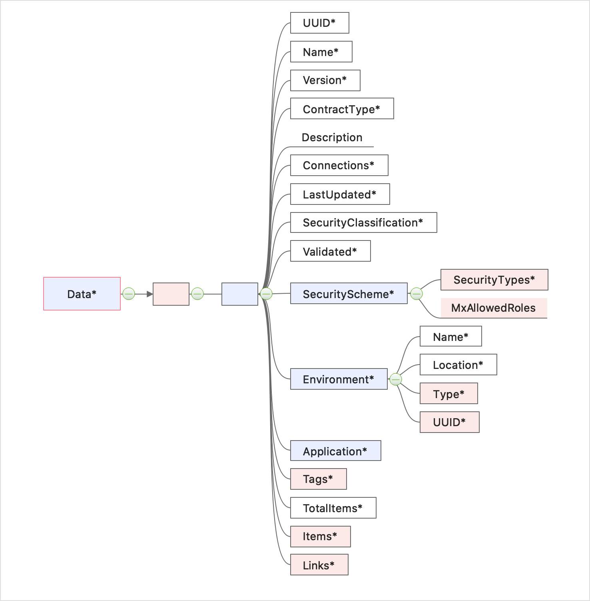
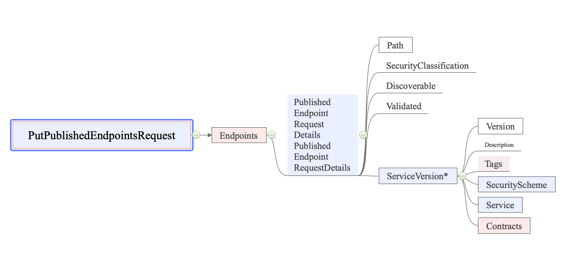
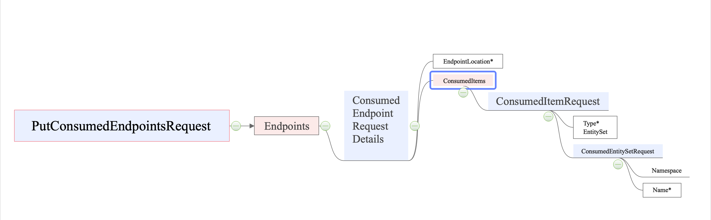
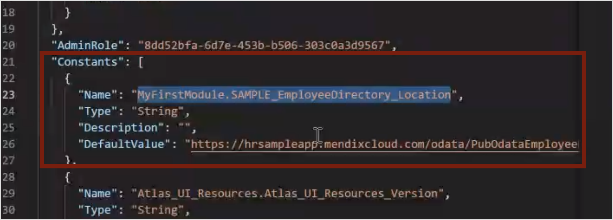

## 1 Introduction

This how-to is a general guide for using  the Data Hub APIs. For the complete definitions the APIs and the responses, refer to the [Data Hub OpenAPI 3.0 spec](https://datahub-spec.s3.eu-central-1.amazonaws.com/index.html).

Data sources that are published as OData Services in Mendix Studio Pro for apps that deploy to a Mendix cloud are automatically registered in the Data Hub upon deployment. Users in Studio Pro can also directly consume shared datasets through the [Data Hub Pane](/refguide/data-hub-pane). For registering data sources from other business applications, the  [Data Hub APIs](https://datahub-spec.s3.eu-central-1.amazonaws.com/index.html) are available.

The [Data Hub APIs](https://datahub-spec.s3.eu-central-1.amazonaws.com/index.html) are published as OpenAPI 3.0 (formerly Swagger) specifications which enable you to visualize the API.  Using the Data Hub APIs you can create a deployment process to register OData v3 and OData v4 services that define your shared data sources to your organization's Data Hub. Using the APIs you can also search for suitable data sources to use in your app development and register apps that consume the shared data sources.

This how-to will guide you in using the APIs that are available for searching the Data Hub and registering your data sources. It provides information to supplement the published OpenAPI specs.

There is a a step-by-step guide on using the Data Hub and the Data Hub integration in Studio Pro to search, register and consume in [Share Data Between Apps](/data-hub/share-data) . This illustrates the steps required for using the Data Hub for your app development and data sharing and illustrates the API calls that are available through the  [Data Hub APIs](https://datahub-spec.s3.eu-central-1.amazonaws.com/index.html).

For Mendix users that deploy to a *non-Mendix Cloud* the [Transform API](#transform) can be used to extract the information that is required to register assets using the Data Hub API calls.

{}To use the Mendix Data Hub a license is required. {}

**This how-to will teach you how to do the following:**

* Incorporating the [PAT](#pat) token into your API calls to ensure that you can access your organizations API.
* Search the catalog for registered assets – [Searching in the Catalog](#api-search)
* Register assets in the Catalog – [Registering Applications, Environments, Data Sources](#reg-contract)
* Register consumed datasets by an App – [Registering Consumed Endpoints by an App](#consumed-ep)
* Use the [Transform API](#transform) to create the request body for registering Mendix services deployed to a non-Mendix environment using the Data Hub API.

You can try out the calls described by following the examples that are provided in the accompanying document: [Data Hub API Examples](data-hub-api-how-to-examples). Examples for the call bodies are included and also a sample OData v3 file that you can use to try the registration calls.

## 2 Prerequisites

Before starting this how-to, make sure you have completed the following:

* Have a registered Mendix Data Hub account
* Obtain your own Personal Access Token (PAT) as described in [Generating your Personal Access Token](/apidocs-mxsdk/apidocs/data-hub-apis#generatepat) to authenticate your API requests

## 3 Overview of the Data Hub APIs

The latest Data Hub APIs are available as OpenAPI specs at: [https://datahub-spec.s3.eu-central-1.amazonaws.com/index.html](https://datahub-spec.s3.eu-central-1.amazonaws.com/index.html).

All requests to the Data Hub API must include the personal access token ([PAT](#pat)) to gain access to the organization’s Data Hub. For more details see: [API calls and Access to Data Hub](#access).

* The following Data Hub APIs are available:

  * Search for registered assets (data sources, datasets, attributes and associations) in the Catalog using the [Search API](https://datahub-spec.s3.eu-central-1.amazonaws.com/search.html) which is described in [Searching in the Catalog](#api-search).
  * Register and update data sources (OData services) using the [Registration API](https://datahub-spec.s3.eu-central-1.amazonaws.com/registration.html) as described in [Registering Applications, Environments, Data Sources](#reg-contract). Data sources are registered to applications, deployed to an  environment. The UUID values are required.
    1. Applications can be registered using [POST](#register-app) for new applications or PUT to update or register to a named UUID.

    2. Register the environment that the dataset is deployed using [POST](#register-env) for new applications or PUT to update or register to a named UUID.

    3. Register the published services (data source) of the application: [PUT published endpoints](#put-service)
  * Register consumed services (data sources) and entities by an application: [PUT consumed endpoints](#consumed-ep)
  * Create a registration call body for Mendix apps *not* deployed to a Mendix Cloud using the [Transform API](#transform).

## 4 Making the API Calls and Access to your Data Hub {#access}

For each request described in this document, the method and the base URL is given with a description of the general parameters and body that can be used for a typical request. An example is given for each of the calls in [Data Hub API Examples](data-hub-api-how-to-examples) so that you can try them out.

For some examples, an example [curl](http://curl.haxx.se/) command is also given. You must enter the specifics for your own registration such as the returned values for your requests and you PAT token value.

{}curl is an open-source tool curl that is pre-installed on many Linux and macOS systems. Windows users can download a version at curl.haxx.se. When using HTTPS on Windows, ensure that your system meets the curl requirements for SSL. {}

### 4.1 Access {#pat}

To gain access to your organization’s Data Hub you must include your personal access token ([PAT](/apidocs-mxsdk/apidocs/data-hub-apis#generatepat)). *Authorization* is not required for your API calls, however, you must include the following key:value pair as part of the *header* for *each* request:

   `Authorization`: `MxToken <your_PAT_Token>`.

Insert the value of your PAT token for the string <*your_PAT_Token*>.

#### 4.1.1 Using Postman

If you prefer to use a tool with a graphical user interface when working with APIs, you can use a REST API client, for example, [Postman](https://www.getpostman.com/) or [Insomnia](https://insomnia.rest/). When using Postman, for each request, provide the request URI, the HTTP method, and, if required, the request parameters and body.

Access to your Data Hub is specified in the request **Header** using the key `Authorization` and setting the value to this key as `MxToken <your_PAT_Token>` (inserting the value of your PAT token for the string <*your_PAT_Token*>).

You can set your PAT token as a variable that can be conveniently called for each request.

#### 4.1.2 Using a Command Line Tool such as Curl

If you are using the [curl](http://curl.haxx.se/) command to send your HTTP requests to the API then you must include the access header as given in this example of a GET call:

`curl --location --request GET 'https://hub.mendix.com/rest/datahubservice/v2/data' \
--header 'Authorization: MxToken <your_PAT_Token>' \`

Insert the value of your PAT token for the string <*your token*> for every request that you make.

### 4.2 Base Variables Used in the How-to

For convenience and conciseness, throughout this how-to the following variables are used and should be substituted by the relevant values or those that are returned in prior responses:

* {*AppUUID}* — insert the value returned in the API response for the UUID of the application
* {*EnvironmentUUID*} – insert the value returned in the API response for the UUID of the environment
* <*your_PAT_Token*> – insert the value of your [PAT](/apidocs-mxsdk/apidocs/data-hub-apis#generatepat) as described in [Access](#pat)

## 5 Searching in the Catalog {#api-search}

The primary method in the [Search API](http://datahub-spec.s3-website.eu-central-1.amazonaws.com/search.html) is GET. This is used to search in the Catalog for registered assets that satisfy a search string and specified filters. It can also be used to retrieve specific registered data sources.

Search is carried out on all **discoverable** registered assets in the Catalog (data sources, data sets, attributes, and descriptions of the registered items).

The Data Hub Search API URL is: <http://datahub-spec.s3-website.eu-central-1.amazonaws.com/search.html.>

To try out an example search request using the call described in this section, see [Searching for Registered Assets in the Catalog that have the string: `sample`](data-hub-api-how-to-examples#get-data-ex).

For general details on Searching in the Data Hub Catalog see [Searching in the Data Hub](/data-hub/data-hub-catalog/search).

### 5.1 Base URL, Method and Endpoint

The Base URL for the search API is: <https://hub.mendix.com/rest/search/v3>

To search and retrieve registered assets the following method and endpoint must be used:

`GET /data`

The relative endpoint `/data` searches and retrieve registered items from the Data Hub that satisfy the parameters that are included in the request. If no parameters are specified, all assets in the Catalog are returned.

### 5.2 Request Parameters

The complete list of possible request parameters for the `/data` call are specified at [Data Hub Search API](http://datahub-spec.s3-website.eu-central-1.amazonaws.com/search.html).

The `query` parameter can be used to search for a specific string of characters. The string must be a minimum of 3 characters, and can only include alphanumeric characters. All other characters are not allowed for the search string.

The `productionEndpointsOnly` parameter is a Boolean, which when set to `true` will only search for assets in **Production** environments. `false` will search in all environments.

### 5.3 Successful 200 OK Response

A successful 200 response returns the all assets from the Data Hub that satisfy the search string and the specified filters in the JSON object `Data`.

All the assets (items registered) in the Catalog that are searched. For each of the assets the following items in the metadata are searched and therefore included in the search results:

* **Endpoint (data sources, services)**: Name, Description, Tags
* **Application**: Name
* **Entity (dataset)**: Name, Description
* **Attribute**: Name, Description
* **Association**: Name

#### 5.3.1 Data Returned in the Search Results {#api-search-results}

The results include the total number of items, `TotalResults`, that satisfy the search request and the `Data` object is the array of the endpoints of the objects that satisfy the search string.

For the full specification see the [<http://datahub-spec.s3-website.eu-central-1.amazonaws.com/search.html).>

#### 5.3.2 `Data` Objects

A representation of what is returned in the response for `Data` is shown below.

The blue boxes indicate that an object is made up of a collection (of objects, data and arrays); the red an array of data; and the solid outline indicates if the item is always returned in the response. Not all sub-levels of the schemas are shown in the representation below.

For the full specification, refer to the [Search API](http://datahub-spec.s3-website.eu-central-1.amazonaws.com/search.html).



### 5.4 Retrieve all Endpoints for a Named Data Source or Service

Using GET you can retrieve details of a named data source or service. This returns all service versions and the details of all the endpoint.

#### 5.4.1 Method, and Endpoint

`GET /applications/{AppUUID}/services/{ServiceName}`

Retrieves details of all the versions and their endpoints for the specified service. Both parameters must be specified and the exact name of the specified service must be included.

#### 5.4.2  Successful 200 Response

A successful response returns details of the data source and full details of the application that published the data source. The `Versions` object returns a collection of all the versions of the named service that are available and details of the endpoints which also includes all the environments that the data source is deployed to.

### 5.5 Retrieve all Contract Files and Endpoint Details for a Data Source

This GET call retrieves full details of a specified service or data source as specified by the unique identifiers of the app and environment UUID and service version. The response also returns the contracts at the data source endpoint.

#### 5.5.1 Method and Endpoint

 `GET /applications/{AppUUID}/environments/{EnvironmentUUID}/services/{ServiceName}/{ServiceVersion}`

#### 5.5.2  Successful 200 Response

The registration details of the specified data source is retrieved and includes the OData contract files for the service. These can be parsed into business applications so that shared datasets can be consumed.

## 6 Registering Applications, Environments, Data Sources {#reg-contract}

This section describes how to use the [Registration API](https://datahub-spec.s3.eu-central-1.amazonaws.com/registration.html). It goes through the sequence of steps for registering data sources—OData v3 or OData v4 service contracts. When registering a data source, all the files that make up the OData v3 or v4 contract must be included in the registration call.

The Data Hub Register API URL is: <https://datahub-spec.s3.eu-central-1.amazonaws.com/registration.html.>

A data source must be registered to an app deployed to a given environment. Therefore, the following sequence of steps must be followed in the given order:

1. Register the application that the data source originates from: `POST application`.
2. Register the environment that the data source is deployed to: `POST environment`.
3. Register the services published by the application (data sources) : `PUT published-endpoints`.

You can register the datasets that are consumed by a registered app as described in [Registering Endpoints Consumed by an App](#consumed-ep). This information is also displayed in the [Data Hub Landscape](/data-hub/data-hub-landscape) showing the network of connected apps, data sources and dependent apps.

To try out the example calls for registering a data source see [Registering an Example OData Contract](data-hub-api-how-to-examples#reg-contract-ex).

### 6.1 Registering an Application in the Catalog using POST {#register-app}

The first step in registering your data sources and available datasets is to register the application that publishes the data source (OData service).

{}If the application and environment of the service is already registered in the Catalog, you can proceed to [Registering the Published Services](#put-service) and use the `AppUUID` and `EnvUUID` as the input parameters. These objects can be obtained from search results as described in [Search request response](#api-search-results). {}

You can try this call by following the example given in [Registering the Howto5-App](data-hub-api-how-to-examples#ex-reg-app).

#### 6.1.1 Method and Endpoint

`POST /applications`

#### 6.1.2 Request Body

There are no parameters to this request only a payload that specifies the details of the application to be registered. The mandatory data that must be included in this request is `Name`, and you can also further provide further details such as the location of files, the application that produced the application (`Type`), a description that will be displayed in the Catalog, and the owners of the app.

#### 6.1.3 Successful 201 POST Response

A successful 201 response will indicate that the application has been registered in the Catalog. The response will return an application `UUID`, which is the Catalog identifier for the registered app that must be used when referring to the application in the next steps of the registration.

### 6.2 Registering an Environment {#register-env}

The next step is to register the environment where the app and the service is deployed.

For apps deployed to multiple environments, there must be a separate call for each environment.

You can follow a real example in [Registering the Environment `Production`.](data-hub-api-how-to-examples#reg-env-ex)

#### 6.2.1 Method and Endpoint

`POST /applications/{AppUUID}/environments`

#### 6.2.2 Request Parameters and body

For this request, the mandatory parameter that must be provided is `AppUUID` that specifies the Catalog UUID for registered app.

The Request must be accompanied by a JSON format body that must include the following:

* Name – Name of the environment
* Location – Location of the environment
* Type – The environment type (Production, Non-Production, Sandbox, the Mendix Free App environment)

#### 6.2.3 Successful 201 POST Response

A 201 response indicates that the environment has been registered in the Catalog for the given application and returns the environment UUID for the environment.

The unique combination of the **App UUID** and the **environment UUID** is the identifier used to register any published endpoints (data sources or services) for the application that are deployed to this environment.

{}These UUIDs are the unique identifiers that are required for registering apps that consume the data sources as described in [registering consumed endpoints](#consumed-ep). {}

### 6.3 Registering the Published Services {#put-service}

This section describes the register service call for registering the data sources or services (that are known as endpoints) published by an app deployed to a specific environment.

When there are several services published by an app, each service (service endpoint) can be included in a single request as a part of the collection of `Endpoints`.

{} OData service contract files must be included in the request body in escaped JSON format. There are several online converters available for converting your *.xml* files into this format such as one available from [Freeformatter.com](https://www.freeformatter.com/json-escape.html#ad-output). Just paste the contents of your files and convert them to the escaped format. {}

You can also try this out by following the example given in [Registering the 5how-toODatav3-sample-service.](data-hub-api-how-to-examples#reg-service-ex)

#### 6.3.1 Method and Endpoint

`PUT /applications/{AppUUID}/environments/{EnvironmentUUID}/published-endpoints`

#### 6.3.2 Request Parameters and Body

The parameters `AppUUID` and `EnvironmentUUID` of the deployed app are required as input parameters.

The request body is made up of the collection of objects for the `PutPublishedEndpointsRequest`. They include an array of the objects that define each service deployed by the app in the given environment – `Endpoints` .

When defining each service in the `ServiceVersion` object the details of the endpoints or service must be specified which includes the name, version number, and the location of the contract files that is provided by the relative path `Path` . The `Contracts` object contains the metadata files that form the contract and must be included in the body an escaped JSON string format.

A representation of the objects that can be specified for the request body is shown below. Not all of the sub-level arrays and objects are shown, for the full schema definition see to the [Registration API](http://datahub-spec.s3-website.eu-central-1.amazonaws.com/registration.html).

(Blue boxes indicate that constituent objects are a collection, the red an array, and the solid outline indicates if the object is required.)



{}

* When Odata contracts are made up of **several files**, all the files must be included for each service so that consumers will have access to the entire definition.

* If an **empty array** is sent for `ServiceVersion`, this it will be interpreted that the application in the environment does not publish any services with this request. However, this will not affect any previously registered services for this same application/environment.

* **Previously registered services** for the application/environment are not affected by a PUT endpoints request. Any services that are already registered for the application/environment will still continue to be registered. Therefore the PUT call has the affect of "adding" services.

* When there are **updates to a services**, care must be taken when deciding to register the new contract at the same endpoint (which means that the previous contract will be replaced) or to a different endpoint.We recommend that you use semantic numbering to indicate the severity of changes in the contract and that you follow a strict protocol when deciding on endpoints to ensure that apps consuming previous versions do not experience disruptions.

* If you want to **"remove" services** for an app, we recommend that you create a new version of the app, deployed to a different environment without the service you do not want included. In this way, you can maintain a historical version of the assets, and ensure that consumers are notified of the new version, without affecting those that are consuming the previous version. For more detail see [removing published services for a registered app](#remove-app)

{}

#### 6.3.3 Successful 200 PUT Response

A successful 200 response returns the array of endpoints that are registered for the given environment and application.

A unique service `UUID` is returned for each for each service endpoint.

For each endpoint, the object `Links` provides the URL of the details page in the Catalog, and also the URI of the service files.

The response also includes the total number of applications/environments – `Connections` – that consume this endpoint. For further details see [registering consumed endpoints](#consumed-ep).

## 7 Registering Consumed Endpoints by an App using PUT {#consumed-ep}

For an app deployed to a specific environment you can register any datasets that it consumes by providing the endpoint details and the entities (datasets) that it consumes. This is registered in the Catalog for both assets and added to the number of **Connections** for the consumed service. This can also be seen in the Data Hub Landscape which displays the networks of publishing and consuming apps and the associated data sources.

{}The PUT call for registering consumed entities will *update* the currently registered datasets for an app/environment. This means that when you want to *add* consumed endpoints to an app (indicating the services that an app is consuming), all previously registered consumed endpoints must be included in the request payload of the new request. If the previously registered consumed endpoints are not included, the result will be that they will be *removed*. {}

You can also try this out by following the example given in [Registering Consumed Endpoints by the Howto5-App](data-hub-api-how-to-examples#consumed-ep-ex).

### 7.1 Method and Endpoint

`PUT /applications/{AppUUID}/environments/{EnvironmentUUID}/consumed-endpoints`

### 7.2 Request Parameters and body

The request must include a body that defines an array of the objects consumed by the application.

Both parameters `AppUUID` and `EnvironmnetUUID` are required for the app that is consuming a data source or service.

The Request body comprises an array of consumed endpoints `ConsumedEndpointRequestDetails`.

For every consumed endpoint the unique identifier of the absolute URL of the endpoint must be provided for the `EndpointLocation`.
The `ConsumedItems` includes the name of the `EntitySet` that is consumed and the `Namespace` of the entity set to ensure that the correct consumed dataset can be registered.

{}Some apps may have the same named `Entityset` which are included in several different `Namespaces` therefore, while `Namespace` is not required, it is recommended that you include it to ensure that the correct dataset is accessed. {}

The following is a representation of the request body. (Blue indicates that the constituent objects are a collection, the red an array, and the solid outline indicates if the object is required.)



### 7.3 Successful 200 POST Response

The 200 OK response returns an array of the consumed endpoints. It returns the full details of each registered consumed endpoint and the catalog UUIDs of them. The total number of connections made to the consumed service is updated and returned to include this registration.

## 8 Removing Published Services for a Registered App {#remove-app}

The [PUT endpoints](#put-service) request does not affect any previously registered services for the application/environment combination. Sending an empty PUT endpoints request will not overwrite previously registered services. Therefore the PUT endpoints has the affect of "adding" services to an app in a specific environment

### 8.1 Removing Services Deployed to an App/Environment

When you have a situation where you want to remove a published service for an app, we recommend that you create a new version of the app, deployed to a different environment, without the service you want to remove.

For example:

**App1.0** publishes the following services

* App-1-premierservice1.0
* App-1-secondaryservice1.0
* App-1-tertiaryservice1.0

If you now want to remove **App-1-secondaryservice1.0** api to **App1.0** then a copy of App 1.0 can be made called **App1.1** and the secondary deleted from the published services.

**App 1.1** therefore publishes the following services:

* App-1-premierservice1.0
* App-1-tertiaryservice1.0

In this example, the services in the two apps, must now be maintained in both apps and owners of the apps consuming from the first app should be notified about the latest version of the app that is available.

In this way, you can maintain a historical version of the registered assets, and ensure that consumers are notified of the new version, without affecting those that are consuming the previous version and giving them time to migrate.

### 8.2 Services Versions and Endpoints

When there are updates to a services, care must be taken when deciding whether to deploy the new contract at the same endpoint or to a different endpoint as the changes may affect consuming apps.

Contract files deployed to the same endpoint of a registered service will mean that consuming apps must reload the changed contract.

We recommend that you use semantic numbering for service versions to maintain a historical record and indicate the severity of changes. Further you should implement a strict protocol that defines when updates are deployed to previously registered endpoints.

In all cases, you are advised to notify all consumers of changes and also new versions deployed to new endpoints.

## 9 Using the Transform API {#transform}

For Mendix apps deploying to the Mendix cloud, there is a registration pipeline that registers the published OData contracts (data sources), and also the consumed entities (datasets) to Data Hub. For this registration, the information that is defined in the location constants of the consumed and published services—located in the **dependencies.json** file for the app—is used.

Mendix users who deploy to *non-Mendix clouds* can make use of the [Transform API](https://datahub-spec.s3.eu-central-1.amazonaws.com/transform.html) to extract the information from the **dependencies.json** file. The Transform API response can be used for the request bodies for the [PUT published endpoints](#put-service) calls.

{}There are additional attributes that are not returned by the Transform API. These are specific to information for the Data Hub Catalog that you must add to the request body which are described in [Optional Values not Obtained from **dependencies.json**] {#not-in-depfile}.{}

The Transform API is available at: <https://datahub-spec.s3.eu-central-1.amazonaws.com/transform.html.>

The base URL for all calls to the API is: <https://hub.mendix.com/rest/transform/v1/dependenciesjson.>

### 9.1 Location of the dependencies.json file of an App

For a Mendix app, the **dependencies.json** file is usually located in the app folder under the following directory: **Mendix\<YourApplicationName>\deployment\model**, where <*YourApplicationName*> is the name of your application.

This file has to be inserted in the call to the API in *escaped json format*.

### 9.2 Method and Endpoint

`POST /applications/{AppUUID}/environments`

### 9.3 Request Body

When making the call to the API the following two object have to be specified.

* `DependenciesJsonString` – insert the `dependencies.json` file of the app *in escaped json format*
* `EndpointLocationConstants` – this object must specify the [location constants](#metadata-file) for the published endpoints that are referred to in the `dependencies.json` file

#### 9.3.1 Location Constants Values {#location-constants}

 You can find the values in the **location constants** document in the **App Explorer** of Studio Pro or in the **metadata.json** file for the app, also located in the **Mendix\<YourApplicationName>\deployment\model**, where <*YourApplicationName*> is the name of your application.

#### 9.3.2 Extracting Location Constants Values from the metadata.json file {#metadata-file}

In the **metadata.json** file for the app there is an object called `Constants` which is an array of all the constants used in the app including the those for the published OData service(s). (In the attached screenshot of a **metadata.json** file the constant for the published OData service for the app is highlighted.)



In the **dependencies.json** file the metadata file location constants are defined by the object `constant`.

To following steps describe to take the information from the two files to add the necessary location information to the registration request body.

1. Take the values in the **metadata.json**  for `Constants` that match those given in the **dependencies.json** file for the object `constant`.
2. For each service, extract the values for `Name` in **metadata.json** and add that as the value to the object `Name`  in the registration body.
3. For each `Name` take the value for  `DefaultValue` in **metadata.json** and add that as the value to the object `Value` in the registration body.
4. Add these to the registration body as specified for the `EndpointLocationConstants` array.
5. For the example given in the screenshot of the **metadata.json** file above the resulting `"constant":"MyFirstModule.SAMPLE_EmployeeDirectory_Location"` is defined with the following values for the location:

    ```json  "EndpointLocationConstants": [
    {
      "Name": "MyFirstModule.SAMPLE_EmployeeDirectory_Location",
      "Value": "https://hrsample.mendixcloud.com/odata/PubOdataEmployeeservice/v2"
    } ```

### 9.4 200 Transformation Successful response

The 200 transformation successful returns a body that can be used for the Data Hub PUT application call based on the **dependencies.json** file and the location constants information provided.

You can add further values to this response body to complete the registration in Data Hub by adding the [optional values not obtained from **dependencies.json**](#not-in-depfile) described below.

### 9.4 Optional Values not Obtained from `dependencies.json` {#not-in-depfile}

There are several objects that are not defined in the service metadata contract and are specific to the Catalog.  These are not also available in the `dependencies.json` file. They can be specified for the Data Hub API `PUT /applications/{AppUUID}/environments/{EnvironmentUUID}/published-endpoints` call. You can add them your request body. These attributes are the following:

* `PublishedEndointRequestDetails`
  * `SecurityClassification`
  * `Discoverable`
  * `Validated`
* `ServiceVersion`
  * `Tags`

When the above attributes are not specified, the registration is made using default values. They can also be changed when the asset is curated in the Data Hub Catalog.

## 10 Sample Contract File {#sample-contract}

The following file is an example OData v3 contract that you can use when trying out the PUT registration service request. The format provided below is in escaped JSON format  so that you can copy it and directly insert it in the PUT request body.

```json
<?xml version=\"1.0\" encoding=\"utf-8\"?>\r\n<edmx:Edmx Version=\"1.0\" xmlns:edmx=\"http:\/\/schemas.microsoft.com\/ado\/2007\/06\/edmx\" xmlns:mx=\"http:\/\/www.mendix.com\/Protocols\/MendixData\">\r\n  <edmx:DataServices m:DataServiceVersion=\"3.0\" m:MaxDataServiceVersion=\"3.0\" xmlns:m=\"http:\/\/schemas.microsoft.com\/ado\/2007\/08\/dataservices\/metadata\">\r\n    <Schema Namespace=\"DefaultNamespace\" xmlns=\"http:\/\/schemas.microsoft.com\/ado\/2009\/11\/edm\">\r\n      <EntityType Name=\"Department\">\r\n        <Key>\r\n          <PropertyRef Name=\"ID\" \/>\r\n        <\/Key>\r\n        <Property Name=\"ID\" Type=\"Edm.Int64\" Nullable=\"false\" mx:isAttribute=\"false\" \/>\r\n        <Property Name=\"Number\" Type=\"Edm.Int64\" \/>\r\n        <Property Name=\"Name\" Type=\"Edm.String\" \/>\r\n        <Property Name=\"Color\" Type=\"Edm.String\" \/>\r\n        <NavigationProperty Name=\"Employees\" Relationship=\"DefaultNamespace.Employee_Department\" FromRole=\"Department\" ToRole=\"Employees\" \/>\r\n      <\/EntityType>\r\n      <EntityType Name=\"Employee\">\r\n        <Key>\r\n          <PropertyRef Name=\"ID\" \/>\r\n        <\/Key>\r\n        <Property Name=\"ID\" Type=\"Edm.Int64\" Nullable=\"false\" mx:isAttribute=\"false\" \/>\r\n        <Property Name=\"firstName\" Type=\"Edm.String\" \/>\r\n        <Property Name=\"lastName\" Type=\"Edm.String\" \/>\r\n        <Property Name=\"email\" Type=\"Edm.String\" \/>\r\n        <Property Name=\"phone\" Type=\"Edm.String\" \/>\r\n        <Property Name=\"street\" Type=\"Edm.String\" \/>\r\n        <Property Name=\"city\" Type=\"Edm.String\" \/>\r\n        <Property Name=\"zip\" Type=\"Edm.String\" \/>\r\n        <Property Name=\"country\" Type=\"Edm.String\" \/>\r\n        <NavigationProperty Name=\"Department\" Relationship=\"DefaultNamespace.Employee_Department\" FromRole=\"Employees\" ToRole=\"Department\" \/>\r\n        <NavigationProperty Name=\"Office\" Relationship=\"DefaultNamespace.Employee_Office\" FromRole=\"Employees\" ToRole=\"Office\" \/>\r\n      <\/EntityType>\r\n      <EntityType Name=\"Office\">\r\n        <Key>\r\n          <PropertyRef Name=\"ID\" \/>\r\n        <\/Key>\r\n        <Property Name=\"ID\" Type=\"Edm.Int64\" Nullable=\"false\" mx:isAttribute=\"false\" \/>\r\n        <Property Name=\"Number\" Type=\"Edm.Int64\" \/>\r\n        <Property Name=\"Name\" Type=\"Edm.String\" \/>\r\n        <Property Name=\"Street\" Type=\"Edm.String\" \/>\r\n        <Property Name=\"StreetNumber\" Type=\"Edm.String\" \/>\r\n        <Property Name=\"ZIP\" Type=\"Edm.String\" \/>\r\n        <Property Name=\"City\" Type=\"Edm.String\" \/>\r\n        <Property Name=\"Country\" Type=\"Edm.String\" \/>\r\n        <Property Name=\"CountryCode\" Type=\"Edm.String\" \/>\r\n        <NavigationProperty Name=\"Employees\" Relationship=\"DefaultNamespace.Employee_Office\" FromRole=\"Office\" ToRole=\"Employees\" \/>\r\n      <\/EntityType>\r\n      <Association Name=\"Employee_Department\">\r\n        <End Type=\"DefaultNamespace.Employee\" Multiplicity=\"*\" Role=\"Employees\" \/>\r\n        <End Type=\"DefaultNamespace.Department\" Multiplicity=\"0..1\" Role=\"Department\" \/>\r\n      <\/Association>\r\n      <Association Name=\"Employee_Office\">\r\n        <End Type=\"DefaultNamespace.Employee\" Multiplicity=\"*\" Role=\"Employees\" \/>\r\n        <End Type=\"DefaultNamespace.Office\" Multiplicity=\"0..1\" Role=\"Office\" \/>\r\n      <\/Association>\r\n      <EntityContainer Name=\"SAP\/v1Entities\" m:IsDefaultEntityContainer=\"true\">\r\n        <EntitySet Name=\"Departments\" EntityType=\"DefaultNamespace.Department\" \/>\r\n        <EntitySet Name=\"Employees\" EntityType=\"DefaultNamespace.Employee\" \/>\r\n        <EntitySet Name=\"Offices\" EntityType=\"DefaultNamespace.Office\" \/>\r\n        <AssociationSet Name=\"Employee_Department\" Association=\"DefaultNamespace.Employee_Department\">\r\n          <End Role=\"Employees\" EntitySet=\"Employees\" \/>\r\n          <End Role=\"Department\" EntitySet=\"Departments\" \/>\r\n        <\/AssociationSet>\r\n        <AssociationSet Name=\"Employee_Office\" Association=\"DefaultNamespace.Employee_Office\">\r\n          <End Role=\"Employees\" EntitySet=\"Employees\" \/>\r\n          <End Role=\"Office\" EntitySet=\"Offices\" \/>\r\n        <\/AssociationSet>\r\n      <\/EntityContainer>\r\n    <\/Schema>\r\n  <\/edmx:DataServices>\r\n<\/edmx:Edmx>
```

## 11 Read More

* [The Data Hub API](/apidocs-mxsdk/apidocs/data-hub-apis)

* [The Data Hub](/data-hub)

* [Examples of the Data Hub API Calls](data-hub-api-how-to-examples)
