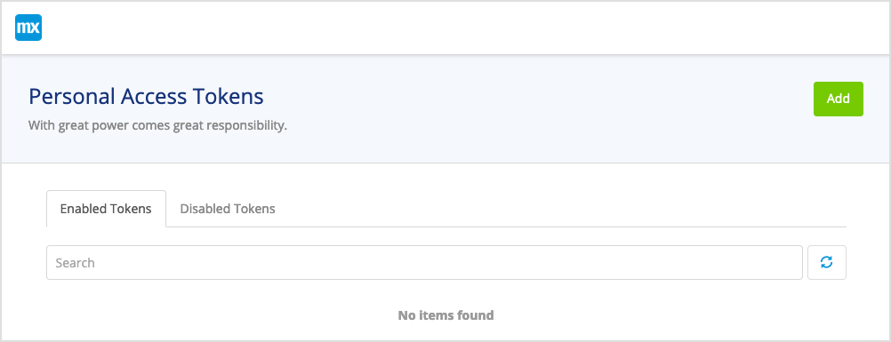
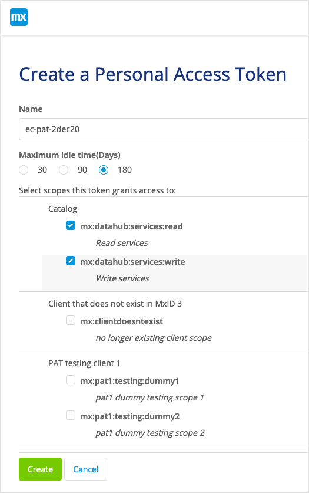

## 1. Introduction

The Data Hub API can be used to establish a gateway that connects your applications to Mendix Data Hub and enable data sources to be shared and used by developers in creating new apps. This means you can integrate the  functionality to explore and discover data sources in the Data Hub Catalog and connect them them. You can also build a registration pipeline to the organization's Data Hub, ensuring that the latest data is readily available.

{}
To use the Mendix Data Hub a license is required.
{}

The following Data Hub APIs are available as Open API (formerly Swagger) specs:

* Registration API [link]
* Search API [lik] 
* ...https://platformcore.pages.rnd.mendix.com/datahub-spec/datahub.html#/.  ??post the final API link here??

Before you can access the API,  authorization is required. Mendix users must obtain a Personal Access Token (PAT) as described in [Generating your Personal Access Token](#generatepat).

## 2. Generating your Personal Access Token {#generatepat}

For every request that is made to the Data Hub API ??is it for every request or is this not relevant.??, you must include a PAT which will be exchanged with the relevant API key to enable access. Mendix users (with a registered account) can obtain the necessary PAT using the Mendix **Warden** app by following these steps: 

1. You can access the **Warden** app ??currently on the test env:?? at:  https://warden-test.mendix.com/index.html. 

2. When you are prompted, enter your login and password. This will take you to the Warden Home page:

   

3. To create a new personal access token, click **Add** to see the **Create a Personal Access Token** screen. 

4. Specify a name for the token.

5. For **Maximum idle time(Days)** select **180** to indicate the length of time that the token is valid for.

6. For the **Select scopes this token grants access to:** **Catalog**, check both **read** and **write** **services** to the Data Hub by checking both options:

   

7. Click **Create**. The token will be generated and displayed in a pop-up window:

   

8. Copy  the **Token secret** to your clipboard by clicking the book icon below the secret. Make sure that you keep this token in a safe place in case you have to set-up the link to the API again.

9. You will have to include ths token in the Authorization header for your requests to the Data Hub API.

