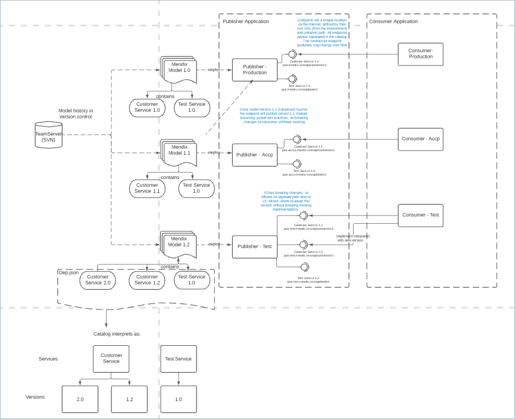
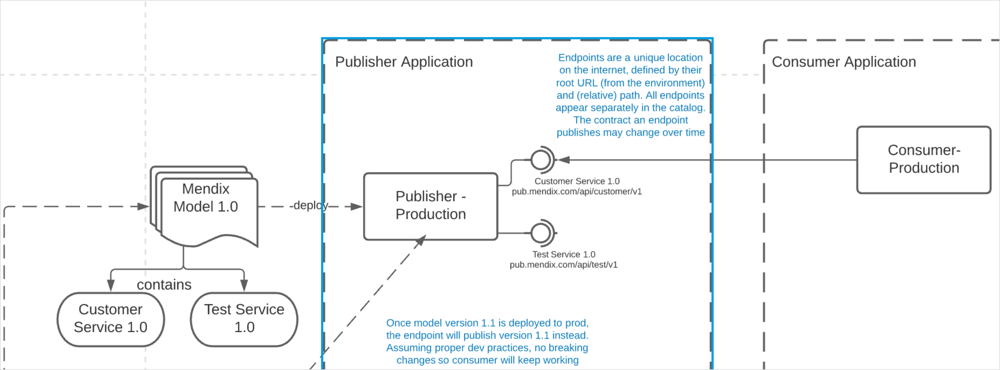
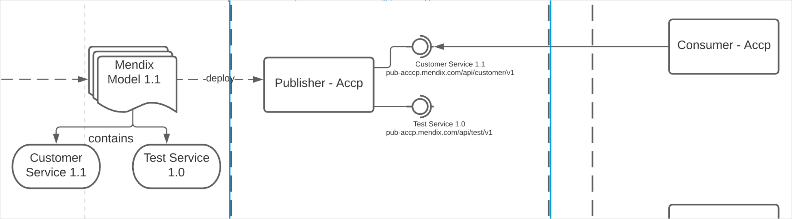
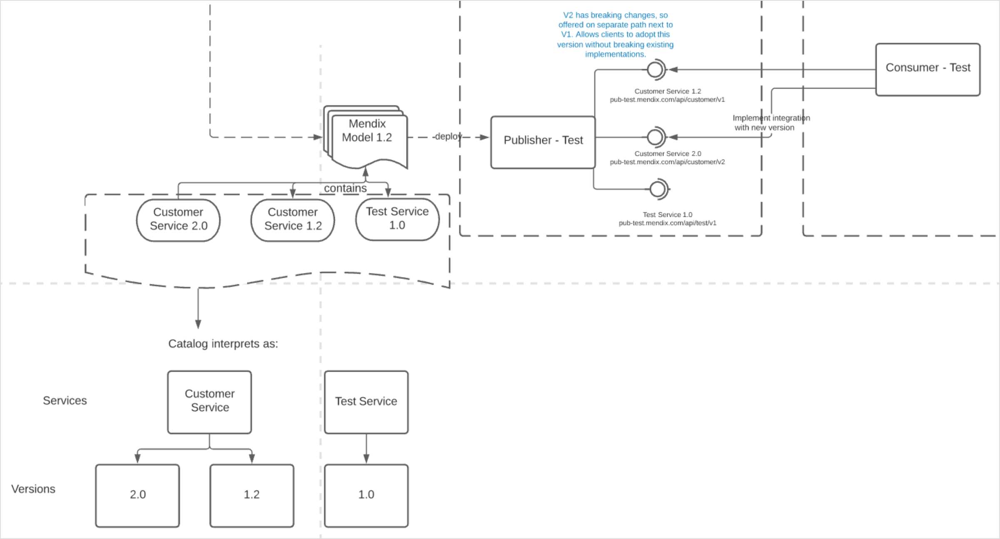

- [ ]  Add discoverability and validity

# 1 Introduction

This document describes the concepts behind using the Mendix Data Hub and defines the terminology behind sharing and managing data sources and datasets and using them in your app.

###  1.1 Overview of using Data Hub to Share Data in your App Development 

The Data Hub is the hub in an organization is where developers can find resources that can be used in their app developement. It also enables these sources to be managed so that users can find the data that they want to work with easily, and ensure that users are kept upto date with any changes and update.

The Data Hub means that in an organization reliable sources can be made available and governed according to the data sharing policies. 

 The process below describes how Data Hub can be typically used in an organization and introduces the terminology behind Data Hub and data sharing and management. 

- [ ] Change this diag to show the steps outlined below.

1. A developer of **Sales APP** has a database of Customer data.  The **owner of this data**—the sales manager—establishes that information of completed sales can be shared with the rest of the company so that they can take this base information and develop their own apps for continued support of the customer, for billing, for post sales activities, etc.
2. The developer of the app—the **technical owner**— publishes useful groups of the customer information, the **datasets**, that are defined by the **entities** in the original app, in REST-based **OData services**. These services are referred to as **data sources** in Data Hub as it is a register of sources of data that can be shared. 
3. Part of the service definition includes how the data sources are organized, the specific use cases and also the levels of access for the published datasets. These services are published according to the OData standard that defines the information about the dataset such as the **entity sets**,  **attributes** and any **associations** and provides the necessary location of the datasets for access by **consumers**.
4. The developer assigns a **version number** to each service that is deployed in each **environment** that the app is deployed to. The different environments that the services are deployed to indicate the quality or purpose of the data: **non-production** environments will have test data, **production** environments will have the live data.
5. There are several ways to register the services in the Catalog:
   1. Mendix app deployed to the Mendix cloud: upon **deployment**, the services are automatically **registered** in Data Hub. 
   2. For Mendix apps deployed to a non-Mendix cloud and for other business applications, a registration "pipeline" can be established using the **Data Hub API** to ensure that data sources are registered.
   3. For business applications: the **Connectors** on the Data Hub **Home** Screen can be used to register data sources.
6. In Data Hub, the developer who is the **technical owner** or an assigned **curator** **curates** the registered assets. Curation includes adding further information to the **metadata** such as  **tags** that indicate the relevancy of the dataset. They may also indicate, for example, that datasets are the "official", "reliable" datasets for this kind of data by setting the sources as **validated**, and identify the source app that the data sources originated from by adding a customized logo.
7. Developers of the **Delivery APP** and **Invoicing APP** discover the customer datasets for their specific requirements in the Data Hub Catalog. They searched for suitable data to use in their apps using the search string and tags.
8. They qualify the originating app, the data owners, and the *quality* of the data from the **Metadata** that is displayed for the data source. Further, they can examine which groups of data sources will be most suited for their use. They see that there are several data sources available from the app.  
9. In Mendix Studio Pro the consuming developers use the **Data Hub Pane** to find the appropriate data source, for the stage of development that they are in. 
10. The required datasets, are dragged into the **Domain Model** as **external entities ** which can immediately be used in their app modeling. The **OData service contract** at the service **endpoint** is consumed, but only the required entities are accessed and displayed in the Domain Model. 
11. During the app modelling, the **external entities** entities can be edited to only include attributes and associations that are required by the consuming app. Other fields that can be removed. 
12. The **consumed entities** are available in all micro-flows and UX components as part of the consuming app's Domain Model.
13. Depending on the stage of development of their apps, in order to fully test out their apps with representative data, services are consumed from the **non-production** environments. For the final deployed app, they will consume the services in the  **production** environments so that that actual data is available.
14. During run-time, when the end users of the **Delivery APP** and **Invoicing APP** do something that requires the **Customer** data, it is automatically retrieved from **Sales APP** in **real-time**. Filtering, paging and selecting in the protocol itself and only the requested fields and records are retrieved. 

##  1.1 The Data Hub Components

Data Hub is made up of the following components:

- **Home** -  From theSearch the Catalog by entering a search string, by selecting the most popular tags, or view the most popular data sources in your Data Hub. Register new data sources from your business apps. 
- **Catalog** provides information on registered data sources and datasets that can be used in app development.  **Search** for registered assets that satisfy the search criteria and filters.  Information about the data source that is provided with the service contract - the **contract metadata** - is displayed in the **Asset Details**. 
- **Landscape** gives a graphical representation of the network and dependencies between apps, data sources and datasets.
- **Curate** enables governance (management) of registered assets, adding further information such as owners, tags, app logos, to manage the assets and increase discoverability.
- **Administration** is to enable management of Data Hub, curators, owners. 

# 2 OData Services, Versions and Endpoints

The Data Hub Catalog is a catalog of registered endpoints and the metadata contracts at these endpoints define and describe the datasets that being exposed in the **data sources**.   

An **Endpoint** is the complete and unique identifier of data souce or service. It is defined by the location of the app *in* the **environment** it is deployed to with the relative path of the service.  For an OData service, the relative path of the service should include the **major version number**.  This is the **endpoint** that is registered in the catalog and this is where the data source *contract* files of the service is located. Consuming apps will consume from this endpoint. 

The schematic below shows the different endpoints that can result from a service that is deployed by an app at different stages of the life-cycle of app (development, testing and acceptance, and production). It gives as an example the resulting endpoints and contracts. The effect of consuming  from these apps is demonstrated. 

The schematic below provides an overview, and acts as a guideline and recommendation for managing your own app production cycles when dealing with shared data resources. 

- [ ]  to be re-drawn according to design guidelines, and so that it is clear and parts can be extracted for the rest of the section.

###  3.1 The Intial Situation

When an app has been developed and is populated with live user data in a production environment.

The app **Mendix Model 1.0**  publishes two services: 

* **Customer Service 1.0**
* **Test Service 1.0**

When this app is deployed to the **production** environment this defines the **root URL** of the app and the services that are deployed by the app:

* **Customer Service 1.0** is published at the endpoint **pub.mendix.com/api/customer/v1**
* **Test Service 1.0** is published at the endpoint **pub.mendix.com/api/test/v1**

The consuming app consumes the contract at the endpoint for the **Customer Service 1.0** service.

### 3.2 New Version of App  Services Deployed to Accp

When the app is revised, a new release **Mendix Model 1.1** is deployed to the acceptance environment.

 

When this app is deployed to the **Accp** environment the following services are deployed:

* **Customer Service 1.1** – minor changes have been made to this service so now the version number has been changed to 1.1 and is published at the endpoint **pub-accp.mendix.com/api/customer/v1**
* **Test Service 1.0** – unchanged from the version in the Production environment –  published at the endpoint **pub-accp.mendix.com/api/test/v1**

The consuming app consumes the service, **Customer Service 1.1** deployed to the endpoint in this environment while being aware that there is a previous version available in the production environment.

**Note** There is now a **Test Service 1.0** deployed to the **Accp** environment in addition to the same version service in the **production** environement. They both have two different endpoints.

### 3.3 Mendix Model 1.1 Deployed to Production  

------------------------

 When the new version of the app **Mendix Model 1.1** is accepted and deployed to the **production** environment, the service endpoints in the production environments  now have the contract files for version 1.1 of the App:

* **Customer Service 1.1** is now published at the endpoint **pub.mendix.com/api/customer/v1**
* **Test Service 1.0** – the unchanged contract the previous version –  is now published at **pub.mendix.com/api/test/v1** (the *same* as relative endpoint as in other environments)

Assuming proper development practices have been followed so that there are no "breaking" changes in the service, the consuming app will now find the new **Customer Service 1.1** contract at the same endpoint it is already consuming from. 

**Note:** In Studio Pro, this change in contract is detected  and indicated to the user whereby the consumer can **Update** the consumed service and ensure that the latest contract is parsed in the app.

### 3.4 Mendix Model 1.2 Deployed to Test Environment

For the version of **Mendix Model 1.2** which is in the test phase and deployed to the **Test** environment the following services are published:

- **Customer Service 2.0** published at endpoint **pub-test.mendix.com/api/customer/v2**. This version of the service has significant changes, which would affect consuming apps significantly, therefore, a **major** service version number has been given, and the service published to a different endpoint.
- **Customer Service 1.2** published at endpoint **pub-test.mendix.com/api/customer/v1**. Contains **minor** version revisions, deployed to the same *relative* endpoint as in other environments.
- **Test Service 1.0** published at endpoint  **pub-test.mendix.com/api/test/v1**. No changes to this service, deployed to the same *relative* endpoint as in other environments.

The consuming app in the **Test** environmet now consumes **Customer Service 1.2** and **Customer Service 2.0** in order to implement integration with the major change in the service. 

## 3.5 Endpoints Registered in the Catalog

After 3.4, the following services and endpoints are registered in the Catalog:

**Customer Service 2.0** published at endpoint **pub-test.mendix.com/api/customer/v2**

**Customer Service 1.1** at  endpoint **pub.mendix.com/api/customer/v1**

**Customer Service 1.2** published at endpoint **pub-test.mendix.com/api/customer/v1**

**Test Service 1.0**  published at **pub.mendix.com/api/test/v1**

**Test Service 1.0** published at endpoint  **pub-test.mendix.com/api/test/v1**

The contract of the first service, **Customer Service 1.0** is no longer available.

# Curation  and Governance

## What is Data Curation?

In practice, data curation is about maintaining and  managing the metadata.  The process of data curation revolves around ingesting and managing metadata.  Data curators not only create, manage, and  maintain data, but may also be involved in determining best practices for working with that data. 

Defining which data sources and data sets are the most useful is the job of the **data curator** who keeps an overview of the data sharing landscape of the organization. While some rules of  thumb and best practices apply, the data curator must make an educated  decision about which data assets are appropriate to use.

{}
Information that is added or changed during curation is stored in the Data Hub Catalog for that asset. It will *not* be added to the OData service contract or metadata files or affect any of the values in the metadata files associated with the service or the data associated with the exposed datasets. 
{}

## What is the Role of a Data Curator?

The curator, maintains the assets in Data Hub. Depending on the organization, curators can be assigned to oversee registered assets for a department, by category, by function. Curation activities in Data Hub can be carried out by the **Data Hub Administrator**,  assigned **Data Hub Curators**.  In addition, data source **owners** also have curation rights over the datasets that they own. 

## Curating Assets in Data Hub

**Tags**

**Discoverability**

**Validated**

**Change Owners**

**Add Catalog descriptions** 

* Application
* Data Source
* Dataset
* Attributes
* Associations

# App Owners

**Business Owners** who own or are responsible for the datasets

**Technical Owners** technical details of app, published data sources and datasets.

By default, the **Technical Owner** for a registered asset is the user who registered the data source when registration is done through the deployment pipeline in Studio Pro or specified during manual registration or using the Data Hub API. 

Owners can be changed by curating the **application** details. 

{}**Business** and **Technical Owners** have curation rights for the registered data source in the Data Hub Catalog if they are registered users on the Mendix Platform. If a custom owner is *created* with the process described in this section, the link to contact them will be displayed for the asset but this does not mean that they are able to curate it.  {}

# External entities **(Studio** **Pro)**

All entities included in the Mendix module through the Data Hub Catalog pane are referred to as external entities in Studio/Studio Pro and represented in the Domain Model with purple containers instead of the Blue Mendix data entity representation. They will have the corresponding differences in the properties as given in the **external entity properties**. 

The major **characteristic** of an external entity is that it is a *connection* to the dataset in the “publishing app” which is accessed and used in the consuming app by end-users.  Currently the consumed data is used by the consuming app.

External entities are read-only, so it is not possible to change te structural values of attributes or associations between two external entities.

For full details see [external entities](ref??)

# Data Sources 

Data sources are the apps/services which define the data that is being made available through it. The generic term used for the app, database or service which owns and provides access to a dataset that can be consumed in Studio/Studio Pro through external entities. From the point of view of the Studio/Studio Pro user, they are connecting through a data source when they use the external entity of this source and using the dataset of the selected entity.

A service is a collection of datasets.

It is the endpoint.

# Datasets

To users, the **dataset**  data, regardless of the system “owning” the data.  A **dataset** is the data similar to a table or excel sheet, with the actual set of data that the user will connect to.

An **entity** is the modelling construct for a dataset - or more specifically in Mendix, the **entityset** - which is the connection to the available data.

The **external entity** in the consuming app connects to the dataset that is maintained in the originating app via the published service (the API to the originating app) registered in the Data Hub Catalog. Datasets for external entities are updated in the source application of the data source. Data is retrieved on the initiative by the consuming app (pull-based), so Data Hub does not play a role in updating the consuming apps: the consuming apps receive the latest data when they request it through the API.

#  Services

The published OData service document (the API) is included in the module definition (in Studio Pro) and contains the metadata for linking to the data for the datasets exposed in the service.

When a new version of the OData service for an external entity is registered in the Data Hub Catalog, the consumed OData service will have to be updated in the consuming app to make use of the new features that the new version brings. For more details on updating a consumed service see the [Updating or Switching a Consumed OData Service](/refguide/consumed-odata-service#updating) section of *Consumed OData Service*.

{}
This is not compulsory, and users can continue to use an older version of a service unless the new version was deployed to the same service endpoint as the previous version. In Studio Pro, new versions of a service are indicated and users can choose to **Update** the service, or **Switch** to another version of the service deployed to another endpoint.
{}

It is good practice that publishers of a service serve a notice of deprecation on a service version that will be replaced with a new service that may contain breaking changes which would cause the consuming app to fail. In this case the updated service should be deployed to a new service endpoint. In this case, in Studio Pro, users will get the option to **Switch** to the new version. 

# **Registration**

This is the process of “adding” a shareable asset – data source (service) or dataset – to Data Hub. This is means that the metadata is available and can be searched/curated etc.

# Consume

Users connecting to the dataset that is made available or registered in Data Hub is  known as *Consume*. 

 A dataset is consumed in an app. Users can find the correct dataset by searching in the Catalog. They  **consume** in Studio Pro through the Data Hub Pane.

Users can also **consume** the dataset through the URL that is available for the asset in the asset details page or by using the DH API.

 Consume is of a specific dataset (entityset), of an endpoint, in a particular environment.

 

In Studio Pro, external data sources registered in the Data Hub Catalog and can be discovered through the **Data Hub Pane**  and introduced in the domain model as *external entities* which can be used with local entities with the difference that external entities **connect** to data that is maintained in the source application and therefore is **read or consumed**. Changes to this data is done in the originating apps.

## Entity sets

To make data from your apps available to others, you can publish the datasets in an **OData service** and register it in the Data Hub. In a Mendix app, the datasets are the **Entity sets** for a defined **Entity**. Further details such as the location of the registered dataset are also captured: for a Mendix app deploying to the Mendix Cloud this information is captured during the deployment process. 

## Assets

Assets is the collective term for all items that are registered in the Catalog - apps, data sources, data sets, registered attributes and their associations. 

##  Data Source Endpoints, URIs and URLS

All registered assets (apps, data sources, datasets) are defined by their endpoints (URLs) in the Catalog. 

The endpoint of the service is accessed by the consuming app. 

The service URLs provide the locations of the service contract. In turn, these define the endpoints for exposed datasets (or entity sets) and attributes and thereby access to the associated datasets by the consuming apps. 

You obtain data source and dataset URI's from the search details for integration of the resource in other BI applications. 

When you add an external entity to your project, you are consuming the entity from a specific version of a service (the *service endpoint*), deployed to a given environment. The metadata file or contract for the service is located at this endpoint. 

% /image_container %}}

When you drag the **Customer** entity from **CustomerApi version 1.0.0** deployed to the **Acceptance** environment into your project, Studio Pro will retrieve the information it requires from the contract that is at the endpoint. 

## Environment

Apps and data source endpoints are deployed to environments. To complete the precise location of an asset, the environment of the relative endpoints is critical. 

The location of the OData service must also include the environment where the publishing app is deployed. Connecting to a data source in the correct environment is very important. For example, when developing an app, you want to connect to the test data of the app deployed to a non-production test or acceptance environment. However, the final production app will have to access the datasets from the production environment - the actual live or working data. In the Data Hub, the **Environment Type** is also specified which indicates to users the quality of the data. 

The Data Hub Catalog is a register of apps that are deployed to a particular environment and the data sources published from the apps deployed to the environment. 

This means that the Catalog registers the version of a service running in a specific environment. 

The environment also indicates the quality of the dataset that is available. Shared datasets that are available from a *production environment* will have production-level data, while those in non-production environments (*acceptance*, *development*) could be populated with data that may not be reliable for building stable apps and be useful for doing development work.

Deployment [environments](/developerportal/deploy/environments) should be clearly defined for the organization. The environment that an app is deployed to is important and indicates the quality and reliability of the app and data. 

## Deployment

## Published OData Service

At the service endpoint are the OData service metadata contract files that define the data exposed by the service. These metadata contracts define the exposed attributes and associations and the links for connecting to the data they define. 

The contract of the published OData service (the *$metadata* document) contains the details of what is exposed in the service. This includes the metadata of the exposed datasets (or entity sets in Mendix Studio Pro) and their exposed attributes, associations, types, and accessibility. This information about the registered OData service is shown in the search details. 

# Supported OData Protocols

OData v3 (Mendix only)

OData v4 (Other Business applications)

## Service Versions

Every published OData service  has a version number, and apps that consume a data source will consume from a specific version. Updates and changes to a service will be indicated by a change in the version number if good practice is followed by the data source originators. This means that there may be several versions of a registered data source available in the catalog and they will all be listed as separate items in the search results for the same-named data source.

The version number of the OData service contracts is also included to uniquely identify the asset and must be specificed in the registration and more importantly when consuming the resource. 

The contract exposed at a specific endpoint may be changed over time by the service owner, and if good practice is followed, these changes will be indicated by changing the version number. Every published OData service has a version number. Apps consuming from a service will consume from a specific version of a service deployed to an environment. 

{}
If significant changes are made in the service which would break any consuming apps, then good practice dictates that the service is published with a major update in the version number and also deployed to a different endpoint. In this case the service will be listed twice for the two different endpoints. 
{}

Notify the **Business Owner** and **Technical Owners** of apps that consume datasets when there is a change to a service or entity.

### Semantic Numbering for Service Versions {#semantic}

It is important that the publishers of the services adopt a strict revision process for any changes they make to their published OData services that are consumed by other users. 

 The service version should clearly indicate the level and severity of the changes that have been made when a service is updated and deployed according to the following guidelines.

#### 4.2.1 Minor Service Updates

*Minor* service updates are, for example,  additional fields added to the service or new operations included which would not break any apps that consume the previous versions. 

If semantic numbering is used then a minor/non-breaking change to a service can be indicated by an increase in the decimal part of the version number. For example, 1.0.11, 1.0.12, 1.1, 1.2. 

Minor service updates can be deployed to the same service endpoints, thereby ensuring that all consuming apps consume the latest version of the service. 

#### 4.2.2 Major Service Updates

*Major* service updates are for example, when entities or attributes are removed, or input parameters are required, which would be incompatible for the consuming apps and result in the consuming app "breaking". 

When a major change has been made to a published service we recommend that the service is deployed to a *different endpoint* with the new service version number clearly indicating that there has been a major change—with semantic numbering this would be an incremental increase  of a whole number. 

In this case the new service will be registered in the Data Hub Catalog as a different service, and show up in the catalog as a separate asset.

There is a major service update indicated by the change in the version number from **1.0.0** to **2.0.0**. Further, both versions have also been deployed to the **Acceptance** which also results in separately registered assets in the Data Hub Catalog.

{} 
Entities of non-Mendix OData services are identified with a key of one or more fields. If the key fields are changed in an update of the service, this will also be seen as a breaking change. 
{}

## Metadata

Metadata is information that defines and describes the data that is shared. The OData contract files for shared datasets are the metadata contracts of the published service.  In the Data Hub Catalog, the metadata is shown in the asset details pages and in the Metadata Panels. Search in the Catalog is performed on the metadata of the assets.

### Discoverability 

When a data source is registered, by default, it is made available to other users with the **Discoverable** setting active in the Data Hub Catalog. When this is set, all users can find it and the view details and consume it. Owners of a registered service and curators can set a data source as non-discoverable, which means it is not visible to users unless they are the owner or a curator.

{}Services that are set to **not Discoverable** in the Catalog will not be included in the search results for *any* user including owners of the service. To consume entities from services owners must ensure that [Discoverability](/data-hub/data-hub-catalog/curate#discoverability) is turned on for them.{}

###  Tags 

Tags help you to group services and datasets and categorize them (for example, by department, process, or use). You can use tags to refine the search and filter search results in the Data Hub Catalog.

* Add tags to the service as a curate function in the Data Hub Catalog after a service is registered by service owners and [Data Hub Curators](/data-hub/#curator)
* Add different tags to the different versions of the same service, as they will be two separately registered assets in the catalog (this is also a way to make different version identifiable)
* Add tags to the datasets exposed in the service
* Add tags in the [manual registration of OData v4 services](register#registration-form)

###  Validated {#validated}

The **Validated** value can be assigned to a data source by owners and curators to indicate, for example that it has been qualified and is a reliable data source. It can turned on and off by clicking the **Validated** toggle. A validated data source is indicated by the validation shield on the data source details screen and also in the search results pane. 

## OData Security for Shared Datasets

For Mendix apps that publish entities and those that consume the shared entities in their apps as [external entities](/refguide/external-entities), the security for the OData-based service is defined in the publishing app – at the app, module, and entity level.

The security that is defined at the module level will apply to the OData services that are published from the module and enforced when the entities from the service are used in a consuming app when end-users try to access the data

# Classification

Classification of the data associated with the entities is defined in the **service metadata** and shown in the [Service Metadata](search#metadata) panel of the **Search Details** screen. 

OData services registered in the Data Hub Catalog have the following classifications that apply to the data associated with the exposed datasets:

* **Public**  – data is available to all internal and external users
* **Internal**  – data is restricted to the members of the organization

# Search in the Data Hub

Enter a search string of alphanumeric characters to search in the Data Hub Catalog. The search will be performed on services, entities, attributes, associations, and descriptions in the Catalog. 

[Filter] – By default, the search will be performed on assets in the **Production** environment. Click the **Filter** icon to include all other environments such as test, acceptance and also the Mendix free app environment **Sandbox** in the search.

You can perform a wildcard search by entering `*` in the search area.

{}
The search strings must be a minimum of 3 alphanumeric characters. Punctuation cannot be used as part of the search term except for the wildcard character `*` to perform an "empty" search in the Data Hub Catalog. You cannot use the wildcard in combination with other characters. For further details, see [How to Search for Registered Assets](/data-hub/data-hub-catalog/search).
{}

# Landscape

The Data Hub Landscape presents a graphical view of the registered endpoints  and environments.  It provides a  visualization of the Landscape of items registered in the [Data Hub Catalog](/data-hub/data-hub-catalog/) and their relationships with apps that consume the datasets that they connect to. In the Data Hub Landscape, the nodes are the runtime instances of applications (or, more specifically, the deployments of apps in specific environments) and the published OData services from the apps. All public services that are issued with Data Hub are also shown in the Landscape.

# Technical Definitions - Mendix Cloud

**App** - Application that can be developed and deployed. Created in MxNew.

App (**Cloud** **Application)** - Cloud node that contains one or more environments on which the app can run. Managed in Cloud Portal (created by CS, assigned to Sprintr App Project by user).

**Environment** - Where app models are deployed. Part of Cloud Application. - unique identifier: **Environment UUID**
